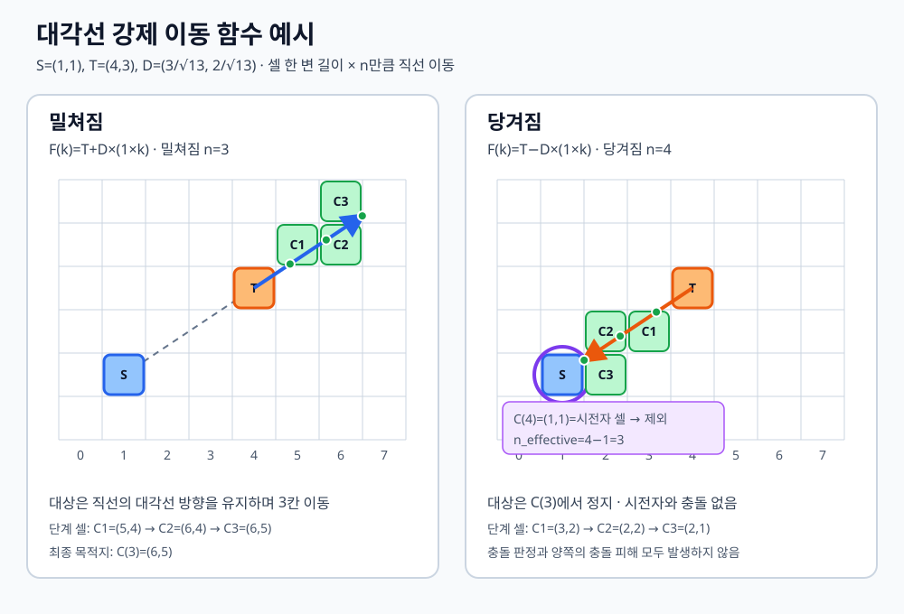
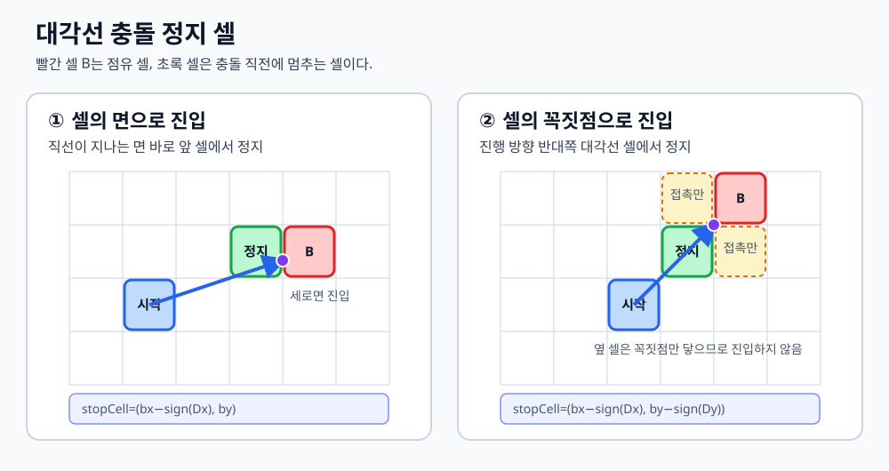
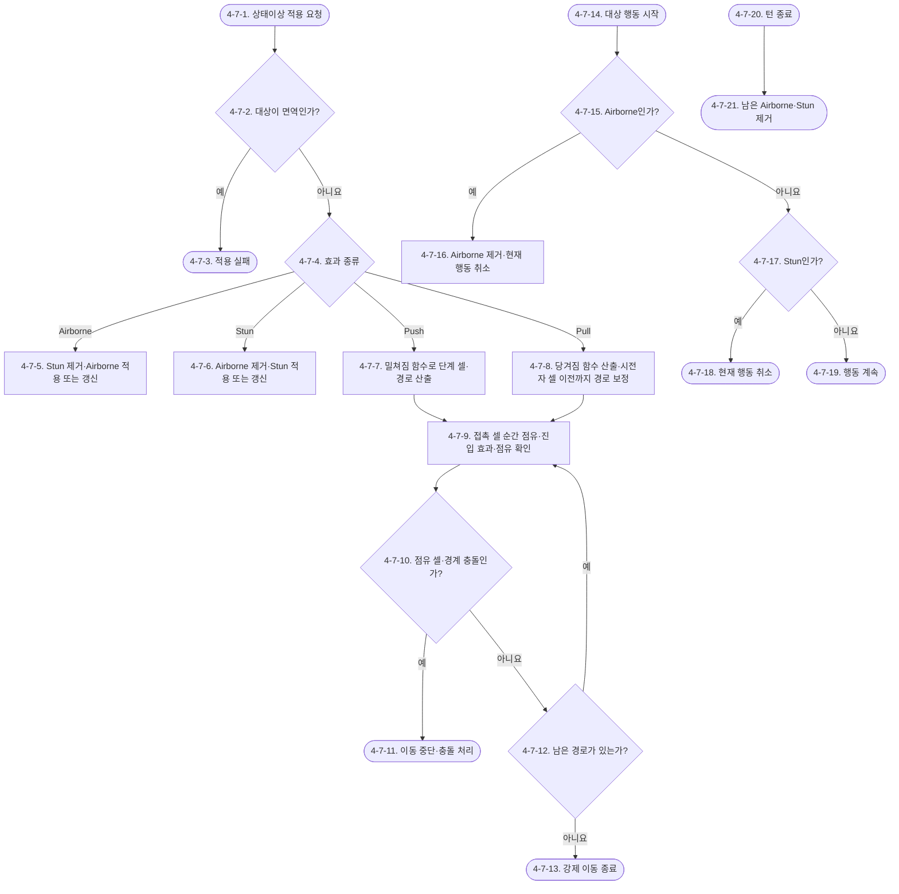

# Waredo 2.0 상태이상 시스템 기획서

> 상태: 확정  
> 문서 범위: 상태이상 공통 처리, 띄워짐, 기절, 강제 이동 공통 규칙, 밀쳐짐, 당겨짐  
> 연계 문서: [전투 시스템 기획서](Waredo_2.0_전투_시스템_기획서.md), [전투판 시스템 기획서](Waredo_2.0_전투판_시스템_기획서.md)

## 시스템 브리핑

상태이상 시스템은 캐릭터의 다음 행동과 위치를 변화시키는 `Airborne(띄워짐)`, `Stun(기절)`, `Push(밀쳐짐)`, `Pull(당겨짐)`을 관리한다. 적용 전에 캐릭터 시스템의 면역 정보를 확인하고, 적용에 성공한 상태와 강제 이동 결과를 전투 시스템에 전달한다.

`Airborne`과 `Stun`은 대상의 다음 행동을 취소하는 지속 상태다. 같은 상태가 다시 적용되면 인스턴스를 중첩하지 않고 지속 시점을 갱신한다. 두 상태가 교차 적용되면 기존 상태를 제거하고 나중에 적용된 상태만 유지하며, 두 상태 중 하나가 적용된 대상이 받는 피해는 치명타로 처리한다.

`Airborne` 상태의 캐릭터는 전투판에서 사라지지 않고 현재 셀을 계속 점유하며 충돌 대상이 된다. 대상의 행동 순서가 오면 띄워짐을 제거한 뒤 행동을 취소한다. `Stun`도 다음 행동을 취소하지만 턴 종료까지 유지되며, 턴이 끝나면 남아 있는 두 상태를 제거한다.

`Push`와 `Pull`은 시전자와 대상을 잇는 직선을 기준으로 목표점과 접촉 경로를 산출하는 즉시 효과다. 직선이 닿는 셀은 이동 중 순간 점유되며 셀 진입 효과와 점유·충돌 판정을 받는다. 밀쳐짐은 시전자 반대 방향으로 이동하고, 당겨짐은 시전자 방향으로 이동하되 시전자 셀을 통과하거나 시전자와 충돌하지 않도록 직전 셀에서 멈춘다.

상태이상 시스템은 상태 목록의 적용·교체·해제와 강제 이동 목적지·접촉 경로를 소유한다. 실제 셀 점유와 충돌 결과는 전투판 시스템을, 행동 취소와 피해·치명타 계산 순서는 전투 시스템을, 상태이상 면역과 치명타 피해율은 캐릭터 시스템을 참조한다.

## 유의사항

- 이 문서는 `activeStatusEffects`와 각 상태이상의 적용·해제 규칙을 소유한다.
- 행동의 실행 순서와 스킵 처리는 전투 시스템이 담당하며, 이 문서는 행동 시점에 필요한 상태 결과를 반환한다.
- 강제 이동의 목표 방향과 거리는 이 문서가 산출하고, 셀 유효성·점유·충돌·정지 위치는 전투판 시스템 결과를 따른다.
- 캐릭터의 상태이상 면역 정보는 캐릭터 시스템에서 참조한다.

# 1. 기획 의도

상태이상은 단순한 수치 감소가 아니라 플레이어가 설계한 행동 순서와 위치를 흔드는 전술 요소다. 띄워짐과 기절은 다음 행동을 잃게 만들고, 밀쳐짐과 당겨짐은 충돌과 위치 변화를 유도해 계획을 다시 계산하게 한다. 플레이어가 위험을 예측하고 상태이상 적용 순서와 위치를 활용하는 재미를 제공한다.

# 2. 개발 목적

- 상태이상의 적용, 면역 확인, 행동 취소와 턴 종료 해제를 일관되게 처리한다.
- 띄워짐과 기절의 비슷하지만 다른 행동 시점 규칙, 재적용과 상호 교체 규칙을 구분한다.
- 밀쳐짐과 당겨짐이 같은 강제 이동 계산 원칙을 공유하도록 한다.
- 당겨지는 대상이 시전자를 통과하거나 시전자와 충돌하지 않도록 이동 거리를 보정한다.
- 강제 이동 결과를 전투판 시스템의 점유·충돌 규칙과 연결한다.

# 3. 시스템 구조

```text
상태이상 시스템 [확정]
├─ 상태이상 공통 처리 [확정]
├─ 띄워짐 [확정]
├─ 기절 [확정]
├─ 강제 이동 공통 규칙 [확정]
├─ 밀쳐짐 [확정]
└─ 당겨짐 [확정]
```

| 모듈 | 핵심 책임 | 주요 연계 |
|---|---|---|
| 상태이상 공통 처리 | 적용·면역·해제 시점과 상태 목록 관리 | 캐릭터 시스템, 전투 시스템 |
| 띄워짐 | 대상의 다음 행동 시작 시 상태 제거와 행동 취소 | 전투 행동 FSM |
| 기절 | 대상의 다음 행동 취소와 턴 종료 시 해제 | 전투 행동 FSM, 턴 FSM |
| 강제 이동 공통 규칙 | 시전자와 대상을 잇는 직선에서 목표점과 이동 경로 산출 | 전투판 시스템 |
| 밀쳐짐 | 대상에서 시전자 반대 방향으로 `n`칸 이동 | 강제 이동 공통 규칙 |
| 당겨짐 | 대상에서 시전자 방향으로 `n`칸 이동하되 시전자 직전에서 정지 | 강제 이동 공통 규칙 |

# 4. 시스템 상세 구조

상태이상 시스템은 `Airborne(띄워짐)`, `Stun(기절)`, `Push(밀쳐짐)`, `Pull(당겨짐)`을 처리한다. `Airborne`과 `Stun`은 `activeStatusEffects`에 유지되는 상태이상이며, `Push`와 `Pull`은 적용 즉시 강제 이동을 처리하고 종료되는 효과다.

## 4-1. 상태이상 공통 처리

### 사용 변수·용어

| 변수·용어 | 이 모듈에서의 의미 | 값 형태 | 소유·성격 |
|---|---|---|---|
| `statusEffectType` | 적용할 상태이상 또는 강제 이동 효과 종류 | 열거값 | 캐릭터 시스템 > 스킬 효과 정의 소유·참조 |
| `activeStatusEffects` | 캐릭터에게 현재 유지 중인 상태이상 인스턴스 | 목록 | 상태이상 시스템 소유·상태 |
| `statusImmunityTags` | 캐릭터가 면역인 상태이상 태그 | 태그 목록 | 캐릭터 시스템 소유·참조 |
| `effectSourceCharacterId` | 상태이상을 발생시킨 캐릭터 | 캐릭터 ID | 공격·스킬 실행 결과 소유·참조 |
| `effectTargetCharacterId` | 상태이상을 적용받는 캐릭터 | 캐릭터 ID | 공격·스킬 실행 결과 소유·참조 |

### 4-1-1. 목적과 책임

| 구분 | 내용 |
|---|---|
| 입력 | `statusEffectType`, 시전자·대상 ID, 효과별 추가값, 대상의 `statusImmunityTags` |
| 처리 | 면역 확인 후 상태 유지 또는 강제 이동 모듈 호출 |
| 출력 | 적용 성공·실패, `activeStatusEffects` 변경 또는 강제 이동 결과 |
| 소유 데이터 | `activeStatusEffects` |
| 참조 데이터 | 캐릭터 시스템의 `statusImmunityTags`, 전투판 시스템의 좌표·점유 상태 |
| 의존 모듈·시스템 | 캐릭터 시스템, 전투 규칙, 행동, 전투판 시스템 |
| 실패·취소·예외 | 대상이 해당 효과에 면역이면 상태 추가와 강제 이동을 모두 실행하지 않음 |

### 4-1-2. 공통 규칙

- 상태이상 적용 요청을 받으면 대상의 `statusImmunityTags`를 먼저 확인한다.
- `Airborne`과 `Stun`은 적용 성공 시 대상의 `activeStatusEffects`에 상태이상 인스턴스를 추가한다. 같은 상태가 이미 있으면 새 인스턴스를 중첩하지 않고 적용 시점과 종료 기준을 새 적용 시점으로 갱신한다.
- `Push`와 `Pull`은 적용 성공 시 즉시 강제 이동을 처리하며 `activeStatusEffects`에 지속 상태로 저장하지 않는다.
- `Airborne` 대상에게 `Stun`을 적용하면 기존 `Airborne`을 제거한 뒤 `Stun`만 적용한다. `Stun` 대상에게 `Airborne`을 적용하면 기존 `Stun`을 제거한 뒤 `Airborne`만 적용한다.
- 따라서 한 캐릭터는 `Airborne`과 `Stun`을 동시에 유지하지 않으며 항상 나중에 성공한 상태이상이 우선한다.
- 피해 적용 직전에 대상의 `activeStatusEffects`를 확인한다. `Airborne` 또는 `Stun`이 있으면 해당 피해의 `isCritical`을 `true`로 처리한다.
- 상태 기반 치명타는 피해 종류나 스킬의 별도 치명타 허용값과 관계없이 적용한다.

### 외부 변수 참조 출처

| 참조 변수 | 가져오는 시스템 | 원본 모듈·데이터 | 현재 시스템에서의 사용 | 원본 문서·번호 |
|---|---|---|---|---|
| `statusImmunityTags` | 캐릭터 시스템 | 상태이상 면역 데이터 | 효과 적용 가능 여부 확인 | `확정/시스템/Waredo_2.0_캐릭터_시스템_기획서.md` 4-1-4 |
| `activeStatusEffects` 소유권 | 캐릭터 시스템 기획서 | 변수 소유권 정의 | 상태이상 시스템이 생성·변경·제거 | 캐릭터 시스템 기획서 4-1-7 |
| `Push`, `Pull`, `Airborne`, `Stun` | 캐릭터 시스템 | 스킬 효과 정의 | 효과 종류와 추가 데이터 연결 | 캐릭터 시스템 기획서 4-1-6-4 |

## 4-2. 띄워짐

### 사용 변수·용어

| 변수·용어 | 이 모듈에서의 의미 | 값 형태 | 소유·성격 |
|---|---|---|---|
| `Airborne` | 대상이 띄워진 상태 | 상태이상 종류 | 상태이상 시스템 소유·상태 |
| 대상의 다음 행동 시작 | 대상 캐릭터의 다음 행동 순서가 시작되는 시점 | 전투 이벤트 | 전투 규칙 소유·참조 |
| 턴 종료 | 현재 턴의 모든 행동이 끝나는 시점 | 전투 이벤트 | 전투 규칙 소유·참조 |

### 4-2-1. 처리 규칙

- `Airborne`은 적용된 시점부터 대상 캐릭터의 다음 행동 시작 또는 현재 턴 종료 중 먼저 도달한 시점까지 유지한다.
- 대상의 행동 순서가 시작될 때 `Airborne`이 남아 있으면 `Airborne`을 제거하고 해당 행동을 취소한다.
- `Airborne`으로 취소된 행동은 다른 캐릭터에게 양도하지 않으며 기존 `actionSlots`의 뒤 순서를 변경하지 않는다.
- 대상의 다음 행동이 오기 전에 턴이 끝나면 턴 종료 시 `Airborne`을 제거한다.
- `Airborne` 상태에서도 캐릭터는 현재 셀의 `cellOccupants`를 유지한다. 다른 요소가 해당 셀에 진입하면 띄워진 캐릭터를 기존 점유 요소이자 충돌 대상으로 처리한다.
- `Airborne`이 다시 적용되면 인스턴스를 추가하지 않고 적용 시점과 종료 기준을 새 적용 시점으로 갱신한다.
- `Stun`이 적용되면 기존 `Airborne`을 즉시 제거하고 `Stun`만 유지한다.

## 4-3. 기절

### 사용 변수·용어

| 변수·용어 | 이 모듈에서의 의미 | 값 형태 | 소유·성격 |
|---|---|---|---|
| `Stun` | 대상의 다음 행동을 취소하는 상태 | 상태이상 종류 | 상태이상 시스템 소유·상태 |
| 행동 취소 요청 | 대상의 현재 행동 슬롯을 실행하지 않도록 하는 요청 | 전투 처리 결과 | 상태이상 시스템 산출 |

### 4-3-1. 처리 규칙

- 대상의 행동 순서가 시작될 때 `Stun`이 있으면 해당 행동을 취소한다.
- 행동 취소는 다른 캐릭터에게 양도하지 않으며 기존 `actionSlots`의 뒤 순서를 변경하지 않는다.
- `Stun`은 행동을 취소한 직후에도 현재 턴 종료 시점까지 유지한다.
- 현재 턴이 끝나면 모든 캐릭터에게 남아 있는 `Stun`을 제거한다.
- 대상이 이미 행동한 뒤 `Stun`을 받으면 추가 행동이 없는 한 행동을 취소하지 못하고 턴 종료 시 제거된다.
- 턴의 `actionSlots`를 구성하는 시점부터 `Stun` 상태라면 기존 전투 규칙에 따라 해당 캐릭터를 슬롯에서 제외한다.
- `Stun`이 다시 적용되면 인스턴스를 추가하지 않고 적용 시점과 종료 기준을 새 적용 시점으로 갱신한다.
- `Airborne`이 적용되면 기존 `Stun`을 즉시 제거하고 `Airborne`만 유지한다.

## 4-4. 강제 이동 공통 규칙

### 사용 변수·용어

| 변수·용어 | 이 모듈에서의 의미 | 값 형태 | 소유·성격 |
|---|---|---|---|
| `forcedMoveDistance` | 밀쳐짐·당겨짐으로 이동시킬 칸 수 `n` | 0 이상의 정수 | 캐릭터 시스템 > 스킬 효과 정의 소유·참조 |
| `sourceCellCoordinate` | 효과 처리 시작 시 시전자 점유 셀 | 셀 좌표 | 전투판 시스템 소유·참조 |
| `targetCellCoordinate` | 효과 처리 시작 시 대상 점유 셀 | 셀 좌표 | 전투판 시스템 소유·참조 |
| 강제 이동 방향 | 시전자와 대상의 셀 중심을 이은 직선의 단위 방향 | 단위 방향 벡터 | 상태이상 시스템 산출 |
| 강제 이동 함수 `F(k)` | 대상 중심에서 효과 방향으로 `k`칸 떨어진 점을 반환하는 함수 | 매개변수 함수 | 상태이상 시스템 산출 |
| 단계 셀 `C(k)` | `F(k)`가 포함된 셀 | 셀 좌표 | 전투판 시스템 참조·상태이상 시스템 산출 |
| 목적지 셀 | 밀쳐짐은 `C(n)`, 당겨짐은 보정된 `C(n_effective)`로 산출한 최종 강제 이동 셀 | 셀 좌표 | 상태이상 시스템 산출 |
| 강제 이동 접촉 경로 | 대상 중심부터 목적지 산출점까지의 직선이 내부·경계·꼭짓점 중 한 곳에 닿는 모든 셀을 이동 순서대로 구성한 목록 | 셀 좌표 목록 | 상태이상 시스템 산출 |
| 충돌 진입 면 | 강제 이동 직선이 점유 셀 또는 전투판 경계에 처음 닿은 위치 | 세로 면, 가로 면, 꼭짓점 | 상태이상 시스템 산출 |
| 충돌 정지 셀 | 충돌 진입 면을 기준으로 대상이 멈추는 전투판 내부 셀 | 셀 좌표 | 상태이상 시스템 산출 |

### 4-4-1. 강제 이동 함수·목적지 셀 산출

시전자와 대상의 셀 중심을 직선으로 연결하고, 대상의 중심에서 그 직선을 따라 **셀 한 변의 길이만큼 `n`번 이동한 점**을 목적지 산출점으로 사용한다. 밀쳐짐은 시전자에게서 멀어지는 방향으로, 당겨짐은 시전자에게 가까워지는 방향으로 계산한다.

셀 한 변의 길이를 `L`이라고 하면 강제 이동 거리 `n`의 실제 직선거리는 `L × n`이다. 이 문서에서는 셀 한 변을 거리 `1`로 사용하므로 `L=1`이다. 셀 좌표가 `(x, y)`이면 셀 중심점은 `(x+0.5, y+0.5)`로 계산한다. 시전자 셀 중심을 `S=(sx, sy)`, 대상 셀 중심을 `T=(tx, ty)`, 두 중심의 차이를 `V=(dx, dy)=T-S`, 강제 이동 거리 `n`을 `forcedMoveDistance`라고 한다.

```text
V = T - S = (dx, dy)
직선 길이 = |V| = sqrt(dx² + dy²)
D = V / |V|
L = 셀 한 변의 길이 = 1

밀쳐짐 함수: F(k) = T + D × (L × k)
당겨짐 함수: F(k) = T - D × (L × k)

단계 셀: C(k) = (floor(Fx(k)), floor(Fy(k)))
밀쳐짐 목적지 셀 = C(n)

당겨짐에서 C(k)가 시전자 셀과 처음 같아지는 단계:
k_source = min{k | C(k) = sourceCellCoordinate}

당겨짐 유효 이동 거리:
n_effective = k_source - 1  (k_source가 있으면)
n_effective = n             (k_source가 없으면)

당겨짐 목적지 셀 = C(n_effective)
```



- `D`는 시전자 중심에서 대상 중심으로 향하는 직선을 길이 `1`로 정규화한 단위 방향 벡터다.
- `D × (L × k)`는 원래 직선의 방향을 유지하면서 대상 중심에서 셀 한 변 길이의 `k`배만큼 떨어진 점을 만든다.
- 밀쳐짐 함수는 대상에서 시전자 반대 방향, 당겨짐 함수는 대상에서 시전자 방향의 점을 반환한다.
- `k=1`부터 `n`까지 함수에 순서대로 대입해 거리별 단계 셀 `C(k)`와 목적지 셀을 산출한다.
- 강제 이동 접촉 경로는 `C(k)`만 이어 붙이지 않는다. 대상 중심에서 목적지 산출점까지의 직선이 셀 내부, 셀 경계 또는 셀 꼭짓점에 한 점이라도 닿으면 해당 셀을 접촉 경로에 포함한다.
- 직선이 하나의 경계 위를 지나면 경계 양쪽 셀을 모두 접촉 셀로 처리한다. 직선이 꼭짓점을 지나면 해당 꼭짓점에 닿는 셀을 모두 접촉 셀로 처리한다.
- `F(k)`가 셀 꼭짓점에 정확히 놓이면 최종 단계 셀 `C(k)`는 강제 이동 방향이 가리키는 대각선 셀로 선택한다. 접촉한 나머지 셀은 이동 중 순간 점유·진입 효과·충돌 판정에만 사용하고 최종 점유 셀로 사용하지 않는다.
- 밀쳐짐은 `C(n)`을 최종 목적지 셀로 사용한다.
- 당겨짐은 `C(k)`가 시전자 셀과 처음 같아지는 `k_source`를 찾고, 시전자 셀에 진입하지 않도록 유효 이동 거리를 `n_effective=k_source-1`로 보정한다.
- 당겨짐 경로에는 `C(1)`부터 `C(n_effective)`까지만 넣고 `C(n_effective)`를 최종 목적지 셀로 사용한다. `C(1)`부터 시전자 셀이라면 `n_effective=0`으로 처리하여 대상을 이동시키지 않는다.
- `F(k)`가 셀 경계에 정확히 놓이면 이동 방향 쪽 셀을 단계 셀로 선택한다. 꼭짓점이면 이동 방향이 가리키는 대각선 셀을 단계 셀로 선택한다.
- 시전자와 대상의 셀 중심이 같아 방향을 계산할 수 없으면 강제 이동을 실행하지 않는다. 정상 점유 상태에서는 두 캐릭터가 같은 셀을 점유할 수 없으므로 방어적 예외로만 둔다.

### 4-4-2. 이동·충돌 처리

- 산출한 강제 이동 접촉 경로를 첫 접촉 셀부터 순서대로 전투판 시스템에 전달한다.
- 대상은 직선이 닿는 각 접촉 셀을 이동 중 순간적으로 점유한 것으로 처리한다. 순간 점유는 셀 진입 효과와 점유·충돌 판정을 발생시키지만, 경로 처리가 끝난 뒤 `cellOccupants`에 남는 영구 점유는 최종 목적지 셀 하나뿐이다.
- 같은 지점에서 여러 셀에 동시에 닿으면 해당 셀들을 하나의 접촉 단계로 처리한다. 그 단계에 포함된 모든 셀의 진입 효과와 점유 여부를 확인한 뒤 다음 단계로 진행한다.
- 요청 셀이 점유되어 있거나 전투판 바깥이면 해당 지점에서 즉시 이동을 멈추고 [전투판 시스템 기획서](Waredo_2.0_전투판_시스템_기획서.md) `4-3. 충돌` 규칙을 적용한다.
- 충돌 발생 여부와 충돌 피해는 전투판 시스템이 결정하고, 대각선 강제 이동의 정확한 정지 셀은 이 문서의 `4-4-3. 대각선 강제 이동의 정지 셀`에 따라 상태이상 시스템이 결정한다.
- 단, 당겨짐의 시전자 셀은 경로 산출 단계에서 제외한다. 대상은 시전자와 충돌하지 않으며, 시전자와 대상 모두 충돌 피해를 받지 않는다.
- 충돌이 없으면 접촉 단계의 효과 처리를 끝내고 남은 접촉 경로를 계속 처리한다. 최종 목적지에 도달하면 기존 셀의 영구 점유를 해제하고 목적지 셀의 영구 점유를 기록한다.
- 강제 이동 직선이 닿는 모든 셀의 화염·회복 등 `cellEntryEffects`를 적용한다. 같은 셀은 하나의 강제 이동에서 한 번만 처리한다.
- `forcedMoveDistance = 0`이면 이동과 충돌 없이 효과 처리를 종료한다.

### 4-4-3. 대각선 강제 이동의 정지 셀

밀쳐짐·당겨짐의 대각선 강제 이동 중 점유 셀 또는 전투판 경계와 충돌하면, 상태이상 시스템은 강제 이동 직선이 처음 닿은 면을 기준으로 정지 셀을 정한다. 전투판 시스템은 충돌 발생 여부와 피해를 처리하고, 여기서는 대상이 실제로 멈출 셀만 결정한다.

점유된 충돌 셀을 `B=(bx, by)`, 강제 이동 방향을 `D=(Dx, Dy)`라고 할 때 정지 셀은 다음과 같다.

```text
세로 면으로 진입: (bx - sign(Dx), by)
가로 면으로 진입: (bx, by - sign(Dy))
꼭짓점으로 진입: (bx - sign(Dx), by - sign(Dy))
```

- 직선이 점유 셀의 세로 면에 먼저 닿으면 해당 면 바로 앞의 셀에 멈춘다.
- 직선이 점유 셀의 가로 면에 먼저 닿으면 해당 면 바로 앞의 셀에 멈춘다.
- 직선이 점유 셀의 꼭짓점에 정확히 닿으면 진행 방향의 반대쪽 대각선 셀에 멈춘다.
- 산출한 정지 셀은 충돌 직전까지 대상이 정상적으로 점유할 수 있었던 셀이며, 해당 셀에서 남은 강제 이동을 종료한다.
- 전투판 바깥과 충돌할 때도 진입한 면 또는 꼭짓점을 기준으로 같은 방식으로 전투판 내부 정지 셀을 정한다. 경계 충돌 피해는 접근 캐릭터에게만 적용한다.
- 충돌 피해량과 피해 대상은 [전투판 시스템 기획서](Waredo_2.0_전투판_시스템_기획서.md) `4-3. 충돌`을 따른다.



## 4-5. 밀쳐짐

### 사용 변수·용어

| 변수·용어 | 이 모듈에서의 의미 | 값 형태 | 소유·성격 |
|---|---|---|---|
| `Push` | 대상을 시전자에게서 멀어지는 방향으로 강제 이동시키는 효과 | 즉시 효과 | 상태이상 시스템 처리 |

### 4-5-1. 처리 규칙

1. 효과 처리 시작 시 시전자와 대상의 현재 셀 좌표를 조회한다.
2. 시전자 셀 중심에서 대상 셀 중심으로 향하는 격자 방향 `D`를 구한다.
3. `F(k)=T+D×k`에 `k=1`부터 `n`까지 대입한다.
4. 각 `F(k)`가 포함된 `C(k)`를 산출하고 `C(n)`을 목적지 셀로 정한다.
5. 대상 중심에서 `F(n)`까지의 직선이 내부·경계·꼭짓점에 닿는 모든 셀을 순서대로 강제 이동 접촉 경로에 넣는다.
6. 경로를 순서대로 이동하며 점유 셀 또는 전투판 경계를 만나면 진입 면에 따른 정지 셀에서 이동을 멈추고 충돌로 처리한다.

## 4-6. 당겨짐

### 사용 변수·용어

| 변수·용어 | 이 모듈에서의 의미 | 값 형태 | 소유·성격 |
|---|---|---|---|
| `Pull` | 대상을 시전자에게 가까워지는 방향으로 강제 이동시키는 효과 | 즉시 효과 | 상태이상 시스템 처리 |

### 4-6-1. 처리 규칙

1. 효과 처리 시작 시 시전자와 대상의 현재 셀 좌표를 조회한다.
2. 시전자 셀 중심에서 대상 셀 중심으로 향하는 격자 방향 `D`를 구한다.
3. `F(k)=T-D×k`에 `k=1`부터 `n`까지 대입한다.
4. 각 `F(k)`가 포함된 `C(k)`를 순서대로 확인하다가 시전자 셀과 처음 같아지는 `k_source`를 찾는다.
5. `k_source`가 있으면 유효 이동 거리를 `n_effective=k_source-1`로 보정한다. 없으면 `n_effective=n`으로 유지한다.
6. `n_effective=0`이면 대상을 이동시키지 않고 당겨짐을 종료한다. 이 처리는 충돌이 아니므로 시전자와 대상 모두 충돌 피해를 받지 않는다.
7. `n_effective>0`이면 `C(n_effective)`를 목적지 셀로 사용하고, 대상 중심에서 `F(n_effective)`까지의 직선이 내부·경계·꼭짓점에 닿는 모든 셀을 강제 이동 접촉 경로로 구성한다. 따라서 대상은 시전자 셀이나 시전자 너머로 이동하지 않는다.
8. 보정된 경로를 순서대로 이동하며 시전자 외의 점유 셀 또는 전투판 경계를 만나면 진입 면에 따른 정지 셀에서 이동을 멈추고 충돌로 처리한다.

## 4-7. 상태이상 처리 순서



| 번호 | 처리 설명 |
|---|---|
| 4-7-1 | 공격·스킬 실행 결과에서 상태이상 적용 요청을 받는다. |
| 4-7-2 | 대상의 `statusImmunityTags`에 요청 효과의 면역 태그가 있는지 확인한다. |
| 4-7-3 | 면역이면 상태 추가와 강제 이동 없이 적용 실패로 종료한다. |
| 4-7-4 | 요청의 `statusEffectType`에 따라 처리 모듈을 선택한다. |
| 4-7-5 | 기존 `Stun`을 제거한다. `Airborne`이 이미 있으면 지속 시점을 갱신하고, 없으면 새로 적용한다. |
| 4-7-6 | 기존 `Airborne`을 제거한다. `Stun`이 이미 있으면 지속 시점을 갱신하고, 없으면 새로 적용한다. |
| 4-7-7 | `Push`이면 밀쳐짐 함수에 `k=1…n`을 대입해 시전자 반대 방향의 목적지 셀과 이동 경로를 산출한다. |
| 4-7-8 | `Pull`이면 당겨짐 함수에 `k=1…n`을 대입하되, 시전자 셀과 처음 겹치기 직전 단계까지만 경로로 확정한다. 시전자와의 충돌 및 충돌 피해는 발생하지 않는다. |
| 4-7-9 | 강제 이동 직선이 닿는 다음 접촉 셀을 순간 점유하고 해당 셀의 진입 효과와 점유 여부를 확인한다. |
| 4-7-10 | 전투판 시스템이 요청 셀의 유효 여부와 점유 여부를 확인한다. |
| 4-7-11 | 전투판 시스템이 충돌 발생을 반환하면 `4-4-3`에 따라 정지 셀을 정하고 이동을 종료한다. 충돌 피해는 전투판 시스템의 충돌 규칙을 적용한다. |
| 4-7-12 | 충돌이 없으면 아직 처리하지 않은 강제 이동 접촉 경로가 있는지 확인한다. |
| 4-7-13 | 남은 경로가 없으면 대상의 최종 점유 셀을 결과로 반환한다. |
| 4-7-14 | 전투 규칙에서 대상 캐릭터의 행동 시작 이벤트를 전달받는다. |
| 4-7-15 | 대상의 `activeStatusEffects`에 `Airborne`이 있는지 확인한다. |
| 4-7-16 | `Airborne`이 있으면 행동 처리 전에 제거하고 대상의 현재 행동을 취소한다. |
| 4-7-17 | `Airborne`이 없으면 대상에게 `Stun`이 있는지 확인한다. |
| 4-7-18 | `Stun`이 있으면 대상의 현재 행동을 취소한다. |
| 4-7-19 | `Stun`이 없으면 다른 행동 불능 조건 판정으로 진행한다. |
| 4-7-20 | 전투 규칙에서 현재 턴 종료 이벤트를 전달받는다. |
| 4-7-21 | 모든 캐릭터에게 남아 있는 `Airborne`과 `Stun`을 제거한다. |

## 4-8. 기획 변수

| 변수명 | 기획상 의미 | 값 형태 | 초기값·허용값 | 소유 모듈 | 사용 위치 | 성격 | 산출·갱신 규칙 | 비고 |
|---|---|---|---|---|---|---|---|---|
| `statusEffectType` | 적용 효과 종류 | 열거값 | `Airborne`, `Stun`, `Push`, `Pull` | 캐릭터 시스템 > 스킬 효과 정의 | 4-4 전체 | 참조 | 스킬 효과 결과에서 전달 | 캐릭터 시스템 4-1-6-4의 효과 문법과 일치 |
| `activeStatusEffects` | 캐릭터별 유지 상태이상 인스턴스 | 목록 | 전투 시작 시 빈 목록 | 상태이상 공통 처리 | 4-1~3·7 | 상태 | 같은 상태 재적용 시 지속 시점 갱신, `Airborne`·`Stun` 교차 적용 시 기존 상태 제거 후 후속 상태만 유지 | 캐릭터 시스템은 참조만 함 |
| `isCritical` | 현재 피해 건의 치명타 성립 여부 | 참·거짓 | 대상에게 `Airborne` 또는 `Stun`이 있으면 `true` | 전투 시스템 > 피해 계산 | 4-1~3 | 참조·판정 요청 | 피해 적용 직전 대상 상태를 조회해 전투 시스템에 치명타 판정 결과 제공 | 상태 기반 치명타는 피해 종류별 허용값을 요구하지 않음 |
| `effectSourceCharacterId` | 효과 시전자 | 캐릭터 ID | 전투 참가 캐릭터 ID | 공격·스킬 실행 결과 | 4-1·4~7 | 참조 | 효과 적용 요청에서 전달 | 현재 셀 조회 키 |
| `effectTargetCharacterId` | 효과 대상 | 캐릭터 ID | 전투 참가 캐릭터 ID | 공격·스킬 실행 결과 | 4-4 전체 | 참조 | 효과 적용 요청에서 전달 | 상태 목록·현재 셀 조회 키 |
| `forcedMoveDistance` | 밀기·당기기 칸 수 `n` | 정수 | 0 이상 | 캐릭터 시스템 > 스킬 효과 정의 | 4-4~7 | 참조 | `Push`·`Pull` 효과 데이터에서 전달 | 캐릭터 시스템 문서의 이동 거리 N |
| `sourceCellCoordinate` | 효과 처리 시작 시 시전자 셀 | 좌표 | 전투판 안의 점유 셀 | 전투판 시스템 > 셀·점유 | 4-4~7 | 참조 | `effectSourceCharacterId`로 현재 점유 셀 조회 | 처리 시작 좌표 고정 |
| `targetCellCoordinate` | 효과 처리 시작 시 대상 셀 | 좌표 | 전투판 안의 점유 셀 | 전투판 시스템 > 셀·점유 | 4-4~7 | 참조 | `effectTargetCharacterId`로 현재 점유 셀 조회 | 강제 이동 함수의 시작 위치 |
