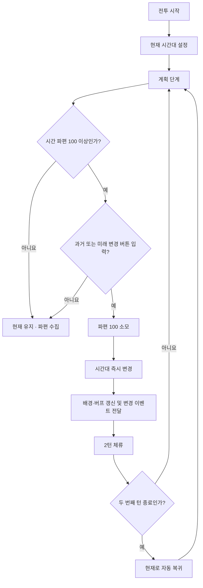
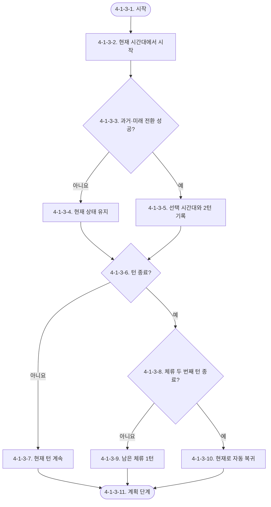
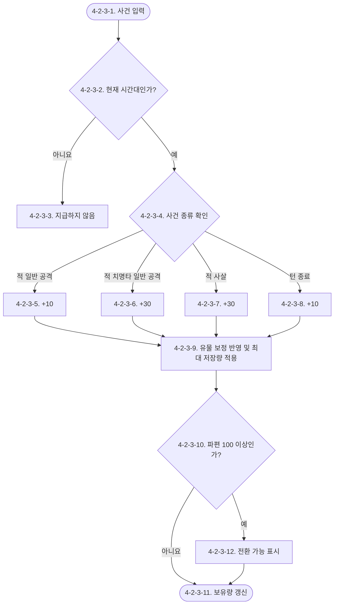
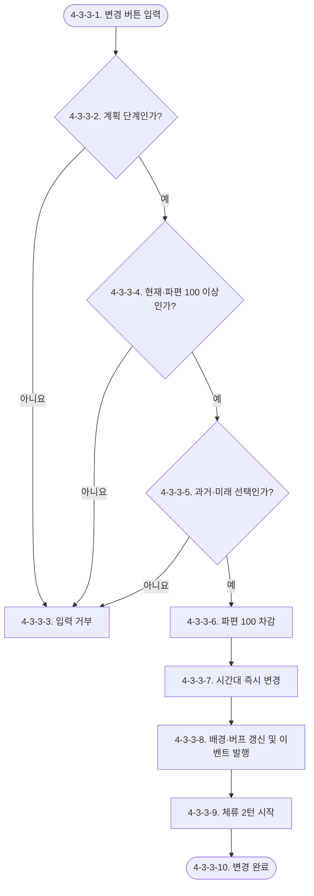
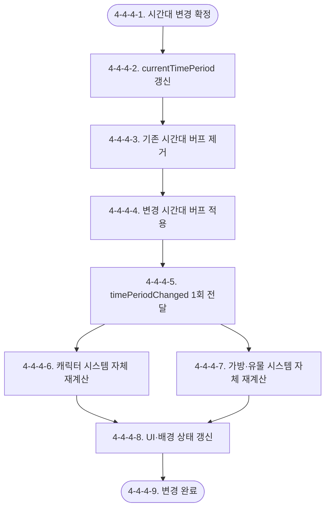

# Waredo 2.0 시간대 전환 시스템 기획서

> 결정 상태: `[확정]`
> 검수 상태: `[초안]`
> 문서 책임자: `[작성 필요]` · 검수자: `[작성 필요]`
> 최초 작성일: 2026-09-06 · 최근 수정일: 2026-09-07
> 기준 문서: `확정/Waredo_2.0_전체_기획_관리.md`
> 관련 문서: `Waredo_2.0_캐릭터_시스템_기획서.md`, `Waredo_2.0_전투_시스템_기획서.md`
> 확정 범위: 현재 시작, 시간 파편 획득·상한, 과거·미래 전환, 2턴 체류·현재 복귀, 아군 전용 시간대 버프, 시간대 변경 이벤트 제공

## 시스템 브리핑

시간대 전환 시스템은 전투 중 모은 시간 파편을 회중시계에 충전하고, 충전량이 100 이상이면 계획 단계에서 현재 전장을 과거 또는 미래로 바꾸는 시스템이다. 전투는 현재 시간대에서 시작하며, 과거와 미래에서는 시간 파편을 모을 수 없다.

시간 파편은 적의 일반 공격·치명타 공격, 적 사살, 턴 종료로 얻는다. 기본 최대 저장량은 100이며 활성 유물 효과로 기존 사건의 획득량과 최대 저장량을 변경할 수 있다. 시간대 전환을 실행하면 보유 파편에서 100만 소모한다. 시간대 전환은 행동 슬롯을 사용하지 않고, 변경 버튼을 누르는 즉시 현재 시간대·배경·시간대 보정을 갱신한다.

과거에서는 아군 이동력이 1 증가하고, 미래에서는 아군 일반 공격력이 3 증가한다. 시간대가 바뀌면 이 시스템은 변경된 시간대와 남은 체류 턴을 관련 시스템에 전달한다. 캐릭터의 궁극기 교체 규칙과 데이터 문법은 캐릭터 시스템이 소유한다.

유물은 고유 시간대나 시간대 태그를 갖지 않는다. 유물이 어느 시간대에 적용되는지는 유물 자체가 아니라 유물을 배치한 가방 칸의 시간대로 결정하며, 가방 칸 구성·배치·효과 활성 판정은 가방·유물 시스템이 소유한다. 시간대 전환 시스템은 해당 판정을 대신하지 않고 현재 시간대만 입력값으로 제공한다.

## 유의사항

- 이 문서는 전투 중 시간대 상태, 파편 자원, 시간대 전환 조건·효과와 외부 시스템에 제공할 시간대 변경 결과를 다룬다.
- 아웃게임·대화 시나리오, 전투 종료 정산, 캐릭터의 태그·일반 스킬·궁극기 문법, 유물·가방 칸 문법과 개별 목록, 배경 에셋 제작은 이 문서가 직접 소유하지 않는다.
- 시간대 전환은 계획 단계에서만 가능하며, 실행 단계가 시작된 뒤에는 해당 턴의 시간대를 바꿀 수 없다.
- 시간대 전환을 실행하면 `timeShard`에서 비용 100을 차감한다. 최대 저장량 증가로 100을 초과해 보유했다면 차감 후 남은 파편을 유지한다. 예를 들어 130을 보유했다면 전환 후 30이 남는다.
- 적 일반 공격 보상과 적 치명타 일반 공격 보상은 한 공격 행동당 한 번만 지급한다. 치명타 일반 공격은 시간 파편 30을 지급하고 일반 공격의 시간 파편 10과 중복하지 않는다.
- 시간 파편은 현재 시간대에서만 발생한다. 과거·미래에서 발생한 적 공격, 사살, 턴 종료 사건은 파편을 지급하지 않는다.
- 시간대 버프는 아군에게만 적용한다. 적군은 현재 시간대와 관계없이 과거 이동력 +1과 미래 일반 공격력 +3을 받지 않는다. 캐릭터별 궁극기 활성 조건은 캐릭터 시스템 문서를 따른다.
- 현재 시간대의 전장 배경과 과거·미래 배경의 실제 콘텐츠 ID·아트 사양은 환경·연출 콘텐츠에서 작성한다.
- 이 문서는 기존 `제안/시스템/Waredo_2.0_GDD_시간대_전환_시스템.md`를 새 사용자 결정에 맞춰 확정 기준으로 재작성한 문서다. 이전 제안의 타입 상성, 시간대 중첩, 시간 추가 피해, 가속·정지·역행, 50 또는 80 파편 규칙은 적용하지 않는다.

# 1. 기획의도

시간대 전환은 플레이어가 적의 공격을 버티며 파편을 모으고, 충전이 완료된 순간 전투의 다음 2턴을 어떤 시간대에서 보낼지 선택하게 한다. 현재는 파편을 모으는 준비 구간이고, 과거와 미래는 짧은 체류 동안 서로 다른 전술적 이점을 활용하는 실행 구간이다.

이 구조는 전투의 행동 설계에 “이번 턴에 어떤 행동을 할 것인가”에 더해 “지금 시간대를 바꿀 것인가”라는 상위 선택을 추가한다. 과거의 이동력과 미래의 일반 공격력, 그리고 캐릭터 시스템이 산출한 궁극기 활성 결과를 함께 비교하면서 파티의 행동 순서와 시간대 선택을 연결한다.

# 2. 개발 목적

- 전투 시작 상태를 현재로 고정하고, 전투 중 사건을 일정한 파편 규칙으로 회중시계 충전에 연결한다.
- 시간 파편을 `0~maxTimeShard` 범위로 제한하고, 전환 비용 100 도달 여부를 명확하게 표시한다.
- 계획 단계의 전환 입력을 전투 실행과 분리하여, 변경 버튼 입력 즉시 상태·배경·버프를 갱신하고 변경 이벤트를 전달한다.
- 과거·미래 체류를 2턴으로 제한해 전환의 영향 범위를 예측 가능하게 유지한다.
- 시간대 변경 결과를 전투·캐릭터·가방·유물·UI·연출 시스템에 동일한 이벤트로 제공해 갱신 시점을 통일한다.

## 2.1 시스템 개요

전투는 현재 시간대에서 시작한다. 플레이어는 현재에서 적의 공격을 견디고 적을 처치하며 시간 파편을 모은다. 파편이 100 이상이면 계획 단계에서 과거 또는 미래 버튼을 누를 수 있고, 누르는 순간 파편 100이 소모되며 전장의 시간대와 배경이 바뀐다. 선택한 시간대는 그 시점부터 두 턴 동안 유지된 뒤 현재로 자동 복귀한다.

## 2.2 사용자가 한 사이클 동안 하는 일

1. 현재 시간대에서 적의 행동 예고와 아군 행동 계획을 확인한다.
2. 적의 일반 공격·치명타 공격, 적 사살, 턴 종료로 증가한 시간 파편을 회중시계에서 확인한다.
3. 파편이 100 이상이면 계획 단계에서 과거 또는 미래를 선택한다.
4. 시간대 변경 버튼을 누르면 즉시 파편이 100 줄고, 배경·시간대 버프를 갱신한 뒤 변경 이벤트를 관련 시스템에 전달한다.
5. 변경한 시간대에서 두 턴을 계획하고 실행한다. 이 기간에는 파편을 추가로 얻지 않는다.
6. 두 번째 턴이 끝나면 현재로 자동 복귀하고, 현재 시간대의 규칙과 파편 수집을 다시 사용할 수 있다.

시간대 변경은 행동 자체가 아니므로 행동 슬롯과 이동력을 소비하지 않는다. 시간대 변경 연출은 규칙 상태가 먼저 갱신된 뒤 표현되며, 연출 재생 여부가 전투 판정을 지연시키거나 취소하지 않는다.

## 2.3 핵심 작동 방식

시간 파편은 현재에서만 충전된다. 파편이 100보다 적으면 시간대 변경 버튼을 사용할 수 없다. 기본 최대 저장량은 100이지만 활성 유물 효과가 최대 저장량을 높이면 초과분을 `maxTimeShard`까지 저장한다. 파편이 100 이상인 상태에서 계획 단계의 변경 버튼을 누르면 현재에서 과거 또는 미래로 이동하며 파편에서 100만 차감한다.

과거와 미래는 현재의 대체 상태가 아니라 2턴 동안만 유지되는 전투 상태다. 시간대에 진입한 계획 턴을 첫 번째 체류 턴으로 계산한다. 첫 번째 턴 종료 후 남은 체류는 1턴으로 표시하고, 두 번째 턴 종료 즉시 현재로 복귀한다. 복귀 시 시간대 버프를 제거하고 현재 복귀 이벤트를 관련 시스템에 전달한다.

캐릭터 시스템은 전달받은 현재 시간대를 기준으로 궁극기 활성 여부를 다시 계산한다. 어떤 캐릭터가 어떤 태그와 스킬을 갖는지, 일반 스킬과 궁극기의 쿨타임을 어떻게 공유하는지는 캐릭터 시스템 기획서가 정의한다. 시간대 전환 시스템은 캐릭터 원본 데이터나 스킬 상태를 직접 변경하지 않는다.

## 2.4 실제 처리 예시

최대 저장량 증가 유물로 `maxTimeShard = 130`이고 `timeShard = 130`인 상황에서 과거 또는 미래로 전환하면 비용 100만 차감한다. 전환 직후 `timeShard = 30`이 되며 남은 30은 이후를 위해 유지한다.

다음 계획 단계에서 플레이어가 과거 변경 버튼을 누르면 파편은 0이 되고 배경은 과거로 바뀐다. 아군의 이동력에는 1이 더해지고, 시간대 변경 이벤트를 받은 캐릭터 시스템은 과거 시간대에 맞는 활성 스킬을 다시 계산한다.

과거에서 첫 번째 턴이 끝나면 “과거에서 1턴 남음”을 표시한다. 두 번째 턴이 끝난 뒤에는 자동으로 현재로 복귀하고 과거 버프를 제거한 뒤 현재 복귀 이벤트를 전달한다. 복귀 직후부터 현재에서 다시 발생하는 파편 획득 사건을 저장할 수 있다.

## 2.5 시스템이 직접 정의하는 것

이 시스템은 `currentTimePeriod`, `timeShard`, 기본 최대 저장량 100, 유물 보정을 반영한 `maxTimeShard`, 기본 시간 파편 획득량, `timeShiftCost`, `timeStayRemainingTurns`, 시간대 버프, 계획 단계 전환과 2턴 후 현재 복귀를 소유한다. 가방·유물 시스템은 기존 획득 사건의 획득량과 최대 저장량에 적용할 보정을 제공한다.

캐릭터 시스템은 캐릭터 태그·스킬·궁극기·쿨타임과 활성 스킬 판정을 소유한다. 가방·유물 시스템은 시간대별 가방 칸, 유물 배치와 효과 활성 판정을 소유한다. 유물 자체에는 시간대 값을 저장하지 않는다. 두 시스템은 이 시스템의 `currentTimePeriod`와 `timePeriodChanged`를 입력으로 받아 각자의 상태를 갱신한다.

# 3. 시스템 구조

시간대 전환 시스템은 시간대 상태, 파편 자원, 계획 단계 전환, 시간대 효과·연동의 네 모듈로 구성한다.

| 모듈명 | 핵심 책임 | 입력 | 출력 | 소유 데이터 | 참조 데이터 | 의존 모듈·시스템 |
|---|---|---|---|---|---|---|
| 시간대 상태 모듈 | 현재 시간대와 체류 턴을 유지하고 자동 복귀 | 전투 시작, 시간대 변경 결과, 턴 종료 | 현재 시간대, 남은 체류 턴, 복귀 이벤트 | `currentTimePeriod`, `timeStayRemainingTurns` | 전투 단계, 턴 종료 결과 | 전투 시스템, 애니메이션·이펙트·연출 시스템 |
| 시간 파편 자원 모듈 | 현재에서만 파편을 지급하고 유효 최대 저장량을 적용 | 적 일반 공격·치명타 공격, 적 사살, 턴 종료, 유물 보정 | 파편 증가, 비용 도달, 현재 보유량 | `timeShard`, 기본 획득량, 기본 최대 저장량 | 현재 시간대, 전투 종료 여부, 유물 보정 | 전투 시스템, 가방·유물 시스템 |
| 계획 단계 전환 모듈 | 파편 100 이상일 때 과거·미래 이동을 즉시 처리 | 계획 단계의 변경 버튼, 현재 보유 파편 | 전환 성공·실패, 즉시 상태 변경, 배경 변경 요청 | `timeShiftCost`, 전환 가능 판정 | `currentTimePeriod`, `timeShard` | 전투 시스템, 연출 시스템 |
| 시간대 효과·연동 모듈 | 시간대 공통 버프를 적용하고 변경 결과를 외부에 전달 | `currentTimePeriod`, 시간대 변경·복귀 | 유효 이동력·일반 공격력 보정, `timePeriodChanged` | 과거·미래 고정 버프 규칙 | 아군 생존 상태 | 전투·캐릭터·가방·유물·UI·연출 시스템 |

시간대 변경의 규칙 흐름은 다음과 같다.

# 4. 시스템 상세 구조

## 4-1. 시간대 상태 모듈

### 사용 변수·용어

| 변수·용어 | 이 모듈에서의 의미 | 값 형태 | 소유·성격 |
|---|---|---|---|
| `currentTimePeriod` | 현재 전투에 적용 중인 시간대 | `과거`, `현재`, `미래` | 시간대 상태 원본 |
| `timeStayRemainingTurns` | 과거 또는 미래에서 현재로 돌아가기 전 남은 턴 | 0~2 정수 | 시간대 상태 원본 |
| `turnEnd` | 한 턴의 모든 행동이 끝난 사건 | 사건 | 전투 시스템 참조 |

#### 외부 변수 참조 출처

| 참조 변수 | 가져오는 시스템 | 원본 모듈·데이터 | 현재 모듈에서의 사용 | 원본 문서·번호 |
|---|---|---|---|---|
| `turnEnd` | 전투 시스템 | 전투 규칙·턴 종료 결과 | 체류 턴 감소와 자동 복귀 시점 확인 | `확정/시스템/Waredo_2.0_전투_시스템_기획서.md` 4-1-1 |

### 4-1-1. 목적과 책임

전투 시작 시 현재 시간대를 설정하고, 시간대 변경 시 과거 또는 미래 상태를 기록한다. 과거·미래에서 턴이 끝날 때 체류 턴을 감소시키고 두 번째 체류 턴이 끝나면 현재로 복귀한다.

### 4-1-2. 처리 규칙

1. 전투 시작 시 `currentTimePeriod = 현재`, `timeStayRemainingTurns = 0`으로 시작한다.
2. 계획 단계에서 과거 또는 미래로 전환하면 `currentTimePeriod`를 선택 시간대로 바꾸고 `timeStayRemainingTurns = 2`로 설정한다.
3. 전환한 계획 턴의 실행이 끝나면 남은 체류 턴을 1로 줄인다.
4. 두 번째 체류 턴의 실행이 끝나면 `currentTimePeriod = 현재`, `timeStayRemainingTurns = 0`으로 바꾼다.
5. 현재를 유지하는 턴에는 체류 턴을 감소시키지 않는다.
6. 전투가 승리·패배로 종료되면 이후 체류 턴 복귀 처리를 실행하지 않는다.
7. 두 번째 과거·미래 턴의 턴 종료 파편 판정은 현재로 자동 복귀하기 전에 처리하므로 파편을 지급하지 않는다.

### 4-1-3. 순서도

| 번호 | 처리 |
|---|---|
| 4-1-3-1 | 전투 시간대 상태 처리를 시작한다. |
| 4-1-3-2 | 전투 시작 시간대를 현재로 설정한다. |
| 4-1-3-3 | 계획 단계에서 과거 또는 미래 전환이 성공했는지 확인한다. |
| 4-1-3-4 | 전환하지 않은 경우 현재 시간대를 유지한다. |
| 4-1-3-5 | 전환한 시간대와 체류 2턴을 기록한다. |
| 4-1-3-6 | 행동 실행이 끝나 턴이 종료됐는지 확인한다. |
| 4-1-3-7 | 턴이 끝나지 않았다면 현재 전투 처리를 계속한다. |
| 4-1-3-8 | 비현재 시간대에서 두 번째 체류 턴이 끝났는지 확인한다. |
| 4-1-3-9 | 첫 번째 체류 턴 종료 후 남은 체류를 1턴으로 기록한다. |
| 4-1-3-10 | 두 번째 체류 턴 종료 후 현재로 복귀한다. |
| 4-1-3-11 | 상태 갱신 후 다음 계획 단계로 돌아간다. |

## 4-2. 시간 파편 자원 모듈

### 사용 변수·용어

| 변수·용어 | 이 모듈에서의 의미 | 값 형태 | 소유·성격 |
|---|---|---|---|
| `timeShard` | 회중시계에 현재 보유한 시간 파편 | 0~`maxTimeShard` 정수 | 시간 파편 원본 |
| `baseMaxTimeShard` | 유물 보정 전 기본 최대 시간 파편 저장량 | 정수, 100 | 시간 파편 원본 |
| `maxTimeShard` | 유물 보정을 반영한 최대 시간 파편 저장량 | 정수, 유물 보정 결과 | 시간 파편 파생값 |
| `timeShardGainModifier` | 기존 시간 파편 획득 사건의 지급량에 적용할 활성 유물 보정 | 보정값 | 가방·유물 시스템 참조 |
| `maxTimeShardModifier` | 최대 시간 파편 저장량에 적용할 활성 유물 보정 | 보정값 | 가방·유물 시스템 참조 |
| `enemyNormalAttackShard` | 현재에서 적의 일반 공격으로 얻는 파편 | 정수, 10 | 밸런스 원본 |
| `enemyCriticalAttackShard` | 현재에서 적의 치명타 공격으로 얻는 파편 | 정수, 30 | 밸런스 원본 |
| `killShard` | 현재에서 적을 사살해 얻는 파편 | 정수, 30 | 밸런스 원본 |
| `turnEndShard` | 현재에서 턴 종료로 얻는 파편 | 정수, 10 | 밸런스 원본 |
| `shardGainEvent` | 파편 지급을 요청하는 전투 사건 | 사건 | 전투 시스템 참조 |

#### 외부 변수 참조 출처

| 참조 변수 | 가져오는 시스템 | 원본 모듈·데이터 | 현재 모듈에서의 사용 | 원본 문서·번호 |
|---|---|---|---|---|
| `shardGainEvent` | 전투 시스템 | 적 행동·피해·사살·턴 종료 결과 | 사건 종류별 파편 지급 요청 | `확정/시스템/Waredo_2.0_전투_시스템_기획서.md` 4-1-2 |
| `timeShardGainModifier`, `maxTimeShardModifier` | 가방·유물 시스템 | 활성 유물 효과 처리 | 기존 획득 사건의 지급량과 최대 저장량 보정 | `제안/시스템/Waredo_2.0_가방_유물_시스템_기획서.md` 4-3 |

### 4-2-1. 목적과 책임

현재 시간대에서만 기존 전투 사건을 시간 파편으로 변환하고, 보유량을 유물 보정이 반영된 `maxTimeShard` 이하로 유지한다. 파편이 전환 비용 100 이상이면 전환 가능 상태를 제공한다.

### 4-2-2. 획득량과 상한

| 사건 | 지급량 | 지급 단위 |
|---|---:|---|
| 적 일반 공격 실행 | +10 | 적의 일반 공격 행동 1회 |
| 적 치명타 일반 공격 실행 | +30 | 적의 치명타 일반 공격 행동 1회 |
| 적 사살 | +30 | 적 1명 전투 불능 1회 |
| 턴 종료 | +10 | 승패가 확정되지 않은 턴 1회 |

- 적 치명타 일반 공격은 적 일반 공격 +10과 중복 지급하지 않는다.
- 적 일반 공격의 여러 대상 타격은 공격 행동 1회로 계산한다.
- 한 번의 광역 공격으로 여러 적을 사살하면 사살한 적 수만큼 `killShard`를 각각 지급한다.
- 활성 유물은 위에 정의된 기존 획득 사건의 지급량만 보정할 수 있으며, 새로운 시간 파편 획득 사건을 만들 수 없다.
- `maxTimeShard`는 기본값 100에 활성 유물의 `maxTimeShardModifier`를 반영한 값이다. 구체적인 보정 연산은 유물 콘텐츠 정의를 따른다.
- 파편 지급 시 `timeShard = min(timeShard + gain, maxTimeShard)`를 적용한다.
- `timeShard = maxTimeShard`인 상태에서 발생한 초과분은 저장하지 않는다.
- 최대 저장량 보정이 감소해 기존 `timeShard`가 새 `maxTimeShard`를 초과하는 경우의 처리는 `[확인 필요]`다.
- 과거·미래에서 발생한 모든 사건은 파편 모듈의 지급 조건을 통과하지 못한다.

### 4-2-3. 순서도

| 번호 | 처리 |
|---|---|
| 4-2-3-1 | 적 공격, 적 사살 또는 턴 종료 사건을 입력받는다. |
| 4-2-3-2 | 사건이 발생한 현재 시간대가 현재인지 확인한다. |
| 4-2-3-3 | 과거·미래라면 파편을 지급하지 않는다. |
| 4-2-3-4 | 현재라면 사건의 파편 종류를 구분한다. |
| 4-2-3-5 | 적 일반 공격 행동 1회에 10을 지급한다. |
| 4-2-3-6 | 적 치명타 일반 공격 행동 1회에 30을 지급한다. |
| 4-2-3-7 | 사살한 적 한 명마다 30을 지급한다. |
| 4-2-3-8 | 승패가 확정되지 않은 턴 종료에 10을 지급한다. |
| 4-2-3-9 | 기존 획득 사건의 지급량에 활성 유물 보정을 반영하고, 지급 후 보유량을 `maxTimeShard` 이하로 제한한다. |
| 4-2-3-10 | 보유량이 전환 비용 100 이상인지 확인한다. |
| 4-2-3-11 | 최대 저장량 이내의 보유량을 저장하고 다음 사건을 기다린다. |
| 4-2-3-12 | 계획 단계에서 시간대 변경이 가능하다는 상태를 표시한다. |

## 4-3. 계획 단계 전환 모듈

### 사용 변수·용어

| 변수·용어 | 이 모듈에서의 의미 | 값 형태 | 소유·성격 |
|---|---|---|---|
| `timeShiftCost` | 과거 또는 미래로 이동할 때 소모하는 파편 | 정수, 100 | 시간대 전환 원본 |
| `currentTimePeriod` | 전환 전 현재 시간대 | 시간대 값 | 4-1 원본 참조 |
| `timeShard` | 전환에 사용할 현재 파편 | 0~`maxTimeShard` 정수 | 4-2 원본 참조 |

#### 외부 변수 참조 출처

| 참조 변수 | 가져오는 시스템 | 원본 모듈·데이터 | 현재 모듈에서의 사용 | 원본 문서·번호 |
|---|---|---|---|---|
| `currentTimePeriod` | 시간대 상태 모듈 | 4-1. 시간대 상태 | 현재에서만 전환하도록 확인 | 본 문서 4-1 |
| `timeShard` | 시간 파편 자원 모듈 | 4-2. 시간 파편 | 100 충전 및 비용 지불 여부 확인 | 본 문서 4-2 |
| 계획 단계 | 전투 시스템 | 전투 규칙·설계 단계 | 버튼 입력을 허용할 시점 확인 | `확정/시스템/Waredo_2.0_전투_시스템_기획서.md` 4-1-1-7 |

### 4-3-1. 목적과 책임

계획 단계에서 파편이 100 이상인 경우 과거 또는 미래 변경 버튼 입력을 받아 즉시 시간대 변경을 실행한다. 전환은 행동 계획의 일부가 아니라 전투 전역 상태 변경이다.

### 4-3-2. 전환 규칙

- 전투가 계획 단계이고 `currentTimePeriod = 현재`이며 `timeShard >= timeShiftCost`일 때만 전환 입력을 허용한다. 별도의 전환 가능 상태 변수는 저장하지 않는다.
- 과거·미래 버튼 중 하나의 입력값을 해당 전환 처리에서만 사용하며 별도 목표 시간대 변수로 저장하지 않는다.
- 전환 버튼을 누르는 순간 `timeShard`에서 100을 차감한다.
- 최대 저장량이 100보다 커서 파편이 남는 경우 차감 후 잔여 파편을 유지한다. 예를 들어 130에서 전환하면 30이 남는다.
- 차감과 시간대 변경은 같은 전환 처리로 취급한다. 하나가 실패하면 다른 하나도 적용하지 않는다.
- 시간대 변경과 동시에 전장 배경을 누른 버튼의 시간대에 맞춰 바꾼다.
- 시간대 변경과 동시에 과거 이동력 +1 또는 미래 일반 공격력 +3을 아군 유효값에 반영한다.
- 시간대 변경과 동시에 `timePeriodChanged`를 발행해 관련 시스템이 각자 소유한 상태를 다시 계산하게 한다.
- 파편 차감, 시간대·체류 턴 갱신, 공통 버프 교체와 이벤트 발행은 하나의 전환 처리다. 중간 단계에서 실패하면 전환 전 상태를 유지한다.
- 시간대 변경 뒤에는 다른 시간대로 다시 변경하지 않는다. 두 턴 체류 후 현재로 자동 복귀한다.
- 실행 단계에서 변경 버튼을 누르거나 파편이 100 미만이면 전환하지 않는다.
- 같은 시간대 유지에는 파편을 소모하지 않는다. 현재를 유지하는 경우 변경 입력을 실행하지 않는다.

### 4-3-3. 순서도

| 번호 | 처리 |
|---|---|
| 4-3-3-1 | 계획 단계의 과거 또는 미래 변경 버튼 입력을 받는다. |
| 4-3-3-2 | 전투가 계획 단계인지 확인한다. |
| 4-3-3-3 | 실행 단계, 배치 단계 또는 종료 상태면 입력을 거부한다. |
| 4-3-3-4 | 현재 시간대이고 보유 파편이 전환 비용 100 이상인지 확인한다. |
| 4-3-3-5 | 변경 대상이 과거 또는 미래인지 확인한다. |
| 4-3-3-6 | 전환 비용 100을 즉시 차감하고 남은 파편은 유지한다. |
| 4-3-3-7 | 현재 시간대를 선택 시간대로 바꾼다. |
| 4-3-3-8 | 배경·시간대 버프를 갱신하고 `timePeriodChanged`를 관련 시스템에 전달한다. |
| 4-3-3-9 | 선택 시간대의 2턴 체류를 시작한다. |
| 4-3-3-10 | 계획 단계에서 갱신된 상태를 사용할 수 있게 한다. |

## 4-4. 시간대 효과·연동 모듈

### 사용 변수·용어

| 변수·용어 | 이 모듈에서의 의미 | 값 형태 | 소유·성격 |
|---|---|---|---|
| `currentTimePeriod` | 현재 전투 시간대 | `과거`, `현재`, `미래` | 4-1 원본 참조 |
| `timePeriodChanged` | `currentTimePeriod`가 변경됐으므로 다시 계산할 시점을 알리는 신호 | 별도 시간대 값이 없는 알림 | 시간대 전환 시스템 출력 |

#### 외부 변수 참조 출처

| 참조 변수 | 가져오는 시스템 | 원본 모듈·데이터 | 현재 모듈에서의 사용 | 원본 문서·번호 |
|---|---|---|---|---|
| 생존 아군과 유효 능력치 | 전투·캐릭터 시스템 | 전투 참여 캐릭터 상태 | 시간대 공통 버프 적용 대상과 결과 계산 | `확정/시스템/Waredo_2.0_캐릭터_시스템_기획서.md` |

### 4-4-1. 목적과 책임

현재 시간대에 따른 공통 전투 버프를 적용하고, 시간대가 바뀌었다는 사실을 외부 시스템에 전달한다. 이 모듈은 캐릭터 태그·스킬 ID·쿨타임, 유물 정의, 가방 칸 배치를 직접 읽거나 변경하지 않는다.

### 4-4-2. 시간대 효과

- `currentTimePeriod = 과거`이면 생존 아군의 유효 이동력에 1을 더한다.
- `currentTimePeriod = 미래`이면 생존 아군의 일반 공격력에 3을 더한다.
- 적군에는 과거 이동력 +1과 미래 일반 공격력 +3을 모두 적용하지 않는다.
- 현재 시간대에는 시간대 공통 능력치 보너스가 없다.
- 시간대 버프는 현재 시간대가 바뀐 동안만 적용하며 현재로 돌아오면 제거한다.
- 시간대 버프는 현재 시간대를 기준으로 매번 다시 산출하며 중첩하지 않는다.
- 시간대 자체에는 우열·상성·추가 피해 배율이 없다.

### 4-4-3. 외부 시스템 연동

- 과거·미래로 변경하거나 현재로 자동 복귀하면 상태와 시간대 버프를 먼저 갱신한 뒤 `timePeriodChanged`를 정확히 1회 전달한다.
- `timePeriodChanged`에는 별도 시간대 값을 넣지 않는다. 시간대의 단일 원본은 `currentTimePeriod`다.
- 캐릭터 시스템은 변경 알림을 받으면 `currentTimePeriod`를 읽어 캐릭터 태그, 스킬 전환, 쿨타임 유지를 자체 규칙으로 다시 계산한다.
- 가방·유물 시스템은 변경 알림을 받으면 `currentTimePeriod`를 읽어 가방 칸의 시간대와 비교하고 해당 칸에 배치된 유물 효과의 활성 여부를 자체 규칙으로 다시 계산한다.

### 4-4-4. 순서도

| 번호 | 처리 |
|---|---|
| 4-4-4-1 | 플레이어 변경 또는 자동 복귀로 시간대 변경을 확정한다. |
| 4-4-4-2 | `currentTimePeriod`와 남은 체류 턴을 갱신한다. |
| 4-4-4-3 | 이전 시간대의 공통 버프를 제거한다. |
| 4-4-4-4 | 과거 이동력 +1 또는 미래 일반 공격력 +3을 적용한다. 현재는 추가 버프를 적용하지 않는다. |
| 4-4-4-5 | `currentTimePeriod` 갱신이 끝난 뒤 값 없는 `timePeriodChanged` 알림을 정확히 1회 전달한다. |
| 4-4-4-6 | 캐릭터 시스템이 자신의 태그·스킬·쿨타임 규칙을 자체 재계산한다. |
| 4-4-4-7 | 가방·유물 시스템이 가방 칸 시간대에 따른 유물 활성 여부를 자체 재계산한다. |
| 4-4-4-8 | 각 시스템의 결과를 받아 UI와 배경을 갱신한다. |
| 4-4-4-9 | 모든 연동 상태가 갱신되면 변경을 완료한다. |

## 4-5. UI·연출 요구사항

- 회중시계에 `timeShard / maxTimeShard`와 현재 시간대를 표시한다.
- 파편이 전환 비용 100 이상이면 시간대 변경 가능 상태를 표시한다.
- 계획 단계에서 과거·미래 변경 버튼을 제공하고, 파편이 부족하거나 현재 시간대가 아니면 비활성화한다.
- 변경 버튼을 누르는 즉시 배경을 해당 시간대로 바꾼다.
- 시간대 변경 시 과거·미래 진입 문구와 배경 전환 연출을 표시할 수 있지만, 연출은 규칙 적용보다 후순위다.
- 과거에서는 “아군 이동력 +1”, 미래에서는 “아군 일반 공격력 +3”을 표시한다.
- 캐릭터 카드와 스킬 버튼에는 캐릭터 시스템이 제공한 현재 활성 스킬과 궁극기 여부를 표시한다.
- 과거·미래 체류 중에는 남은 턴을 “과거에서 1턴 남음”과 같이 표시한다.
- 가방 화면의 시간대 칸 및 유물 활성 표시는 가방·유물 시스템이 담당하며, 시간대 전환 시스템은 현재 시간대만 제공한다.

## 자체 검수 결과표

| 검수 항목 | 결과 | 확인 내용 |
|---|---|---|
| 사용자 결정 반영 | 정상 | 현재 시작, 파편 4종 획득량, 기본 저장량 100·전환 시 100 소모·잔여 파편 유지, 치명타 일반 공격 파편 30의 비중복 지급, 2턴 체류·현재 복귀, 과거·미래 버프를 반영했다. |
| 버프 적용 대상 | 정상 | 과거 이동력 +1과 미래 일반 공격력 +3은 생존 아군에게만 적용하며 적군에는 적용하지 않는다. |
| 시간대 전환 시점 | 정상 | 계획 단계 변경 버튼 입력 순간 파편 차감·시간대·배경·버프를 즉시 갱신하도록 정의했다. |
| 시간 파편 수집 제한 | 정상 | 현재에서만 지급하고 과거·미래에서는 적 공격·사살·턴 종료를 포함한 모든 지급을 차단했다. |
| 상한 처리 | 보완 필요 | 기본 최대 저장량은 100이고 유물 보정 시 `maxTimeShard`까지 저장한다. 최대 저장량 감소 후 현재 파편이 새 상한을 초과하는 경우는 `[확인 필요]`다. |
| 캐릭터 연결 | 정상 | 시간대 변경 이벤트만 제공하고 캐릭터 태그·스킬·쿨타임 문법은 캐릭터 시스템에 위임했다. |
| 유물 연결 | 정상 | 유물 자체에는 시간대를 두지 않고, 가방 칸 시간대에 따른 활성 판정을 가방·유물 시스템에 위임했다. |
| 문서 책임 범위 | 정상 | 캐릭터·유물 콘텐츠 문법을 제거하고 시간 상태·파편·전환·공통 버프·변경 이벤트만 정의했다. |
| 폐기 규칙 | 정상 | 타입 상성, 시간대 중첩·시간 추가 피해, 기존 가속·정지·역행·50/80 파편 규칙을 적용 대상에서 제외했다. |
| 미정 범위 분리 | 보완 필요 | 배경 콘텐츠 ID·BGM·세부 연출과 유물 시스템 원본 문서는 별도 작성이 필요하다. |

> 이 문서는 사용자가 제공한 규칙을 기준으로 작성한 시스템 설계안이다. 문서 관리 및 검수 규칙 자체는 `[제안]` 상태이며, 본 문서의 세부 제작 항목은 별도 검수에서 확인한다.
