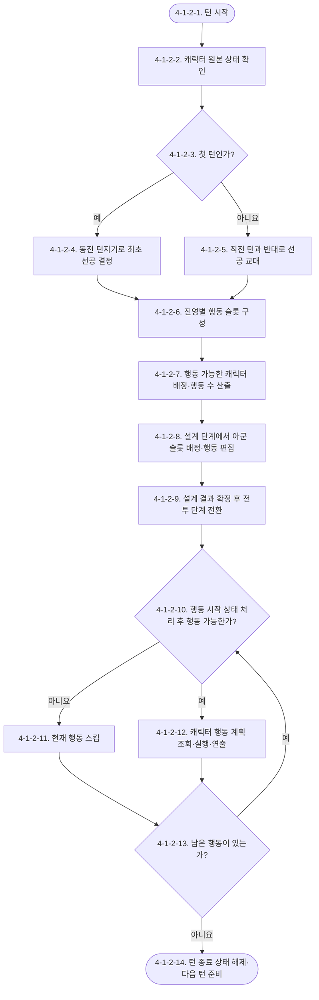

# Waredo 2.0 전투 시스템 기획서

> 상태: 확정
> 최근 수정일: 2026-09-06
> 문서 범위: 전투 규칙, 행동, 이동·경로, 일반 공격 실행, 스킬 실행·쿨타임 반영
> 연계 문서: [전투판 시스템 기획서](Waredo_2.0_전투판_시스템_기획서.md), [상태이상 시스템 기획서](Waredo_2.0_상태이상_시스템_기획서.md), [시간대 전환 시스템 기획서](Waredo_2.0_시간대_전환_시스템_기획서.md)

## 시스템 브리핑

전투 시스템은 한 턴에 행동할 아군 전체의 순서와 행동을 먼저 설계하고, `턴 실행` 이후 그 결과를 정해진 순서대로 해결하는 턴제 전투를 관리한다. 플레이어는 설계 단계에서 시간대 전환 버튼, 아군 행동 슬롯의 캐릭터 배정, 이동 경로와 일반 공격 또는 스킬을 조정하며 적의 행동 계획은 모두 확인할 수 있다. 시간대 전환 버튼을 누르면 시간대 전환 시스템이 즉시 현재 시간대·배경·버프를 갱신하고 변경 이벤트를 전달한다. 캐릭터 시스템은 이를 받아 활성 스킬을 다시 산출하며, 전투 시스템은 갱신된 상태를 해당 턴 실행에 참조한다.

행동 순서는 `actionSlots`가 소유하고 행동 내용은 캐릭터별 `characterActionPlans`가 소유한다. 슬롯에 기록된 `characterId`로 해당 캐릭터 플랜을 불러오기 때문에 플레이어가 슬롯의 캐릭터를 교환하면 이동·공격·스킬 계획도 그 캐릭터와 함께 실행 순서가 바뀐다.

캐릭터 한 명의 행동은 이동 후 일반 공격 또는 스킬 중 하나를 실행하는 구조다. 이동은 생략할 수 있지만 일반 공격이나 스킬을 사용한 뒤에는 이동할 수 없으며, 일반 공격과 스킬을 한 행동에서 함께 사용할 수 없다. 실행 도중 위치·상태·대상이 바뀌면 실제 위치를 기준으로 다시 판정하고, 실패한 주 행동은 취소하되 이미 진행한 이동은 유지한다.

일반 공격은 `Directional`, `SelfCentered`, `TileSelect` 세 종류를 사용하고, 스킬은 여기에 `SelfBuff`를 더한 네 종류를 사용한다. 방향성 공격은 상·하·좌·우 중 한 방향을 저장하고, 자기 기준 공격은 실행 시점의 캐릭터 현재 위치를 중심으로 처리한다. 타일 선택형은 절대 타일 좌표를 저장하지 않고 계획된 이동 도착 셀 기준 상대 방향·거리인 `relativeTargetOffset`을 저장하므로, 시전자의 실제 도착 위치가 달라지면 목표 셀도 같은 상대 위치를 유지하며 함께 이동한다. 자가 버프형은 별도 목표를 저장하지 않고 실행 시전자 자신에게 버프를 적용한다.

각 아군 캐릭터는 일반 스킬과 궁극기를 한 쌍으로 보유한다. 현재 시간대와 캐릭터의 `과거` 또는 `미래` 태그가 일치하면 같은 스킬 슬롯이 궁극기로 교체된다. 시간대 전환은 공유 `cooldownRemaining`을 변경하지 않는다. 시간대 태그는 상성이나 피해 배율을 만들지 않는다. 시간대별 버프, 시간 파편, 전환 비용과 2턴 체류는 [시간대 전환 시스템 기획서](Waredo_2.0_시간대_전환_시스템_기획서.md)를 따른다. 프로토타입 기준으로 적 캐릭터는 시간대 태그와 궁극기를 사용하지 않는다.

전투 시스템은 턴 구성, 행동 계획과 실행 순서, 쿨타임 반영, 반격 반응 및 효과 해결 흐름을 소유한다. 셀 좌표·점유·충돌은 전투판 시스템을, 띄워짐·기절·강제 이동은 상태이상 시스템을, 공격·스킬의 원본 수치와 범위는 캐릭터 시스템을 참조한다. 반격 상태·발동 기록·반응 공격은 이 문서의 반격 모듈이 소유한다. 세부 FSM 실행 설계는 [전투 FSM 기획서](../../보류/시스템/Waredo_2.0_전투_FSM_기획서.md)로 분리했으며 현재 전투 시스템의 확정 기준에는 적용하지 않는다.

## 유의사항

- 이 문서는 전투의 턴 구성과 플레이어 계획, 행동 실행 순서를 소유한다.
- 셀 좌표·점유·충돌은 전투판 시스템이 소유하며, 띄워짐·기절·밀쳐짐·당겨짐은 상태이상 시스템이 소유한다.
- 일반 공격과 스킬의 정의·수치·범위는 캐릭터 시스템이 소유한다. 이 문서는 계획된 일반 공격과 스킬을 전투 중 언제, 어떤 조건으로 실행하는지를 정의한다.
- 자가 버프 스킬의 `Counter` 효과 정의는 캐릭터 시스템이 소유하고, 반격 상태·범위 판정·발동 횟수·피해와 행동 중단은 전투 시스템이 소유한다.
- 전투 진입·초기 배치, 승패 판정, 전투 종료·게임 정산, 승리 보상은 `[기존 유지]`이며 전투 진입 및 종료 시스템을 참조한다.
- 시간대 전환은 계획 단계에서만 가능하고 변경 버튼 입력 순간 즉시 처리된다. 전투 단계에서는 시간대·배경·버프·활성 스킬을 변경하지 않는다. 상세 규칙과 비용은 시간대 전환 시스템의 단일 원본을 참조한다.
- 변경 가능한 값과 외부 시스템에서 참조하는 값은 각 모듈의 접이식 변수 표에서 출처와 소유권을 함께 표시한다.

# 1. 기획 의도

플레이어가 캐릭터 한 명의 행동을 즉시 입력하는 대신, 한 턴에 참여하는 아군 전체의 순서와 행동을 미리 설계하게 한다. 선공 진영의 교대, 적 행동 순서, 이동 뒤에만 가능한 공격 또는 스킬이라는 제약을 읽고 계획을 조정하면서, 제한된 순서 안에서 더 좋은 결과를 만드는 전술적 재미를 제공한다.

# 2. 개발 목적

- 턴의 행동 수와 선공 교대 규칙을 일관되게 관리한다.
- 행동 슬롯은 실행 순서를, 캐릭터 플랜은 해당 캐릭터의 행동 내용을 소유하도록 분리한다.
- 슬롯에 배정된 캐릭터 ID로 해당 캐릭터 플랜을 불러와 행동이 캐릭터를 따라가게 한다.
- 이동, 일반 공격, 스킬 사용의 허용 순서와 상호 배타 조건을 공통 규칙으로 제공한다.
- 실행 시점의 전투불능·상태이상·사거리·타겟 유효성 변화에 안전하게 대응한다.

# 3. 시스템 구조

## 3.1 모듈 구성

```text
전투 시스템 [확정]
├─ 전투 규칙 [확정]
│  ├─ 전투 시작·선공 결정 [확정]
│  ├─ 행동 슬롯·행동 순서 [확정]
│  └─ 설계·전투 단계 [확정]
├─ 행동 [확정]
│  ├─ 행동 슬롯 [확정]
│  ├─ 캐릭터 플랜 [확정]
│  └─ 슬롯·플랜 연결 및 행동 실행 [확정]
├─ 이동·경로 [확정]
├─ 일반 공격 실행 [확정]
├─ 스킬 실행·쿨타임 반영 [확정]
└─ 반격 [확정]
```

FSM의 상태명과 세부 전이 구조는 이 문서의 확정 범위에 포함하지 않는다. 별도로 분리한 전투 FSM 기획서는 `[보류]` 상태이며 보류 해제 전까지 참고 자료로만 사용한다.

## 3.2 시스템 경계

| 구분 | 이 문서가 소유 | 외부에서 참조 |
|---|---|---|
| 전투 규칙 | 턴 인덱스, 선공 진영, 행동 슬롯, 현재 행동 번호, 설계·전투 단계 | 캐릭터 생존 상태, 상태이상, 적 순서, 시간대 |
| 행동 | 캐릭터별 계획, 이동과 주 행동의 실행 연결 | 행동 슬롯, 공격·스킬 정의 |
| 이동·경로 | 플레이어가 그린 직교 경로와 경로 진행 | 전투판의 셀 유효성·점유·충돌, 캐릭터 이동력 |
| 공격·스킬 실행 | 도착 위치 기준 재검증과 성공·실패 처리 | 캐릭터 시스템의 공격·스킬 데이터 |
| 반격 | 반격 상태, 발동 범위·시점·대상별 중복 방지, 반응 피해와 행동 중단 | 캐릭터 시스템의 `Counter` 효과·일반 공격 피해, 전투판 위치, 상태이상 |

# 4. 시스템 상세 구조

## 4-1. 기능 모듈

전투 시스템은 `전투 규칙`이 한 턴의 구성과 설계·전투 단계의 진행을 통제하고, `행동`이 캐릭터별 계획을 조회해 `이동`, `공격`, `스킬 사용` 모듈을 순서대로 연결하는 구조다. 이동은 전투판 시스템에 셀 진입을 요청하고 점유 변경 또는 충돌 결과를 받는다. 공격·스킬의 내부 계산은 각 소유 시스템의 후속 기획 범위로 남긴다.

### 4-1-1. 전투 규칙

#### 사용 변수·용어

| 변수·용어 | 이 모듈에서의 의미 | 값 형태 | 소유·성격 |
|---|---|---|---|
| `battlePhase` | 현재 전투 진행 단계 | 열거값 | 전투 규칙 소유·상태 |
| `turnIndex` | 현재 전투의 턴 번호 | 정수 | 전투 규칙 소유·상태 |
| `characterId` | 전투 캐릭터를 식별하는 값 | ID | 캐릭터 시스템 > 캐릭터 정의 모듈 소유·참조 |
| `characterCategory` | 일반 적·보스 적·아군을 구분하는 분류 | 열거값 | 캐릭터 시스템 > 캐릭터 정의 모듈 소유·참조 |
| `currentHp` | 캐릭터의 현재 체력 | 정수 | 캐릭터 시스템 > 파라미터 모듈 소유·참조 |
| `activeStatusEffects` | 캐릭터에게 현재 적용 중인 상태이상 인스턴스 | 목록 | 상태이상 시스템 > 활성 상태이상 목록 소유·참조 |
| `turnActionCount` | 현재 턴의 전체 행동 수 | 정수 | 전투 규칙 산출·파생 |
| `firstActingFaction` | 현재 턴의 1번 행동을 갖는 진영 | 열거값 | 전투 규칙 소유·상태 |
| `enemyActionOrder` | 레벨 디자인이 정한 적의 진영 내부 순서 | ID 목록 | 레벨 디자인 > 적 배치·행동 순서 데이터 소유·참조 |
| `actionSlots` | 현재 턴의 행동 번호·진영·배정 `characterId`를 함께 관리하는 전체 행동 순서 | 행동 슬롯 목록 | 전투 규칙 소유·상태·캐릭터 배정 단일 원본 |
| `currentTimePeriod` | 현재 전투가 위치한 시간대 | `과거`, `현재`, `미래` | 시간대 전환 시스템 > 시간대 상태 소유·참조 |
| `currentActionNumber` | 전투 단계에서 현재 처리 중인 행동 번호 | 정수 | 전투 규칙 소유·상태 |

#### 4-1-1-1. 목적과 책임

`전투 규칙`은 `currentHp > 0`이고 `activeStatusEffects`에 `Stun`이 없는 캐릭터를 기준으로 `actionSlots`를 구성하고, 첫 턴에는 동전 던지기로 선공을 결정하며 이후 턴에는 선공을 교대한다. 적 슬롯에는 `enemyActionOrder`에 따라 적을 배정한다. 아군 슬롯은 전투 최초 한 번만 무작위로 배정하고 이후 턴에는 직전 턴의 아군 상대 순서를 유지한다. 설계 단계에서는 아군 슬롯 사이의 캐릭터 배정과 각 아군의 행동을 변경할 수 있다. 플레이어가 `턴 실행` 버튼을 누르면 `battlePhase`를 `Combat`으로 전환하고 현재 `actionSlots`와 캐릭터별 행동 계획의 편집을 차단한 뒤 그대로 조회한다. 각 행동 직전에도 같은 원본값을 확인하며 조건을 충족하지 못하면 현재 행동을 스킵한다.

#### 4-1-1-2. 입력·처리·출력

| 구분 | 내용 |
|---|---|
| 입력 | `characterId`, `characterCategory`, `currentHp`, `activeStatusEffects`, `enemyActionOrder`, `currentTimePeriod`, 적 행동 내용, 플레이어의 아군 행동·슬롯 배정 변경 |
| 처리 | `currentHp`와 `activeStatusEffects` 직접 확인, `turnActionCount` 산출, 최초 동전 던지기와 이후 선공 교대, 최초 아군 무작위 배정과 이후 순서 유지, 진영별 순서 배치, `턴 실행` 입력 후 편집 차단, 행동 순차 처리, 행동 불능 캐릭터의 행동 스킵 |
| 출력 | `firstActingFaction`, `actionSlots`, 현재 행동 실행 요청 또는 스킵 결과, 연출 시스템 표현 요청 |
| 소유 데이터 | `battlePhase`, `turnIndex`, `firstActingFaction`, `actionSlots`, `currentActionNumber` |
| 참조 데이터 | `characterId`, `characterCategory`, `currentHp`, `activeStatusEffects`, `enemyActionOrder`, `currentTimePeriod` |
| 의존 모듈·시스템 | 캐릭터 시스템, 상태이상 시스템, 레벨 디자인, 시간대 전환 시스템, 적 AI 시스템, 애니메이션·이펙트·연출 시스템 |
| 실패·취소·예외 | 행동 직전 `currentHp <= 0`이거나 `activeStatusEffects`에 `Stun`이 있으면 현재 행동을 스킵하고 다른 캐릭터에게 양도하지 않는다. `currentHp <= 0`인 캐릭터는 전투불능 확정 즉시 전투판에서 제거한다. |

외부에서 참조하는 변수는 아래 원본에서 가져온다.

| 참조 변수 | 가져오는 시스템 | 원본 모듈·데이터 | 전투 규칙에서의 사용 | 원본 문서 |
|---|---|---|---|---|
| `characterId` | 캐릭터 시스템 | 4-1-1. 캐릭터 정의 모듈 | 전투 참가자, 행동 순서와 행동자의 식별 | `확정/시스템/Waredo_2.0_캐릭터_시스템_기획서.md` |
| `characterCategory` | 캐릭터 시스템 | 4-1-1. 캐릭터 정의 모듈 | `Ally`, `NormalEnemy`, `BossEnemy`를 아군·적 진영으로 구분 | `확정/시스템/Waredo_2.0_캐릭터_시스템_기획서.md` |
| `currentHp` | 캐릭터 시스템 | 4-1-2. 파라미터 모듈·4-1-7. 변수 소유권 모듈 | 0 이하인지 직접 확인해 행동 스킵 | `확정/시스템/Waredo_2.0_캐릭터_시스템_기획서.md` |
| `activeStatusEffects` | 상태이상 시스템 | 캐릭터별 활성 상태이상 인스턴스 목록 | `Stun` 존재 여부를 직접 확인해 행동 스킵 | [상태이상 시스템 기획서](Waredo_2.0_상태이상_시스템_기획서.md) 4-1; 소유권 관계는 캐릭터 시스템 기획서 4-1-7에서 확인 |
| `enemyActionOrder` | 레벨 디자인 | 전투별 적 배치·행동 순서 데이터 | 적 캐릭터를 적 행동 슬롯에 배치 | 레벨 디자인 문서 `[확인 필요]` |
| `currentTimePeriod` | 시간대 전환 시스템 | 현재 전투가 위치한 시간대 | 전투 단계에서 사용할 시간대 참조 | `확정/시스템/Waredo_2.0_시간대_전환_시스템_기획서.md` |

#### 4-1-1-3. 턴과 행동 수 규칙

- 한 턴은 설계 단계와 전투 단계로 구성한다.
- 행동 가능 여부를 나타내는 별도 파생 변수는 만들지 않는다.
- 턴 시작 시 전체 전투 캐릭터의 `currentHp`와 `activeStatusEffects`를 직접 확인한다.
- `actionSlots`를 구성할 때 `currentHp > 0`이고 `activeStatusEffects`에 `Stun`이 없는 캐릭터만 배정한다.
- 모든 캐릭터 배정이 끝나면 `turnActionCount`를 `actionSlots`의 전체 개수로 산출한다.
- 하나의 행동 가능 캐릭터는 현재 턴의 `actionSlots`에 정확히 한 번 배치한다.

```text
행동 슬롯 포함 조건 = currentHp > 0 AND activeStatusEffects에 Stun 없음
```

```text
turnActionCount = actionSlots의 개수
```

#### 4-1-1-4. 선공 규칙

- `turnIndex`가 1인 전투 첫 턴에는 동전 던지기를 한 번 수행한다.
- 첫 턴의 `firstActingFaction`은 50% 확률로 아군 또는 적이 된다.
- `turnIndex`가 2 이상이면 동전을 다시 던지지 않고 직전 턴의 후공 진영을 `firstActingFaction`으로 정한다.
- 이에 따라 아군과 적은 턴마다 번갈아 선공한다.
- `NormalEnemy`와 `BossEnemy`는 모두 적 진영으로 판정한다.
- 동전 결과는 해당 턴의 설계 단계가 시작되기 전에 정한다.

#### 4-1-1-5. 행동 슬롯 캐릭터 배정 규칙

- `enemyActionOrder`는 레벨 디자인이 정한다.
- 일반 적과 보스는 모두 `enemyActionOrder`에 포함될 수 있으며, 해당 순서대로 적 `actionSlots`에 배정한다.
- 첫 턴에는 아군 캐릭터를 아군 `actionSlots`에 무작위로 한 명씩 배정한다.
- 두 번째 턴부터는 직전 턴 종료 시점의 아군 슬롯 상대 순서를 유지하며 다시 무작위 배정하지 않는다. 전투불능 캐릭터는 순서에서 제거하고 남은 아군끼리의 상대 순서는 유지한다.
- 플레이어는 설계 단계에서 아군 `actionSlots`에 배정된 `characterId`를 아군 슬롯끼리 자유롭게 교환할 수 있다.
- 플레이어는 적 캐릭터의 `enemyActionOrder`를 변경할 수 없다.
- 별도의 아군 순서 목록은 저장하지 않으며 `actionSlots`의 `characterId` 배정을 단일 원본으로 사용한다.

#### 4-1-1-6. 전체 행동 순서 규칙

- `firstActingFaction`의 캐릭터를 1번 행동에 배치한다.
- 이후 양 진영의 캐릭터를 교차해 `actionSlots`에 배치한다.
- 양 진영의 행동 가능 캐릭터 수가 다르면 한 진영의 캐릭터가 모두 배치될 때까지 선공 진영부터 교차 배치한다. 이후 남은 진영의 캐릭터를 기존 진영 내부 순서대로 뒤에 연속 배치한다.
- 설계 단계에서 아군 슬롯의 캐릭터 배정을 변경하면 해당 아군 `actionSlots`의 `characterId`만 서로 교환한다.
- 플레이어의 순서 변경은 `firstActingFaction`, 적 슬롯과 `turnActionCount`를 변경하지 않는다.

#### 4-1-1-7. 설계 단계 규칙

- `battlePhase`가 `Design`일 때 플레이어는 `Ally` 카테고리 캐릭터를 조작할 수 있다.
- 설계 단계에서 시간대 전환 버튼, 아군 행동과 아군 `actionSlots`의 캐릭터 배정을 변경할 수 있다. 시간대 전환 버튼 입력은 별도 행동 슬롯을 사용하지 않으며 누르는 즉시 처리된다.
- 적 행동 내용은 적 AI 시스템 또는 레벨 디자인이 제공한다. 설계 단계에서는 적 캐릭터의 이동 경로, 일반 공격·스킬·주 행동 없음 여부와 방향·자기 기준 범위·상대 타일 위치를 포함한 행동 계획을 모두 공개한다.
- 플레이어가 `턴 실행` 버튼을 누르는 순간 설계 단계를 종료한다.
- `턴 실행` 버튼 입력을 받으면 `battlePhase`를 `Combat`으로 전환하고 현재 시간대·아군 행동 계획·`actionSlots`의 편집을 차단한다. 별도의 턴 계획 복제 객체는 만들지 않는다.
- 별도의 계획 검증 모듈이나 실행용 계획 사본은 만들지 않는다. `턴 실행` 입력 직후 현재 데이터를 읽기 전용으로 바꾸고 전투 단계로 전환한다.

#### 4-1-1-8. 전투 단계 규칙

- `battlePhase`가 `Combat`이면 `currentActionNumber`가 가리키는 `actionSlots`의 행동을 순서대로 처리한다.
- 전투 단계에서는 `currentTimePeriod`·아군 행동 계획·`actionSlots` 배정을 변경하지 않는다. 전투 단계에 들어온 뒤 시간대 전환을 시도할 수 없다.
- 각 행동 시작 이벤트와 턴 종료 이벤트는 상태이상 시스템에 전달한다.
- 각 행동 결과는 애니메이션·이펙트·연출 시스템에 전달해 표시한다.
- 구체적인 행동 효과의 판정과 연출 타이밍은 해당 전투 하위 시스템과 연출 시스템에서 정의한다.

#### 4-1-1-9. 행동 가능 판정과 행동 스킵 규칙

- 턴 시작 시 `currentHp <= 0`이거나 `activeStatusEffects`에 `Stun`이 있는 캐릭터는 현재 턴의 `actionSlots`에서 제외한다.
- 전투 단계에서는 각 행동 시작 시 `currentHp`와 `activeStatusEffects`를 다시 조회한다.
- `Airborne`이 있으면 상태이상 시스템이 이를 제거하고 해당 행동을 취소한다.
- 현재 턴에서 `currentHp <= 0`이거나 `activeStatusEffects`에 `Stun`이 있는 캐릭터에게 아직 실행되지 않은 행동이 있으면 해당 행동을 스킵한다.
- 스킵된 행동을 다른 캐릭터에게 배정하지 않는다.
- 전투불능 또는 기절로 인해 현재 턴의 `actionSlots`를 재구성하거나 뒤 행동의 번호를 변경하지 않는다.
- `currentHp <= 0`이 확인되면 전투불능을 확정하고 캐릭터의 셀 점유와 전투판 표시를 즉시 제거한다. 해당 캐릭터를 대상으로 남아 있는 실행 요청은 취소한다.
- 현재 턴의 모든 행동이 끝나면 상태이상 시스템에 턴 종료 이벤트를 전달해 남은 `Airborne`과 `Stun`을 제거하고, 반격 모듈은 모든 `counterState`를 제거한다.
- 다음 계획 단계에서는 상태 해제 결과와 `currentHp`를 직접 확인하고 조건을 충족하지 못한 캐릭터를 새로 구성할 `actionSlots`에서 제외한다. 적 배정 시에는 `enemyActionOrder`에서 해당 캐릭터를 건너뛴다.

### 4-1-2. 전투 시스템 처리 순서



| 번호 | 처리 설명 |
|---|---|
| 4-1-2-1 | 현재 턴의 전투 규칙 처리를 시작한다. |
| 4-1-2-2 | 전체 전투 캐릭터의 `currentHp`와 `activeStatusEffects`를 직접 확인한다. 별도 행동 가능 캐릭터 목록은 만들지 않는다. |
| 4-1-2-3 | `turnIndex`가 1인 첫 턴인지 확인한다. |
| 4-1-2-4 | 첫 턴이면 50% 확률의 동전 던지기로 최초 `firstActingFaction`을 결정한다. |
| 4-1-2-5 | 이후 턴이면 직전 턴의 후공 진영으로 `firstActingFaction`을 교대한다. |
| 4-1-2-6 | `firstActingFaction`과 양 진영의 행동 가능 인원으로 진영별 `actionSlots`를 구성한다. |
| 4-1-2-7 | `currentHp > 0`이고 `activeStatusEffects`에 `Stun`이 없는 캐릭터만 슬롯에 배정한다. 적은 `enemyActionOrder`를 따른다. 아군은 첫 턴에만 무작위로 배정하고 이후 턴에는 직전 턴의 상대 순서를 유지한다. 한 진영의 인원이 먼저 소진되면 남은 진영의 캐릭터를 뒤에 연속 배치하고 `actionSlots` 개수로 `turnActionCount`를 산출한다. |
| 4-1-2-8 | 플레이어가 시간대·아군 행동과 아군 `actionSlots` 사이의 캐릭터 배정을 변경하는 설계 단계를 진행한다. |
| 4-1-2-9 | 플레이어가 `턴 실행` 버튼을 누르면 `battlePhase`를 `Combat`으로 전환하고 현재 시간대·아군 행동 계획·`actionSlots`의 편집을 차단한다. |
| 4-1-2-10 | 행동 시작 시 `currentHp`와 `activeStatusEffects`를 다시 조회한다. `Airborne`이 있으면 이를 제거하고 현재 행동을 취소한다. |
| 4-1-2-11 | `Airborne`으로 취소되지 않았더라도 `currentHp <= 0`이거나 `activeStatusEffects`에 `Stun`이 있으면 현재 행동을 실행하지 않고 스킵한다. |
| 4-1-2-12 | 두 스킵 조건에 해당하지 않으면 `characterId`로 행동 계획을 조회한다. 행동 개시·이동 셀 진입마다 반격을 먼저 해결하고 생존·기절 여부를 재확인하면서 이동 뒤 일반 공격 또는 스킬 중 하나를 실행한 다음 연출 시스템에 표현을 요청한다. |
| 4-1-2-13 | `actionSlots`에 처리할 다음 행동이 남았는지 확인한다. |
| 4-1-2-14 | 남은 행동이 없으면 턴 종료 이벤트로 남은 `Airborne`·`Stun`을 제거하고 다음 턴을 준비한다. 다음 계획 단계에서는 갱신된 원본 상태로 행동 순서를 구성한다. |

### 4-1-3. 기획 변수

| 변수명 | 기획상 의미 | 값 형태 | 초기값·허용값 | 소유 모듈 | 사용 위치(번호) | 성격 | 산출·갱신 규칙 | 비고 |
|---|---|---|---|---|---|---|---|---|
| `battlePhase` | 현재 전투 진행 단계 | 열거값 | `Design`, `Combat` | 전투 규칙 | 4-1-1 | 상태 | 턴 순서에 따라 전환 | 전투 진입·종료 단계는 후속 기획 |
| `turnIndex` | 현재 전투의 턴 번호 | 정수 | 1 이상, 최초 1 | 전투 규칙 | 4-1-1, 4-1-1-4, 4-1-2 | 상태 | 한 턴의 모든 행동이 끝나면 1 증가 | 첫 턴 동전 여부 판정에 사용 |
| `characterId` | 전투 캐릭터 식별값 | ID | 중복 불가 | 캐릭터 시스템 > 캐릭터 정의 모듈 | 4-1-1 | 참조 | 캐릭터 정의에서 설정 | `확정/시스템/Waredo_2.0_캐릭터_시스템_기획서.md` 4-1-1 참조 |
| `characterCategory` | 캐릭터의 일반 적·보스 적·아군 분류 | 열거값 | `NormalEnemy`, `BossEnemy`, `Ally` | 캐릭터 시스템 > 캐릭터 정의 모듈 | 4-1-1-2, 4-1-1-4~5, 4-1-1-7 | 참조 | 캐릭터 정의에서 조회 | 캐릭터 시스템 기획서 4-1-1 참조; 두 적 카테고리는 적 진영으로 묶음 |
| `currentHp` | 캐릭터의 현재 체력 | 정수 | `0~effectiveMaxHp` | 캐릭터 시스템 > 파라미터 모듈 | 4-1-1-2 | 참조 | 피해·회복 결과로 캐릭터 시스템이 갱신 | 캐릭터 시스템 기획서 4-1-2·4-1-7 참조; 0 이하면 전투불능 확정 후 즉시 제거 |
| `activeStatusEffects` | 현재 적용 중인 상태이상 인스턴스 | 목록 | 0개 이상 | 상태이상 시스템 > 활성 상태이상 목록 | 4-1-1, 4-1-1-3, 4-1-1-9, 4-1-2 | 참조 | 상태이상 시스템만 생성·변경·제거 | 상태이상 시스템 기획서 4-1; 캐릭터 시스템 기획서 4-1-7에서 소유권 관계 확인 |
| `turnActionCount` | 현재 턴의 전체 행동 수 | 정수 | 0 이상 | 전투 규칙 | 4-1-1-3, 4-1-1-6, 4-1-2 | 파생 | 구성이 끝난 `actionSlots`의 개수 | 별도 행동 가능 캐릭터 목록을 만들지 않음 |
| `firstActingFaction` | 현재 턴의 선공 진영 | 열거값 | `Ally`, `Enemy` | 전투 규칙 | 4-1-1-4, 4-1-1-6, 4-1-2 | 상태 | 첫 턴에는 50% 동전 던지기, 이후 턴에는 직전 턴의 반대 진영으로 갱신 | 턴마다 교대 |
| `enemyActionOrder` | 레벨 디자인이 정한 적 내부 순서 | ID 목록 | 행동 가능한 적, 중복 없음 | 레벨 디자인 > 적 배치·행동 순서 데이터 | 4-1-1-5~6, 4-1-1-9, 4-1-2 | 참조 | 레벨 디자인 원본에서 조회 후 `currentHp <= 0`이거나 `Stun` 상태인 캐릭터 제외 | 원본 레벨 디자인 문서 확인 필요; 일반 적·보스 포함 |
| `actionSlots` | 행동 번호·진영·배정 캐릭터를 포함하는 현재 턴의 실행 순서 | 행동 슬롯 목록 | `turnActionCount`개, 캐릭터 중복 배정 불가 | 전투 규칙 | 4-1-1, 4-1-1-5~9, 4-1-2 | 상태 | 선공과 진영별 인원으로 슬롯을 생성하고 적은 `enemyActionOrder`, 아군은 첫 턴 무작위·이후 직전 상대 순서로 `characterId`를 배정한 뒤 설계 단계에서 아군 슬롯끼리 교환 | 캐릭터 배정 단일 원본; 한 진영 소진 후 남은 진영을 뒤에 연속 배치 |
| `currentTimePeriod` | 현재 전투가 위치한 시간대 | 시간대 값 | `과거`, `현재`, `미래` | 시간대 전환 시스템 > 시간대 상태 | 4-1-1-7, 4-1-2 | 참조 | 시간대 전환 시스템의 즉시 전환 결과를 조회 | `확정/시스템/Waredo_2.0_시간대_전환_시스템_기획서.md` 참조; 효과·비용도 해당 시스템 소유 |
| `currentActionNumber` | 현재 처리 중인 행동 번호 | 정수 | `actionSlots` 범위 | 전투 규칙 | 4-1-1, 4-1-1-8, 4-1-2 | 상태 | 전투 단계에서 행동 처리 후 다음 번호로 진행 | 행동 스킵 시에도 진행 |
| `characterActionPlans` | 캐릭터별 이동과 주 행동 계획 | 캐릭터 ID별 계획 목록 | 캐릭터당 최대 1개 | 행동 | 4-1-4 | 상태 | 아군은 플레이어, 적군은 적 AI·레벨 디자인이 작성하고 `characterId`로 조회 | 슬롯이 아니라 캐릭터에 귀속 |
| `movePath` | 이동 시작 셀을 제외한 순차 이동 경로 | 셀 좌표 목록 | 0개 이상, 최대 `effectiveMoveRange`개 | 행동 | 4-1-4, 4-1-5 | 상태 | 전투판 시스템의 `cellCoordinate` 규칙에 따라 직교 인접 셀을 순서대로 추가 | 대각선 연결 불가 |
| `mainActionType` | 이동 뒤 실행할 주 행동 종류 | 열거값 | `None`, `NormalAttack`, `Skill` | 행동 | 4-1-4~7 | 상태 | 캐릭터별 계획에서 하나만 선택 | 공격·스킬 동시·연속 사용 불가 |
| `actionId` | 선택한 일반 공격 또는 스킬 정의 식별값 | ID 또는 없음 | `mainActionType`에 대응 | 행동 | 4-1-4, 4-1-6~7 | 상태 | 주 행동 선택 시 해당 정의 ID 저장 | 원본 정의는 캐릭터 시스템 소유 |
| `targetDirection` | `Directional` 행동에서 저장한 방향 | 방향 또는 없음 | `Up`, `Down`, `Left`, `Right` | 행동 | 4-1-4, 4-1-6~7 | 상태 | 방향 선택 시 저장 | 실행 시 도착 위치에서 해당 방향 사용 |
| `relativeTargetOffset` | `TileSelect` 행동에서 저장한 시전자 기준 상대 방향·거리 | 상대 변위 또는 없음 | `(Δx, Δy)` | 행동 | 4-1-4, 4-1-6~7 | 상태 | 계획 원점과 선택 타일의 차이를 저장 | 실행 시 시전자의 실제 위치에 더해 목표 셀 산출 |
| `selfBuffConfirmed` | `SelfBuff` 스킬의 자기 대상 확정 여부 | 참/거짓 | 기본 `false` | 행동 | 4-1-4, 4-1-7 | 상태 | 자기 자신 재선택 또는 행동 확정 입력 시 `true` | 실행 후 다음 계획에서 초기화 |
| `effectiveMoveRange` | 현재 캐릭터가 한 행동에서 이동 가능한 셀 수 | 정수 | 캐릭터 시스템 허용 범위 | 캐릭터 시스템 > 파라미터 모듈 | 4-1-5 | 참조 | 캐릭터 시스템의 현재 이동력 조회 | 캐릭터 시스템 기획서 참조 |
| `cellOccupants` | 각 셀을 현재 점유하는 캐릭터 또는 환경 요소 | 셀별 점유 정보 | 비점유 또는 점유 요소 1개 | 전투판 시스템 > 셀·점유 모듈 | 4-1-5~7 | 참조 | 전투판 시스템의 점유 결과를 조회 | 전투판 시스템 기획서 4-2 참조 |
| `cellEntryEffects` | 캐릭터가 셀에 진입할 때 적용할 효과 | 효과 목록 | 0개 이상 | 환경 요소 시스템 > 셀 진입 효과 | 4-1-5 | 참조 | 셀 진입 시 환경 요소 시스템에서 조회 | 환경 요소 문서 `[작성 전]` |
| `normalAttackTargetingType` | 일반 공격의 저장 데이터 선택 기준 | 열거값 | `Directional`, `SelfCentered`, `TileSelect` | 캐릭터 시스템 > 일반 공격 정의 모듈 | 4-1-6 | 참조 | 일반 공격 정의에서 조회 | 캐릭터 시스템 기획서 4-1-5 |
| `normalAttackRangePatternId` | 도착 위치에서 펼칠 일반 공격 범위 패턴 | ID | 일반 공격별 필수 | 캐릭터 시스템 > 일반 공격 정의 모듈 | 4-1-6 | 참조 | 일반 공격 정의에서 조회 | 캐릭터 시스템 기획서 4-1-5 |
| `normalAttackAffectedCellPatternId` | 범위 검증 성공 후 실제 영향 셀 패턴 | ID 또는 없음 | 타겟팅 유형별 규칙 | 캐릭터 시스템 > 일반 공격 정의 모듈 | 4-1-6 | 참조 | 일반 공격 정의에서 조회 | 캐릭터 시스템 기획서 4-1-5 |
| `normalAttackValidTargetTeam` | 일반 공격의 유효 대상 진영 | 열거값 | `Enemy`, `Ally`, `All` | 캐릭터 시스템 > 일반 공격 정의 모듈 | 4-1-6 | 참조 | 일반 공격 정의에서 조회 | 캐릭터 시스템 기획서 4-1-5 |
| `normalAttackDamage` | 일반 공격의 보정 전 기본 피해 | 정수 | 0 이상 | 캐릭터 시스템 > 일반 공격 정의 모듈 | 4-1-6 | 참조 | 범위 검증 성공 후 피해 계산 입력으로 사용 | 캐릭터 시스템 기획서 4-1-2·4-1-5 |
| `skillTargetingType` | 스킬의 저장 데이터 선택 기준 | 열거값 | `Directional`, `SelfCentered`, `TileSelect`, `SelfBuff` | 캐릭터 시스템 > 스킬 정의 모듈 | 4-1-7 | 참조 | 활성 스킬 정의에서 조회 | 캐릭터 시스템 기획서 4-1-3·4-1-6 |
| `activeSkillId` | 현재 시간대와 태그에 따라 스킬 슬롯에 활성화된 일반 스킬 또는 궁극기 | ID | 캐릭터의 스킬 쌍 중 하나 | 캐릭터 시스템 > 시간대 태그·스킬 교체 모듈 | 4-1-7 | 참조 | 시간대·태그 일치 시 궁극기, 아니면 일반 스킬 | 시간대 전환 시 재산출, 쿨타임은 유지 |
| `skillRangePatternId` | 도착 위치에서 펼칠 스킬 범위 패턴 | ID | 스킬별 필수 | 캐릭터 시스템 > 스킬 정의 모듈 | 4-1-7 | 참조 | 스킬 정의에서 조회 | 캐릭터 시스템 기획서 4-1-6 |
| `skillAffectedCellPatternId` | 범위 검증 성공 후 실제 영향 셀 패턴 | ID 또는 없음 | 타겟팅 유형별 규칙 | 캐릭터 시스템 > 스킬 정의 모듈 | 4-1-7 | 참조 | 스킬 정의에서 조회 | 캐릭터 시스템 기획서 4-1-6 |
| `skillEffects` | 성공한 스킬이 순서대로 실행할 효과 | 효과 목록 | 1개 이상 | 캐릭터 시스템 > 스킬 정의 모듈 | 4-1-7 | 참조 | 스킬 정의의 작성 순서대로 실행 요청 | 캐릭터 시스템 기획서 4-1-6 |
| `effectiveCooldownMax` | 스킬 사용 성공 시 설정할 쿨타임 | 정수 | 1 이상 | 캐릭터 시스템 > 파라미터 모듈 | 4-1-7 | 참조 | 스킬 원본과 보정으로 산출 | 캐릭터 시스템 기획서 4-1-2·4-1-6 |
| `cooldownRemaining` | 현재 남은 스킬 쿨타임 | 정수 | `0~effectiveCooldownMax` | 전투 스킬 쿨타임 모듈 | 4-1-7 | 상태 참조 | 사용 성공 시 설정하고 범위 실패 시 유지 | 본 문서 4-1-6·4-1-7 |
| `counterState` | 캐릭터에게 적용된 반격 대기 상태 | 상태 또는 없음 | 기본 없음, 자가 버프 성공 시 생성 | 반격 | 4-1-8 | 상태 | 적용 턴 종료 시 제거 | 반격 효과의 실행 상태 |
| `counterRangePatternId` | 반격 발동 범위 | 패턴 ID | 기본 `사각형_1` | 캐릭터 시스템의 `Counter` 효과 참조 | 4-1-8 | 참조 | 반격자 현재 셀을 원점으로 판정 | 3×3, 중심은 적 점유 불가 |
| `counterTriggeredTargetIds` | 현재 턴에 이미 반격한 대상 | 캐릭터 ID 목록 | 상태 생성 시 빈 목록 | 반격 | 4-1-8 | 상태 | 대상별 첫 발동 직전에 ID 추가, 턴 종료 시 상태와 함께 제거 | 같은 대상에게 턴당 1회 |
| `counterAppliesStun` | 반격 시 기절 적용 여부 | 참/거짓 | `true` 또는 `false` | 반격 | 4-1-8 | 상태 | `Counter` 효과 적용 시 설정 | `true`면 반격 피해와 함께 현재 위치에 기절 적용 |

### 4-1-4. 행동

#### 사용 변수·용어

| 변수·용어 | 이 모듈에서의 의미 | 값 형태 | 소유·성격 |
|---|---|---|---|
| `actionSlots` | 행동 번호·진영·배정 `characterId`만 저장하는 실행 순서 | 행동 슬롯 목록 | 전투 규칙 소유·참조 |
| `characterActionPlans` | `characterId`로 조회하는 캐릭터별 행동 계획 | 캐릭터 ID별 계획 목록 | 행동 소유·상태 |
| `movePath` | 캐릭터가 순서대로 통과할 셀 | 셀 좌표 목록 | 행동 소유·상태; 좌표 규칙은 전투판 시스템 참조 |
| `mainActionType` | 이동 뒤 실행할 일반 공격·스킬·없음 중 하나 | 열거값 | 행동 소유·상태 |
| `actionId` | 일반 공격 또는 스킬 정의 식별값 | ID 또는 없음 | 행동 소유·상태 |
| `targetDirection` | 방향성 행동에서 저장한 방향 | 방향 또는 없음 | 행동 소유·상태 |
| `relativeTargetOffset` | 타일 선택형 행동에서 저장한 상대 방향·거리 | 상대 변위 또는 없음 | 행동 소유·상태 |
| `selfBuffConfirmed` | 자가 버프형 스킬의 자기 대상 확정 여부 | 참/거짓 | 행동 소유·상태 |
| `currentHp` | 행동 캐릭터의 현재 체력 | 정수 | 캐릭터 시스템 소유·참조 |
| `activeStatusEffects` | 행동 캐릭터에게 적용 중인 상태이상 | 목록 | 상태이상 시스템 소유·참조 |

#### 4-1-4-1. 행동 슬롯 설명

`actionSlots`는 이번 턴에 **몇 번째로, 어느 진영의 어떤 캐릭터가 행동하는지**를 정하는 실행 순서다. 슬롯은 행동 내용을 저장하지 않으며 아래 정보만 가진다.

| 슬롯 정보 | 설명 |
|---|---|
| `actionNumber` | 현재 턴에서 실행할 순번 |
| `faction` | 해당 순번에 행동할 진영 |
| `characterId` | 해당 순번에 배정된 캐릭터 |

- 하나의 슬롯에는 하나의 `characterId`만 배정한다.
- 플레이어가 아군 행동 순서를 바꾸는 것은 아군 슬롯끼리 `characterId`를 교환하는 처리다.
- 슬롯에는 `movePath`, `mainActionType`, `actionId`, `targetDirection`, `relativeTargetOffset`, `selfBuffConfirmed`를 저장하지 않는다.
- 따라서 행동 순서를 변경해도 캐릭터의 행동 내용이 이전 슬롯에 남지 않는다.

#### 4-1-4-2. 캐릭터 플랜 설명

`characterActionPlans`는 **각 캐릭터가 자신의 행동 차례에 무엇을 할지** 저장하는 캐릭터별 플랜이다. 각 플랜은 `characterId`에 귀속되며 다음 정보를 가진다.

| 플랜 정보 | 설명 |
|---|---|
| `characterId` | 플랜을 소유하는 캐릭터 |
| `movePath` | 캐릭터가 순서대로 이동할 셀. 이동하지 않으면 빈 목록 |
| `mainActionType` | `None`, `NormalAttack`, `Skill` 중 하나 |
| `actionId` | 사용할 일반 공격 또는 스킬 정의 ID |
| `targetDirection` | `Directional`이면 저장하는 상·하·좌·우 방향 |
| `relativeTargetOffset` | `TileSelect`이면 저장하는 계획 원점 기준 상대 변위 `(Δx, Δy)` |
| `selfBuffConfirmed` | `SelfBuff`이면 저장하는 자기 대상 확정 여부 |

- 아군 캐릭터 플랜은 플레이어가 설계한다.
- 적군 캐릭터 플랜은 적 AI 또는 레벨 디자인이 제공한다.
- `movePath`는 선택 사항이며 이동하지 않을 경우 빈 목록으로 둔다.
- `mainActionType`은 단일 값이므로 일반 공격과 스킬을 동시에 저장할 수 없다.
- `Directional`은 `targetDirection`, `TileSelect`는 `relativeTargetOffset`만 저장한다. `SelfCentered`와 `SelfBuff`는 별도 타겟 데이터를 저장하지 않는다.
- 한 플랜에서 허용되는 최대 행동 구성은 `이동 → 일반 공격` 또는 `이동 → 스킬`이다.
- 일반 공격 후 스킬, 스킬 후 일반 공격처럼 주 행동을 두 번 실행하는 플랜은 허용하지 않는다.

#### 4-1-4-3. 행동 슬롯과 캐릭터 플랜 연결

행동 실행의 핵심은 **현재 슬롯에 배정된 `characterId`로 해당 캐릭터 플랜을 불러오는 것**이다.

```text
현재 actionSlot 조회
→ 슬롯의 characterId 확인
→ characterActionPlans[characterId] 조회
→ 해당 캐릭터 플랜 실행
```

- 슬롯과 캐릭터 플랜은 `characterId`로 연결한다.
- 플레이어가 두 아군 슬롯의 `characterId`를 교환하면 두 캐릭터의 실행 순서가 바뀐다.
- 실행 시 교환된 `characterId`로 플랜을 다시 조회하므로 `movePath`, `mainActionType`, `actionId`와 타겟팅 유형별 입력값은 해당 캐릭터를 따라간다.
- 즉, 행동을 슬롯에 복사하거나 슬롯 교환 시 행동 데이터를 함께 옮기는 별도 처리는 하지 않는다.

#### 4-1-4-4. 실행 규칙

1. 현재 `actionSlots`에서 `actionNumber`에 해당하는 슬롯을 조회한다.
2. 슬롯에 배정된 `characterId`를 조회한다.
3. 상태이상 시스템에 행동 시작 이벤트를 전달한다. 해당 캐릭터에게 `Airborne`이 있으면 이를 제거하고 슬롯을 스킵한다.
4. `Airborne`으로 취소되지 않았더라도 해당 캐릭터의 `currentHp <= 0`이거나 `activeStatusEffects`에 `Stun`이 있으면 슬롯을 스킵한다.
5. `characterActionPlans[characterId]`로 해당 캐릭터 플랜을 불러온다.
6. 이동 또는 주 행동이 있으면 반격 모듈에 행동 개시 판정을 요청한다. 반격 피해만으로는 남은 행동을 취소하지 않으며, 반격으로 기절 또는 전투불능이 된 경우에만 남은 행동을 취소한다.
7. `movePath`가 있으면 이동 모듈을 요청하고 셀 하나에 진입할 때마다 반격 모듈에 범위 진입 판정을 요청한다.
8. 각 반격 처리 뒤 `currentHp`와 `activeStatusEffects`를 다시 조회한다. 전투불능·기절이면 현재 셀에서 이동을 중단하고 주 행동을 취소한다.
9. 이동 완료 뒤에도 행동 가능하면 `mainActionType`에 따라 일반 공격, 스킬 사용 또는 주 행동 없음 중 하나만 처리한다.
10. 일반 공격 또는 스킬 사용을 시작한 뒤에는 이동 모듈을 호출할 수 없다.

#### 외부 변수 참조 출처

| 외부 변수 | 소유 시스템 > 소유 모듈·데이터 | 현재 모듈 사용 | 원본 문서 |
|---|---|---|---|
| `actionSlots` | 전투 시스템 > 전투 규칙 | 실행 순서 조회 | 본 문서 4-1-1 |
| `currentHp` | 캐릭터 시스템 > 파라미터 모듈 | 행동 스킵 여부 직접 확인 | `확정/시스템/Waredo_2.0_캐릭터_시스템_기획서.md` |
| `activeStatusEffects` | 상태이상 시스템 > 활성 상태이상 목록 | `Stun` 존재 여부 직접 확인 | 상태이상 시스템 기획서 4-1~3 |
| 적 행동 계획 | 적 AI 시스템 또는 레벨 디자인 > 적 행동 계획 데이터 | 적 `characterActionPlans` 구성 | 원본 문서 `[확인 필요]` |

### 4-1-5. 이동·경로

#### 사용 변수·용어

| 변수·용어 | 이 모듈에서의 의미 | 값 형태 | 소유·성격 |
|---|---|---|---|
| `movePath` | 시작 셀을 제외하고 순서대로 진입할 셀 | 셀 좌표 목록 | 행동 소유·참조; 좌표 규칙은 전투판 시스템 참조 |
| `effectiveMoveRange` | 그릴 수 있는 최대 경로 셀 수 | 정수 | 캐릭터 시스템 소유·참조 |
| `cellOccupants` | 셀의 현재 점유 정보 | 셀별 점유 정보 | 전투판 시스템 > 셀·점유 모듈 소유·참조 |
| `cellEntryEffects` | 셀에 진입하면 적용되는 효과 목록 | 효과 목록 | 환경 요소 시스템 소유·참조 |
| `currentHp` | 셀 진입 효과 적용 후 현재 체력 | 정수 | 캐릭터 시스템 소유·참조 |
| `activeStatusEffects` | 셀 진입 효과 적용 후 상태이상 목록 | 목록 | 상태이상 시스템 소유·참조 |

#### 4-1-5-1. 수동 경로 작성 규칙

- 플레이어는 캐릭터의 현재 셀에서 이어지는 이동 경로를 손으로 그린다.
- `movePath`의 연속된 두 셀은 상·하·좌·우 중 한 방향으로 맞닿아야 한다.
- 대각선으로 맞닿은 셀은 경로로 연결할 수 없다.
- 시작 셀은 `movePath`에 포함하지 않는다.
- 하나의 `movePath`에는 같은 셀을 두 번 이상 추가할 수 없다. 이미 포함된 셀을 다시 선택하면 해당 입력을 거부한다.
- `movePath`에 포함할 수 있는 셀 수는 `effectiveMoveRange` 이하로 제한한다.

```text
movePath의 셀 수 <= effectiveMoveRange
```

#### 4-1-5-2. 셀별 이동과 임시 점유

- 이동은 최종 셀로 즉시 위치를 변경하지 않고 `movePath`를 한 셀씩 순서대로 처리한다.
- 캐릭터가 다음 셀로 이동할 때 전투판 시스템에 셀 진입을 요청한다.
- 전투판 시스템이 이동 성공을 반환하면 직전 셀의 점유가 해제되고 새 셀의 점유가 기록된 것으로 처리한다.
- 따라서 경로에 포함된 각 셀은 캐릭터가 통과하는 동안 일시적으로 점유된다.
- 전투판 시스템이 점유 셀 또는 전투판 경계 충돌을 반환하면 해당 셀에 진입하지 않고 남은 이동을 즉시 중단한다.
- 충돌로 이동이 중단되어도 캐릭터가 전투불능·기절 상태가 아니면 현재 정지 셀을 기준으로 계획한 일반 공격 또는 스킬 실행을 계속한다. 이때 주 행동의 범위와 대상은 현재 정지 셀에서 다시 검증한다.

#### 4-1-5-3. 셀 진입 효과

- 각 셀 진입이 완료될 때마다 해당 셀의 `cellEntryEffects`를 조회한다.
- 진입 효과가 있으면 다음 셀로 이동하기 전에 즉시 적용한다.
- 화염 피해와 회복은 `cellEntryEffects`의 처리 시점을 설명하기 위한 예시이며 실제 효과값은 환경 요소 시스템이 소유한다.
- 효과 적용 뒤 `currentHp`와 `activeStatusEffects`를 다시 조회한다.
- 효과 적용 뒤 `currentHp <= 0`이거나 `Stun`이 확인되면 남은 이동을 즉시 중단한다. 전투불능이면 캐릭터를 전투판에서 즉시 제거하고, 기절이면 현재 셀의 점유를 유지한다.

#### 4-1-5-4. 행동 순서 제약

| 행동 구성 | 허용 여부 |
|---|---|
| 이동만 | 허용 |
| 일반 공격만 | 허용 |
| 스킬만 | 허용 |
| 이동 후 일반 공격 | 허용 |
| 이동 후 스킬 | 허용 |
| 일반 공격 후 이동 | 불가 |
| 스킬 후 이동 | 불가 |
| 일반 공격과 스킬 동시 사용 | 불가 |
| 일반 공격 후 스킬 또는 스킬 후 일반 공격 | 불가 |

#### 외부 변수 참조 출처

| 외부 변수 | 소유 시스템 > 소유 모듈·데이터 | 현재 모듈 사용 | 원본 문서 |
|---|---|---|---|
| `effectiveMoveRange` | 캐릭터 시스템 > 파라미터 모듈 | 최대 경로 셀 수 판정 | `확정/시스템/Waredo_2.0_캐릭터_시스템_기획서.md` |
| `cellOccupants` | 전투판 시스템 > 셀·점유 모듈 | 셀 진입 요청과 현재 위치 조회 | 전투판 시스템 기획서 4-2 |
| `cellEntryEffects` | 환경 요소 시스템 > 셀 진입 효과 | 셀 진입 직후 효과 적용 | 환경 요소 문서 `[작성 전]` |
| `currentHp` | 캐릭터 시스템 > 파라미터 모듈 | 진입 효과 적용 후 0 이하 여부 확인 | `확정/시스템/Waredo_2.0_캐릭터_시스템_기획서.md` |
| `activeStatusEffects` | 상태이상 시스템 > 활성 상태이상 목록 | 진입 효과 적용 후 `Stun` 존재 여부 확인 | 상태이상 시스템 기획서 4-1~3 |

### 4-1-6. 일반 공격 실행

#### 사용 변수·용어

| 변수·용어 | 이 모듈에서의 의미 | 값 형태 | 소유·성격 |
|---|---|---|---|
| `mainActionType` | 일반 공격 선택 여부 | 열거값 | 행동 소유·참조 |
| `actionId` | 사용할 일반 공격 정의 | ID | 행동 소유·참조 |
| `targetDirection` | 방향성 일반 공격에서 저장한 방향 | 방향 또는 없음 | 행동 소유·참조 |
| `relativeTargetOffset` | 타일 선택형 일반 공격에서 저장한 상대 방향·거리 | 상대 변위 또는 없음 | 행동 소유·참조 |
| `cellOccupants` | 실행 시점 공격자의 실제 점유 셀 | 셀별 점유 정보 | 전투판 시스템 > 셀·점유 모듈 소유·참조 |
| `normalAttackTargetingType` | 저장 데이터 선택 기준 | 열거값 | 캐릭터 시스템 > 일반 공격 정의 모듈 소유·참조 |
| `normalAttackRangePatternId` | 예정 도착 셀에서 펼칠 공격 범위 | ID | 캐릭터 시스템 > 일반 공격 정의 모듈 소유·참조 |
| `normalAttackAffectedCellPatternId` | 범위 검증 성공 후 영향 셀 패턴 | ID 또는 없음 | 캐릭터 시스템 > 일반 공격 정의 모듈 소유·참조 |
| `normalAttackValidTargetTeam` | 실제 피격을 허용하는 진영 | 열거값 | 캐릭터 시스템 > 일반 공격 정의 모듈 소유·참조 |
| `normalAttackDamage` | 일반 공격의 기본 피해 | 정수 | 캐릭터 시스템 > 일반 공격 정의 모듈 소유·참조 |

#### 4-1-6-1. 실행 연결 규칙

- `mainActionType`이 `NormalAttack`일 때만 일반 공격 실행 모듈을 호출한다.
- `movePath`가 있으면 마지막 셀인 예정 도착 셀까지 이동을 마친 뒤 해당 위치를 일반 공격 범위의 원점으로 사용한다. 이동하지 않으면 현재 점유 셀을 원점으로 사용한다.
- `actionId`로 캐릭터 시스템의 일반 공격 정의를 조회하고 `normalAttackTargetingType`에 맞는 저장 데이터를 사용한다.
- `Directional`은 `targetDirection`을 저장한다. 실행 시 예정 도착 셀에서 저장한 방향을 바라보고 범위·영향 패턴을 해당 방향으로 회전해 일반 공격을 실행한다.
- `SelfCentered`는 별도 타겟 데이터를 저장하지 않는다. 실행 시점 공격자의 실제 점유 셀을 중심으로 `normalAttackAffectedCellPatternId`를 펼쳐 유효 대상에게 피해를 준다.
- `TileSelect`는 절대 타일 좌표 대신 계획된 이동 도착 셀에서 선택 타일까지의 `relativeTargetOffset`을 저장한다. 이동 계획이 없으면 현재 셀을 계획 원점으로 사용한다.
- `TileSelect`의 실행 목표 셀은 `실행 시점 공격자 셀 + relativeTargetOffset`으로 산출한다. 이동 성공·중단 등으로 공격자 위치가 바뀌면 목표 셀도 같은 상대 방향·거리를 유지한 채 이동한다.
- 산출한 목표 셀이 전투판 밖이거나 실행 범위를 벗어나면 일반 공격을 실행하지 않고 행동을 취소한다. 다른 셀로 자동 보정하거나 재타겟팅하지 않는다.
- 범위 검증에 성공하면 캐릭터 시스템의 `normalAttackAffectedCellPatternId`, `normalAttackValidTargetTeam`, `normalAttackDamage`와 피해 계산 연결 규칙을 사용해 결과를 처리한다.
- 일반 공격이 시작되면 같은 행동에서 이동하거나 스킬을 사용할 수 없다.

#### 외부 변수 참조 출처

| 외부 변수 | 소유 시스템 > 소유 모듈·데이터 | 현재 모듈 사용 | 원본 문서 |
|---|---|---|---|
| 일반 공격 타겟팅·범위·영향 패턴·피해 원본 | 캐릭터 시스템 > 일반 공격 정의 모듈 | 저장 데이터 유형 결정, 실행 범위 검증, 영향 대상·기본 피해 조회 | `확정/시스템/Waredo_2.0_캐릭터_시스템_기획서.md` 4-1-5 |
| 피해 계산 연결 규칙 | 캐릭터 시스템 > 파라미터 모듈 | 범위 검증 성공 후 최종 피해 처리 | 캐릭터 시스템 기획서 4-1-2-4 |
| `cellOccupants` | 전투판 시스템 > 셀·점유 모듈 | 실행 시점 공격자 위치 조회 | 전투판 시스템 기획서 4-2 |

### 4-1-7. 스킬 실행·쿨타임 반영

#### 사용 변수·용어

| 변수·용어 | 이 모듈에서의 의미 | 값 형태 | 소유·성격 |
|---|---|---|---|
| `mainActionType` | 스킬 선택 여부 | 열거값 | 행동 소유·참조 |
| `actionId` | 사용할 스킬 정의 | ID | 행동 소유·참조 |
| `targetDirection` | 방향성 스킬에서 저장한 방향 | 방향 또는 없음 | 행동 소유·참조 |
| `relativeTargetOffset` | 타일 선택형 스킬에서 저장한 상대 방향·거리 | 상대 변위 또는 없음 | 행동 소유·참조 |
| `activeSkillId` | 현재 시간대에 스킬 슬롯에서 사용할 일반 스킬 또는 궁극기 | ID | 캐릭터 시스템 소유·참조 |
| `selfBuffConfirmed` | 자가 버프형 스킬의 자기 대상 확정 여부 | 참/거짓 | 행동 소유·참조 |
| `cellOccupants` | 실행 시점 시전자의 실제 점유 셀 | 셀별 점유 정보 | 전투판 시스템 > 셀·점유 모듈 소유·참조 |
| `skillTargetingType` | 저장 데이터 선택 기준 | 열거값 | 캐릭터 시스템 > 스킬 정의 모듈 소유·참조 |
| `skillRangePatternId` | 예정 도착 셀에서 펼칠 스킬 범위 | ID | 캐릭터 시스템 > 스킬 정의 모듈 소유·참조 |
| `skillAffectedCellPatternId` | 범위 검증 성공 후 영향 셀 패턴 | ID 또는 `None` | 캐릭터 시스템 > 스킬 정의 모듈 소유·참조 |
| `skillEffects` | 성공 시 실행할 스킬 효과 목록 | 목록 | 캐릭터 시스템 > 스킬 정의 모듈 소유·참조 |
| `cooldownRemaining` | 현재 남아 있는 스킬 쿨타임 | 정수 | 전투 스킬 쿨타임 모듈 소유·참조 |
| `effectiveCooldownMax` | 스킬 사용 성공 시 설정할 쿨타임 | 정수 | 캐릭터 시스템 파라미터 모듈 소유·참조 |

#### 4-1-7-1. 실행 연결 규칙

- `mainActionType`이 `Skill`일 때만 스킬 실행 모듈을 호출한다.
- `movePath`가 있으면 마지막 셀인 예정 도착 셀까지 이동을 마친 뒤 해당 위치를 스킬 범위의 원점으로 사용한다. 이동하지 않으면 현재 점유 셀을 원점으로 사용한다.
- 현재 시간대와 캐릭터 시간대 태그를 비교해 `activeSkillId`를 조회하고 해당 스킬 정의의 `skillTargetingType`에 맞는 저장 데이터를 사용한다.
- `Directional`은 `targetDirection`을 저장한다. 실행 시 예정 도착 셀에서 저장한 방향을 바라보고 `skillRangePatternId`와 `skillAffectedCellPatternId`를 해당 방향으로 회전해 스킬을 사용한다.
- `SelfCentered`는 별도 타겟 데이터를 저장하지 않는다. 실행 시점 시전자의 실제 점유 셀을 중심으로 `skillAffectedCellPatternId`를 펼친다.
- `TileSelect`는 절대 타일 좌표 대신 계획된 이동 도착 셀에서 선택 타일까지의 `relativeTargetOffset`을 저장한다. 이동 계획이 없으면 현재 셀을 계획 원점으로 사용한다. 실행 목표 셀은 `실행 시점 시전자 셀 + relativeTargetOffset`으로 산출한다.
- 산출한 목표 셀이 전투판 밖이거나 실행 범위를 벗어나면 스킬을 사용하지 않고 행동을 취소한다. 다른 셀로 자동 보정하거나 재타겟팅하지 않는다.
- `SelfBuff`는 자기 자신 재선택 또는 행동 확정 입력으로 `selfBuffConfirmed = true`가 된 경우에만 사용할 수 있다. 별도 대상·방향·타일 정보는 저장하지 않는다.
- `SelfBuff` 실행 시 시전자 자신을 효과 대상으로 사용한다. `Counter` 효과가 있으면 반격 모듈에 `counterState` 생성 또는 교체를 요청한다.
- 범위 밖으로 실패한 스킬은 사용한 것으로 처리하지 않으며 `cooldownRemaining`을 `effectiveCooldownMax`로 설정하지 않는다. 기존 `cooldownRemaining`을 그대로 유지한다.
- 범위 검증에 성공해 스킬 사용을 시작하면 `skillEffects`를 작성 순서대로 실행 요청하고 `cooldownRemaining`을 `effectiveCooldownMax`로 설정한다.
- 일반 스킬과 궁극기는 하나의 `cooldownRemaining`을 공유한다. 시간대가 바뀌어 활성 스킬이 교체되어도 남은 값은 초기화·증가·감소하지 않는다.
- 스킬 사용이 시작되면 같은 행동에서 이동하거나 일반 공격을 사용할 수 없다.

#### 외부 변수 참조 출처

| 외부 변수 | 소유 시스템 > 소유 모듈·데이터 | 현재 모듈 사용 | 원본 문서 |
|---|---|---|---|
| 스킬 타겟팅·범위·영향 패턴·효과·쿨타임 원본 | 캐릭터 시스템 > 스킬 정의 모듈 | 저장 데이터 유형 결정, 실행 범위 검증, 효과 실행·쿨타임 설정 | `확정/시스템/Waredo_2.0_캐릭터_시스템_기획서.md` 4-1-6 |
| `effectiveCooldownMax` | 캐릭터 시스템 > 파라미터 모듈 | 사용 성공 시 `cooldownRemaining` 설정 | 캐릭터 시스템 기획서 4-1-2 |
| `cooldownRemaining` | 전투 스킬 쿨타임 모듈 > 현재 스킬 쿨타임 | 사용 가능 여부 확인, 성공·실패 후 갱신 | 전투 스킬 쿨타임 문서 `[작성 전]`; 소유권은 캐릭터 문서 4-1-7에서 확인 |
| `cellOccupants` | 전투판 시스템 > 셀·점유 모듈 | 실행 시점 시전자 위치 조회 | 전투판 시스템 기획서 4-2 |

### 4-1-8. 반격

#### 사용 변수·용어

| 변수·용어 | 이 모듈에서의 의미 | 값 형태 | 소유·성격 |
|---|---|---|---|
| `counterState` | 반격을 기다리는 캐릭터의 전투 상태 | 상태 또는 없음 | 반격 소유·상태 |
| `counterRangePatternId` | 반격자 현재 위치에서 펼칠 발동 범위 | 패턴 ID | 캐릭터 시스템 `Counter` 효과 참조 |
| `counterTriggeredTargetIds` | 현재 턴에 이미 반격한 대상 ID | 캐릭터 ID 목록 | 반격 소유·상태 |
| `counterAppliesStun` | 반격 시 기절 적용 여부 | 참/거짓 | 반격 소유·상태 |
| `counterTargetId` | 현재 반격 판정을 일으킨 상대 캐릭터 | 캐릭터 ID | 반격 실행·임시값 |
| `normalAttackDamage` | 반격 피해의 기본값 | 정수 | 캐릭터 시스템 > 일반 공격 정의 참조 |
| `cellOccupants` | 반격자와 대상의 현재 위치 | 셀별 점유 정보 | 전투판 시스템 참조 |

#### 4-1-8-1. 목적과 책임

자가 버프 스킬의 `Counter` 효과로 생성된 반격 상태를 관리하고, 상대가 반격 범위 안의 타일을 점유하거나 범위 안에서 행동하면 행동 슬롯을 소비하지 않는 즉시 일반 공격 피해 1건을 적용한다. 반격의 발동 범위·대상별 중복 방지·다중 반격 순서·기절 및 전투불능에 따른 행동 중단을 이 모듈이 판정한다.

#### 4-1-8-2. 반격 상태 생성·종료

- `SelfBuff` 스킬의 `Counter` 효과가 성공하면 시전자에게 `counterState`를 생성한다.
- `counterState`에는 `counterRangePatternId`, 빈 `counterTriggeredTargetIds`, `counterAppliesStun`을 저장한다.
- 같은 캐릭터에게 반격 상태를 다시 적용하면 기존 상태를 새 상태로 교체한다.
- 반격 상태는 적용된 현재 턴의 남은 행동 동안 유지하고 턴 종료 시 제거한다.
- 반격자가 전투불능이 되면 반격 상태와 남은 반격 요청을 즉시 제거한다.
- 반격자가 기절 또는 띄워짐 상태이면 반격 상태는 유지하지만 해당 상태가 해제되기 전까지 반격을 실행하지 않는다.

#### 4-1-8-3. 발동 시점과 범위

- 반격 대상은 반격자와 반대 진영이며 `currentHp > 0`인 캐릭터다.
- 대상이 이동 또는 주 행동이 있는 행동을 개시할 때, 대상의 현재 셀이 반격 범위 안이면 반격을 판정한다. 이동도 주 행동도 없는 대기는 발동시키지 않는다.
- 일반 이동 중에는 대상이 셀 하나를 점유할 때마다 반격 범위 안인지 판정한다. 범위 밖에서 범위 안으로 들어온 순간 즉시 반격한다.
- 밀치기·당기기 같은 강제 이동도 대상이 각 셀을 점유하는 순간마다 같은 판정을 적용한다.
- 범위는 발동 시점의 반격자 현재 셀을 원점으로 `counterRangePatternId`를 펼쳐 계산한다.
- 프로토타입 기본 반격 범위는 반격자 중심의 `사각형_1`, 즉 3×3이다. 중심 셀은 반격자가 점유하므로 적 대상 셀이 될 수 없다.
- 대상이 반격 피해를 한 번 받으면 해당 반격 상태의 `counterTriggeredTargetIds`에 기록되어 같은 상태에서 다시 대상이 되지 않는다. 반격자가 이동해 범위가 바뀌어도 이 기록은 유지한다.

#### 4-1-8-4. 실행 순서와 다중 반격

1. 발동 시점마다 생존한 모든 반대 진영 반격자를 조회한다.
2. 반격 상태, 행동 가능 상태, 현재 범위, 대상별 중복 기록을 검사한다.
3. 조건을 만족한 반격자가 여러 명이면 실행 순서를 무작위로 정한다.
4. 각 반격은 대상에게 반격자의 일반 공격 피해 1건만 적용한다.
5. `counterAppliesStun`이 `true`면 피해 적용과 함께 대상의 현재 위치에 기절을 즉시 적용한다.
6. 반격 피해가 적용된 뒤 `counterTargetId`를 `counterTriggeredTargetIds`에 기록한다. 대상이 생존하면 다음 반격자의 요청을 계속 처리하고, 대상이 전투불능이 되거나 승패가 확정되면 남은 반격 요청을 취소한다.

#### 4-1-8-5. 반격 피해·중단 규칙

- 반격은 반격자의 일반 공격 `normalAttackDamage` 피해 1건만 적용한다.
- 반격 대상은 발동 순간 점유한 타일의 캐릭터로 확정되므로 일반 공격의 타겟팅·방향·영향 셀 패턴·추가 효과를 다시 적용하지 않는다.
- 반격은 별도 행동 슬롯을 사용하지 않고 반격자의 이동·주 행동 계획이나 스킬 쿨타임을 소비하지 않는다.
- 반격으로 발생한 피해는 일반 공격 적중으로 분류하되, 다른 반격을 다시 발동시키지 않는다. 반격에 대한 연쇄 반격은 없다.
- `counterAppliesStun`이 `true`면 반격 피해와 함께 현재 위치에 기절을 즉시 적용한다. 대상이 기절 면역이면 기절만 실패하고 반격 피해는 계속 처리한다.
- 반격 피해만 받은 대상은 남은 행동이 있고 행동불능 상태가 아니면 현재 행동을 계속한다.
- 반격으로 대상이 기절하거나 전투불능이 되면 해당 위치에서 즉시 행동을 중단하고 남은 이동·주 행동을 취소한다.
- 반격 피해로 대상의 `currentHp <= 0`이 되면 즉시 전투불능 처리하고 남은 이동·주 행동·미실행 슬롯을 취소한 뒤 승패를 판정한다.
- 반격자가 기절·띄워짐·전투불능이거나 대상이 이미 전투불능이면 해당 반격 요청은 실행하지 않는다.

#### 외부 변수 참조 출처

| 외부 변수 | 소유 시스템 > 소유 모듈·데이터 | 현재 모듈 사용 | 원본 문서 |
|---|---|---|---|
| `Counter` 효과·`counterRangePatternId` | 캐릭터 시스템 > 스킬 정의 모듈 | 반격 상태 생성과 범위 원본 조회 | `확정/시스템/Waredo_2.0_캐릭터_시스템_기획서.md` 4-1-6 |
| `normalAttackDamage` | 캐릭터 시스템 > 일반 공격 정의 모듈 | 반격 기본 피해 조회 | 캐릭터 시스템 기획서 4-1-5 |
| `cellOccupants` | 전투판 시스템 > 셀·점유 모듈 | 반격자·대상 현재 위치와 범위 판정 | 전투판 시스템 기획서 4-2 |
| 기절·띄워짐·강제 이동 | 상태이상 시스템 | 반격 가능 여부, 반격 기절, 강제 이동 중 셀 점유 시점 판정 | [상태이상 시스템 기획서](Waredo_2.0_상태이상_시스템_기획서.md) |
