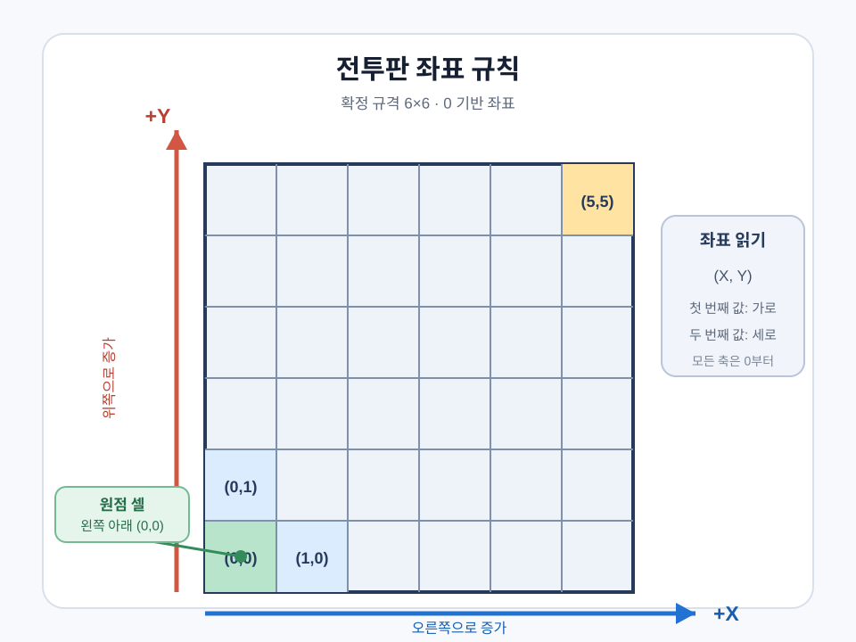
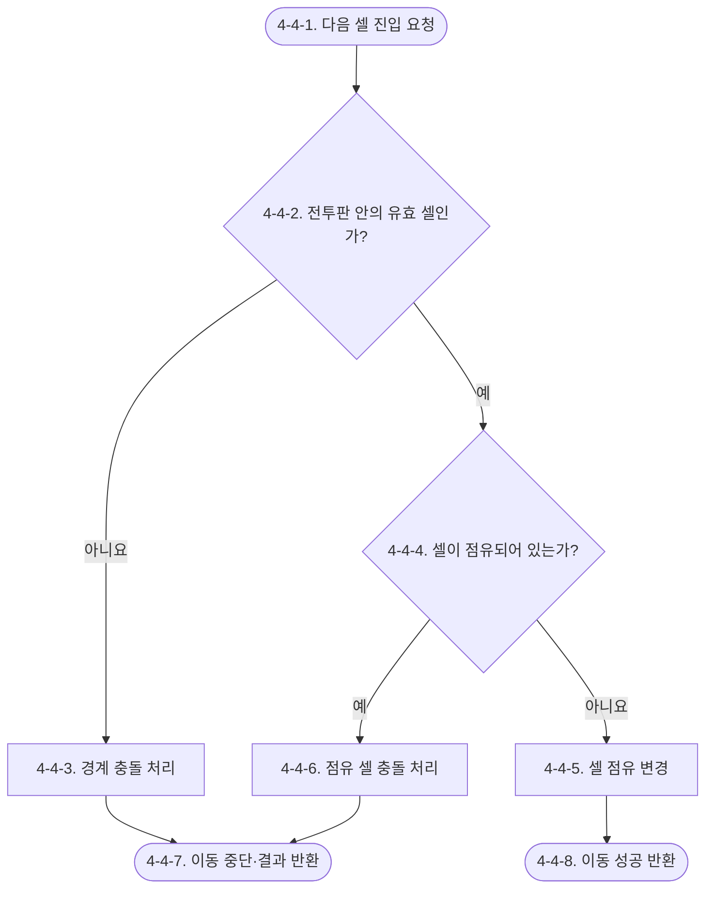

# Waredo 2.0 전투판 시스템 기획서

> 상태: 확정  
> 문서 범위: 전투판 구성, 셀·점유, 충돌  
> 연계 문서: [전투 시스템 기획서](Waredo_2.0_전투_시스템_기획서.md), [상태이상 시스템 기획서](Waredo_2.0_상태이상_시스템_기획서.md)

## 시스템 브리핑

전투판 시스템은 캐릭터와 환경 요소가 배치되고 이동하는 `6×6` 정사각형 격자 공간을 관리한다. 모든 셀은 왼쪽 아래 `(0, 0)`에서 시작하며, 오른쪽을 `+X`, 위쪽을 `+Y`로 사용하는 동일한 좌표 규칙으로 식별한다.

각 셀은 비어 있거나 캐릭터 또는 환경 요소 하나가 점유한다. 점유된 셀은 다른 요소의 진입을 차단하며, 캐릭터 두 명이 같은 셀에 서거나 캐릭터가 점유형 환경 요소 위에 설 수 없다. 띄워진 캐릭터도 현재 셀의 점유와 충돌 대상 상태를 유지한다.

일반 이동과 강제 이동은 다음 셀 또는 접촉 셀의 진입 가능 여부를 전투판 시스템에 요청한다. 비어 있는 유효 셀이면 점유를 변경하고, 이동 중 점유 셀이나 전투판 경계를 만나면 충돌 발생 결과와 피해 요청을 반환한다. 대각선 강제 이동의 접촉 경로와 정확한 정지 셀은 상태이상 시스템이 결정한다.

전투판 시스템은 좌표, 셀 유효성, 영구·순간 점유와 충돌 결과를 소유한다. 일반 이동 경로는 전투 시스템이, 밀쳐짐·당겨짐의 목적지와 접촉 경로는 상태이상 시스템이 산출한다. 충돌 피해는 기본값 `5`를 사용하며, 유물 보정이 있으면 하나의 충돌 사건에 참여한 피해 대상에게 같은 보정값을 공통 적용한다.

## 유의사항

- 이 문서는 전투 공간의 좌표, 셀 유효성, 점유와 충돌 판정의 단일 원본이다.
- 일반 이동 경로의 작성과 이동력 제한은 전투 시스템이 소유한다.
- 밀쳐짐·당겨짐의 목적지 산출은 상태이상 시스템이 소유하고, 실제 셀 진입·점유·충돌 결과는 이 문서의 규칙을 따른다.
- 전투판 크기는 `6×6`으로 확정하며, 좌표 시작값은 `0`으로 확정한다.

# 1. 기획 의도

플레이어가 전투판을 단순한 배경이 아니라 전술 자원으로 읽게 한다. 한 셀에 하나의 점유 요소만 설 수 있고, 경로와 강제 이동이 점유물이나 경계에 막혀 충돌로 이어지게 함으로써 위치 선정과 이동 예측에서 재미가 발생하도록 한다.

# 2. 개발 목적

- 모든 시스템이 같은 0 기반 셀 좌표를 사용하도록 한다.
- 캐릭터와 환경 요소의 점유 상태를 한곳에서 관리한다.
- 점유 셀과 전투판 경계를 향한 이동을 공통 충돌 규칙으로 처리한다.
- 일반 이동과 강제 이동이 동일한 셀 진입 판정 결과를 사용하도록 한다.

# 3. 시스템 구조

```text
전투판 시스템 [확정]
├─ 전투판 구성 [확정]
├─ 셀·점유 [확정]
└─ 충돌 [확정]
```

| 모듈 | 핵심 책임 | 주요 연계 |
|---|---|---|
| 전투판 구성 | 정사각형 전투판과 0 기반 좌표, 유효 셀 판정 | 전투 시스템, 상태이상 시스템 |
| 셀·점유 | 캐릭터·환경 요소의 셀 점유 조회와 변경 | 환경 요소 시스템 |
| 충돌 | 이동 중 점유 셀·경계와의 충돌 발생 여부 및 충돌 피해 요청 | 캐릭터 시스템, 가방·유물 시스템 |

# 4. 시스템 상세 구조

전투판 시스템은 `전투판 구성`, `셀·점유`, `충돌` 모듈로 구성한다. 전투 시스템의 이동 요청을 받아 유효 셀과 점유 상태를 판정하고 점유 변경 또는 충돌 결과를 반환한다.

## 4-1. 전투판 구성

### 사용 변수·용어

| 변수·용어 | 이 모듈에서의 의미 | 값 형태 | 소유·성격 |
|---|---|---|---|
| `cellCoordinate` | 전투판 안의 각 셀을 식별하는 좌표 | 좌표 | 전투판 구성 소유·원본 |

### 4-1-1. 목적과 책임

`전투판 구성`은 전투판 규격과 전투판 안의 각 셀에 `cellCoordinate`를 부여하는 계산 규칙을 정의한다.

| 구분 | 내용 |
|---|---|
| 입력 | 전투판 규격, 진입 요청 좌표 |
| 처리 | 정사각형 셀 생성, `(0, 0)` 원점과 축 증가 방향에 따른 `cellCoordinate` 부여 |
| 출력 | `cellCoordinate`, 요청 위치의 유효 셀 여부 |
| 소유 데이터 | `cellCoordinate` 부여 규칙 |
| 참조 데이터 | 없음 |
| 의존 모듈·시스템 | 셀·점유, 충돌, 전투 시스템 |
| 실패·취소·예외 | 전투판 바깥 위치는 유효 셀로 반환하지 않음 |

### 4-1-2. 전투판·좌표 규칙

- 전투판은 가로와 세로의 셀 수가 같은 정사각형으로 구성한다.
- 전투판 규격은 `6×6`으로 고정한다.
- 전투판 안에 생성된 셀만 캐릭터 위치, 이동 경로, 일반 공격·스킬의 대상 셀로 사용할 수 있다.
- 각 셀에는 서로 중복되지 않는 `cellCoordinate`를 하나씩 부여한다.
- `cellCoordinate`는 `(가로축, 세로축)`의 두 값으로 셀 위치를 표현한다.
- 전투판의 첫 좌표는 `(0, 0)`이며 가로축과 세로축을 모두 `0`부터 센다.
- `6×6` 전투판의 가로축과 세로축 좌표 범위는 각각 `0~5`다.
- `(0, 0)`을 전투판의 왼쪽 아래 셀로 두고, 가로축 `X`는 오른쪽으로 갈수록 증가하며 세로축 `Y`는 위쪽으로 갈수록 증가한다.
- `movePath`, `targetCell`, 진입 요청 좌표, `cellOccupants`는 모두 같은 `cellCoordinate` 규칙을 사용한다.
- 전투판 바깥 위치는 셀로 생성하지 않는다.

```text
셀 좌표 = (가로축 위치, 세로축 위치)
유효 셀 = 전투판 규격 안에서 부여된 cellCoordinate와 일치하는 셀
```



위 그림은 확정된 `6×6` 전투판의 좌표 규칙을 나타낸다.

## 4-2. 셀·점유

### 사용 변수·용어

| 변수·용어 | 이 모듈에서의 의미 | 값 형태 | 소유·성격 |
|---|---|---|---|
| `cellOccupants` | 각 셀을 점유하는 캐릭터 또는 환경 요소 | 셀별 점유 정보 | 셀·점유 소유·상태 |
| 점유 요소 | 셀을 현재 차지하고 있는 캐릭터 또는 환경 요소 | 요소 ID와 유형 | `cellOccupants`에 저장하는 정보 |
| 순간 점유 | 강제 이동 직선이 닿는 셀을 통과하는 동안만 성립하는 점유 | 접촉 단계별 점유 결과 | 셀·점유 산출·임시 |

### 4-2-1. 목적과 책임

`셀·점유`는 각 유효 셀의 현재 점유 요소를 단일 원본으로 관리하고 진입·이탈·제거에 따라 갱신한다.

| 구분 | 내용 |
|---|---|
| 입력 | 진입 요청 좌표, 셀 점유 조회, 진입·이탈·제거 요청 |
| 처리 | 유효 셀의 현재 점유 요소 확인 및 `cellOccupants` 갱신 |
| 출력 | 비점유 또는 점유 요소 정보, 점유 변경 결과 |
| 소유 데이터 | `cellOccupants` |
| 참조 데이터 | 캐릭터·환경 요소 ID와 유형 |
| 의존 모듈·시스템 | 전투판 구성, 충돌, 전투 시스템, 환경 요소 시스템 |
| 실패·취소·예외 | 이미 점유된 셀의 신규 점유 요청을 거부하고 기존 점유 유지 |

### 4-2-2. 점유 규칙

- 하나의 셀은 비어 있거나 캐릭터 또는 환경 요소 하나에 의해 점유된다.
- `cellOccupants`는 셀마다 현재 점유 요소의 ID와 요소 유형을 관리한다.
- 점유된 셀은 해당 셀을 새로 점유하려는 다른 요소의 진입을 차단한다.
- 하나의 셀에 두 캐릭터가 동시에 올라설 수 없다.
- 환경 요소가 점유한 셀에 캐릭터가 올라설 수 없다.
- 이미 점유된 셀에는 새 점유를 기록하지 않으며 기존 `cellOccupants`를 유지한다.
- 점유 요소가 셀에서 정상적으로 이탈하거나 제거되면 해당 셀의 점유를 해제한다.
- 상태이상 시스템 규칙에 따라 `Airborne` 상태는 셀 점유를 해제하지 않는다. 전투판 시스템은 띄워진 캐릭터를 현재 셀의 기존 점유 요소이자 충돌 대상으로 계속 관리한다.
- 상태이상 시스템이 강제 이동 접촉 경로로 전달한 셀은 순간적으로 점유한 것으로 처리한다. 순간 점유 셀에서도 일반 점유와 같은 셀 진입 효과 및 충돌 판정을 수행한다.
- 같은 접촉 지점에서 여러 셀에 닿으면 해당 셀들을 하나의 접촉 단계로 확인한다. 접촉 단계가 끝나면 순간 점유는 해제하며 최종 목적지 셀 하나만 `cellOccupants`의 영구 점유로 남긴다.

## 4-3. 충돌

### 사용 변수·용어

| 변수·용어 | 이 모듈에서의 의미 | 값 형태 | 소유·성격 |
|---|---|---|---|
| 접근 요소 | 점유 셀 또는 전투판 바깥을 향해 이동한 캐릭터 | 캐릭터 | 충돌 판정 입력 |
| 기존 점유 요소 | 접근 대상 셀을 먼저 점유하고 있던 캐릭터 또는 환경 요소 | 점유 요소 | 셀·점유 > `cellOccupants` 참조 |
| 유효 셀 여부 | 요청 위치가 전투판 안의 셀인지 나타내는 판정 결과 | 판정값 | 전투판 구성 산출·참조 |
| `cellOccupants` | 요청 셀을 현재 점유하는 요소 정보 | 셀별 점유 정보 | 셀·점유 소유·참조 |
| `collisionBaseDamage` | 충돌 시 보정 전에 사용하는 기본 피해 | 정수 | 충돌 소유·원본 |
| `collisionDamageModifier` | 충돌 피해를 변경하는 유물 보정 | 보정값 | 가방·유물 시스템 > 충돌 피해 보정 소유·참조 |
| `isIndestructibleEnvironment` | 기존 점유 환경 요소의 파괴 불가 여부 | 불리언 | 환경 요소 시스템 > 환경 요소 정의 소유·참조 |

### 4-3-1. 목적과 책임

`충돌`은 캐릭터가 이동 중 점유 셀 또는 전투판 바깥과 접촉했는지 판정하고, 충돌이 발생하면 충돌 대상과 피해 적용을 요청한다.

| 구분 | 내용 |
|---|---|
| 입력 | 진입 요청 좌표, 유효 셀 여부, `cellOccupants`, `isIndestructibleEnvironment`, `collisionDamageModifier` |
| 처리 | 이동 중 충돌 발생 여부와 충돌 대상 결정, `collisionBaseDamage`에 유물 보정 반영 |
| 출력 | 충돌 발생 결과, 충돌 대상, 캐릭터·환경 요소 피해 적용 요청 |
| 소유 데이터 | `collisionBaseDamage` |
| 참조 데이터 | 유효 셀 여부, `cellOccupants`, `isIndestructibleEnvironment`, `collisionDamageModifier` |
| 의존 모듈·시스템 | 전투판 구성, 셀·점유, 전투 시스템, 캐릭터 시스템, 환경 요소 시스템, 가방·유물 시스템 |
| 실패·취소·예외 | 파괴 불가 환경 요소에는 피해를 요청하지 않으며 전투판 바깥에는 기존 점유 요소 피해가 없음 |

### 4-3-2. 점유 셀 충돌

1. 캐릭터가 일반 이동 또는 강제 이동 중 다음 셀이나 접촉 셀에 진입하려 할 때 `cellOccupants`를 조회한다.
2. 이동 중 접촉한 셀이 점유되어 있으면 충돌이 발생한 것으로 판정하고 현재 이동을 종료한다.
3. 접근 요소에는 `collisionBaseDamage`를 기준으로 산출한 충돌 피해를 적용한다.
4. 기존 점유 요소가 캐릭터 또는 파괴 가능한 환경 요소이면 동일한 충돌 피해를 적용한다.
5. 기존 점유 요소가 파괴 불가 환경 요소이면 해당 환경 요소에는 피해를 적용하지 않고 접근 요소에만 적용한다.
6. 양쪽 피해는 하나의 충돌 사건에서 함께 요청하며 한쪽의 피해 결과가 다른 쪽의 피해 요청을 취소하지 않는다.

대각선 강제 이동에서 충돌한 면·꼭짓점에 따라 어느 셀에 멈추는지는 [상태이상 시스템 기획서](Waredo_2.0_상태이상_시스템_기획서.md) `4-4-3. 대각선 강제 이동의 정지 셀`을 따른다.

### 4-3-3. 전투판 경계 충돌

- 이동 중 전투판 바깥과 접촉하면 경계 충돌이 발생한 것으로 판정하고 현재 이동을 종료한다.
- 전투판 바깥에는 기존 점유 요소가 없으므로 접근 캐릭터에게만 충돌 피해를 적용한다.
- 전투판 바깥 위치는 `cellOccupants`에 생성하거나 점유하지 않는다.
- 대각선 강제 이동의 정확한 정지 셀은 [상태이상 시스템 기획서](Waredo_2.0_상태이상_시스템_기획서.md) `4-4-3. 대각선 강제 이동의 정지 셀`을 따른다.

### 4-3-4. 충돌 피해와 외부 시스템 연결

- `collisionBaseDamage`는 `5`다.
- 충돌 피해는 일반 공격 또는 스킬 사용으로 처리하지 않는다.
- 충돌 발생 시 가방·유물 시스템의 `collisionDamageModifier`를 조회해 기본 피해 `5`에 반영한 뒤 피해 적용을 요청한다.
- 하나의 충돌 사건에서는 동일한 `collisionDamageModifier`를 접근 요소와 피해를 받는 기존 점유 요소에 공통으로 적용한다. 파괴 불가 환경 요소처럼 피해 대상에서 제외되는 요소에는 계산하지 않는다.
- 파괴 가능한 환경 요소의 피해 반영과 파괴 판정은 환경 요소 시스템에 요청하며 전투판 시스템이 내구도 원본을 별도로 저장하지 않는다.

```text
충돌 피해 기준값 = collisionBaseDamage = 5
최종 충돌 피해 = 가방·유물 시스템이 collisionBaseDamage에 충돌 피해 보정을 적용한 결과
```

### 외부 변수 참조 출처

| 참조 변수 | 가져오는 시스템 | 원본 모듈·데이터 | 현재 모듈에서의 사용 | 원본 문서·번호 |
|---|---|---|---|---|
| `isIndestructibleEnvironment` | 환경 요소 시스템 | 환경 요소 정의 | 기존 점유 환경 요소의 피해 제외 여부 판정 | 환경 요소 시스템 기획서 `[작성 전]` |
| `collisionDamageModifier` | 가방·유물 시스템 | 충돌 피해 보정 | 기본 충돌 피해 `5`에 적용하고 같은 충돌 사건의 양쪽 피해 대상이 공통 사용 | 가방·유물 시스템 기획서 `[작성 전]` |

## 4-4. 전투판 시스템 처리 순서



| 번호 | 처리 설명 |
|---|---|
| 4-4-1 | 전투 시스템 또는 강제 이동 효과에서 캐릭터의 다음 셀 진입을 요청한다. |
| 4-4-2 | 전투판 구성 모듈이 요청 위치가 전투판 안의 유효 셀인지 확인한다. |
| 4-4-3 | 유효 셀이 아니면 접근 캐릭터만 대상으로 경계 충돌을 처리한다. |
| 4-4-4 | 유효 셀이면 셀·점유 모듈이 `cellOccupants`를 조회한다. |
| 4-4-5 | 비점유 셀이면 기존 셀의 점유를 해제하고 요청 셀의 점유를 기록한다. |
| 4-4-6 | 점유 셀이면 접근 요소와 피해 적용이 가능한 기존 점유 요소를 대상으로 충돌을 처리한다. |
| 4-4-7 | 충돌이 발생하면 충돌 결과와 피해 요청을 반환하고 현재 이동을 종료한다. 강제 이동의 정확한 정지 셀은 상태이상 시스템이 결정한다. |
| 4-4-8 | 충돌이 없으면 점유가 변경된 이동 성공 결과를 반환한다. |

## 4-5. 기획 변수

| 변수명 | 기획상 의미 | 값 형태 | 초기값·허용값 | 소유 모듈 | 사용 위치(번호) | 성격 | 산출·갱신 규칙 | 비고 |
|---|---|---|---|---|---|---|---|---|
| `cellCoordinate` | 전투판 안의 각 셀을 식별하는 위치 좌표 | 좌표 | 시작값 `(0, 0)`, `+X` 오른쪽, `+Y` 위쪽 | 전투판 구성 | 4-1~4 | 원본 | 왼쪽 아래를 원점으로 양 축을 `0`부터 세어 각 셀에 중복 없이 부여 | 전투판 크기만 확인 필요 1 |
| `cellOccupants` | 각 셀을 현재 점유하는 캐릭터 또는 환경 요소 | 셀별 점유 정보 | 비점유 또는 점유 요소 1개 | 셀·점유 | 4-2~4 | 상태 | 요소의 셀 진입·이탈·제거 시 갱신 | 점유 요소의 ID와 유형 보관 |
| `collisionBaseDamage` | 충돌 대상에게 적용하기 전 기본 피해 | 정수 | `5` | 충돌 | 4-3~4 | 원본 | 전투 중 고정하고 유물 보정의 기준값으로 사용 | 일반 공격·스킬 피해와 구분 |
| `collisionDamageModifier` | 유물이 충돌 피해에 적용하는 보정 | 보정값 | 가방·유물 시스템 허용값 | 가방·유물 시스템 > 충돌 피해 보정 | 4-3~4 | 참조 | 충돌 발생 시 한 번 조회해 접근 요소와 피해를 받는 기존 점유 요소에 공통 적용 | 파괴 불가 환경 요소에는 적용하지 않음 |
| `isIndestructibleEnvironment` | 점유 환경 요소가 파괴 불가인지 구분 | 불리언 | `true`, `false` | 환경 요소 시스템 > 환경 요소 정의 | 4-3~4 | 참조 | 점유 환경 요소 정의에서 조회 | `true`이면 기존 점유 요소 피해 제외 |
