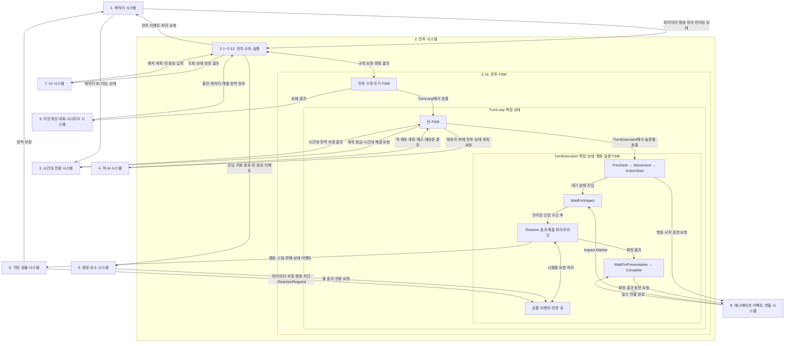

# Waredo 2.0 시스템 구조 및 작성 현황

> 문서 목적: Waredo 2.0의 시스템 분류, 작성 상태, 시스템 간 의존 관계와 변경 검토 대상을 한곳에서 관리한다.  
> 문서 성격: **확정 관리 문서**  
> 적용 원칙: 개별 시스템 문서가 추가·확정·변경될 때 이 문서를 같은 작업에서 함께 갱신한다.

## 1. 상태 표기 규칙

시스템과 하위 항목의 작성 상태는 다음 세 가지 표기만 사용한다.

| 상태 | 의미 | 변경 조건 |
|---|---|---|
| `[완료]` | 확정 경로에 시스템 기획서가 존재하고 현재 확정 규칙이 반영된 상태 | 신규 확정 문서 등록 및 자체 검수 완료 |
| `[작성 전]` | 확정 시스템 기획서가 아직 없는 상태. 제안서·초안·설계안만 있는 경우도 포함 | 확정 기획서 작성에 착수하면 작업 중 기록을 남기고, 확정 완료 시 `[완료]`로 변경 |
| `[수정필요]` | 확정 기획서는 있으나 상위 규칙 또는 연관 시스템 변경으로 재검토·수정이 필요한 상태 | 연관 변경 영향 확인 후 수정·검수까지 끝나면 `[완료]`로 복귀 |

추가 관리 규칙:

1. `[수정필요]`로 변경할 때는 상태만 바꾸지 않고 반드시 `검토필요-사유:`를 함께 작성한다.
2. 사유에는 **변경된 시스템, 변경 내용, 영향을 받는 규칙 또는 변수**를 적는다.
3. 검토 결과 영향이 없으면 상태는 유지하고 변경 이력에 `검토 완료-영향 없음:`을 기록한다.
4. 하나의 변경이 여러 시스템에 영향을 주면 영향을 받는 모든 시스템을 각각 검토 대상으로 표시한다.
5. 하위 항목 일부만 영향을 받으면 상위 시스템 상태와 별도로 해당 하위 항목을 `[수정필요]`로 표시한다.
6. 제안 문서가 존재하더라도 확정 경로에 기획서가 없으면 `[작성 전]`이다.
7. 개별 확정 문서의 `[확인 필요 목록]`이 남아 있더라도, 문서가 정의한 범위가 확정·검수되었다면 `[완료]`로 관리할 수 있다. 단, 미확정 항목은 본 문서의 비고 또는 변경 이력에서 추적한다.

## 2. 전체 시스템 구조

```text
1. 캐릭터 시스템 [완료]
   - 캐릭터 파라미터 [완료]
   - 공격·타겟팅 정의 [완료]
   - 스킬·쿨타임 정의 [완료]
   - 상태이상 정의 [완료]
   - 밀치기·당기기 처리 규격 [완료]
   - 변수 관리 [완료]
   - 콘텐츠 기획 문법 [완료]
2. 전투 시스템 [완료]
   - 전투 FSM [완료]
   - 전투판·셀·점유 [완료]
   - 전투 진입·초기 배치 [완료]
   - 전투 시작·선공 결정 [완료]
   - 행동 슬롯·행동 순서 [완료]
   - 행동 설계 [완료]
   - 이동·경로·충돌 [완료]
   - 공격·타겟팅 [완료]
   - 스킬·쿨타임 [완료]
   - 상태이상 [완료]
   - 계획 검증·확정 [완료]
   - 행동·효과·이벤트 실행 [완료]
   - 턴 정산 [완료]
   - 승패 판정·전투 종료 [완료]
3. 시간대 전환 시스템 [작성 전]
4. 적 AI 시스템 [작성 전]
5. 환경 요소 시스템 [작성 전]
6. 가방·유물 시스템 [작성 전]
7. UI 시스템 [작성 전]
8. 애니메이션·이펙트·연출 시스템 [작성 전]
9. 아웃게임·대화 시나리오 시스템 [작성 전]
```

## 3. 시스템별 작성 현황

| 번호 | 시스템 | 상태 | 기준 문서 또는 참고 문서 | 주요 의존 시스템 | 비고 |
|---:|---|---|---|---|---|
| 1 | 캐릭터 시스템 | `[완료]` | `확정/시스템/Waredo_2.0_캐릭터_시스템_기획서.md`<br>`확정/시스템/Waredo_2.0_캐릭터_시스템_변수_정의서.md` | 전투, 시간대 전환, 적 AI, 가방·유물, UI, 연출 | 통합 범위 데이터, 서로 다른 출처의 전역 효과 큐 우선순위·삽입 위치, `BattleTimingStamp`, 외부 보정·행동 차단 인터페이스는 연관 시스템에서 확정 필요 |
| 2 | 전투 시스템 | `[완료]` | `확정/시스템/Waredo_2.0_전투_시스템_기획서.md`<br>`전투_시스템_기획서_작성전_설계안.md` | 캐릭터 및 모든 전투 연관 시스템 | 전투·턴·행동 실행의 3단 FSM과 행동 내부 `Resolve` 효과 파이프라인·반응 큐를 포함한 14개 하위 항목 작성. 적 AI만 별도 시스템으로 분리 |
| 3 | 시간대 전환 시스템 | `[작성 전]` | `제안/시스템/Waredo_2.0_GDD_시간대_전환_시스템.md` | 전투, 캐릭터, 유물, UI, 연출 | 제안서만 존재. 시간 파편 수치와 시간대 유지 규칙 미확정 |
| 4 | 적 AI 시스템 | `[작성 전]` | `제안/GDD/Waredo_2.0_GDD_시스템_개편안.md` | 전투 FSM, 캐릭터, 이동, 공격, 스킬, 상태이상, UI | 타겟·경로·일반 공격·스킬 계획과 예고를 전투에 반환하는 별도 시스템. 판단·동률·재계산 세부 로직 미확정 |
| 5 | 환경 요소 시스템 | `[작성 전]` | `제안/GDD/Waredo_2.0_GDD_시스템_개편안.md` | 전투판, 이동, 전투 FSM, 상태이상, 유물, UI, 연출 | 제안 규칙만 존재. 콘텐츠 수치와 발동 세부 규칙 미확정 |
| 6 | 가방·유물 시스템 | `[작성 전]` | `제안/GDD/Waredo_2.0_GDD_시스템_개편안.md` | 캐릭터, 전투, 시간대, 전투 FSM, UI | 제안 규칙만 존재. 보정·트리거·카운터 계약 미확정 |
| 7 | UI 시스템 | `[작성 전]` | `제안/GDD/Waredo_2.0_GDD_시스템_개편안.md` | 전체 사용자 입력·정보 제공 시스템 | 화면별 표시 정보와 모바일 조작 규칙의 확정 문서 필요 |
| 8 | 애니메이션·이펙트·연출 시스템 | `[작성 전]` | `제안/GDD/Waredo_2.0_GDD_시스템_개편안.md` | 전투, 캐릭터, 전투 FSM, 상태이상, 시간대, UI | 규칙 판정 이후 행동 세트별 표현 요청을 소비하고 완료 통지를 반환하는 구조로 작성 필요 |
| 9 | 아웃게임·대화 시나리오 시스템 | `[작성 전]` | `제안/GDD/Waredo_2.0_GDD_시스템_개편안.md` | 캐릭터, 전투 결과, 가방·유물, UI | 기존 유지 대상이나 확정 시스템 문서가 현재 경로에 없음 |

## 4. 캐릭터 시스템 하위 항목 작성 현황

캐릭터 시스템은 캐릭터 원본·런타임과 캐릭터가 소유·참조하는 행동 정의의 단일 원본이다. 아래 항목과 이름이 같은 전투 시스템 하위 항목은 이 규칙을 다시 정의하지 않고, 전투 흐름에서의 호출 시점·입력·결과·취소·다음 단계만 작성한다.

| 번호 | 하위 항목 | 상태 | 캐릭터 시스템이 정의한 내용 | 전투 시스템과의 경계 |
|---:|---|---|---|---|
| 1-1 | 캐릭터 파라미터 | `[완료]` | `CharacterDefinition`, `CharacterBattleRuntime`, 타입·상성, 기본값과 유효값, 면역, 전투 불능 파생 판정 | 전투는 유효값과 런타임을 조회하고 체력 변경·점유 해제·행동 무효화의 호출 시점만 정함 |
| 1-2 | 공격·타겟팅 정의 | `[완료]` | 일반 공격 3유형, 타겟 입력, 범위 참조, 실행 재검증, 대상 확정, 피해 계산과 효과 요청 생성 | 전투 `2-7`은 공격 요청 시점, 요청 문맥, 취소·피해 요청 결과의 후속 처리만 정함 |
| 1-3 | 스킬·쿨타임 정의 | `[완료]` | 스킬 3유형, 5개 효과, `RESOLVE_TIMING`, 실행 규칙, 쿨타임 적용·감소·예외 | 전투 `2-8`은 선택·실행·Impact Marker 대기·Resolve 등록·쿨타임 갱신 요청 순서를 정함 |
| 1-4 | 상태이상 정의 | `[완료]` | 상태 정의·인스턴스, `Airborne`·`Stun` 적용·갱신·종료 조건, 면역 판정 | 전투 `2-9`는 적용 요청과 `ActionBegin`·`TurnCleanup` 이벤트 연결만 정함 |
| 1-5 | 밀치기·당기기 처리 규격 | `[완료]` | `Push`·`Pull` 방향, 거리, 면역, 셀 단위 강제 이동과 충돌 결과 | 전투는 효과 처리 중 강제 이동 요청 시점과 반환 결과의 후속 처리만 정함 |
| 1-6 | 변수 관리 | `[완료]` | 정의·런타임·행동 계획·상태 인스턴스의 독립값, 파생값, 실행 임시값, 외부 참조 및 소유권 | 전투 변수 정의서는 `ActionPlan` 등을 복제하지 않고 전투 런타임·슬롯·잠금·실행 문맥만 추가함 |
| 1-7 | 콘텐츠 기획 문법 | `[완료]` | 캐릭터·일반 공격·스킬 콘텐츠의 ID, 열거값, 필수 필드와 작성 규칙 | 전투 문서는 실제 캐릭터·공격·스킬 수치나 범위 좌표를 작성하지 않음 |

### 4.1 캐릭터 파라미터 `[완료]`

#### 목적과 책임

- 모든 캐릭터가 사용하는 원본 능력치, 전투 중 변경되는 런타임 값과 외부 보정을 반영한 유효값 조회를 구분한다.
- 캐릭터 타입·상성·면역·전투 불능 판정을 공격, 이동, 스킬, UI와 전투 흐름에서 공통으로 조회할 수 있게 한다.
- 실제 캐릭터별 수치와 목록은 캐릭터 콘텐츠 테이블에 두고, 시스템 문서는 데이터 구조와 판정 규칙만 소유한다.

#### 확정 데이터

| 구분 | 필드·조회 | 확정 규칙 |
|---|---|---|
| 식별 | `characterId`, `characterName` | ID는 중복할 수 없고 이름은 UI·콘텐츠 표시값으로 사용 |
| 원본 능력치 | `maxHp`, `attackPower`, `moveRange`, `criticalDamageRatePercent` | 최대 체력은 1 이상, 공격력·이동력은 0 이상, 공통 초기 치명타 피해율은 `140%` |
| 타입 | `characterType` | 선구자·계승자·기술자·각성자 중 하나 |
| 행동 소유 | `normalAttack`, `skillId` | 일반 공격 정의 1개와 스킬 정의 참조 1개를 정확히 소유 |
| 런타임 | `currentHp`, `skillCooldownRemaining`, `activeStatusEffects` | 직접 변경되는 독립값. `currentHp`는 전투 종료 후에도 유지하며 다음 전투 진입 시 회복·초기화하지 않음 |
| 면역 | `statusImmunityTags` | `Push`, `Pull`, `Airborne`, `Stun` 중 0개 이상 |
| 유효값 | `effectiveMaxHp`, `effectiveAttackPower`, `effectiveMoveRange`, `effectiveCriticalDamageRatePercent` | 원본과 현재 보정에서 계산하며 별도로 저장하지 않음 |
| 상태 조회 | `isIncapacitated`, `occupiedCell`, `hasStatus(tag)` | 체력·점유 맵·상태 목록에서 계산하는 읽기 전용 파생값 |

#### 확정 판정

- 유물·전투 효과는 원본 능력치를 직접 수정하지 않고 보정값을 제공한다.
- 유효값은 `기본값 → 고정 보정 합산 → 비율 보정 합산 적용 → 최종 반올림 → 허용 범위 제한` 순서로 계산한다.
- 타입 상성은 계승자→기술자→각성자→계승자의 순환 구조다. 유리 `×1.5`, 불리 `×0.5`, 동일 타입·선구자 관계는 `×1.0`이다.
- 환경 요소 피해에는 타입 상성을 적용하지 않는다.
- 피해 계산은 `기본 피해 → 타입 상성 → 치명타 → 전투 중 임시 보정 → 반올림 → 0 이상 제한` 순서를 사용한다.
- `currentHp <= 0`이면 별도 상태값을 저장하지 않고 전투 불능 조건을 조회한다. 피해 적용 후·전투 불능 전 유물 반응을 처리한 뒤에도 조건이 유지될 때 전투 불능 처리를 확정한다.
- 전투 불능 처리 확정 시 `cellOccupants`에서 점유를 해제하고 현재·남은 행동 무효화를 전투 FSM에 요청한다. 반응 효과로 `currentHp > 0`이 되면 전투 불능 처리를 하지 않는다.

#### 외부 연결

| 연결 시스템 | 제공·요청 내용 |
|---|---|
| 전투 | 체력·상태·유효 능력치 조회, 체력 변경 결과 반영, 행동 무효화 연결 |
| 전투판·이동 | `effectiveMoveRange` 제공, `cellOccupants` 기반 현재 위치 조회·점유 해제 요청 |
| 가방·유물 | 능력치 보정과 행동 차단 조건 수신 |
| 시간대 전환 | 캐릭터 타입 원본 제공. 시간대별 타입 효과는 계산하지 않음 |
| UI·연출 | 이름·타입·체력·쿨타임·상태·전투 불능 조회 제공 |

### 4.2 공격·타겟팅 정의 `[완료]`

#### 목적과 책임

- 캐릭터가 소유한 일반 공격의 입력 방식, 범위 참조, 계획 단계 표시와 실행 단계 재검증 규칙을 정의한다.
- 실제 전투 흐름은 공격 실행을 요청하고 결과를 소비하지만 공격 형태·대상 확정·피해 계산은 이 항목을 단일 원본으로 사용한다.

#### 확정 유형과 입력

| 유형 | 계획 입력 | 실행 시 대상 확정 |
|---|---|---|
| `Target` / `InRangeTarget` | 캐릭터 1명 지정 | 실제 위치 기준 범위 안에 있는 지정 대상만 공격 |
| `TileSelect` / `CellSelect` | 방향 없이 셀 1개 지정 | 선택 셀 기준 영향 셀에 있는 유효 캐릭터 확정 |
| `Directional` | 상·하·좌·우 중 방향 지정 | 실제 위치 기준으로 회전한 영향 셀의 현재 점유자 확정 |

#### 확정 실행 규칙

1. `NormalAttackDefinition`에서 유형, 범위 ID와 대상 진영을 조회한다.
2. 계획 단계에는 캐릭터의 현재 표시 위치를 기준으로 선택 가능 범위와 예상 영향 셀을 표시하되, 앞 행동 결과를 반영한 캐릭터 예상 위치는 계산하지 않는다.
3. 실행 단계에는 전투 불능과 `canExecuteMainAction`을 먼저 확인한다.
4. 실행 시점의 실제 위치를 기준으로 통합 범위를 다시 생성한다.
5. 타겟·셀·방향과 대상 진영 조건을 다시 검증한다.
6. 실패하면 공격을 취소하며 자동 재타겟팅·자동 셀 변경을 하지 않는다.
7. 성공하면 `effectiveAttackPower`를 기본 피해로 사용하고 상성·치명타·임시 보정을 적용한다.
8. 확정 피해는 즉시 체력에 직접 쓰지 않고 피해 효과 요청으로 효과 큐에 등록한다.

#### 예외와 경계

- `CellSelect`는 방향 입력과 방향 회전을 사용하지 않는다.
- 빈 영향 셀도 공격 실행 자체는 성립할 수 있으며 다른 셀로 자동 보정하지 않는다.
- `Directional`은 계획 당시 캐릭터가 아니라 실행 당시 영향 셀의 점유자를 대상으로 한다.
- 일반 공격은 띄워짐 대상에게 항상 치명타를 적용한다.
- 실제 범위 좌표와 회전 데이터는 통합 범위 데이터가 소유하며 캐릭터·전투 문서에 중복 저장하지 않는다.

### 4.3 스킬·쿨타임 정의 `[완료]`

#### 확정 데이터와 유형

| 구분 | 확정 내용 |
|---|---|
| 소유 | 캐릭터당 `skillId` 1개 |
| 타겟팅 | `InRangeTarget`, 방향 없는 `CellSelect`, `Directional`의 3유형 |
| 범위 참조 | `skillRangePatternId`, 필요 시 `skillAffectedCellPatternId` |
| 효과 | `Damage`, `Push`, `Pull`, `Airborne`, `Stun` |
| 효과 데이터 | 공통 필드 외에 피해·강제 이동·지속 상태별 필수값만 가지는 구분 타입 |
| 효과 순서 | 문법에 `EFFECT <효과순번>`을 작성하고 목록 인덱스 `+1`을 파생 `effectSequence`로 사용 |
| 쿨타임 | `cooldownMax`, `skillCooldownRemaining`, 파생 `effectiveCooldownMax` |
| 치명타 | 스킬별 `canCritical`로 띄워짐 치명타 허용 여부 결정 |
| 효과 해결 시작 | `resolveTiming`의 `ImpactMarker` 또는 `Immediate`로 전투 행동 FSM의 `WaitForImpact` 통과 방식 결정 |

#### 확정 실행·쿨타임 규칙

1. 현재 쿨타임이 0일 때만 계획할 수 있다.
2. 실행 시 실제 위치를 기준으로 범위·대상·셀을 재검증한다.
3. 검증 실패 시 자동 재타겟팅하지 않고 스킬을 취소하며 쿨타임을 적용하지 않는다.
4. 검증 성공 시 `effectSequence` 오름차순으로 1개 이상의 효과 요청을 효과 큐에 등록한다.
5. 첫 효과가 정상 등록되는 시점에 현재 쿨타임을 유효 최대 쿨타임으로 설정한다.
6. 사용한 턴에는 감소하지 않고 다음 `TurnSetup`부터 턴마다 1씩 감소시킨다.
7. 현재 쿨타임은 0 미만 또는 유효 최대 쿨타임 초과가 되지 않게 제한한다.
8. 앞 효과가 실패하면 해당 효과만 실패 처리하고 다음 순번을 계속 처리한다.
9. 효과로 전투 불능 조건이 발생하면 유물 반응 후 재판정하고, 전투 불능 처리가 최종 확정되면 같은 스킬의 남은 효과를 중단하고 재개하지 않는다.

#### 예외와 경계

- 한 행동에서 스킬과 일반 공격은 함께 사용할 수 없다.
- `Push`·`Pull` 효과가 있는 스킬은 `Directional`만 사용한다.
- 셀 선택형은 영향 패턴이 없으면 선택 셀 하나, 있으면 선택 셀 기준의 무회전 영향 패턴을 사용한다.
- `effectTargetTeam`에 포함되지 않은 캐릭터는 해당 효과에서 제외한다.
- 설치형 스킬은 확정된 캐릭터 시스템 범위에 포함하지 않는다.
- 같은 스킬 내부 효과의 등록·처리 순서는 캐릭터 시스템이 소유하고, 서로 다른 출처의 전역 우선순위와 큐 삽입 위치는 전투 FSM에서 결정한다.

### 4.4 상태이상 정의 `[완료]`

#### 데이터 흐름

`StatusEffectDefinition → StatusEffectApplyRequest → StatusEffectInstance`의 구조를 사용한다. 정의 데이터는 상태 ID·이름·태그·종료 규칙을, 요청은 출처·대상·발생 스킬을, 인스턴스는 상태 ID·적용 주체·적용 시점을 보관한다.

#### 지속 상태 확정 규칙

| 상태 | 적용 효과 | 종료 조건 | 재적용 | 대상 제한 |
|---|---|---|---|---|
| `Airborne` | 치명타 조건 제공 | 대상의 다음 `ActionBegin` 또는 적용 턴 `TurnCleanup` 중 먼저 발생한 시점 | 중첩하지 않고 `appliedAt` 갱신 | 적에게만 적용 |
| `Stun` | 행동 슬롯을 소비하고 이동·공격·스킬 모두 패스 | 적용된 턴의 `TurnCleanup` | 추가 슬롯을 패스하지 않고 같은 종료 시점 유지 | 적에게만 적용 |

#### 공통 적용 순서

1. 대상 생존·진영 조건을 확인한다.
2. 대상의 대응 면역 태그를 확인한다.
3. 같은 상태가 없으면 새 인스턴스를 만들고, 있으면 중첩 수 없이 종료 기준만 갱신한다.
4. 활성 목록을 갱신하고 행동 순서·공격·UI·FSM에 결과를 알린다.
5. 실패하면 해당 상태만 제거하고 같은 스킬의 다른 효과는 계속 처리한다.

#### 상태별 전투 연결

- 일반 공격은 `Airborne` 대상에게 항상 치명타를 적용하고, 스킬은 `canCritical = true`일 때만 적용한다.
- 이미 행동을 마친 캐릭터에게 적용된 `Stun`은 완료 행동에 영향을 주지 않는다.
- 남은 슬롯이 없는 캐릭터에게 적용된 `Stun`은 그 턴에 실질적인 행동 제한을 만들지 않는다.
- 상태 목록에 인스턴스가 존재하는 것 자체가 활성 상태이므로 별도 `isActive`를 저장하지 않는다.

### 4.5 밀치기·당기기 처리 규격 `[완료]`

#### 공통 규칙

- `Push`와 `Pull`은 즉시형이며 지속 상태 인스턴스를 남기지 않는다.
- `Push`는 선택 방향, `Pull`은 선택 방향의 반대 방향으로 `forceMoveDistance`만큼 직선 이동한다.
- 방향이 먼저 확정되므로 후보 경로와 동률 선택은 발생하지 않는다.
- 아군에게도 적용할 수 있지만 아군 대상에게 같은 스킬의 피해는 적용하지 않고 강제 이동만 처리한다.
- 대응 면역이 있으면 강제 이동만 실패하며 같은 스킬의 다른 효과는 유지한다.

#### 셀 단위 처리

1. 대상 현재 셀부터 지정 방향으로 N개의 경로 셀을 생성한다.
2. 매 셀 진입 직전에 전투판 내부·이동 가능·미점유 조건을 확인한다.
3. 진입 가능하면 `cellOccupants`를 갱신하고 환경 요소 셀 진입 이벤트를 요청한다.
4. 캐릭터·이동 차단 환경 요소·벽·전투판 외곽으로 진입할 수 없으면 직전 유효 셀에서 정지하고 남은 거리를 폐기한다.
5. 강제 이동 대상에 대한 충돌 피해 10 요청을 생성하고, 충돌 원인이 피해를 받을 수 있으면 같은 피해 요청을 생성한다.
6. 전투 시스템이 충돌 피해를 일반 피해·유물·전투 불능 순서로 처리한 뒤 최종 위치·점유와 성공·부분 이동·전투 불능·면역 실패 결과를 확정한다.

#### 소유권 경계

- 강제 이동의 방향·거리·면역·중단 규칙은 캐릭터 시스템이 소유한다.
- 셀 유효성·점유 원본과 실제 점유 갱신은 전투판·이동 시스템이 소유한다.
- 환경 요소의 발동 조건과 효과는 환경 요소 시스템이 소유한다.

### 4.6 변수 관리 `[완료]`

#### 저장 분류

| 분류 | 주요 구조·값 | 관리 원칙 |
|---|---|---|
| 콘텐츠 독립 원본 | `CharacterDefinition`, `NormalAttackDefinition`, `SkillDefinition`, `SkillEffectData`, `StatusEffectDefinition` | 제작자가 직접 결정하며 런타임 결과로 덮어쓰지 않음 |
| 전투 독립 런타임 | `CharacterBattleRuntime`, `StatusEffectInstance` | 전투 진행으로 직접 변경되고 원본만으로 복원할 수 없음 |
| 행동 계획 | `ActionPlan`, `MainActionPlan`, `ActionTarget` | 이동 경로와 본 행동을 하나의 판별 가능한 구조로 묶음 |
| 요청·실행 임시값 | `StatusEffectApplyRequest`, `ForceMoveRequest`, `movementResult`, 실제 피격 대상 목록 | 한 처리에서 생성·소비하고 지속 저장하지 않음 |
| 파생 프로퍼티 | `effective*`, `isIncapacitated`, `occupiedCell`, `hasStatus`, `hitTargetRule`, `forceMoveDirection`, `canUseSkill`, `canExecuteMainAction` | 원본과 현재 문맥으로 계산하며 외부에서 설정할 수 없음 |
| 외부 참조 | `cellOccupants`, 효과 대기 목록, 전투 시점·보정 목록 | 소유 시스템에서 조회하거나 변경을 요청함 |

#### 행동 계획 확정 구조

```text
ActionPlan
├─ movePath: List<Vector2Int>
└─ mainAction: MainActionPlan?
   ├─ actionType: NormalAttack | Skill
   └─ target
      ├─ CharacterTarget(characterId)
      ├─ CellTarget(cell)
      └─ DirectionTarget(direction)
```

- 이동만 계획하면 `mainAction = null`이다.
- `targetCharacterId`, `targetCell`, `actionDirection`을 nullable 필드로 동시에 저장하지 않는다.
- 정의 데이터의 타겟팅 유형과 `ActionTarget` 하위 타입이 일치하지 않으면 계획을 확정하지 않는다.
- `canExecuteMainAction`은 전투 불능, 기절, 이동 중 전투 불능과 외부 행동 차단 조건을 모은 결과로 계산한다. 이동 충돌은 피해 처리 후 생존하면 정지 위치에서 본 행동을 실행하므로 차단 사유가 아니다.

#### 제거한 중복 상태

`characterBattleState`, 저장형 `occupiedCell`, `cancelMainAction`, `stackCount`, `isActive`, `remainingCount`, `expireEvents`, `sourcePosition`, `targetPosition`, 요청 내부의 중복 `direction`은 사용하지 않는다. 각각 체력 파생 판정, 전투판 조회, 차단 사유 조회, 컨테이너 포함 여부, 종료 규칙 또는 `DirectionTarget`으로 대체한다.

### 4.7 콘텐츠 기획 문법 `[완료]`

#### 캐릭터 문법 범위

- 캐릭터 ID·이름, 네 가지 타입, 최대 체력, 공격력, 이동력과 치명타 피해율을 필수로 작성한다.
- 일반 공격 ID·이름·유형·통합 범위 ID·대상 진영을 캐릭터 블록 안에 정확히 1개 작성한다.
- 스킬은 정수 ID 하나를 참조하고 면역은 `NONE` 또는 지원 태그 조합으로 작성한다.
- 실제 범위 좌표를 직접 작성하지 않고 통합 범위 데이터 ID만 참조한다.

#### 일반 공격 문법 범위

| 문법 값 | 내부 유형 | 입력·대상 규칙 |
|---|---|---|
| `TARGET` | `InRangeTarget` | 캐릭터 지정, 지정 대상만 적용 |
| `TILE_SELECT` | `CellSelect` | 방향 없는 셀 지정, 영향 셀의 유효 캐릭터에게 적용 |
| `DIRECTIONAL` | `Directional` | 상·하·좌·우 지정, 회전된 영향 셀의 유효 캐릭터에게 적용 |

#### 스킬 문법 범위

- 이름·설명·타겟팅·시전 범위·영향 범위·쿨타임·치명타 허용 여부를 작성한다.
- 효과를 1개 이상 작성하고 각 `EFFECT`에 1부터 시작하는 연속 순번을 명시한다.
- 효과 실패 시 다음 순번을 계속 처리하고, 유물 반응 후 전투 불능 처리가 최종 확정되면 같은 스킬의 남은 효과를 중단한다.
- 효과별로 대상 범위·대상 진영과 피해값, 강제 이동 거리 또는 상태 ID 중 필요한 값만 작성한다.
- `AIRBORNE`·`STUN`은 적 대상만 허용한다.
- 문법 열거값과 변수 정의서 열거값은 동일하게 유지한다.

### 4.8 캐릭터 시스템의 외부 미확정 범위

| 미확정 항목 | 캐릭터 시스템에서 현재 확정된 경계 | 최종 소유 시스템 |
|---|---|---|
| 통합 범위 데이터 좌표·원점·회전·선택 셀·영향 셀 형식 | 공격·스킬은 정수형 패턴 ID로 참조 | 통합 범위 데이터·전투판 연계 문서 |
| 서로 다른 출처의 효과 큐 전역 우선순위·삽입 위치 | 같은 스킬은 파생 `effectSequence` 오름차순으로 등록·처리하며 실패 시 계속, 전투 불능 발생 시 잔여 효과 중단 | 전투 시스템 내부 FSM |
| `BattleTimingStamp` 실제 필드 | `StatusEffectInstance.appliedAt`이 해당 타입을 사용한다는 점만 확정 | 전투 시스템 내부 FSM |
| 유물·전투 효과의 보정 인터페이스 | 유효값 계산 순서와 읽기 전용 조회까지만 확정 | 가방·유물 및 전투 시스템 내부 FSM |
| 외부 행동 차단 인터페이스 | `GetActionBlockReasons`에 조건 제공자를 연결한다는 원칙만 확정 | 가방·유물 및 전투 시스템 내부 FSM |

### 4.9 캐릭터·전투 시스템 중복 검사 결과

| 겹쳐 보이는 항목 | 단일 원본 | 전투 기획서에 허용하는 내용 | 검사 결과 |
|---|---|---|---|
| 공격·타겟팅 | 캐릭터 `1-2` | 실행 요청 시점, 요청 문맥, 반환된 취소·피해 요청의 처리 순서 | 규칙 재정의 금지 조건으로 분리 완료 |
| 스킬·쿨타임 | 캐릭터 `1-3` | 선택·실행 요청 시점, 효과 큐 연결, 쿨타임 변경 요청과 결과 처리 | 규칙 재정의 금지 조건으로 분리 완료 |
| 상태이상·강제 이동 | 캐릭터 `1-4~1-5` | 상태 적용·강제 이동 요청 시점, 전투 이벤트, 처리 결과의 다음 단계 | 규칙 재정의 금지 조건으로 분리 완료 |
| 이동·충돌 | 일반 이동·전투판은 전투 `2-1`, `2-6`; 강제 이동 규격은 캐릭터 `1-5` | 전투는 공통 셀 진입 판정과 일반 이동을 소유하고, 강제 이동은 캐릭터 규격을 호출 | 일반 이동과 강제 이동의 소유권을 분리 완료 |
| 전투 불능 | 캐릭터 `1-1`의 체력·파생 판정·점유 해제 | 전투는 행동 중단, 슬롯 무효화, 승패 판정과 종료 연결만 소유 | 상태 판정과 전투 흐름을 분리 완료 |
| 행동 계획 | 캐릭터 변수 정의서의 `ActionPlan` 계열 | 전투는 슬롯 배치, 검증, 잠금, 실행 커서와 실행 문맥만 추가 | 자료형 복제 금지 조건으로 분리 완료 |

## 5. 전투 시스템 하위 항목 작성 현황

전투 시스템은 아래 하위 항목을 모두 포함한다. 전투 시스템 기획서 작성 중 항목별 진행 상태를 이 표에서 관리한다.

| 번호 | 하위 항목 | 상태 | 선행·참조 항목 | 현재 확인 사항 |
|---:|---|---|---|---|
| 2-1 | 전투판·셀·점유 | `[완료]` | 캐릭터, 환경 요소 | `cellOccupants`를 위치·점유의 단일 원본으로 확정. 기본 크기는 9×9이며 레벨별 변경 가능. 이동 불가 셀·배치 가능 셀 실제 자료형은 레벨 디자인·환경 요소 문서에서 정의 |
| 2-2 | 전투 진입·초기 배치 | `[완료]` | 전투판, 캐릭터, 레벨 데이터, UI | 배치 가능 구역에 최대 3명을 배치하며 현존 조작 체계를 유지. 세부 입력 규격은 UI 문서에서 정의 |
| 2-3 | 전투 시작·선공 결정 | `[완료]` | 초기 배치, 행동 순서, 전투 FSM, 아웃게임 | 전투 간 유지된 현재 체력을 사용하고 첫 턴 동전 던지기와 이후 선공 교대를 연결. 전투 진입 시 체력 회복 없음 |
| 2-4 | 행동 슬롯·행동 순서 | `[완료]` | 캐릭터, 선공, 적 AI, 레벨 디자인, UI | 아군 최초 무작위 내부 순서, 적 레벨 지정 최초 순서와 턴별 우측 순환, 진영 교차·후순위 슬롯 확정. 턴 중 전투 불능 슬롯은 유지·패스하고 행동 카드에 명시적으로 표시 |
| 2-5 | 행동 설계 | `[완료]` | 행동 슬롯, 이동, 공격, 스킬, UI | 예상 위치 계산 없이 현재 위치·경로·설정만 표시. 드래그로 이동 경로 작성 후 공격·스킬 버튼으로 본 행동 설정. 본 행동 설정 후 이동 입력 차단. 완전 무행동 허용 |
| 2-6 | 이동·경로·충돌 | `[완료]` | 전투판, 캐릭터, 환경 요소, 전투 FSM | 일반·강제 이동 중 캐릭터·차단 환경·벽·외곽 충돌 시 직전 셀 정지 및 피해 10 처리. 생존하면 정지 위치에서 예정 행동 실행. 빈 경로 결과는 확인 필요 |
| 2-7 | 공격·타겟팅 | `[완료]` | 캐릭터 확정 문서, 통합 범위 데이터, 이동 | 캐릭터 `1-2`를 재정의하지 않고 호출·재검증 결과·후속 효과 연결 확정. 캐릭터와 타겟 사이 직선 방해물 처리는 논의 필요 |
| 2-8 | 스킬·쿨타임 | `[완료]` | 캐릭터 확정 문서, 통합 범위 데이터, 상태이상, 전투 FSM | `effectSequence`, 실패 계속, 전투 불능 최종 확정 시 중단과 전역 큐 연결 확정 |
| 2-9 | 상태이상 | `[완료]` | 캐릭터 확정 문서, 이동, 전투 FSM | 캐릭터 `1-4~1-5`의 상태·강제 이동 요청과 전투 이벤트 연결 확정 |
| 2-10 | 계획 검증·확정 | `[완료]` | 행동 설계, 시간대 전환, 전투 FSM, UI | 전체 검증 범주·실패 반환·잠금·시간대 해결 연결 확정. 잠금 자료형 확인 필요 |
| 2-11 | 행동·효과·이벤트 실행 | `[완료]` | 전투 FSM, 이동, 공격, 스킬, 유물, 효과 큐, 연출 | 공격·스킬 시작 연출→Impact Marker→피해→유물→전투 불능 후보→생존 유물→재판정→전투 불능 처리→결과 연출 완료 순서 확정 |
| 2-12 | 턴 정산 | `[완료]` | 상태이상, 스킬 쿨타임, 환경, 유물, 시간대 | 정산 호출 순서 확정. 정산 중 승패 확정 시 중단 범위 확인 필요 |
| 2-13 | 승패 판정·전투 종료 | `[완료]` | 캐릭터 체력, 효과 큐, 전투 FSM, 아웃게임 | 패배 우선·결과 잠금·남은 처리 중단 확정. 승리 후 유물 3개 중 1개를 선택하고 타일을 빠져나가 다음 타일로 진행. 외부 전달 자료형과 패배·재도전은 확인 필요 |
| 2-14 | 전투 FSM | `[완료]` | 전투 2-1~13, 캐릭터, 적 AI, 유물, 환경, 시간대, 연출 | 전투 수명 주기 `TurnLoop` 안에 턴 FSM, 턴 `TurnExecution` 안에 행동 실행 FSM을 배치. 행동은 `WaitForImpact → Resolve 파이프라인·반응 큐 → WaitForPresentation`으로 처리. 전역 동률 우선순위와 연출 타임아웃은 확인 필요 |

## 6. 시스템 의존 관계

### 6.1 관계도



관계도에서 전투 FSM은 전투 시스템과 동급인 별도 시스템이 아니다. 전투 시스템 내부의 `2-14` 통제 계층이며, `전투 수명 주기 FSM > TurnLoop의 턴 FSM > TurnExecution의 행동 실행 FSM` 순서로 부모 상태 안에 자식 FSM이 중첩된다. 효과·피격·유물 반응은 별도 FSM을 늘리지 않고 행동 실행 FSM의 `Resolve` 파이프라인과 반응 큐에서 처리한다. 적 AI만 전투 시스템 외부 기획서로 분리하고 행동 계획 결과를 턴 FSM에 반환한다.

### 6.2 변경 시 기본 검토 대상

| 변경 시스템 | 우선 검토할 연관 시스템 | 검토 이유 |
|---|---|---|
| 캐릭터 | 전투 FSM, 시간대, 적 AI, 유물, UI, 연출 | 파라미터·행동 정의·런타임·상태 조회 계약 변경 가능 |
| 전투 | 캐릭터, 시간대, 적 AI, 환경, 유물, UI, 연출, 아웃게임 | 내부 FSM 상태, 전투 이벤트와 전체 호출 순서 변경 가능 |
| 시간대 전환 | 전투, 캐릭터, 유물, UI, 연출 | 피해·회복·보정·계획 잠금·연출 규칙 변경 가능 |
| 전투 FSM | 전투 2-1~13, 캐릭터, 적 AI, 환경, 유물, UI, 연출 | 행동 순서·재검증·효과 큐·반응 시점·행동 세트 완료 게이트 변경 가능 |
| 적 AI | 전투 FSM, 캐릭터, 이동, 공격, 스킬, UI | 적 계획·예고·재계산 결과 계약 변경 가능 |
| 환경 요소 | 전투, 전투판·이동, 상태이상, 전투 FSM, UI, 연출 | 셀 진입·강제 이동·피해·승패 처리 변경 가능 |
| 가방·유물 | 캐릭터, 전투, 시간대, 전투 FSM, UI | 유효값·행동 차단·트리거와 장착 데이터 변경 가능 |
| UI | 입력 대상 시스템, 전투, 시간대, 유물 | 입력 가능 상태와 필수 표시 정보 변경 가능 |
| 애니메이션·이펙트·연출 | 전투 FSM, 캐릭터, 상태이상, 시간대 | 행동 세트별 표현 요청, 상태 매핑과 완료 통지 계약 변경 가능 |
| 아웃게임·대화 시나리오 | 전투, 캐릭터, 가방·유물, UI | 전투 진입 데이터와 결과 전달 구조 변경 가능 |

## 7. 변경 영향 관리 규칙

### 7.1 변경이 발생했을 때 처리 순서

1. 변경한 시스템의 확정 문서를 수정한다.
2. 본 문서 6.2에서 기본 검토 대상을 찾는다.
3. 실제로 변수, 호출 순서, 상태, 이벤트, UI 표시 또는 콘텐츠 문법에 영향이 있는지 확인한다.
4. 영향이 있으면 해당 시스템 또는 하위 항목의 상태를 `[수정필요]`로 변경한다.
5. 해당 행 비고 또는 8장의 변경 영향 기록에 `검토필요-사유:`를 작성한다.
6. 연관 문서 수정과 자체 검수가 끝나면 `[완료]`로 되돌리고 `검토 완료:` 기록을 남긴다.
7. 영향이 없으면 상태를 바꾸지 않고 `검토 완료-영향 없음:`을 변경 이력에 남긴다.

### 7.2 검토 필요 표기 형식

```text
[수정필요]
검토필요-사유: <변경 시스템>에서 <변경 내용>이 확정되어,
<대상 시스템>의 <규칙·변수·인터페이스>와의 일치 여부를 검토해야 한다.
```

예시:

```text
[수정필요]
검토필요-사유: 전투 FSM에서 서로 다른 출처의 효과 큐 우선순위와 삽입 위치가 확정되어,
캐릭터 시스템의 스킬 내부 `effectSequence` 순서 및 상태이상 적용 시점과의 일치 여부를 검토해야 한다.
```

### 7.3 검토 완료 표기 형식

```text
[완료]
검토 완료: <연관 변경 내용>을 <대상 문서·항목>에 반영하고 자체 검수를 완료했다.
```

영향이 없을 때:

```text
[완료]
검토 완료-영향 없음: <변경 내용>은 <대상 시스템>의 소유 변수·호출 계약·처리 순서를 변경하지 않는다.
```

## 8. 변경 영향 기록

변경이 발생할 때 최신 기록을 표의 위쪽에 추가한다.

| 날짜 | 변경 시스템 | 변경 내용 | 검토 대상 | 상태 | 사유·검토 결과 |
|---|---|---|---|---|---|
| 2026-08-23 | 캐릭터·전투 FSM | 피드백에 따라 공격·스킬 시작 연출 후 `Impact Marker`에서 효과를 적용하고 결과 연출 완료 후 다음 슬롯으로 진행하도록 수정. 효과·피격·반응 FSM은 `Resolve` 파이프라인·반응 큐로 간소화하고 스킬 문법에 `RESOLVE_TIMING` 추가 | 캐릭터, 유물, 환경, 시간대, UI, 연출, 적 AI | `[완료]` | 스킬은 직접 효과 순서와 해결 시작 방식만 제공하고 공통 이벤트·반응 순서는 전투가 소유. 트리거 스킬은 소유 규칙 미제공으로 제외, 전역 반응 우선순위·연쇄 제한·연출 타임아웃은 확인 필요 |
| 2026-08-23 | 전투·적 AI 시스템 | 기존 외부 `전투 FSM·적 행동 시스템`을 분리해 전투 FSM은 전투 시스템의 2-14 하위 항목으로 편입하고 적 AI만 별도 4번 시스템으로 유지. 전투·턴·행동 슬롯·효과·피격·반응 FSM과 행동 세트별 연출 완료 게이트 구조 추가 | 캐릭터, 적 AI, 유물, 환경, 시간대, UI, 연출, 아웃게임 | `[완료]` | 스킬은 `effectSequence`로 직접 효과 순서를 제공하고 FSM은 공통 실행·반응 시점을 통제하는 구조. 전역 동률 우선순위와 연출 타임아웃은 확인 필요 |
| 2026-08-23 | 캐릭터·전투 시스템 | 전투 간 현재 체력 유지, 아군 최초 무작위 순서, 적 레벨 지정·턴별 순환 순서, 전투 불능 슬롯 패스 표시, 예상 위치 미계산, 드래그 이동과 버튼형 본 행동 입력, 본 행동 설정 후 이동 차단, 일반·강제 이동 충돌 피해 10 및 생존 시 예정 행동 실행을 반영 | 아웃게임·세이브, 레벨 디자인, 전투 FSM·적 행동, UI, 환경 요소, 이동, 공격·스킬 | `[완료]` | 적 전투 불능 후 순환 기준, 충돌 양측 피해 순서와 직선 방해물 타겟팅은 전투 문서 확인 필요 목록에 등록 |
| 2026-08-23 | 전투 시스템 | 개발 목적과 시스템 구조 사이에 전투 시스템 개요, 턴 단위 플레이 경험, 핵심 작동 방식, 피해·유물·전투 불능 처리 예시와 직접 정의 범위를 추가 | 캐릭터, 전투 FSM·적 행동, 시간대, 환경, 유물, UI, 연출 | `[완료]` | 처음 읽는 사람이 구조도에 들어가기 전에 전투의 목표·플레이 방식·시스템 책임을 말로 이해할 수 있도록 보강 |
| 2026-08-23 | 전투 시스템 | 기본 9×9 가변 전투판, 최대 3명 초기 배치, 현존 배치 조작 유지, 완전 무행동 계획 허용, 승리 후 유물 3택 1 및 다음 타일 진행 규칙 반영 | 레벨 디자인·환경 요소, UI, 이동, 아웃게임 | `[완료]` | 실제 셀 데이터·UI 입력·패배 및 재도전 규칙은 각 소유 문서에서 추적 |
| 2026-08-23 | 전투 시스템 | 확정 문서·GDD를 대조해 13개 하위 항목, 피해·유물·전투 불능·연출 이벤트 순서와 통합 변수표를 포함한 확정 기획서 작성 | 캐릭터, 전투 FSM·적 행동, 시간대, 환경, 유물, UI, 연출, 아웃게임 | `[완료]` | 확정 캐릭터 규칙을 단일 원본으로 참조하고 GDD 충돌값을 치환. 외부 미확정 계약은 문서 확인 필요 목록에 등록 |
| 2026-08-23 | 캐릭터 시스템 | 전투 이벤트 순서와 맞추기 위해 HP 0 조건 후 유물 반응·재판정·전투 불능 처리 확정 순서로 점유 해제 규칙 동기화 | 전투, 전투 FSM·적 행동, 유물 | `[완료]` | `isIncapacitated`는 체력 기반 파생 조건을 유지하고 점유 해제·행동 무효화는 반응 처리 후에도 조건이 유지될 때 확정 |
| 2026-08-23 | 캐릭터 시스템 | 스킬 문법에 효과 순번을 추가하고 같은 스킬의 효과 실패 계속·전투 불능 발생 시 잔여 효과 중단 규칙 확정 | 전투, 전투 FSM·적 행동, UI, 연출 | `[완료]` | `effectSequence`는 목록 위치 기반 파생값으로 관리. 전투 문서는 결과 연결, FSM은 서로 다른 출처의 전역 우선순위·삽입 위치를 정의해야 함 |
| 2026-08-23 | 시스템 구조 관리 | 캐릭터 시스템 7개 완료 항목의 목적·데이터·확정 규칙·예외·입출력·외부 경계와 전투 시스템 중복 검사 결과를 상세 등록 | 캐릭터, 전투 | `[완료]` | 캐릭터는 정의·판정 규칙의 단일 원본, 전투는 호출 시점·입출력·후속 흐름의 소유자로 구분 |
| 2026-08-21 | 전투 시스템 | 확정 시스템 구조의 13개 하위 항목에 맞춰 전투 기획서 작성 전 구조안을 재구성 | 캐릭터, 시간대 전환, 전투 FSM·적 행동, 환경 요소, 유물, UI, 연출, 아웃게임 | `[작성 전]` | 확정 기획서 작성 전 구조 정리 단계. 외부 시스템 내부 규칙은 재정의하지 않고 호출 계약으로 분리 |
| 2026-08-21 | 시스템 구조 관리 | 9개 상위 시스템과 전투 시스템 13개 하위 항목을 확정 관리 구조로 등록 | 전체 시스템 | `[완료]` | 최초 구조 등록. 캐릭터 시스템은 기존 확정 문서를 기준으로 완료 처리하고 나머지는 확정 문서 유무에 따라 작성 전 처리 |

## 9. 신규 시스템 문서 등록 체크리스트

새 시스템 문서를 확정 경로에 추가할 때 아래 항목을 함께 처리한다.

- [ ] 본 문서 3장의 해당 시스템 상태를 `[완료]`로 변경
- [ ] 캐릭터 하위 항목이면 4장, 전투 하위 항목이면 5장의 해당 상태도 `[완료]`로 변경
- [ ] 기준 문서 경로 추가
- [ ] 주요 의존 시스템 갱신
- [ ] 6.1 관계도와 실제 연결 방향 일치 확인
- [ ] 6.2 변경 시 기본 검토 대상 갱신
- [ ] 연관 확정 문서의 변수·이벤트·호출 계약 검토
- [ ] 영향이 있는 문서에 `[수정필요]` 및 `검토필요-사유:` 기록
- [ ] 8장 변경 영향 기록 추가
- [ ] 전체 검토가 끝난 문서를 `[완료]`로 복귀
