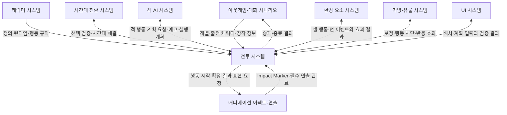
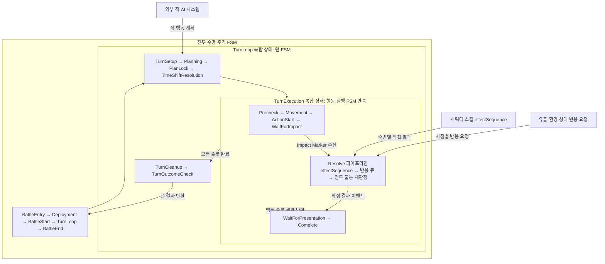
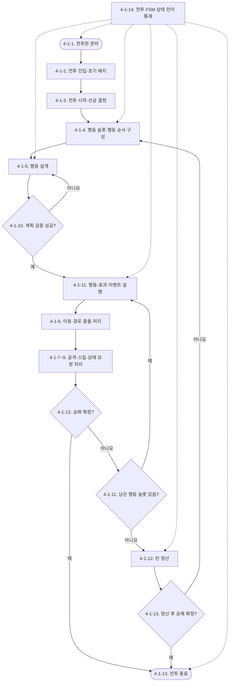
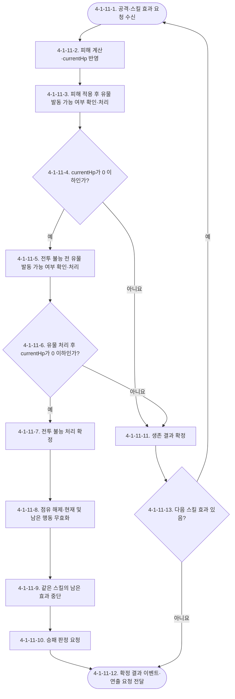
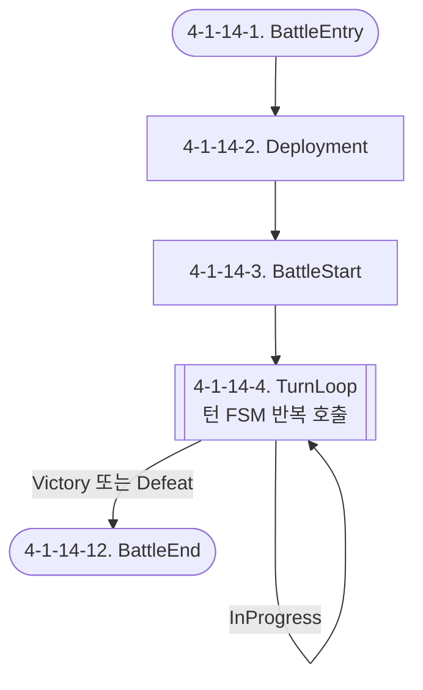
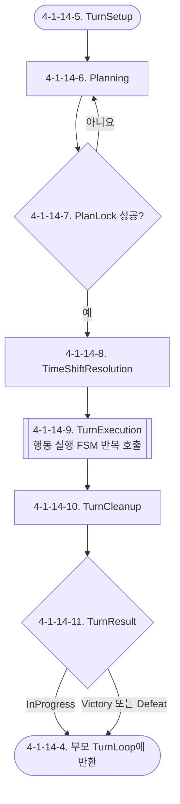
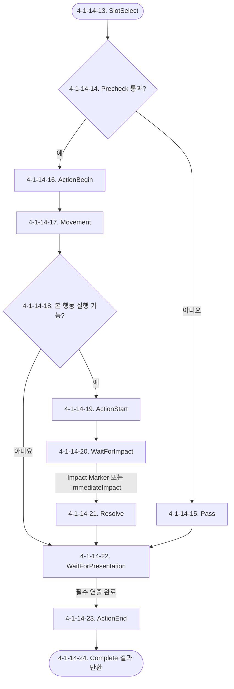
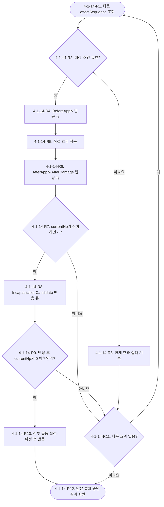

# Waredo 2.0 전투 시스템 기획서

## [확인 필요 목록]

1. 전투판은 기본 `9×9`이고 레벨에 따라 변경할 수 있다. 허용 가능한 최소·최대 크기와 이동 불가 셀·초기 배치 가능 셀의 실제 데이터 필드는 레벨 디자인·환경 요소 기획서에서 확정해야 한다.
2. 초기 배치는 배치 가능 구역에 캐릭터를 최대 3명까지 배치하고 현재 존재하는 조작 방식을 유지한다. 전투 시작에 필요한 최소 배치 인원과 세부 모바일 조작 규격은 UI 문서에서 확인해야 한다.
3. `ActionSlot`과 잠긴 턴 계획의 실제 필드, 저장 위치와 수명 주기가 명시되지 않았다. 전투 변수 정의 단계에서 확정해야 한다.
4. 이동과 본 행동이 모두 없는 행동 계획은 허용한다. 다만 빈 이동 경로의 실행 결과를 `Completed`로 처리할지 별도 결과로 구분할지 확정해야 한다.
5. 일반 공격과 스킬의 통합 범위 데이터는 별도 문서에서 다룬다. 전투 시스템과 연결할 참조·조회 계약은 해당 문서 작성 후 반영해야 한다.
6. 서로 다른 스킬·유물·환경·연쇄 효과 요청의 전역 우선순위, 동일 우선순위 동률과 큐 삽입 위치가 명시되지 않았다. 전투 시스템의 `Resolve` 반응 큐 계약에서 확정해야 한다.
7. 같은 반응 시점에 복수 유물이 조건을 만족할 때의 처리 순서와, 유물 발동이 자동인지 플레이어 선택인지 명시되지 않았다.
8. 피해 적용 후 유물은 `AfterDamage`, 전투 불능 후보 유물은 `IncapacitationCandidate`로 분류했다. 각 시점에서 허용할 효과 종류와 자동·선택 발동 범위는 유물 시스템에서 확정해야 한다.
9. 전투 불능 확정 후 `IncapacitationConfirmed` 반응 큐를 처리하도록 위치를 정했다. 해당 시점에 참여할 수 있는 유물·환경·아군·적 반응 종류와 허용 효과는 각 소유 시스템에서 확정해야 한다.
10. 유물·환경·상태 효과가 새로운 효과 요청을 생성할 때 무한 연쇄를 방지할 최대 깊이·중복 제한·오류 처리 규칙이 명시되지 않았다.
11. `BattleTimingStamp`의 실제 필드와 턴·슬롯·효과 순번을 식별하는 방식이 명시되지 않았다. 전투 FSM에서 확정해야 한다.
12. 시간대 선택을 잠근 뒤 `TimeShiftResolution`이 실패할 경우 계획 단계로 돌아갈지 오류로 중단할지 명시되지 않았다.
13. 환경 요소의 셀 진입·이동 종료·행동 시작·턴 종료 이벤트가 같은 시점에 복수 발생할 때의 처리 순서가 명시되지 않았다.
14. 효과 묶음의 시작·종료 경계와 효과 묶음 안에서 승패를 판정하는 정확한 시점이 명시되지 않았다.
15. 전투 승리 후 유물 3개 선택지를 제공하고 1개를 선택하면 현재 타일을 빠져나가 다음 타일로 진행한다. 전투 종료 결과의 실제 필드와 패배·재도전 처리는 아웃게임 시스템에서 확정해야 한다.
16. 본 시스템의 정량적 개발 목표와 지표가 제공되지 않았다. 별도 지표가 필요하면 목표값과 측정 방식을 제공해야 한다.
17. 적이 전투 불능이 되어 다음 턴 행동 목록에서 제외될 때, 최초 레벨 배치 순서를 기준으로 순환할지 생존 적 목록만 다시 구성해 순환할지 확정해야 한다.
18. 충돌한 캐릭터와 충돌 원인이 모두 피해를 받을 수 있을 때 피해 적용 순서와, 양쪽이 동시에 전투 불능 후보가 되는 경우의 반응 순서를 확정해야 한다.
19. 캐릭터 타겟팅에서 공격자와 대상 사이의 직선상에 캐릭터·환경 요소·벽이 있을 때 타겟 선택과 공격 적중을 허용할지 논의해야 한다.
20. `WaitForImpact`의 마커 또는 `WaitForPresentation`의 완료 통지를 기다리는 동안 연출 실패·응답 지연이 발생했을 때 타임아웃 시간과 강제 진행·재시도 정책을 연출 시스템에서 확정해야 한다.

## 유의사항

- 본 문서는 전투 진입, 초기 배치, 선공·행동 순서, 행동 설계, 이동, 공격·스킬·상태 연결, 계획 확정, 행동·이벤트 실행, 턴 정산과 승패·종료를 다룬다.
- 캐릭터 파라미터, 타입 상성, 일반 공격·스킬·상태이상·밀치기·당기기의 내부 규칙은 확정 캐릭터 시스템 문서가 단일 원본이다. 본 문서는 해당 규칙을 재정의하지 않고 호출 시점·입력·결과·후속 흐름만 정의한다.
- 같은 스킬 내부 효과는 캐릭터 시스템의 `effectSequence` 오름차순으로 처리한다. 앞 효과가 실패하면 다음 효과를 계속 처리하고, 전투 불능이 최종 확정되면 같은 스킬의 남은 효과를 중단한다.
- 피해 적용 직후 `currentHp <= 0`은 전투 불능 처리 후보 조건이다. 피해 반응 유물과 전투 불능 전 유물 처리 후에도 `currentHp <= 0`일 때 전투 불능 처리를 확정한다.
- 위치와 셀 점유의 단일 원본은 전투판의 `cellOccupants`다. 캐릭터에 저장형 `occupiedCell`을 추가하지 않는다.
- `currentHp <= 0`, 기절, 이동 중 전투 불능과 외부 행동 차단 조건을 직접 확인한다. 충돌했더라도 충돌 피해 후 생존하면 예정된 본 행동을 실행한다. 저장형 `cancelMainAction`을 만들지 않는다.
- 전투 진입 시 캐릭터의 `currentHp`를 최대 체력으로 회복하지 않고 아웃게임에서 유지된 현재 체력을 그대로 사용한다.
- 계획 단계에서 앞 행동의 결과를 반영한 캐릭터 예상 위치를 계산하지 않는다. 캐릭터는 현재 위치에 그대로 표시하고 이동 경로와 설정한 행동 정보만 표시한다.
- 공격·스킬 시작 연출은 규칙 적용 전에 재생하고 `Impact Marker`만 효과 해결 시작 신호로 사용한다. 피해·상태 등 결과 연출은 확정 결과 이벤트를 소비하며 연출 실패나 지연이 전투 결과를 변경해서는 안 된다.
- 시간대 효과, 적 AI 내부 판단, 환경 요소 내부 효과, 유물 조건·카운터, UI 조작과 연출 재생 규칙은 각 별도 시스템이 소유한다.
- 확정 전 GDD와 확정 문서가 충돌하면 확정 문서를 적용한다. 셀 선택 일반 공격은 방향 없이 셀만 지정하고, 설치형 스킬은 현재 범위에서 제외한다.
- 전투판 기본 크기는 `9×9`이며 레벨에 따라 변경할 수 있다. 이동 불가 셀·배치 가능 셀과 환경 요소 데이터는 레벨 디자인·환경 요소 문서가 소유한다.
- 초기 배치는 배치 가능 구역에 캐릭터를 최대 3명까지 배치하며 현재 존재하는 배치 시스템을 유지한다. 세부 조작은 UI 시스템이 소유한다.
- 아군 내부 행동 순서는 전투 최초 진입 시 무작위로 한 번 정하고 전투 중 유지한다.
- 적 내부 행동 순서의 최초 목록은 레벨 디자인에서 정의한다. 턴이 진행될 때마다 마지막 적을 맨 앞으로 옮기는 방식으로 순환한다.
- 이동 경로는 전투판 위에서 드래그해 작성한다. 일반 공격 또는 스킬 버튼을 누르면 해당 행동의 타겟 설정으로 진입하며, 본 행동이 설정된 상태에서는 이동 경로를 추가·변경할 수 없다.
- 턴 도중 전투 불능이 된 캐릭터의 현재 턴 행동 슬롯은 삭제하거나 재배열하지 않고 패스한다. 행동 카드에는 회색 처리 등 패스 상태를 명시적으로 표시한다.
- 일반 이동과 강제 이동 중 캐릭터·이동 차단 환경 요소·벽·전투판 외곽에 충돌하면 직전 셀에서 정지하고 충돌 피해 10을 처리한다.
- 적 AI의 타겟 선정·스킬 선택·경로 재계산·동률 처리와 행동 변경 허용 범위는 추후 별도 기획한다.
- 전투 FSM은 별도 상위 시스템이 아니라 본 전투 시스템 내부의 실행 통제 하위 항목이다. 적 AI만 별도 시스템으로 분리하며 전투 상태 전이 권한을 갖지 않는다.
- `[확인 필요 목록]`의 항목은 임의 규칙이나 수치로 보완하지 않았으며 관련 시스템 작성 시 다시 확인해야 한다.

# 1. 기획의도

플레이어가 적의 행동 예고와 전투 진입 시 무작위로 정해진 아군 행동 순서를 확인한 뒤, 각 캐릭터의 이동 경로, 일반 공격 또는 스킬과 시간대를 설계하게 한다.

행동 설계 단계에서는 충분히 검토하고 수정할 수 있게 하며, 계획 확정 뒤에는 아군과 적군의 행동이 정해진 순서로 빠르게 해결되는 난투 경험을 제공한다. 충돌, 면역, 대상 이탈, 유물 반응과 전투 불능으로 계획이 달라질 때 어떤 사건이 어떤 순서로 처리됐는지 설명 가능한 전투를 목표로 한다.

# 2. 개발 목적

- 전투 진입부터 종료까지의 호출 순서와 시스템별 소유권을 분리한다.
- 계획 단계와 실행 단계가 같은 원본 데이터와 판정 규칙을 사용하게 한다.
- 위치·점유·체력·상태·행동 계획의 단일 원본을 확립하고 중복 저장을 방지한다.
- 공격·스킬·유물·환경 반응과 전투 불능 처리의 이벤트 순서를 결정적으로 재현할 수 있게 한다.
- 전투 로직과 연출을 분리하여 UI·로그·애니메이션이 동일한 확정 결과를 소비하게 한다.
- 정량적 비즈니스·운영 지표는 제공되지 않았으므로 본 문서에서 임의 목표를 추가하지 않는다.

## 2.1 시스템 개요: 어떤 전투를 만드는가

본 전투 시스템은 기본 `9×9` 격자형 전투판에서 최대 3명의 아군을 배치하고, 적이 다음 턴에 수행할 행동을 확인한 뒤 정해진 행동 순서에 맞춰 아군 전체의 이동과 행동을 미리 설계하는 턴제 전투 시스템이다.

플레이어는 캐릭터 한 명에게 명령을 내리자마자 결과를 확인하는 것이 아니라, 이번 턴에 참여하는 아군의 이동 경로와 일반 공격·스킬·무행동을 먼저 계획한다. 모든 계획을 확정하면 아군과 적군의 행동이 정해진 행동 슬롯 순서에 따라 연속으로 실행된다. 계획 화면은 앞 행동의 결과를 미리 시뮬레이션하지 않고 현재 캐릭터 위치를 그대로 보여주므로, 실행 중 발생하는 이동·충돌·강제 이동과 전투 불능에 따라 이후 행동의 실제 결과가 달라질 수 있다.

첫 턴의 선공 진영은 전투 시작 시 결정하고 이후 턴마다 선공 진영을 교대한다. 아군 내부 순서는 전투 최초 진입 시 무작위로 정하고, 적 내부 최초 순서는 레벨 디자인에서 정한다. 적 순서는 턴이 지날 때마다 마지막 적을 맨 앞으로 옮겨 순환한다. 각 진영의 내부 순서를 정한 뒤에는 선공 진영부터 아군과 적군을 교차 배치하고, 한 진영의 캐릭터가 더 많으면 남은 캐릭터의 행동 슬롯을 뒤에 이어 붙인다.

## 2.2 플레이어가 한 턴 동안 하는 일

1. 전투 시작 전 배치 가능 구역에 아군을 최대 3명까지 배치한다.
2. 전투가 시작되면 이번 턴의 아군·적군 행동 순서와 적의 예정 행동을 확인한다.
3. 각 아군의 이동 경로를 전투판에서 드래그해 작성하고, 일반 공격 또는 스킬 버튼을 눌러 사용할 행동과 타겟을 설정한다. 본 행동을 먼저 설정했다면 이를 취소하기 전에는 이동 경로를 작성할 수 없다. 필요하면 이동이나 본 행동을 선택하지 않고 해당 슬롯을 넘길 수도 있다.
4. 시간대 변경이 필요하면 현재 턴에 사용할 시간대를 함께 선택한다.
5. 캐릭터의 현재 위치와 각 행동에 표시된 이동 경로·타겟 정보를 확인하고 계획을 수정한다. 앞 행동의 결과를 반영한 예상 위치는 계산하거나 표시하지 않는다.
6. 턴 계획을 확정하면 더 이상 계획을 수정하지 않고, 행동 슬롯 순서대로 이동·공격·스킬·반응 효과가 실행되는 과정을 확인한다.
7. 모든 행동이 끝나고 승패가 나지 않았으면 상태·쿨타임·환경·유물·시간대를 정산한 뒤 다음 턴을 계획한다.

## 2.3 이 전투의 핵심 작동 방식

### 계획과 실행의 분리

계획 단계에서는 현재 캐릭터 위치를 그대로 표시하고 앞 행동의 결과를 반영한 예상 위치를 계산하지 않는다. 이동 경로와 본 행동·타겟 설정은 계획 정보로 표시하되, 실제 행동을 실행할 때 캐릭터의 실제 체력, 상태, 위치, 셀 점유와 각종 보정을 다시 확인한다. 앞선 행동에서 캐릭터가 이동하거나 밀려나고, 대상이 전투 불능이 되거나 셀이 막히면 뒤에 계획한 행동은 처음 설정한 계획과 다른 위치에서 실행되거나 실패할 수 있다.

### 위치 변화가 뒤 행동에 미치는 영향

앞 캐릭터가 특정 셀을 점유하면 뒤 캐릭터의 이동 경로가 막힐 수 있다. 반대로 적을 밀치거나 당겨서 다른 셀로 옮기면 뒤 캐릭터의 공격 범위 안으로 들어오거나 기존 타겟이 범위 밖으로 벗어날 수 있다. 이처럼 하나의 행동 결과가 뒤 행동의 출발 위치·경로·범위·대상을 바꾸는 연쇄가 전투의 주요 판단 요소다.

### 계획 실패를 포함하는 실행

실행 시 이동 경로가 다른 캐릭터·이동 차단 환경 요소·벽·전투판 외곽에 막히면 캐릭터는 직전 유효 셀에서 멈추고 충돌 피해 10을 받는다. 충돌 원인이 피해를 받을 수 있는 캐릭터나 환경 요소라면 같은 피해를 받는다. 이동 캐릭터가 충돌 피해 후 생존하면 정지한 위치에서 예정된 일반 공격 또는 스킬을 실행하고, 전투 불능이 최종 확정되면 이후 행동을 취소한다. 공격·스킬의 대상이 사라지거나 실제 범위에서 벗어나면 자동으로 다른 대상을 찾지 않고 해당 행동을 실패 처리한다. 같은 스킬 안의 개별 효과 하나가 면역·대상 없음 등의 이유로 실패하면 다음 효과는 계속 처리한다.

### 시간대와 전투 계획의 결합

시간대 선택은 별도의 연출 선택이 아니라 현재 턴의 전투 규칙과 캐릭터·유물·환경 상태에 영향을 주는 계획 요소다. 플레이어가 턴 계획을 확정하면 선택한 시간대도 함께 잠기며, 시간대 변경 비용과 활성 효과를 먼저 해결한 뒤 행동 실행을 시작한다.

### 결과와 연출의 분리

전투 시스템은 공격·스킬 시작 연출을 먼저 요청하고 연출 시스템이 반환한 `Impact Marker`에서 피해·위치·상태·유물 반응과 전투 불능을 해결한다. 이후 애니메이션·이펙트·사운드·UI는 확정 결과를 순서대로 보여준다. 마커는 판정 시점만 제공하며 피해량·대상·승패를 결정하지 않고, 결과 연출이 늦게 재생되거나 실패하더라도 이미 확정된 전투 결과는 바뀌지 않는다.

## 2.4 실제 처리 예시

적이 아군을 공격해 체력이 0 이하가 되는 상황은 다음과 같이 처리한다.

```text
적 공격 실행
→ 공격 시작 애니메이션·카메라·사운드 요청
→ 실제 타격 프레임의 Impact Marker 수신
→ 피해 계산 및 체력 반영
→ 피해 적용 후 발동 가능한 유물·상태·환경 반응 확인
→ 반응 효과 처리
→ currentHp가 0 이하인지 전투 불능 후보 확인
→ 전투 불능을 막거나 생존시키는 유물 반응 확인
→ 생존 반응 처리 후 currentHp 재확인
→ 여전히 0 이하이면 전투 불능 최종 확정
→ 위치 점유 해제 및 남은 행동 무효화
→ 전투 불능 확정 후 반응과 승패 처리
→ 확정 결과에 맞춰 애니메이션·이펙트·UI 재생
```

이 순서가 필요한 이유는 피해를 받은 즉시 캐릭터를 제거하면 피해 반응 유물이나 전투 불능 방지 유물이 개입할 수 없기 때문이다. 따라서 `currentHp <= 0`은 즉시 제거를 의미하지 않고 전투 불능 처리 후보를 의미한다. 정해진 반응 시점을 모두 해결한 뒤에도 조건이 유지될 때만 실제 전투 불능을 확정한다.

## 2.5 전투 시스템이 직접 정의하는 것

전투 시스템은 캐릭터의 공격력이나 개별 스킬 효과를 직접 제작하는 시스템이 아니다. 캐릭터·유물·환경·시간대·적 AI가 제공한 규칙과 결과를 전투의 올바른 시점에 호출하고, 그 결과를 다음 행동으로 연결하는 실행 통제 시스템이다.

본 문서가 직접 정의하는 범위는 전투 진입과 초기 배치, 선공과 행동 슬롯, 행동 계획의 작성·잠금, 이동과 행동의 실행 순서, 효과와 반응 이벤트의 처리 순서, 턴 정산, 전투 불능과 승패·종료 처리다. 개별 캐릭터 수치와 공격·스킬의 내부 계산, 유물의 발동 조건, 환경 요소의 고유 효과, 적의 판단 기준, UI 조작과 연출 재생 방식은 각 소유 시스템 문서에서 정의한다.

# 3. 시스템 구조

전투 시스템은 전투 FSM을 실행 통제 중심으로 두고 13개 규칙·실행 하위 항목을 연결하는 총 14개 하위 항목으로 구성한다. 적의 타겟·경로·스킬을 결정하는 적 AI는 별도 시스템으로 분리한다.

```text
전투 시스템
├─ 전투 FSM
│  ├─ 전투 수명 주기 FSM
│  ├─ 턴 FSM
│  └─ 행동 실행 FSM
│     └─ Resolve 효과 해결 파이프라인·반응 큐
├─ 전투판·셀·점유
├─ 전투 진입·초기 배치
├─ 전투 시작·선공 결정
├─ 행동 슬롯·행동 순서
├─ 행동 설계
├─ 이동·경로·충돌
├─ 공격·타겟팅 연결
├─ 스킬·쿨타임 연결
├─ 상태이상·강제 이동 연결
├─ 계획 검증·확정
├─ 행동·효과·이벤트 실행
├─ 턴 정산
└─ 승패 판정·전투 종료
```

## 3.1 외부 시스템 관계



## 3.2 데이터 단일 원본과 사용 계약

| 정보 | 단일 원본 소유자 | 전투 시스템 사용 방식 |
|---|---|---|
| 캐릭터 원본·행동 정의 | 캐릭터 시스템 | 읽기 조회 |
| 현재 체력·쿨타임·상태 목록 | 캐릭터 런타임 | 변경 요청과 결과 조회 |
| 캐릭터 위치·셀 점유 | 전투판 `cellOccupants` | 위치 조회·점유 변경 요청 |
| 행동 계획 구조 | 캐릭터 변수 정의서 `ActionPlan` | 계획 작성·잠금·실행 참조 |
| 행동 슬롯·잠긴 턴 계획·실행 커서 | 전투 시스템 | 턴 단위 생성·잠금·실행 갱신 |
| 아군 내부 행동 순서 | 전투 시스템 | 전투 최초 진입 시 무작위로 한 번 생성하고 전투 중 유지 |
| 적 내부 최초 행동 순서 | 레벨 디자인 | 레벨 데이터에서 조회하고 턴마다 전투 시스템이 순환 |
| 전투 흐름 상태·효과·반응 처리 창과 전역 효과 큐 | 전투 시스템 내부 FSM | 상태 전이·효과 처리·다음 행동 진행 통제 |
| 적 행동 계획 | 적 AI 시스템 | 계획 요청·예고 결과 수신·실행 재검증 요청 |
| 시간대·시간 파편 | 시간대 전환 시스템 | 선택 검증·잠금·해결 요청 |
| 환경 요소 상태 | 환경 요소 시스템 | 이벤트 통지·효과 결과 수신 |
| 유물 장착·보정·트리거 상태 | 가방·유물 시스템 | 조회·반응 시점 통지·효과 결과 수신 |
| 표현 재생 상태 | 애니메이션·이펙트·연출 시스템 | 확정 결과 이벤트 전달 |

## 3.3 전체 진행 개요

```text
전투 진입
→ 전투판·캐릭터 런타임 준비
→ 초기 배치
→ 전투 시작·최초 선공 결정
→ 턴 준비·행동 슬롯 구성
→ 적 행동 계획 요청·예고
→ 아군 행동·시간대 설계
→ 계획 검증·잠금
→ 시간대 해결
→ 행동 슬롯 순서대로 실행
→ 이동·공격 또는 스킬·효과·반응 이벤트 처리
→ 전투 불능·승패 판정
→ 남은 행동 반복
→ 턴 정산
→ 정산 후 승패 판정
→ 선공 교대·다음 턴
→ 전투 종료 결과 전달
```

## 3.4 전투 FSM 계층 구조

전투 FSM은 개별 스킬·유물 효과를 직접 정의하지 않는다. 전투 진입부터 종료까지의 상태 전이, 한 턴의 반복과 한 기물의 행동 세트를 소유한다. 여러 프레임 유지·입력·외부 완료 신호 대기가 필요한 단계만 FSM 상태로 두고, 대상 검증·피해 적용·유물 조건 확인·전투 불능 재판정처럼 한 번에 해결하는 처리는 `Resolve` 내부 파이프라인으로 실행한다. 스킬은 자신의 `effectSequence` 목록을 제공하고 유물·환경·상태 효과는 지정된 반응 시점에 요청을 제공한다.



| 부모 FSM·상태 | 내부에서 호출하는 자식 FSM | 자식 호출 시점 | 부모로 반환하는 결과 |
|---|---|---|---|
| 전투 수명 주기 FSM의 `TurnLoop` | 턴 FSM | `BattleStart` 완료 후, 승패가 없을 때 턴마다 호출 | 턴 종료 상태, 승패 판정 결과 |
| 턴 FSM의 `TurnExecution` | 행동 실행 FSM | 계획·시간대 해결 완료 후, 소비할 슬롯마다 반복 호출 | 행동 슬롯 결과, 다음 슬롯 진행 가능 여부, 승패 판정 요청 |
| 행동 실행 FSM의 `WaitForImpact` | 연출 시스템의 피격 타이밍 신호 | 공격·스킬 시작 애니메이션 요청 후 호출 | `Impact Marker` 또는 즉시 실행 완료 신호 |
| 행동 실행 FSM의 `Resolve` | 효과 해결 파이프라인·반응 큐 | `Impact Marker` 수신 후 호출 | 확정 효과 결과, 다음 `effectSequence` 진행 여부, 행동 중단 여부 |
| 행동 실행 FSM의 `WaitForPresentation` | 연출 시스템 완료 신호 | 현재 행동 세트의 확정 결과 이벤트가 준비됐을 때 호출 | 필수 연출 완료 통지와 `Complete` 진행 허용 신호 |

부모 FSM은 자식 FSM이 실행되는 동안 자신의 복합 상태를 유지한다. 예를 들어 행동 실행 FSM이 실행되는 동안 턴 FSM의 현재 상태는 계속 `TurnExecution`이며, 행동 실행 FSM이 완료 결과를 반환해야만 턴 FSM이 다음 슬롯 호출 또는 `TurnCleanup`으로 전이한다. `Resolve` 파이프라인은 별도 FSM이 아니며 한 행동 실행 FSM의 동기 처리 단계다.

## 3.5 전투 FSM 실행 단위

FSM은 다음 세 계층을 큰 단위에서 작은 단위 순으로 중첩하며, 가장 안쪽 행동 실행 FSM의 `Resolve`가 효과 해결 파이프라인을 호출한다.

```text
전투 수명 주기 FSM
├─ BattleEntry
├─ Deployment
├─ BattleStart
├─ TurnLoop [복합 상태]
│  └─ 턴 FSM
│     ├─ TurnSetup
│     ├─ Planning
│     ├─ PlanLock
│     ├─ TimeShiftResolution
│     ├─ TurnExecution [복합 상태]
│     │  └─ 행동 실행 FSM [슬롯마다 반복]
│     │     ├─ Precheck 또는 Pass
│     │     ├─ Movement
│     │     ├─ ActionStart
│     │     ├─ WaitForImpact
│     │     ├─ Resolve [효과 해결 파이프라인·반응 큐]
│     │     ├─ WaitForPresentation
│     │     └─ Complete
│     ├─ TurnCleanup
│     └─ TurnOutcomeCheck
└─ BattleEnd
```

한 기물의 행동 세트가 논리 처리와 연출 동기화까지 완료되기 전에는 다음 기물의 행동 세트를 시작하지 않는다. 공격·스킬 시작 연출은 논리 적용 전에 시작하고, FSM은 연출 시스템의 `Impact Marker`를 받은 시점에 `Resolve`를 실행한다. 연출 시스템은 확정된 결과를 변경하지 않으며 결과 연출 완료 통지는 다음 행동으로 넘어가기 위한 게이트다. 연출 실패·응답 지연 시의 타임아웃과 강제 진행 정책은 연출 시스템 문서에서 확정해야 한다.

# 4. 시스템 상세 구조

## 4-1. 전투 시스템

전투 시스템은 전투 전체 규칙 순서와 외부 시스템 호출 계약을 소유한다. 캐릭터·유물·환경·시간대·AI의 내부 규칙을 복사하지 않으며, 각 시스템이 반환한 확정 결과를 다음 전투 단계에 연결한다.

### 4-1 전체 순서도



| 번호 | 처리 내용 |
|---|---|
| 4-1-1 | 레벨 전투판의 셀, 이동 가능 여부와 빈 점유 맵을 준비한다. |
| 4-1-2 | 출전 캐릭터 런타임을 만들고 초기 배치를 검증·확정한다. |
| 4-1-3 | 유지된 현재 체력으로 전투 런타임을 준비하고 최초 선공 진영을 결정한다. |
| 4-1-4 | 무작위 아군 내부 순서와 레벨 지정·턴 순환 적 내부 순서를 이용해 행동 슬롯을 구성한다. |
| 4-1-5 | 적 행동 예고와 현재 위치를 표시하고 드래그 이동 경로·본 행동·시간대를 설계한다. |
| 4-1-6 | 잠긴 이동 경로를 셀 단위로 실행하고 충돌·환경 결과를 반환한다. |
| 4-1-7~9 | 캐릭터 시스템의 공격·스킬·상태 규칙을 호출하고 효과 요청을 받는다. |
| 4-1-10 | 전체 계획과 시간대 선택을 검증하고 성공한 계획을 잠근다. |
| 4-1-11 | 슬롯을 소비하며 이동·본 행동·효과·유물 반응·전투 불능·표현 요청을 순서대로 해결한다. |
| 4-1-12 | 모든 슬롯 완료 후 환경·상태·유물·시간 파편·다음 턴 준비 요청을 처리한다. |
| 4-1-13 | 효과와 정산 결과로 승패를 판정하고 확정 시 남은 처리를 중단한다. |
| 4-1-14 | 전투·턴·행동 실행 상태를 계층적으로 전이시키고 `Resolve` 효과 파이프라인과 연출 완료 전 다음 슬롯 진행을 막는다. |

### 4-1-1. 전투판·셀·점유

#### 책임

- 모든 위치 판정이 공통으로 사용하는 정사각형 격자 셀과 점유 원본을 제공한다.
- 초기 배치, 일반 이동, 강제 이동, 공격·스킬 범위와 환경 요소가 같은 셀 좌표를 참조하게 한다.

#### 입력

- 레벨별 전투판 크기. 기본값은 `9×9`이며 추후 변경 가능
- 이동 불가 셀 목록 `[확인 필요]`
- 초기 배치 가능 셀 `deployableCells`
- 환경 요소의 셀 진입 차단 정보 `[확인 필요]`

#### 처리 규칙

1. 요청한 셀이 전투판 내부인지 확인한다.
2. 이동 가능한 셀인지 확인한다.
3. `cellOccupants`에 다른 `characterId`가 있는지 확인한다.
4. 필요한 경우 환경 요소가 진입을 차단하는지 확인한다.
5. 모든 조건을 만족할 때만 진입 가능한 셀로 반환한다.
6. 위치 변경은 기존 점유 제거와 새 점유 등록을 하나의 처리로 요청한다.

#### 출력·예외

- 셀 유효성, 진입 가능 여부, 현재 점유 캐릭터와 위치 변경 결과를 반환한다.
- 캐릭터는 별도 `occupiedCell`을 저장하지 않고 `cellOccupants`에서 자신의 위치를 조회한다.
- 동일 셀 복수 점유 또는 동일 캐릭터의 복수 셀 점유 요청은 거부하고 오류를 기록한다.

### 4-1-2. 전투 진입·초기 배치

#### 책임

아웃게임에서 레벨·출전 캐릭터·장착 정보를 받아 전투판과 캐릭터 런타임을 생성하고, 최대 3명의 출전 캐릭터가 서로 다른 유효 배치 셀에 배치됐을 때 전투 시작을 허용한다.

#### 처리 규칙

1. 레벨 데이터와 출전 캐릭터·장착 정보를 받는다.
2. 전투판과 빈 `cellOccupants`를 생성한다.
3. 캐릭터별 원본 정의와 장착 보정을 연결하고 전투 런타임을 생성한다.
4. `deployableCells`를 UI에 제공하고 최대 3명까지만 배치 요청을 받는다.
5. 배치 요청마다 전투판 내부·이동 가능·배치 가능·미점유 조건을 확인한다.
6. 성공한 배치를 `cellOccupants`에 반영한다.
7. 모든 출전 캐릭터가 정확히 한 셀을 점유했는지 조회한다.
8. 완료 조건이 충족되면 전투 시작 입력을 허용한다.

#### 예외·경계

- 초기 배치 중에는 행동 슬롯, 이동 경로, 공격·스킬 범위와 적 행동 예고를 표시하지 않는다.
- 배치 완료 여부는 배치된 출전 캐릭터 수와 유효 점유를 이용해 계산하며 저장형 bool 추가를 지양한다.
- 배치 조작은 현재 존재하는 시스템을 유지하며 세부 모바일 입력은 UI 시스템이 소유한다.

### 4-1-3. 전투 시작·선공 결정

#### 처리 규칙

1. 배치 완료 조건과 전투 시작 입력을 확인한다.
2. 아웃게임에서 전달된 각 캐릭터의 `currentHp`를 변경하지 않고 전투 런타임에 연결한다.
3. `skillCooldownRemaining`을 0, `activeStatusEffects`를 빈 목록으로 초기화한다.
4. 시간대 전환 시스템에 전투 시작을 요청한다.
5. 첫 턴의 선공 진영을 동전 던지기로 결정해 최초 선공 결과를 저장한다.
6. 첫 `TurnSetup`과 행동 슬롯 구성을 요청한다.

#### 예외·경계

- 첫 턴 이후 선공 진영은 턴마다 교대한다.
- 동전 던지기와 아군 내부 순서 무작위 배치의 시드·재현 방식은 구현·QA 정책에서 확정해야 한다.
- 시작 시간대와 시간 파편은 시간대 전환 시스템이 소유한다.
- 전투 진입은 체력 회복 시점이 아니다. 전투 종료 후 남은 `currentHp`는 다음 전투 진입에도 유지한다.

### 4-1-4. 행동 슬롯·행동 순서

#### 처리 규칙

1. 전투 최초 진입 시 `currentHp > 0`인 아군을 무작위로 섞어 아군 내부 행동 순서를 한 번 저장한다.
2. 레벨 디자인 데이터에서 적 내부 최초 행동 순서를 조회한다.
3. 첫 턴에는 레벨 디자인 순서를 그대로 사용하고, 다음 턴부터 직전 적 순서의 마지막 적을 맨 앞으로 이동시켜 순환한다. 예: `적1 → 적2 → 적3` 다음은 `적3 → 적1 → 적2`다.
4. 현재 턴에는 각 진영 순서에서 `currentHp > 0`인 캐릭터를 조회한다.
5. 현재 턴의 선공 진영을 계산한다.
6. 선공 진영의 첫 캐릭터부터 양 진영의 캐릭터를 교차로 행동 슬롯에 배치한다.
7. 한 진영의 캐릭터가 남으면 해당 진영의 남은 캐릭터 슬롯을 뒤에 연속 추가한다.
8. 같은 캐릭터가 둘 이상의 슬롯에 들어가지 않게 검증한다.
9. 적 슬롯은 적 AI 시스템에 행동자·계획 생성을 요청한다.
10. 아군 슬롯은 정해진 행동자에 대한 행동 설계 입력을 대기한다.

#### 예외·경계

- `actionNumber`는 슬롯 목록 인덱스 `+1`로 계산하고 별도 저장하지 않는다.
- 턴 도중 전투 불능이 된 캐릭터의 현재 턴 슬롯은 삭제하지 않고 순서와 번호를 유지한 채 패스한다.
- 전투 불능으로 패스하는 슬롯의 행동 카드는 회색 처리 등 실행 불가 상태를 명시적으로 표시한다. 구체적인 색상·아이콘·문구는 UI 시스템에서 정의한다.
- 아군 내부 행동 순서는 전투 중 다시 섞지 않는다.
- 적 내부 행동 순서는 레벨 디자인이 최초 목록을 소유하고, 전투 시스템은 턴 단위 순환만 수행한다.
- 적 전투 불능 후 순환 기준은 `[확인 필요 목록]` 17번에서 확정한다.
- 적 행동자·타겟·경로·스킬 선택 기준은 적 AI 시스템이 소유한다.

### 4-1-5. 행동 설계

#### 계획 구조

```text
ActionPlan
├─ movePath: List<Vector2Int>
└─ mainAction: MainActionPlan?
   ├─ actionType: NormalAttack | Skill
   └─ target
      ├─ CharacterTarget(characterId)
      ├─ CellTarget(cell)
      └─ DirectionTarget(direction)
```

#### 처리 규칙

1. 적 AI 시스템에서 타겟과 예정 경로를 받아 예고한다.
2. 모든 캐릭터는 현재 `cellOccupants`에서 조회한 실제 위치에 그대로 표시하며, 앞 행동 결과를 반영한 예상 위치를 계산하거나 캐릭터 표시 위치를 옮기지 않는다.
3. 플레이어가 무작위로 정해진 각 아군 슬롯의 행동 카드를 선택해 해당 캐릭터의 계획을 작성한다.
4. 본 행동이 설정되지 않은 상태에서 전투판 위를 드래그해 현재 표시 셀부터 상·하·좌·우로 `effectiveMoveRange` 이하의 이동 경로를 작성한다.
5. 일반 공격 버튼 또는 스킬 버튼을 누르면 해당 행동의 타겟 설정 상태로 진입한다.
6. 선택한 행동의 타겟팅 유형과 일치하는 `ActionTarget` 하나를 저장한다.
7. 일반 공격 또는 스킬이 설정되면 이동 경로의 신규 작성과 변경 입력을 차단한다.
8. 캐릭터는 현재 위치에 그대로 두고 작성한 이동 경로, 현재 표시 위치 기준의 선택 가능 범위·영향 셀·타겟 정보를 표시한다. 앞 슬롯 결과에 따른 캐릭터 예상 위치만 계산하지 않는다.
9. 턴 종료 입력 전까지 이동 경로·본 행동·타겟·시간대 계획을 수정하거나 취소할 수 있게 한다.
10. 본 행동 설정 후 이동하려면 설정한 일반 공격 또는 스킬을 먼저 취소하게 한다.

#### 확정 규칙·예외

- 한 행동은 `이동 → 일반 공격 또는 스킬` 순서만 허용한다.
- 이동 없이 일반 공격 또는 스킬을 사용하는 것은 허용한다.
- 이동과 일반 공격·스킬을 모두 선택하지 않고 해당 행동 슬롯을 넘기는 완전 무행동 계획도 허용한다. 이 경우 `movePath`는 빈 목록이고 `mainAction = null`이다.
- 일반 공격과 스킬은 같은 행동에서 함께 사용할 수 없다.
- 입력 순서는 `이동 경로 작성 → 일반 공격 또는 스킬 설정`만 허용한다. 본 행동을 먼저 설정한 뒤 이동을 추가하거나 변경할 수 없다.
- 계획 단계에서는 앞 행동 결과에 따른 캐릭터 예상 위치를 계산하지 않는다. 현재 표시 위치를 기준으로 범위·영향 셀·타겟 정보를 제공하되 실행 단계에서 실제 위치·점유·타겟 유효성을 다시 판정한다.

### 4-1-6. 이동·경로·충돌

#### 처리 규칙

1. 행동 캐릭터의 실제 현재 위치를 `cellOccupants`에서 조회한다.
2. 잠긴 `movePath`의 다음 셀이 현재 셀과 직교 인접하는지 확인한다.
3. 다음 셀의 전투판 내부·이동 가능·미점유·환경 차단 조건을 진입 직전에 확인한다.
4. 진입 가능하면 기존 점유 제거와 새 점유 등록을 함께 처리한다.
5. 셀 진입 환경 이벤트를 요청하고 반환된 효과를 전투 이벤트 처리로 연결한다.
6. 이동 중 전투 불능이 최종 확정되면 점유 해제 후 남은 경로와 예정된 본 행동을 폐기한다.
7. 다음 셀에 캐릭터, 이동 차단 환경 요소, 벽 또는 전투판 외곽이 있어 진입할 수 없으면 직전 유효 셀에서 멈추고 남은 경로를 폐기한다.
8. 충돌한 이동 캐릭터에 대한 피해 10 요청을 생성한다.
9. 충돌 원인이 피해를 받을 수 있는 캐릭터 또는 환경 요소라면 동일한 피해 10 요청을 생성한다. 벽·전투판 외곽처럼 피해를 받을 수 없는 원인에는 요청을 생성하지 않는다.
10. 생성된 충돌 피해를 일반 피해와 같은 유물·전투 불능 이벤트 순서로 처리한다. 양쪽 요청의 적용 순서는 `[확인 필요 목록]` 18번에서 확정한다.
11. 이동 캐릭터의 전투 불능이 최종 확정되면 예정된 본 행동을 취소하고 `Incapacitated`를 반환한다.
12. 이동 캐릭터가 생존하면 정지한 위치를 최종 위치로 확정하고 `Collision`을 반환한다.
13. 충돌 없이 남은 경로가 없으면 `Completed`를 반환한다.

#### 이동 결과

| 결과 | 의미 | 후속 처리 |
|---|---|---|
| `Completed` | 잠긴 경로를 끝까지 실행 | 본 행동 실행 조건 확인 |
| `Collision` | 다음 셀 진입 실패 후 충돌 피해를 받고 생존 | 남은 경로 폐기, 정지 위치에서 예정된 본 행동 실행 |
| `Incapacitated` | 이동 중 전투 불능 확정 | 점유 해제, 남은 행동 중단, 승패 판정 |

#### 예외·경계

- 일반 이동과 강제 이동의 충돌 피해는 10이다.
- 충돌 원인이 피해를 받을 수 있으면 이동 캐릭터와 충돌 원인 모두 피해 10을 받는다.
- 충돌 원인이 피해로 전투 불능이 되더라도 이동 캐릭터는 정지한 위치에서 이동을 끝내며 폐기한 경로를 다시 진행하지 않는다.
- 빈 이동 경로의 반환값은 `[확인 필요]`다.
- 이동 경로와 충돌 셀은 실행 임시값이며 행동 종료 후 폐기한다.
- 강제 이동의 방향·거리·면역은 캐릭터 시스템 `Push`·`Pull` 규격을 사용하며, 충돌 정지·피해·전투 불능은 본 항목과 같은 규칙을 적용한다.

### 4-1-7. 공격·타겟팅 연결

#### 책임

캐릭터 시스템이 확정한 일반 공격 3유형을 행동 설계와 실행 흐름에 연결한다. 일반 공격 정의·범위 사용·대상 확정·피해 계산을 다시 정의하지 않는다.

#### 처리 규칙

1. 잠긴 행동 계획이 `NormalAttack`인지 확인한다.
2. 행동 캐릭터의 `currentHp > 0`, 기절 없음, 이동 결과가 `Incapacitated`가 아님과 외부 행동 차단 조건 미충족을 확인한다. `Collision` 후 생존한 경우는 정지한 실제 위치에서 공격을 계속한다.
3. 캐릭터 시스템에 실제 위치와 잠긴 `ActionTarget`을 포함한 공격 실행을 요청한다.
4. 캐릭터 시스템은 실제 위치 기준 범위와 타겟·셀·방향을 재검증한다.
5. 검증 실패 결과를 받으면 자동 재타겟팅 없이 공격 행동을 종료한다.
6. 성공하면 타입 상성·치명타·보정을 적용한 피해 요청을 받는다.
7. 피해 요청을 행동·효과·이벤트 실행 단계에 전달한다.

#### 적용할 확정값

- 유형은 `Target`, 방향 없는 `TileSelect`, `Directional`이다.
- `TileSelect`는 `CellTarget`만 사용하고 방향 입력·회전을 사용하지 않는다.
- 실행 시 실제 현재 위치 기준으로 범위를 다시 생성한다.
- 일반 공격은 띄워짐 대상에게 항상 치명타를 적용한다.
- 공격 수치와 범위 좌표를 전투 문서에 중복 작성하지 않는다.
- 공격자와 캐릭터 타겟 사이의 직선상 방해물 처리 여부는 `[확인 필요 목록]` 19번의 논의사항으로 유지한다.

#### 논의사항: 캐릭터와 타겟 사이 직선상 방해물

캐릭터 직접 타겟형 공격·스킬에서 사용자 셀과 타겟 셀을 잇는 직선상에 다른 캐릭터, 환경 요소 또는 벽이 있을 때의 처리가 미확정이다. 이 규칙은 타겟을 처음 선택할 때와 잠긴 행동을 실제 실행할 때 동일한 기준으로 검사할 수 있어야 한다.

확정해야 하는 세부 항목은 다음과 같다.

1. 직선상 방해물이 있으면 타겟 선택 자체를 금지할지, 선택은 허용하되 실행 시 실패시킬지 정한다.
2. 아군·적군 캐릭터가 모두 방해물이 되는지, 특정 진영만 방해물이 되는지 정한다.
3. 이동을 막는 환경 요소와 공격을 막는 환경 요소를 같은 속성으로 볼지 별도 속성으로 분리할지 정한다.
4. 파괴 가능한 환경 요소가 방해물일 때 환경 요소를 대신 타격할지, 원래 타겟 공격을 실패시킬지 정한다.
5. 벽과 전투판 외곽은 항상 차단하는지 정한다.
6. `Target`·`InRangeTarget`에만 적용할지, 방향성·셀 선택형의 영향 셀에도 적용할지 정한다.
7. 계획 후 앞 행동으로 방해물이 이동·생성·파괴된 경우 실행 시 실제 배치를 기준으로 다시 검사할지 정한다.

위 항목이 확정되기 전까지 본 문서는 직선상 방해물을 이유로 타겟 선택·공격·스킬을 임의로 차단하지 않는다.

### 4-1-8. 스킬·쿨타임 연결

#### 책임

캐릭터 시스템의 스킬 실행·효과 순번·쿨타임 규칙을 전투 행동과 전역 이벤트 처리에 연결한다.

#### 처리 규칙

1. 잠긴 행동 계획이 `Skill`인지 확인한다.
2. 행동 캐릭터의 본 행동 실행 가능 조건과 `skillCooldownRemaining == 0`을 확인한다.
3. 캐릭터 시스템에 실제 위치와 잠긴 `ActionTarget`을 포함한 스킬 실행을 요청한다.
4. 범위·대상·셀 검증 실패 결과를 받으면 스킬을 종료하고 쿨타임을 변경하지 않는다.
5. 검증 성공 시 `effectSequence` 오름차순의 효과 요청 목록을 받는다.
6. 첫 효과 요청이 정상 등록되면 쿨타임을 `effectiveCooldownMax`로 변경하도록 요청한다.
7. 현재 효과가 면역·대상 없음·조건 불일치로 실패하면 해당 효과만 실패로 기록하고 다음 순번을 요청한다.
8. 현재 효과 처리 중 전투 불능 후보가 발생하면 전투 불능 전 반응 이벤트를 해결한다.
9. 반응 처리 후 전투 불능이 최종 확정되면 같은 스킬의 남은 `effectSequence`를 중단한다.
10. 전투 불능이 확정되지 않았고 다음 효과가 있으면 다음 순번을 처리한다.

#### 적용할 확정값

- 유형은 `InRangeTarget`, 방향 없는 `CellSelect`, `Directional`이다.
- 지원 효과는 `Damage`, `Push`, `Pull`, `Airborne`, `Stun`이다.
- 설치형 스킬은 포함하지 않는다.
- 효과 순번은 1부터 연속되며 목록 인덱스 `+1`인 파생 `effectSequence`를 사용한다.
- 중단 전에 처리된 효과 결과는 되돌리지 않고 중단된 효과는 다시 처리하지 않는다.
- 서로 다른 출처의 전역 우선순위와 큐 삽입 위치는 전투 FSM이 소유한다.
- 캐릭터를 직접 지정하는 스킬에서 사용자와 타겟 사이 직선상 방해물을 판정할지는 `[확인 필요 목록]` 19번의 논의사항으로 유지한다.

### 4-1-9. 상태이상·강제 이동 연결

#### 처리 규칙

1. 효과 요청의 종류가 `Airborne`, `Stun`, `Push`, `Pull`인지 확인한다.
2. `Airborne`·`Stun`은 상태이상 적용 요청으로 캐릭터 시스템에 전달한다.
3. `Push`·`Pull`은 상태이상 시스템을 거쳐 강제 이동 요청으로 전달한다.
4. 대상·진영·면역 조건 실패 시 해당 효과 실패 결과를 받는다.
5. 실패한 효과만 종료하고 같은 스킬의 다음 효과 순번으로 진행한다.
6. 상태 적용 성공 시 `activeStatusEffects` 변경 결과를 받는다.
7. 강제 이동 성공·충돌 정지·전투 불능·면역 실패의 최종 위치와 점유 결과를 받는다.
8. 충돌 정지 결과에는 강제 이동 대상과 피해 가능한 충돌 원인에 대한 피해 10 요청을 포함하고 행동·효과·이벤트 실행 순서로 처리한다.
9. 강제 이동 중 셀 진입 환경 이벤트를 행동·효과·이벤트 실행에 연결한다.
10. 효과 결과로 전투 불능 후보가 발생하면 전투 불능 전 반응 처리로 진행한다.

#### 적용할 확정값

- `Push`·`Pull`은 즉시형이며 지속 인스턴스를 남기지 않는다.
- `Airborne`·`Stun`은 지속 인스턴스를 사용한다.
- `Stun` 캐릭터의 슬롯은 소비 후 이동·공격·스킬을 패스한다.
- `Airborne`은 대상의 다음 `ActionBegin` 또는 적용 턴 `TurnCleanup` 중 먼저 발생한 시점에 해제한다.
- `Stun`은 적용된 턴의 `TurnCleanup`에서 해제한다.
- 면역으로 실패한 상태만 취소하고 같은 스킬의 다른 효과는 유지한다.

### 4-1-10. 계획 검증·확정

#### 처리 규칙

1. 전투 진입 시 무작위로 정한 아군 내부 순서의 현재 행동 가능한 캐릭터마다 아군 슬롯과 행동 계획이 정확히 하나씩 존재하는지 확인한다.
2. 슬롯 진영과 캐릭터 진영이 일치하는지 확인한다.
3. 각 `movePath`가 직교 인접·전투판 내부·이동 가능 셀·유효 이동력 조건을 만족하는지 확인한다.
4. `MainActionPlan.actionType`과 `ActionTarget` 하위 타입이 정의의 타겟팅 유형과 일치하는지 확인한다.
5. 스킬 계획의 현재 쿨타임이 0인지 확인한다.
6. 선택 시간대와 현재 보유 시간 파편의 유효성을 시간대 전환 시스템에 요청한다.
7. 실패 항목이 있으면 잠그지 않고 전체 실패 사유를 UI에 반환한다.
8. 모든 검증이 성공하면 슬롯 순서·행동 계획·선택 시간대를 실행용 읽기 전용 데이터로 잠근다.
9. 시간대 변경 비용·효과·유물 활성 상태 해결을 `TimeShiftResolution`에 요청한다.
10. 시간대 해결 성공 후 행동 실행 단계로 진행한다.

#### 예외·경계

- UI의 `턴 종료` 입력은 실제 턴 종료가 아니라 계획 검증·잠금 요청이다.
- 잠금 후에는 해당 턴의 행동 순서·경로·본 행동·시간대를 수정할 수 없다.
- 계획 잠금 데이터의 실제 저장 구조와 시간대 해결 실패 처리는 `[확인 필요]`다.

### 4-1-11. 행동·효과·이벤트 실행

#### 책임

행동 슬롯을 번호 순서대로 소비하면서 행동 시작, 이동, 공격·스킬 시작 연출, 실제 피격 타이밍, 효과 요청, 유물·환경·상태 반응, 전투 불능 처리, 결과 연출과 승패 판정을 연결한다.

#### 행동 슬롯 실행 순서

1. 현재 실행 슬롯과 행동 캐릭터를 조회한다.
2. 행동 캐릭터의 `currentHp <= 0` 여부를 확인한다. 전투 불능 처리 확정 상태면 슬롯을 패스하고, 행동 카드에 회색 처리 등 명시적인 실행 불가 상태를 표시한 뒤 슬롯을 소비한다.
3. `ActionBegin` 이벤트를 상태이상·환경·유물 시스템에 통지한다.
4. `Stun` 인스턴스가 있으면 슬롯을 소비하고 이동·일반 공격·스킬을 모두 패스한다.
5. 아군은 잠긴 계획, 적군은 적 AI 시스템의 실행 계획을 조회한다.
6. 이동 경로를 실행하고 `MovementResult`를 받는다.
7. 충돌 피해와 반응 처리 후 `currentHp <= 0`, `Stun` 존재, 이동 결과가 `Incapacitated`, 외부 차단 조건 충족 여부를 직접 확인한다.
8. 차단 조건이 없으면 이동 결과가 `Completed` 또는 `Collision`인지와 관계없이 실제 정지 위치에서 예정된 일반 공격 또는 스킬의 시작 연출을 요청한다.
9. 연출 시스템에서 `Impact Marker`를 받으면 생성된 효과 요청을 `Resolve` 파이프라인과 반응 큐로 처리한다. 즉시 실행 행동은 시작 연출 요청과 함께 즉시 통과 신호를 사용한다.
10. 확정된 피해·상태·위치·유물·전투 불능 결과 이벤트를 연출 시스템에 전달하고 필수 결과 연출 완료 통지를 기다린다.
11. 효과 처리 뒤 승패를 판정한다. 승패가 없고 필수 연출이 완료되면 `ActionEnd` 이벤트를 통지하고 현재 슬롯 결과를 부모 `TurnExecution`에 반환한다.

#### 피해·유물·전투 불능·연출 처리 순서도



| 번호 | 처리 내용 |
|---|---|
| 4-1-11-1 | 일반 공격 또는 현재 `sourceEffectSequence`의 스킬 효과 요청을 받는다. |
| 4-1-11-2 | 확정 공격·스킬 규칙으로 피해를 계산하고 대상 `currentHp`에 반영한다. 피해가 없는 효과라면 해당 효과 결과를 반영한다. |
| 4-1-11-3 | 피해 적용 후 반응하는 유물의 발동 가능 여부를 조회하고 반환된 효과를 처리한다. 유물의 자동·선택 발동과 복수 순서는 `[확인 필요]`다. |
| 4-1-11-4 | 피해 반응 처리까지 끝난 현재 `currentHp <= 0`인지 확인한다. 0보다 크면 생존 결과로 진행한다. |
| 4-1-11-5 | 전투 불능 후보 조건에서 반응하는 유물의 발동 가능 여부를 조회하고 반환된 효과를 처리한다. |
| 4-1-11-6 | 전투 불능 전 유물 결과를 반영한 뒤 `currentHp <= 0`인지 다시 확인한다. 0보다 크면 전투 불능 처리를 하지 않는다. |
| 4-1-11-7 | 재판정 후에도 `currentHp <= 0`이면 전투 불능 처리를 확정한다. |
| 4-1-11-8 | `cellOccupants`의 점유를 해제하고 현재 행동과 남은 행동 무효화를 요청한다. |
| 4-1-11-9 | 스킬 처리 중이었다면 아직 처리하지 않은 같은 스킬의 후속 `effectSequence`를 모두 중단하고 재개하지 않는다. |
| 4-1-11-10 | 양 진영 생존 캐릭터 수를 조회하여 승패 판정을 요청한다. |
| 4-1-11-11 | 대상의 생존과 현재 체력·상태·위치 결과를 확정한다. |
| 4-1-11-12 | 공격, 피해, 유물, 회복·방지, 전투 불능과 승패의 확정 결과 이벤트를 순서대로 연출 시스템에 전달한다. |
| 4-1-11-13 | 승패와 전투 불능 확정이 없고 같은 스킬의 다음 효과가 있으면 다음 `sourceEffectSequence`를 처리한다. |

#### 효과 실패·중단 규칙

- 면역·대상 없음·조건 불일치로 효과가 실패하면 실패 결과만 기록하고 같은 스킬의 다음 효과를 계속 처리한다.
- 실패한 효과를 다른 대상·셀·효과로 자동 변경하지 않는다.
- 성공한 효과의 체력·상태·위치·점유 결과를 반영한 뒤 다음 효과로 진행한다.
- 전투 불능 전 유물 처리 후 전투 불능이 최종 확정되면 같은 스킬의 남은 효과를 중단한다.
- 전투 불능 후보가 유물로 해소되면 전투 불능 처리를 하지 않고 다음 효과를 계속한다.
- 중단 전에 반영한 효과와 유물 결과는 되돌리지 않는다.

#### 행동 연출·피격 타이밍·결과 연출

```text
공격·스킬 시작 요청
→ 연출 시스템이 행동자 애니메이션·선행 이펙트·카메라·시전 사운드 재생
→ Impact Marker 반환
→ 전투 시스템이 Resolve 파이프라인 실행
→ 단계별 확정 결과 이벤트 생성
→ 연출 시스템이 피해 수치·피격 애니메이션·결과 이펙트·사운드 재생
→ 필수 연출 완료 통지
→ ActionEnd
```

- `Impact Marker`는 논리 적용을 허용하는 타이밍 신호이며 피해량·대상·승패를 결정하지 않는다.
- 즉시 실행 행동은 별도 애니메이션 마커 없이 `ImmediateImpact` 신호로 `Resolve`에 진입한다.
- 연출은 규칙 판정을 요청하거나 상태를 직접 변경하지 않는다.
- 연출 실패·지연은 확정된 피해·체력·상태·위치·승패를 변경하지 않는다.
- 행동 간 연출 대기와 재생 속도, 마커 누락 시 타임아웃은 연출 시스템에서 확정해야 한다.

#### 공통 이벤트와 반응 요청

| 공통 시점 | 발생 조건 | 주요 구독 대상 | 처리 위치 |
|---|---|---|---|
| `ActionBegin` | 행동 슬롯 실행 시작 | 상태·환경·유물 | 행동 실행 FSM |
| `SkillCast` | 스킬 시작 연출 요청 성공 | 유물·시간대·패시브 확장 | `WaitForImpact` 진입 전 |
| `BeforeApply` | 현재 효과를 대상에 적용하기 직전 | 유물·환경·상태 | `Resolve` 반응 큐 |
| `AfterApply` | 직접 효과 적용 직후 | 유물·환경·상태 | `Resolve` 반응 큐 |
| `AfterDamage` | 1 이상의 피해가 반영된 직후 | 유물·환경·상태 | `Resolve` 반응 큐 |
| `IncapacitationCandidate` | 반응 처리 후 `currentHp <= 0` | 생존·방지 유물과 상태 | `Resolve` 반응 큐 |
| `IncapacitationConfirmed` | 재판정 후 전투 불능 확정 | 유물·환경·상태 | `Resolve` 반응 큐 |
| `ActionEnd` | 효과와 필수 결과 연출 완료 | 상태·환경·유물 | 행동 실행 FSM |

- 스킬 사용과 효과 적용은 위 이벤트의 발생 원인이 될 수 있지만 스킬 데이터가 FSM 상태를 직접 전이시키지는 않는다.
- 구독 콘텐츠는 조건을 만족하면 `ReactionRequest`를 반환하고 전투 시스템이 현재 반응 시점의 큐에서 처리한다.
- 캐릭터당 능동 스킬 1개라는 현재 캐릭터 구조는 유지한다. 이벤트로 자동 발동하는 별도 트리거 스킬과 추가 행동 스킬은 소유·장착 규칙이 없으므로 이번 확정 범위에 포함하지 않는다.

### 4-1-12. 턴 정산

#### 처리 규칙

1. 모든 행동 슬롯이 소비됐고 승패가 확정되지 않았는지 확인한다.
2. 환경 요소 시스템에 `OnTurnEnd` 효과 처리를 요청한다.
3. 환경 효과의 피해·상태·강제 이동 결과를 행동·효과·이벤트 실행 순서로 처리한다.
4. 전투 불능 처리와 승패를 판정한다.
5. 적용 턴 종료형 상태이상 제거를 요청한다.
6. 외부 버프·디버프 종료와 유물 `OnTurnEnd` 반응을 요청한다.
7. 환경 요소의 유지 턴·발동 횟수와 유물 턴 단위 카운터 갱신을 요청한다.
8. 시간대 전환 시스템에 턴 경과 시간 파편 지급을 요청한다.
9. 승패가 없으면 턴 번호를 진행하고 선공 진영을 교대한다.
10. 적 내부 행동 순서의 마지막 적을 맨 앞으로 이동시켜 다음 턴 순서를 만든다.
11. 다음 `TurnSetup`에서 스킬 쿨타임을 1 감소시키고 새 행동 슬롯을 구성한다.

#### 예외·경계

- 스킬을 사용한 같은 턴에는 해당 쿨타임을 감소시키지 않는다.
- `Airborne`은 대상의 다음 `ActionBegin` 또는 적용 턴 `TurnCleanup` 중 먼저 발생한 시점에 제거한다.
- `Stun`은 적용된 턴의 `TurnCleanup`에서 제거한다.
- 정산 중 전투 불능이 최종 확정되면 남은 정산을 어디까지 처리할지 단계별 정책이 필요하다. 현재는 승패 판정 이후 처리 중단 여부가 `[확인 필요]`다.
- 환경·유물·시간대 내부 카운터와 수치는 각 시스템이 소유한다.

### 4-1-13. 승패 판정·전투 종료

#### 판정 순서

```text
currentHp > 0인 아군 수 조회
→ 아군 수가 0이면 Defeat
→ 아니면 currentHp > 0인 적군 수 조회
→ 적군 수가 0이면 Victory
→ 아니면 InProgress
```

#### 확정 규칙

- 모든 적이 전투 불능이면 승리한다.
- 모든 아군이 전투 불능이면 패배한다.
- 같은 효과 묶음에서 양 진영이 모두 전투 불능이면 패배를 우선한다.
- 승패가 확정되면 남은 행동 슬롯, 같은 스킬의 남은 효과와 추가 전투 트리거를 중단한다.
- 확정 결과를 저장하고 UI·연출·아웃게임 시스템에 전달한다.
- 활성 전투의 승패는 생존 수에서 계산하는 의존값으로 사용하고, 전투가 종료될 때만 최종 결과를 독립값으로 잠근다.

#### 전투 종료 처리

1. 승패 결과를 한 번만 잠근다.
2. 전투 입력과 추가 상태 전이를 차단한다.
3. 전투 시스템 내부 FSM이 남은 행동·효과·반응 요청을 중단 또는 폐기한다.
4. 전투 종료 확정 결과 이벤트를 연출 시스템에 전달한다.
5. 전투 결과 데이터를 아웃게임 시스템에 전달한다.
6. 승리 시 유물 선택지 3개를 제공한다.
7. 플레이어가 유물 1개를 선택하면 현재 타일을 빠져나가 다음 타일로 진행한다.
8. 유물 선택지 생성 규칙, 전투 종료 결과의 실제 자료형과 패배·재도전 처리는 아웃게임 시스템에서 처리한다.

### 4-1-14. 전투 FSM

#### 책임

전투 FSM은 전투 시스템 내부 실행 통제 계층이다. 전투 전체, 한 턴, 한 행동 슬롯과 하나의 효과 해결을 서로 다른 상태 범위로 나누고, 하위 상태가 완료 결과를 반환해야 상위 상태가 다음 단계로 이동하게 한다. 적 AI는 행동 계획만 반환하며 전투 상태를 직접 전이시키지 않는다.

#### 전투 수명 주기 FSM

전투 수명 주기 FSM은 가장 바깥쪽 부모 FSM이다. `TurnLoop`는 단일 처리 단계가 아니라 **턴 FSM을 반복 호출하는 복합 상태**이며, 턴 FSM이 `Victory` 또는 `Defeat`를 반환할 때까지 유지된다.



| 번호 | 상태·처리 내용 |
|---|---|
| 4-1-14-1 | 전투 진입 데이터와 전투 인스턴스를 준비한다. |
| 4-1-14-2 | 배치 가능 구역의 아군 배치를 입력받아 확정한다. |
| 4-1-14-3 | 유지된 체력과 초기화 대상 런타임을 연결하고 최초 선공·내부 행동 순서를 결정한다. |
| 4-1-14-4 | `TurnLoop` 복합 상태를 유지하면서 턴 FSM을 한 번씩 호출한다. 자식 턴 FSM이 `InProgress`를 반환하면 다음 턴 FSM을 다시 호출하고, `Victory` 또는 `Defeat`를 반환하면 `BattleEnd`로 전이한다. |
| 4-1-14-12 | 승패를 한 번만 잠그고 입력·추가 상태 전이를 막은 뒤 종료 결과를 외부에 전달한다. |

#### `TurnLoop` 내부: 턴 FSM

턴 FSM은 전투 수명 주기 FSM의 `4-1-14-4. TurnLoop` 상태 안에서만 활성화된다. 한 턴을 준비·계획·실행·정산한 뒤 결과를 부모 FSM에 반환하며, `TurnExecution`은 **행동 실행 FSM을 슬롯마다 반복 호출하는 복합 상태**다.



| 번호 | 상태·처리 내용 |
|---|---|
| 4-1-14-5 | 현재 턴 선공, 아군 순서와 순환된 적 순서로 행동 슬롯을 구성하고 적 AI에 행동 계획을 요청한다. |
| 4-1-14-6 | 아군 이동 경로·본 행동·타겟·시간대를 입력받는다. |
| 4-1-14-7 | 전체 계획이 유효하면 읽기 전용 계획으로 잠그고, 실패하면 `Planning`으로 되돌린다. |
| 4-1-14-8 | 잠긴 시간대의 비용·활성 효과를 해결한다. 실패 후 복귀·중단 정책은 `[확인 필요 목록]` 12번에서 확정한다. |
| 4-1-14-9 | 행동 실행 FSM을 현재 턴 슬롯 순서대로 호출한다. 자식 FSM 하나가 완료되어야 다음 슬롯을 호출하며, 도중 승패가 확정되면 잔여 슬롯을 중단한다. |
| 4-1-14-10 | 환경·상태·유물·쿨타임·시간대의 턴 종료 처리를 호출한다. |
| 4-1-14-11 | 정산 결과까지 반영한 생존 인원으로 `InProgress`, `Victory`, `Defeat`를 판정해 부모 `TurnLoop`에 반환한다. 부모는 `InProgress`이면 턴 번호와 선공을 진행하고 적 내부 순서를 순환한 뒤 새로운 턴 FSM을 `TurnSetup`부터 호출한다. |

#### 한 기물 행동 실행 FSM

행동 실행 FSM은 턴 FSM의 `4-1-14-9. TurnExecution` 복합 상태 안에서 슬롯마다 한 번 호출한다. 애니메이션 또는 외부 완료 신호를 기다려야 하는 단계만 상태로 유지하고, 효과별 판정은 `Resolve` 상태의 동기 파이프라인에서 처리한다. 현재 슬롯이 끝나면 부모 `TurnExecution`에 결과를 반환하며 다음 슬롯 선택은 부모가 수행한다.



| 번호 | 상태·처리 내용 |
|---|---|
| 4-1-14-13 | 부모 `TurnExecution`이 지정한 현재 행동 슬롯과 행동자를 실행 문맥으로 가져온다. |
| 4-1-14-14 | 전투 불능 확정·기절·외부 차단 상태를 확인해 행동 세트 실행 가능 여부를 판정한다. |
| 4-1-14-15 | 실행할 수 없는 슬롯을 삭제·재배열하지 않고 패스 결과와 행동 카드 표시 이벤트를 생성한다. |
| 4-1-14-16 | 행동자 기준 상태·환경·유물의 `ActionBegin` 시점을 열고 반환된 반응 요청을 해결한다. |
| 4-1-14-17 | 잠긴 경로를 실행하고 정상 완료·충돌 정지·이동 중 전투 불능 결과와 이동 연출 완료를 해결한다. |
| 4-1-14-18 | 실제 정지 위치, 생존·행동 가능 조건과 예정된 일반 공격·스킬 또는 본 행동 없음을 다시 확인한다. |
| 4-1-14-19 | 공격·스킬 시작 애니메이션, 선행 이펙트·카메라·사운드를 연출 시스템에 요청한다. 스킬이면 `SkillCast` 이벤트를 발행한다. |
| 4-1-14-20 | 연출 시스템의 `Impact Marker`를 기다린다. 즉시 실행 행동은 `ImmediateImpact`로 바로 통과한다. |
| 4-1-14-21 | 스킬의 `effectSequence` 또는 단일 공격·충돌 요청을 효과 해결 파이프라인과 반응 큐로 처리하고 논리 결과를 확정한다. |
| 4-1-14-22 | 이동·공격·피격·피해 수치·상태·유물·전투 불능 결과 이벤트를 연출 시스템에 전달하고 필수 연출 완료를 기다린다. |
| 4-1-14-23 | 현재 행동 세트의 `ActionEnd` 시점을 열고 해당 시점의 반응 요청까지 해결한다. |
| 4-1-14-24 | 현재 슬롯의 `ActionSlotResult`를 부모 `TurnExecution`에 반환한다. 부모는 승패와 남은 슬롯을 확인해 다음 행동 실행 FSM 호출 또는 `TurnCleanup`을 결정한다. |

#### `Resolve` 효과 해결 파이프라인

`Resolve`는 별도 FSM이 아니다. `4-1-14-21` 상태에 진입했을 때 현재 효과 묶음을 순차 처리하는 공통 실행 절차다. 대상 검증, 직접 효과 적용과 체력 재판정은 한 프레임에서 완료 가능한 동기 처리이며, 유물·환경·상태의 반응 요청도 현재 반응 큐가 빌 때까지 같은 파이프라인 안에서 해결한다.



| 번호 | 처리 내용 |
|---|---|
| 4-1-14-R1 | 스킬 정의에서 아직 처리하지 않은 가장 앞의 `effectSequence`를 조회한다. 일반 공격·충돌·환경처럼 단일 효과인 요청도 같은 진입점을 사용한다. |
| 4-1-14-R2 | 현재 실제 위치·점유·대상·진영·면역·효과 조건을 검증한다. |
| 4-1-14-R3 | 실패 원인을 기록하고 현재 효과만 종료한다. 전투 불능이 확정되지 않았다면 다음 효과로 진행한다. |
| 4-1-14-R4 | `BeforeApply`를 구독하는 유물·환경·상태 요청을 수집하고 현재 반응 큐가 빌 때까지 처리한다. |
| 4-1-14-R5 | 피해·회복·강제 이동·상태 적용 등 현재 효과의 직접 결과를 반영한다. |
| 4-1-14-R6 | `AfterApply`와 1 이상 피해 시 `AfterDamage` 반응 요청을 수집하고 처리한다. |
| 4-1-14-R7 | 반응 결과까지 반영한 대상의 `currentHp <= 0` 조건을 확인한다. 체력과 무관한 효과는 다음 효과 확인으로 진행한다. |
| 4-1-14-R8 | `IncapacitationCandidate`를 구독하는 생존·방지 반응 요청을 처리한다. |
| 4-1-14-R9 | 전투 불능 후보 반응 이후 `currentHp <= 0`인지 다시 확인한다. |
| 4-1-14-R10 | 조건이 유지되면 전투 불능을 확정하고 점유 해제·행동 무효화를 요청한 뒤 `IncapacitationConfirmed` 반응 큐를 처리한다. |
| 4-1-14-R11 | 전투 불능과 승패가 확정되지 않았고 다음 `effectSequence`가 있는지 확인한다. |
| 4-1-14-R12 | 처리된 성공·실패 효과, 전투 불능, 남은 효과 중단 여부와 승패 판정 요청을 `Resolve` 상태에 반환한다. |

#### 반응 큐 계약

1. 공통 반응 시점이 열리면 유물·환경·상태 등 등록된 구독자에게 이벤트 문맥을 전달한다.
2. 조건을 만족한 구독자는 전투 상태를 직접 변경하지 않고 `ReactionRequest`를 반환한다.
3. 전투 시스템은 현재 반응 시점의 요청을 정렬해 하나씩 실행하고, 실행 중 생성된 신규 요청도 동일한 연쇄 제한 안에서 처리한다.
4. 같은 스킬 내부의 직접 효과는 `effectSequence` 순서를 유지한다.
5. 서로 다른 출처의 우선순위·동률·삽입 위치와 최대 연쇄 깊이는 아직 `[확인 필요]`이며 임의로 확정하지 않는다.
6. 앞 효과 실패 시 다음 효과를 계속 처리하고, 전투 불능이 최종 확정되면 같은 효과 묶음의 남은 직접 효과를 중단한다.

#### FSM 경계

- 스킬마다 다른 효과 개수와 직접 실행 순서는 스킬 정의의 `effectSequence`가 소유한다.
- 피해 전·피해 후·전투 불능 후보·전투 불능 확정 후처럼 모든 콘텐츠가 공유하는 반응 시점과 해결 순서는 `Resolve` 파이프라인이 소유한다.
- 유물·환경·상태 효과는 자신이 구독할 반응 시점과 발동 조건을 제공하며 전투 상태를 직접 전이시키지 않는다.
- 적 AI는 적의 행동자·이동 경로·공격·스킬·타겟 계획만 반환하고 슬롯 실행·효과 해결·승패 전이는 전투 FSM이 수행한다.
- 행동 시작 연출은 논리 적용 전에 실행하고 `Impact Marker`가 `Resolve` 진입 시점을 제공한다. `Resolve` 이후의 결과 연출은 확정된 피해·상태·승패를 변경하지 않으며 완료 통지는 다음 행동 세트로 넘어가기 위한 진행 게이트다.

### 변수 관리

아래 표는 전투 시스템에서 직접 저장하거나 조회하는 변수와 외부 참조를 통합 관리한다. 타입·초기값·허용 범위가 제공되지 않은 항목은 임의로 채우지 않고 `[확인 필요]`로 표시한다.

| 변수명 | 타입 | 초기값 | 허용 범위 | 설명 | 참조 시스템(번호) | 성격(독립/의존) | 산출 규칙(의존인 경우) | 비고 |
|---|---|---|---|---|---|---|---|---|
| `battleId` | `[확인 필요]` | `[확인 필요]` | 전투 인스턴스에서 유일 | 전투 실행 식별자 | 4-1 전체 | 독립 | - | 실제 타입·생성 규칙 확인 필요 |
| `battleFsmState` | `BattleFsmState` | `BattleEntry` | `BattleEntry`, `Deployment`, `BattleStart`, `TurnLoop`, `BattleEnd` | 가장 바깥쪽 전투 수명 주기 FSM의 현재 상태 | 4-1-14 | 독립 | - | `TurnLoop` 동안 자식 턴 FSM을 반복 호출 |
| `turnFsmState` | `TurnFsmState?` | `null` | `null`, `TurnSetup`, `Planning`, `PlanLock`, `TimeShiftResolution`, `TurnExecution`, `TurnCleanup`, `TurnResult` | `TurnLoop` 안에서 현재 한 턴의 실행 상태 | 4-1-3~14 | 독립 | - | `battleFsmState == TurnLoop`일 때만 활성, 이탈 시 `null` |
| `actionFsmState` | `ActionFsmState?` | `null` | `null`, `SlotSelect`, `Precheck`, `Pass`, `ActionBegin`, `Movement`, `MainActionPrecheck`, `ActionStart`, `WaitForImpact`, `Resolve`, `WaitForPresentation`, `ActionEnd`, `Complete` | `TurnExecution` 안에서 현재 기물 행동 세트의 실행 상태 | 4-1-4~11, 4-1-14 | 독립 | - | `turnFsmState == TurnExecution`일 때만 활성, 행동 세트 종료 후 `null` |
| `impactSignal` | `ImpactSignal?` | `null` | `null`, `ImpactMarker`, `ImmediateImpact` | 공격·스킬 효과 해결을 시작하도록 연출 시스템이 반환하는 타이밍 신호 | 4-1-11, 4-1-14 | 독립 | - | 행동 실행 임시값, `Resolve` 진입 후 폐기 |
| `currentReactionTiming` | `BattleReactionTiming?` | `null` | `null`, `ActionBegin`, `SkillCast`, `BeforeApply`, `AfterApply`, `AfterDamage`, `IncapacitationCandidate`, `IncapacitationConfirmed`, `ActionEnd` | 현재 열려 있는 공통 반응 시점 | 4-1-11, 4-1-14 | 독립 | - | 반응 큐 처리 중에만 유지하는 실행 임시값 |
| `reactionQueue` | `[확인 필요]` | 빈 목록 | 현재 반응 시점에서 생성된 요청 | 유물·환경·상태가 반환한 `ReactionRequest` 대기 목록 | 4-1-11, 4-1-14 | 독립 | - | 전역 우선순위·동률·삽입 위치·최대 깊이 확인 필요 |
| `actionSlotResult` | `[확인 필요]` | `null` | 현재 슬롯의 확정 결과 | 이동·본 행동·효과·반응·전투 불능·승패 판정 요청을 부모 `TurnExecution`에 전달 | 4-1-11, 4-1-14 | 독립 | - | 실제 필드·타입 확인 필요, 슬롯 완료 후 반환·폐기 |
| `turnIndex` | `int` | `1` | 1 이상 | 현재 턴 번호 | 4-1-3, 4-1-4, 4-1-12 | 독립 | - | 다음 턴 준비 시 1 증가 |
| `initialFirstActingTeam` | `Team` | 첫 턴 동전 던지기 결과 | `Ally`, `Enemy` | 최초 선공 진영 | 4-1-3, 4-1-4 | 독립 | - | 첫 전투 시작 시 한 번 결정 |
| `currentFirstActingTeam` | `Team` | `initialFirstActingTeam` | `Ally`, `Enemy` | 현재 턴 선공 진영 | 4-1-4, 4-1-12 | 의존 | `turnIndex`가 홀수면 최초 선공, 짝수면 반대 진영 | 별도 저장하지 않음 |
| `allyBattleOrder` | `List<int>` | 전투 최초 진입 시 생존 아군 무작위 배열 | 출전 아군 ID 중복 없음 | 전투 중 유지하는 아군 내부 행동 순서 | 4-1-3~5, 4-1-10~12 | 독립 | - | 최초 셔플 결과를 전투 동안 유지 |
| `initialEnemyBattleOrder` | `List<int>` | 레벨 디자인 데이터 | 출전 적 ID 중복 없음 | 첫 턴 적 내부 행동 순서 | 4-1-3~5, 4-1-12 | 독립 | - | 레벨 디자인 외부 원본 |
| `currentEnemyBattleOrder` | `List<int>` | `initialEnemyBattleOrder` | 출전 적 ID 중복 없음 | 현재 턴 적 내부 행동 순서 | 4-1-4, 4-1-12 | 의존 | `initialEnemyBattleOrder`를 `turnIndex - 1`회 오른쪽으로 한 칸씩 순환 | 전투 불능 적 제외 기준은 확인 필요 17 |
| `boardSize` | `Vector2Int` | `(9, 9)` | 레벨별 변경 가능, 최소·최대 `[확인 필요]` | 전투판 가로·세로 셀 수 | 4-1-1, 4-1-2 | 독립 | - | 기본 9×9. 레벨 데이터 외부 원본 |
| `walkableCells` | `[확인 필요]` | 레벨 데이터 | 전투판 내부 셀 | 이동 가능한 셀 집합 | 4-1-1, 4-1-6 | 독립 | - | 전투판·레벨 데이터 외부 원본 |
| `deployableCells` | `[확인 필요]` | 레벨 데이터 | `walkableCells`의 부분 집합 | 초기 배치 가능 셀 | 4-1-2 | 독립 | - | 전투판·레벨 데이터 외부 원본 |
| `cellOccupants` | `Dictionary<Vector2Int, int>` | 빈 맵 | 셀당 캐릭터 0~1명 | 위치·점유 단일 원본 | 4-1-1, 4-1-2, 4-1-6~9, 4-1-11 | 독립 | - | 전투판 소유. 저장형 `occupiedCell` 금지 |
| `occupiedCell(characterId)` | `Vector2Int?` | `null` | 유효 셀 또는 `null` | 캐릭터 현재 위치 조회 | 4-1-1, 4-1-6~9, 4-1-11 | 의존 | `cellOccupants`에서 `characterId`가 점유한 키 조회 | 읽기 전용 |
| `isDeploymentComplete` | `bool` | `false` | `true`, `false` | 초기 배치 완료 여부 | 4-1-2, 4-1-3 | 의존 | 모든 출전 캐릭터가 서로 다른 유효 `deployableCells`를 정확히 하나씩 점유하면 `true` | 저장하지 않음 |
| `actionSlots` | `[확인 필요]` | 빈 목록 | 현재 턴 행동 가능 캐릭터 수만큼 | 턴 행동 순서 원본 | 4-1-4, 4-1-5, 4-1-10~12 | 독립 | - | `ActionSlot` 필드 확인 필요 |
| `actionNumber` | `int` | 1 | 1~`actionSlots.Count` | 슬롯 표시·실행 순번 | 4-1-4, 4-1-11 | 의존 | 슬롯 목록 인덱스 `+1` | 별도 저장하지 않음 |
| `isActionSlotPassed` | `bool` | `false` | `true`, `false` | 전투 불능 캐릭터 슬롯의 패스·행동 카드 표시 여부 | 4-1-4, 4-1-11 | 의존 | 슬롯 실행 시 행동 캐릭터의 전투 불능 처리가 확정된 상태면 `true` | 슬롯 삭제·번호 재배열 없이 UI가 회색 등으로 표시 |
| `lockedTurnPlan` | `[확인 필요]` | `null` | 잠금 전 `null`, 잠금 후 현재 턴 계획 | 슬롯별 잠긴 `ActionPlan`과 선택 시간대 | 4-1-5, 4-1-10, 4-1-11 | 독립 | - | 실제 구조·소유 위치 확인 필요 |
| `executionCursor` | `int` | `0` | 0~`actionSlots.Count` | 다음에 실행할 슬롯 인덱스 | 4-1-11 | 독립 | - | 슬롯 완료 시 증가 |
| `movementResult` | `MovementResult` | `[확인 필요]` | `Completed`, `Collision`, `Incapacitated` | 이번 행동의 이동 결과 | 4-1-6, 4-1-11 | 독립 | - | `Collision` 후 생존하면 본 행동 실행. 실행 임시값 |
| `collisionCell` | `Vector2Int?` | `null` | 유효 셀 또는 `null` | 진입 실패 셀 | 4-1-6 | 독립 | - | 반환 필요 여부 `[확인 필요]`, 실행 임시값 |
| `collisionCauseType` | `CollisionCauseType?` | `null` | `null`, `Character`, `BlockingEnvironment`, `Wall`, `OutOfBounds` | 이동을 정지시킨 충돌 원인 | 4-1-6, 4-1-9, 4-1-11 | 독립 | - | 실행 임시값 |
| `collisionTarget` | `CollisionTargetRef?` | `null` | 피해 가능한 캐릭터·환경 요소 참조 또는 `null` | 충돌 피해를 함께 받을 수 있는 원인 참조 | 4-1-6, 4-1-9, 4-1-11 | 독립 | - | 벽·외곽과 피해 불가 환경 요소는 `null`. 실행 임시값 |
| `collisionDamage` | `int` | `10` | `10` | 이동 캐릭터와 피해 가능한 충돌 원인에게 적용하는 고정 피해 | 4-1-6, 4-1-9, 4-1-11 | 독립 | - | 일반 이동·강제 이동 공통 |
| `currentHp` | `int` | 아웃게임 저장값 | 0~`effectiveMaxHp` | 전투와 전투 사이에 유지되는 캐릭터 현재 체력 | 4-1-3, 4-1-7~13 | 독립 | - | 전투 진입 시 회복·초기화하지 않음. 캐릭터 런타임 외부 원본 |
| `isIncapacitated` | `bool` | `false` | `true`, `false` | 현재 체력 기반 전투 불능 조건 조회 | 4-1-4, 4-1-8, 4-1-11~13 | 의존 | `currentHp <= 0`이면 `true` | 전투 불능 전 유물 처리 뒤 최종 처리 확정 |
| `skillCooldownRemaining` | `int` | `0` | 0~`effectiveCooldownMax` | 현재 스킬 쿨타임 | 4-1-3, 4-1-8, 4-1-10, 4-1-12 | 독립 | - | 캐릭터 런타임 외부 원본 |
| `effectSequence` | `int` | 1 | 1~`skillEffects.Count` | 같은 스킬의 효과 순번 | 4-1-8, 4-1-11 | 의존 | `skillEffects` 목록 인덱스 `+1` | 별도 저장하지 않음 |
| `sourceEffectSequence` | `int` | 현재 `effectSequence` | 1 이상 | 효과 요청의 스킬 내부 출처 순서 | 4-1-8, 4-1-11 | 의존 | 현재 처리 중인 `skillEffects` 목록 인덱스 `+1` | 요청 식별을 위해 전달하는 실행 임시값, 처리 후 폐기 |
| `battleTimingStamp` | `BattleTimingStamp` | `[확인 필요]` | `[확인 필요]` | 상태·이벤트 발생 시점 식별 | 4-1-9, 4-1-11, 4-1-12, 4-1-14 | 독립 | - | 전투 시스템 내부 FSM 원본, 필드 확인 필요 |
| `allyAliveCount` | `int` | 출전 생존 아군 수 | 0 이상 | 생존 아군 수 | 4-1-13 | 의존 | 아군 중 `currentHp > 0`인 캐릭터 수 | 별도 저장하지 않음 |
| `enemyAliveCount` | `int` | 출전 생존 적군 수 | 0 이상 | 생존 적군 수 | 4-1-13 | 의존 | 적군 중 `currentHp > 0`인 캐릭터 수 | 별도 저장하지 않음 |
| `activeBattleOutcome` | `BattleOutcome` | `InProgress` | `InProgress`, `Victory`, `Defeat` | 활성 전투 승패 조회 | 4-1-11~13 | 의존 | 아군 생존 수 0이면 `Defeat`, 아니고 적 생존 수 0이면 `Victory`, 그 외 `InProgress` | 동시 0은 패배 우선 |
| `confirmedBattleResult` | `[확인 필요]` | `null` | 종료 전 `null`, 종료 후 확정 결과 | 외부 전달용 최종 전투 결과 | 4-1-13 | 독립 | - | 필드·타입 확인 필요, 한 번만 잠금 |
| `resolvedPresentationEvents` | `[확인 필요]` | 빈 목록 | 확정 결과 이벤트 목록 | 연출 시스템에 전달할 순서 보장 결과 | 4-1-11, 4-1-13 | 독립 | - | 전투 상태를 직접 변경하지 않음 |
| `selectedTimePeriod` | 시간대 시스템 전용 타입 | 시간대 시스템 제공값 | 과거·현재·미래 | 현재 턴 선택 시간대 | 4-1-5, 4-1-10 | 독립 | - | 시간대 전환 시스템 외부 원본 |

변수 적용 원칙:

1. `occupiedCell`, `isDeploymentComplete`, `currentFirstActingTeam`, `currentEnemyBattleOrder`, `actionNumber`, `isActionSlotPassed`, `isIncapacitated`, `effectSequence`, 생존 수와 활성 승패는 저장하지 않는다.
2. 본문에서 본 행동 실행 여부를 판단할 때 저장형 bool을 사용하지 않고 체력·상태·이동 결과·외부 차단 조건을 직접 확인한다.
3. 외부 시스템 소유 값은 복사본을 전투 런타임에 중복 저장하지 않고 조회 또는 변경 요청으로 사용한다.
4. 실행 임시값은 해당 행동·효과가 끝나면 폐기하고 확정된 상태 변경과 결과 이벤트만 남긴다.

## 자체 검수 결과표

| 점검 항목 | 결과(정상/이슈 발견) | 세부 내용 | 해당 위치(번호) |
|---|---|---|---|
| 넘버링 무결성 | 정상 | 시스템 단위 `4-1`, 하위 기능 `4-1-1~4-1-14`, 이벤트 세부 단계 `4-1-11-1~13`, FSM 단계 `4-1-14-1~24`와 Resolve 단계 `4-1-14-R1~R12`를 설명표와 대응시켰다. | 4-1 전체 |
| 순서도-텍스트 일치성 | 정상 | 전체 순서도와 피해·유물·전투 불능·연출 순서도, 전투·턴·행동 실행 FSM 및 Resolve 파이프라인의 모든 번호를 설명표와 1:1로 대응시켰다. | 4-1 전체 순서도, 4-1-11, 4-1-14 |
| 변수 일관성 | 정상 | 위치·체력·쿨타임·효과 순번·승패와 FSM 상태의 단일 원본 및 저장·파생·외부 참조를 구분했다. | 변수 관리 |
| 변수 참조 무결성 | 이슈 발견 | `ActionSlot`, 잠긴 턴 계획, 전투 종료 결과, 전투 시점, 표현 이벤트의 실제 자료형이 미확정이므로 확인 필요 목록과 변수표에 표시했다. | 확인 필요 3, 11, 15; 변수 관리 |
| 시스템 간 충돌 | 정상 | 전투 FSM을 전투 시스템 내부 실행 통제 계층으로 편입하고 적 AI는 행동 계획만 제공하는 외부 시스템으로 분리했다. 캐릭터 시스템의 공격·스킬·상태 내부 규칙은 복제하지 않았다. | 유의사항, 3.1~3.5, 4-1-7~11, 4-1-14 |
| 임의 추가 여부 자가 점검 | 이슈 발견 | 전역 큐 우선순위, 유물 복수 발동 순서, 반응 연쇄 제한, 정산 중단 정책, 정량 지표와 연출 동기화 타임아웃은 제공되지 않아 임의 확정하지 않고 질문으로 남겼다. | 확인 필요 6~10, 16, 20; 4-1-11~12, 4-1-14 |
| 순환 참조/모순된 조건 분기 | 정상 | 효과 실패는 다음 순번, 전투 불능 후보 해소는 생존, 최종 전투 불능은 잔여 효과 중단·승패 판정으로 종료되어 무한 반복 경로가 없다. 외부 반응 연쇄 제한은 미확정으로 별도 표시했다. | 4-1-8, 4-1-11, 확인 필요 10 |
| 콘텐츠 문법 준수 여부 | 정상 | 전투 시스템은 직접 제작하는 콘텐츠 문법이 없으므로 신규 문법을 만들지 않았다. 캐릭터 스킬 문법은 확정 문서를 참조한다. | 유의사항, 4-1-8 |
| 기획의도-개발목적-시스템구조 정합성 | 정상 | 현재 위치 기반 계획, 실제 상태 재검증, 무작위·순환 행동 순서, 충돌 후 행동 연결과 행동 세트 단위 실행·연출 동기화를 14개 하위 항목에 반영했다. | 1~4 |
| 파생 가능 변수 점검 | 정상 | 위치, 배치 완료, 행동 번호, 전투 불능 조건, 효과 순번, 생존 수와 활성 승패를 의존값으로 분류하고 산출 규칙을 기재했다. | 변수 관리 |
