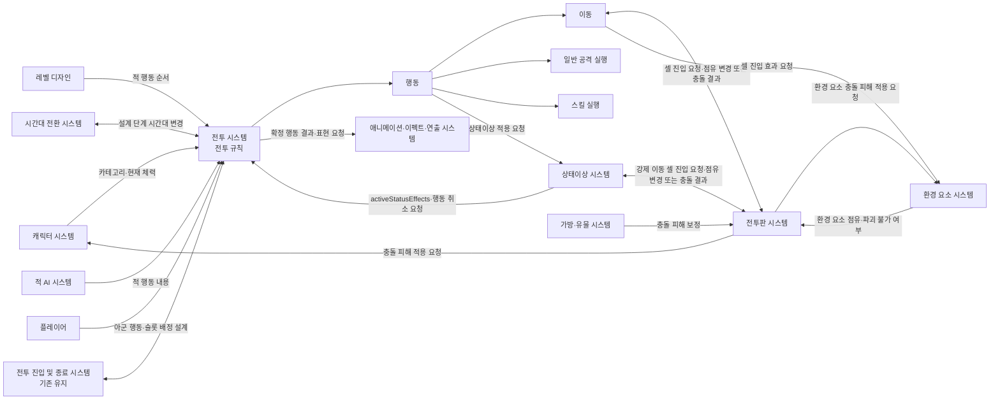
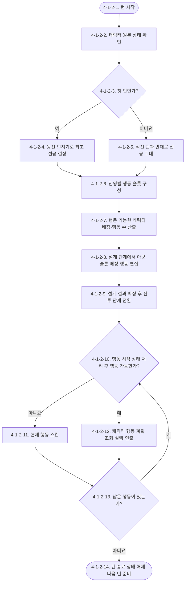
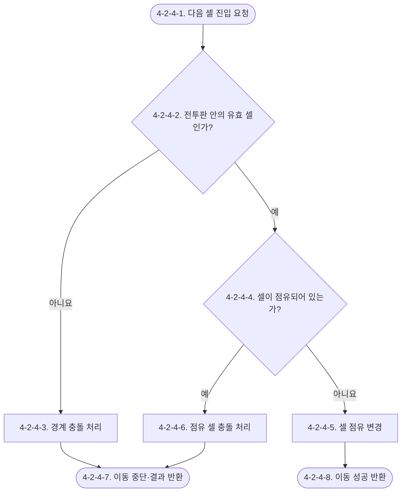
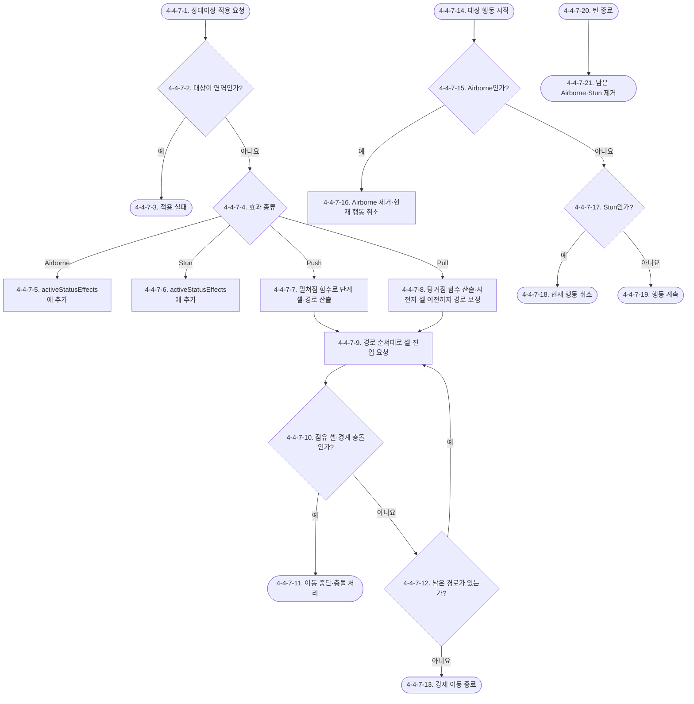

# Waredo 2.0 전투 시스템 기획서

## [확인 필요 목록]

1. 아군 캐릭터의 아군 `actionSlots` 무작위 배정은 전투 최초 한 번만 수행합니까, 매 턴의 설계 단계 시작마다 수행합니까?
2. 양 진영의 행동 가능 캐릭터 수가 다를 때 교차 배치 후 남은 진영의 행동을 뒤에 연속 배치하는 기존 제안 규칙을 유지합니까?
3. 설계 단계의 종료 조건은 모든 아군의 행동·슬롯 배정·시간대 설정 완료입니까, 일부 항목을 정하지 않은 상태에서도 전투 단계로 이동할 수 있습니까?
4. 적 캐릭터의 행동 내용과 대상은 설계 단계에서 플레이어에게 어느 범위까지 공개합니까?
5. `currentHp <= 0`은 행동 스킵 조건으로 직접 사용합니다. 이 상태를 문서와 연출에서 `사망` 또는 `전투불능` 중 어떤 용어로 표시하며 캐릭터 제거는 언제 처리합니까?
6. 한 번의 이동 경로에서 같은 셀을 다시 통과할 수 있으며, 이 경우 셀 진입 효과를 다시 적용합니까?
7. 셀 진입 효과로 이동 중 사망하거나 기절하면 남은 이동을 즉시 중단합니까?
8. 전투판 규격은 `9×9`와 `6×6` 중 어느 것으로 확정합니까?
9. 좌표의 가로축과 세로축은 각각 어느 방향으로 증가합니까?
10. 유물로 충돌 피해가 변할 때 접근 요소와 기존 점유 요소에 하나의 보정값을 공통 적용합니까, 피해를 받는 요소별로 각각 보정합니까?
11. 밀쳐짐·당겨짐 함수의 `F(k)`가 셀 경계 또는 꼭짓점에 정확히 놓이면 어느 셀을 `C(k)`로 선택합니까?
12. 밀쳐짐·당겨짐으로 지나가는 셀의 화염·회복 같은 셀 진입 효과를 적용합니까?
13. 띄워짐 상태에서도 캐릭터가 현재 셀을 계속 점유하고 충돌 대상이 됩니까?
14. 같은 캐릭터에게 띄워짐 또는 기절이 다시 적용될 때 지속 시점을 갱신합니까, 중첩 인스턴스를 추가합니까?
15. 충돌로 이동이 조기 종료된 캐릭터가 생존하면 멈춘 셀에서 계획한 일반 공격·스킬을 계속 실행합니까?
16. 하나의 효과로 아군과 적이 동시에 전멸하면 승리·패배·무승부 중 무엇으로 처리합니까?

## 유의사항

- 이 문서는 `전투 시스템`, `전투판 시스템`, `전투 진입 및 종료 시스템`, `상태이상 시스템`을 함께 다룬다. 전투 진입 및 종료 시스템은 전체를 `[기존 유지]`로 처리한다.
- 현재 신규 기획 범위는 턴의 행동 수, 최초 선공 결정과 이후 선공 교대, 행동 슬롯, 캐릭터별 행동 계획, 수동 이동 경로, 이동 중 셀 진입 효과, 일반 공격·스킬의 실행 순서 제약, 전투판 규격·좌표·점유·충돌, 띄워짐·기절·밀쳐짐·당겨짐 처리다.
- 전투 진입·초기 배치, 승패 판정, 전투 종료·게임 정산, 승리 보상·다음 타일 진행은 신규 기획 범위에 포함하지 않는다.
- 공격·스킬의 개별 수치 계산은 현재 범위에 포함하지 않는다.
- 플레이어는 `Ally` 카테고리의 캐릭터만 조작한다. `NormalEnemy`와 `BossEnemy` 카테고리는 선공 판정에서 하나의 적 진영으로 취급한다.
- `characterCategory`, `currentHp`, `statusImmunityTags`의 단일 원본은 캐릭터 시스템이 소유하고, `activeStatusEffects`의 단일 원본은 상태이상 시스템이 소유한다. 시간대의 상태와 변경 규칙은 시간대 전환 시스템이 소유하며, 적 행동 내용은 적 AI 시스템 또는 레벨 디자인이 제공한다.
- 사용자 최신 결정에 따라 전투 최초 진입 시 양 진영이 각각 50% 확률을 갖는 동전 던지기로 첫 선공을 정하고, 이후 턴부터 선공 진영을 교대한다. 이 규칙은 기존 제안 GDD의 선공 규칙과 일치한다.
- 기존 제안 GDD의 진영 교차 행동 규칙은 확인 필요 2가 확정될 때까지 제안 규칙으로 표시한다.
- 전투 단계의 연출은 확정된 행동 결과를 표시하는 과정이다. 연출 세부 타이밍과 표현 방식은 애니메이션·이펙트·연출 시스템이 소유한다.
- 전투판의 규격·좌표·점유·충돌 규칙은 본 문서 `4-2. 전투판 시스템`이 소유한다. `4-1. 전투 시스템`은 이동 시 다음 셀의 진입을 요청하고 결과를 참조한다.
- 변경하지 않는 기존 동작은 상세 규칙을 다시 작성하지 않고 `[기존 유지]`로 표시한다.
- `[확인 필요 목록]`의 미확정 항목은 임의로 확정하지 않았으며 후속 답변에 따라 갱신해야 한다.

# 1. 기획의도

플레이어가 한 캐릭터의 행동을 즉시 실행하는 대신, 해당 턴에 행동할 아군 전체의 시간대·행동·슬롯 배정을 먼저 설계하게 한다. 전투 최초에 정해진 선공과 이후 교대하는 선공, 레벨 디자인에 따라 배치된 적 순서를 확인하고 아군 슬롯의 캐릭터 배정을 조정함으로써 턴마다 달라지는 행동 흐름에 대응하도록 한다.

# 2. 개발 목적

- 턴을 구성하는 전체 행동 수를 현재 행동 가능한 캐릭터 수로 일관되게 산출한다.
- 선공, 적 캐릭터 배정 기준과 전체 `actionSlots`의 결정 주체를 명확히 한다.
- 설계 단계에서 변경 가능한 항목과 전투 단계에서 사용하는 확정 결과를 구분한다.
- 사망 또는 기절로 행동할 수 없는 캐릭터를 턴 시작 시 제외하고, 전투 도중 행동 불능이 된 캐릭터의 남은 행동을 스킵하는 공통 규칙을 제공한다.
- 전투 규칙의 결과와 연출 시스템의 표현 책임을 분리한다.
- 행동 순서와 캐릭터별 행동 계획을 분리하여 슬롯의 캐릭터 배정을 변경해도 행동 계획이 해당 캐릭터를 따라가게 한다.
- 이동, 일반 공격, 스킬 사용의 허용 순서를 단일 행동 규칙으로 통제한다.
- 모든 위치·경로·타겟 데이터가 같은 셀 좌표 규칙을 사용하도록 한다.
- 점유 셀 또는 전투판 바깥을 향한 이동을 동일한 충돌 규칙으로 처리한다.
- 띄워짐·기절의 종료 시점과 행동 처리 차이를 명확히 한다.
- 밀쳐짐·당겨짐은 두 캐릭터를 잇는 직선 위에 거리 `n`의 목표점을 찍고 목표점이 포함된 셀을 목적지로 산출한다.

## 2.1 시스템 개요: 어떤 시스템인가

전투 진입 및 종료 시스템은 전체를 `[기존 유지]`로 처리한다. 신규 전투 시스템은 사망하지 않고 기절하지 않은 아군과 적을 행동 가능한 캐릭터로 판정해 한 턴의 행동 수를 정한다. 전투 최초 진입 시 동전 던지기로 첫 선공 진영을 결정한 뒤 이후 턴부터 선공을 교대한다. 플레이어는 설계 단계에서 시간대·아군 행동·아군 슬롯의 캐릭터 배정을 조정한다. 각 캐릭터는 이동력만큼 직교 셀을 이어 이동 경로를 그릴 수 있고, 이동 뒤 일반 공격 또는 스킬 중 하나를 선택할 수 있다. 이동 시 전투판 시스템에 셀 진입을 요청하고 점유 변경 또는 충돌 결과를 받는다. 전투 단계가 시작되면 시스템은 `actionSlots`와 캐릭터별 행동 계획을 순차 조회해 결과를 연출한다. 상태이상 시스템은 띄워짐·기절의 행동 시점 처리를 제공하고, 밀쳐짐·당겨짐의 강제 이동 경로를 산출해 전투판 시스템에 셀 진입을 요청한다.

## 2.2 사용자가 한 사이클 동안 하는 일

한 사이클은 한 턴의 시작부터 다음 턴의 설계 단계 진입까지다.

1. 시스템은 현재 행동 가능한 아군과 적을 집계해 이번 턴의 행동 수를 정한다.
2. 전투 첫 턴이면 시스템은 동전 던지기로 첫 선공 진영을 정하고, 이후 턴이면 직전 턴과 반대 진영을 선공으로 정한다.
3. 시스템은 레벨 디자인의 적 순서로 적 슬롯에 캐릭터를 배정하고, 아군 슬롯에는 아군 캐릭터를 무작위로 배정한다.
4. 플레이어는 설계 단계에서 시간대를 변경하고 아군의 행동과 아군 슬롯 사이의 캐릭터 배정을 조정한다.
5. 플레이어는 아군 캐릭터별 이동 경로를 그리고 일반 공격 또는 스킬 중 하나를 설정한다.
6. 플레이어가 설계를 끝내면 전투 단계가 시작된다.
7. 시스템은 설계 단계에서 정해진 행동 순서대로 이동과 주 행동의 결과를 처리하고 연출 시스템을 통해 표시한다.
8. 각 행동 시작 시 상태이상 시스템이 해당 캐릭터의 `Airborne`을 확인한다. `Airborne`이면 상태를 제거하고 현재 행동을 취소하며, 사망 또는 `Stun` 상태인 캐릭터의 아직 실행되지 않은 행동도 스킵한다.
9. 현재 턴의 행동이 끝나면 전투 규칙에 따라 선공 진영을 교대하고 새로운 설계 단계를 준비한다. 다음 턴 시작 시 사망·기절 상태를 다시 판정해 행동 가능한 캐릭터를 집계한다.

## 2.3 핵심 작동 방식

한 턴의 길이는 고정된 행동 횟수가 아니라 현재 행동 가능한 양 진영 캐릭터 수의 합으로 결정된다. 첫 선공은 전투 최초 진입 시 50% 확률의 동전 던지기로 정하고, 이후 턴부터는 직전 턴의 후공 진영이 다음 턴의 선공을 맡는다. 적 캐릭터는 레벨 디자인의 순서대로 적 슬롯에 배정하고, 아군 캐릭터는 아군 슬롯에 무작위로 배정한 뒤 플레이어가 설계 단계에서 아군 슬롯 사이의 배정을 변경한다. 별도의 아군 순서 목록은 저장하지 않고 `actionSlots`를 단일 원본으로 사용한다.

설계 단계와 전투 단계의 가장 큰 차이는 변경 권한이다. 설계 단계에서는 플레이어가 시간대·아군 행동·아군 슬롯의 캐릭터 배정을 변경할 수 있지만, 전투 단계에서는 설계 결과를 바꾸지 않고 정해진 `actionSlots`대로 처리한다. 행동 가능 여부를 나타내는 별도 변수는 두지 않는다. 턴 시작에는 `currentHp`와 `Stun`을 확인해 슬롯을 구성하고, 각 행동 직전에는 `currentHp`, `Airborne`, `Stun`을 직접 확인한다. `currentHp <= 0` 또는 `Stun`이면 행동을 스킵하고, `Airborne`이면 상태를 제거하면서 해당 행동을 취소한다.

행동 순서는 `actionSlots`가 소유하고 행동 내용은 `characterActionPlans`가 캐릭터별로 소유한다. 따라서 플레이어가 두 아군 슬롯의 `characterId`를 교환하면 각 캐릭터의 이동·공격·스킬 계획도 캐릭터와 함께 순서가 바뀐다. 한 캐릭터의 행동은 `이동(선택) → 일반 공격 또는 스킬 중 하나(선택)` 순서만 허용한다. 일반 공격이나 스킬을 사용한 뒤에는 이동할 수 없고, 일반 공격과 스킬을 같은 행동에서 동시에 또는 연속으로 사용할 수 없다.

## 2.4 실제 처리 예시

행동 가능한 아군 2명과 적 2명이 있는 턴을 예로 든다.

1. 아군 2명과 적 2명의 `currentHp`와 `activeStatusEffects`를 직접 확인하며, 네 캐릭터 모두 행동 스킵 조건에 해당하지 않는다.
2. 동전 던지기에서 아군이 선공으로 결정된다.
3. 기존 진영 교차 행동 규칙을 적용하면 아군 슬롯과 적 슬롯이 번갈아 배치된다.
4. 적 캐릭터는 레벨 디자인의 `enemyActionOrder`에 따라 적 슬롯에 배치된다.
5. 아군 캐릭터는 아군 `actionSlots`에 무작위로 배정된다. 모든 배정이 끝난 `actionSlots`가 4개이므로 `turnActionCount`는 4가 되며, 플레이어는 설계 단계에서 두 아군 슬롯의 `characterId`를 서로 바꿀 수 있다.
6. 플레이어가 시간대와 아군 행동을 정하고 설계를 종료하면 전투 단계가 시작된다.
7. 먼저 행동한 적의 결과로 아직 행동하지 않은 아군 한 명의 `currentHp`가 0이 되거나 `activeStatusEffects`에 `Stun`이 추가되면 해당 아군의 행동을 스킵한다.
8. 남은 행동은 기존 `actionSlots`의 순서를 유지한 채 계속 처리한다.
9. 턴 종료 시 남은 `Airborne`과 `Stun`을 제거한다. 다음 계획 단계에서는 갱신된 상태를 기준으로 `currentHp`가 0인 아군을 새로 구성할 `actionSlots`에서 제외한다.

> 확인 필요 2가 변경되면 3단계의 전체 행동 순서 예시도 함께 수정해야 한다.

## 2.5 시스템이 직접 정의하는 것

`4-1. 전투 시스템`의 전투 규칙 모듈은 턴 행동 수, 선공 진영, 전체 행동 순서, 턴 종료 후 선공 교대·다음 설계 단계 진입, 전투 단계와 행동 스킵을 직접 정의한다. 이동 경로도 전투 시스템이 소유한다. `4-2. 전투판 시스템`은 셀 좌표, 점유 상태와 충돌 결과를 소유하며 전투 시스템과 상태이상 시스템의 셀 진입 요청에 결과를 반환한다. `4-3. 전투 진입 및 종료 시스템`은 전체를 `[기존 유지]`로 처리한다. `4-4. 상태이상 시스템`은 `activeStatusEffects`와 띄워짐·기절의 수명 주기, 밀쳐짐·당겨짐의 강제 이동 산출을 소유한다. 캐릭터의 카테고리·현재 체력·상태이상 면역은 캐릭터 시스템을 참조하고, 적 내부 순서는 레벨 디자인을 참조한다.

# 3. 시스템 구조

## 3.1 모듈 구성

| 모듈명 | 핵심 책임 | 입력 | 출력 | 소유 데이터 | 참조 데이터 | 의존 모듈·시스템 |
|---|---|---|---|---|---|---|
| 전투 규칙 | 턴 행동 수, 최초 선공·이후 교대, 행동 슬롯과 캐릭터 배정, 설계·전투 단계, 턴 종료 후 다음 설계 단계 진입과 행동 불능 시 스킵을 통제 | 캐릭터 카테고리·사망·기절 상태, 적 순서, 플레이어 설계 결과, 시간대 변경 결과 | 선공 진영, 캐릭터가 배정된 행동 슬롯, 행동 실행·스킵 요청 | `battlePhase`, `turnIndex`, `firstActingFaction`, `actionSlots`, `currentActionNumber` | `characterId`, `characterCategory`, `currentHp`, `activeStatusEffects`, `enemyActionOrder`, `selectedTimePeriod` | 캐릭터 시스템, 상태이상 시스템, 레벨 디자인, 시간대 전환 시스템, 적 AI 시스템, 애니메이션·이펙트·연출 시스템 |
| 행동 | 행동 슬롯과 캐릭터별 행동 계획을 분리해 저장하고 슬롯 순서대로 실행 요청 | `actionSlots`, 아군 입력, 적 행동 계획, `currentHp`, `activeStatusEffects` | 이동·일반 공격·스킬 중 해당 모듈 실행 요청 | `characterActionPlans`, `mainActionType` | `actionSlots`, `currentHp`, `activeStatusEffects` | 전투 규칙, 이동, 공격, 스킬 사용 |
| 이동 | 직교 수동 경로, 이동력 제한, 셀별 점유와 진입 효과 적용 | `movePath`, `effectiveMoveRange`, `cellOccupants`, `cellEntryEffects` | 전투판 시스템 셀 진입 요청, 셀 이동 결과, 진입 효과 적용 요청 | 이동 중인 경로 진행 상태 | 캐릭터 시스템, 전투판 시스템, 환경 요소 시스템 | 행동, 전투판 시스템, 환경 요소 시스템 |
| 일반 공격 실행 | 도착 위치에서 저장한 타겟 데이터를 재검증하고 일반 공격 결과를 처리 | `mainActionType`, 일반 공격 계획, 실제 점유 셀, 일반 공격 정의 | 일반 공격 성공 또는 행동 취소 | 없음 | 캐릭터 시스템의 일반 공격 정의 | 행동, 캐릭터 시스템 |
| 스킬 실행 | 도착 위치에서 저장한 타겟 데이터를 재검증하고 스킬 효과·쿨타임 결과를 처리 | `mainActionType`, 스킬 계획, 실제 점유 셀, 스킬 정의 | 스킬 성공 또는 쿨타임 미변경 행동 취소 | 없음 | 캐릭터 시스템의 스킬 정의·쿨타임 | 행동, 캐릭터 시스템 |
| 전투 FSM | 전투 수명 주기·턴·행동 상태를 연결하고 효과 해결·연출 대기를 호출 | 전투 진입, 설계 완료, 행동 슬롯, 효과·연출 완료 결과 | 다음 상태 또는 전투 종료 전이 | FSM 현재 상태, 효과 큐·반응 큐 | 전투 규칙·행동·상태이상·전투판·연출 결과 | 본 문서의 전 시스템, 가방·유물 시스템, 애니메이션·이펙트·연출 시스템 |
| 전투판 구성 | 정사각형 전투판 규격과 셀 좌표 계산 규칙 정의 | 전투판 규격, 진입 요청 좌표 | `cellCoordinate`, 유효 셀 여부 | `cellCoordinate` | 없음 | 셀·점유, 충돌, 전투 시스템 |
| 셀·점유 | 캐릭터·환경 요소의 셀 점유 상태 관리 | 진입 요청 좌표, 셀 진입·이탈·제거 요청 | 점유 조회·변경 결과 | `cellOccupants` | 캐릭터·환경 요소 ID와 유형 | 전투판 구성, 충돌, 전투 시스템, 환경 요소 시스템 |
| 충돌 | 점유 셀 또는 전투판 경계를 향한 이동 중단과 충돌 피해 요청 | 진입 요청 좌표, 유효 셀 여부, 점유 정보, 환경 요소 파괴 불가 여부, 유물 충돌 피해 보정 | 이동 중단 위치, 충돌 대상, 피해 적용 요청 | `collisionBaseDamage` | `cellOccupants`, `isIndestructibleEnvironment`, `collisionDamageModifier` | 전투판 구성, 셀·점유, 전투 시스템, 캐릭터 시스템, 환경 요소 시스템, 가방·유물 시스템 |
| 전투 진입·초기 배치 `[기존 유지]` | 기존 유지 | - | - | - | - | - |
| 승패 판정 `[기존 유지]` | 기존 유지 | - | - | - | - | - |
| 전투 종료·게임 정산 `[기존 유지]` | 기존 유지 | - | - | - | - | - |
| 승리 보상·다음 타일 진행 `[기존 유지]` | 기존 유지 | - | - | - | - | - |
| 상태이상 공통 처리 | 상태이상 적용·면역 확인·해제 시점 통제 | 상태이상 적용 요청, 대상 면역 데이터, 행동 시작·턴 종료 이벤트 | 적용 성공·실패, 상태 해제 결과 | `activeStatusEffects` | 캐릭터 시스템의 상태이상 면역 | 캐릭터 시스템, 전투 규칙, 행동 |
| 띄워짐·기절 | 띄워짐의 다음 행동 시작 전 해제와 기절의 다음 행동 취소 처리 | `activeStatusEffects`, 대상 행동 시작, 턴 종료 | 상태 해제 또는 행동 취소 요청 | 상태이상 효과 인스턴스 | `actionSlots`, `battlePhase` | 상태이상 공통 처리, 전투 규칙, 행동 |
| 밀쳐짐 | 두 캐릭터를 잇는 직선을 대상 바깥쪽으로 `n`칸 연장한 목표점의 셀까지 강제 이동 | 시전자·대상 ID, 두 셀 좌표, `forcedMoveDistance` | 강제 이동 셀 진입 요청 | 없음 | 전투판 좌표·점유·충돌 | 상태이상 공통 처리, 전투판 시스템 |
| 당겨짐 | 두 캐릭터를 잇는 직선에서 시전자 쪽으로 `n`칸 떨어진 목표점의 셀까지 강제 이동 | 시전자·대상 ID, 두 셀 좌표, `forcedMoveDistance` | 강제 이동 셀 진입 요청 | 없음 | 전투판 좌표·점유·충돌 | 상태이상 공통 처리, 전투판 시스템 |

## 3.2 시스템 관계



# 4. 시스템 상세 구조

## 4-1. 전투 시스템

전투 시스템은 `전투 규칙`이 한 턴의 구성과 설계·전투 단계의 진행을 통제하고, `행동`이 캐릭터별 계획을 조회해 `이동`, `공격`, `스킬 사용` 모듈을 순서대로 연결하는 구조다. 이동은 전투판 시스템에 셀 진입을 요청하고 점유 변경 또는 충돌 결과를 받는다. 공격·스킬의 내부 계산은 각 소유 시스템의 후속 기획 범위로 남긴다.

### 4-1-1. 전투 규칙

#### 사용 변수·용어

| 변수·용어 | 이 모듈에서의 의미 | 값 형태 | 소유·성격 |
|---|---|---|---|
| `battlePhase` | 현재 전투 진행 단계 | 열거값 | 전투 규칙 소유·상태 |
| `turnIndex` | 현재 전투의 턴 번호 | 정수 | 전투 규칙 소유·상태 |
| `characterId` | 전투 캐릭터를 식별하는 값 | ID | 캐릭터 시스템 > 캐릭터 정의 모듈 소유·참조 |
| `characterCategory` | 일반 적·보스 적·아군을 구분하는 분류 | 열거값 | 캐릭터 시스템 > 캐릭터 정의 모듈 소유·참조 |
| `currentHp` | 캐릭터의 현재 체력 | 정수 | 캐릭터 시스템 > 파라미터 모듈 소유·참조 |
| `activeStatusEffects` | 캐릭터에게 현재 적용 중인 상태이상 인스턴스 | 목록 | 상태이상 시스템 > 활성 상태이상 목록 소유·참조 |
| `turnActionCount` | 현재 턴의 전체 행동 수 | 정수 | 전투 규칙 산출·파생 |
| `firstActingFaction` | 현재 턴의 1번 행동을 갖는 진영 | 열거값 | 전투 규칙 소유·상태 |
| `enemyActionOrder` | 레벨 디자인이 정한 적의 진영 내부 순서 | ID 목록 | 레벨 디자인 > 적 배치·행동 순서 데이터 소유·참조 |
| `actionSlots` | 현재 턴의 행동 번호·진영·배정 `characterId`를 함께 관리하는 전체 행동 순서 | 행동 슬롯 목록 | 전투 규칙 소유·상태·캐릭터 배정 단일 원본 |
| `selectedTimePeriod` | 설계 단계에서 적용 대상으로 정한 시간대 | 시간대 값 | 시간대 전환 시스템 > 설계 단계 시간대 선택 결과 소유·참조 |
| `currentActionNumber` | 전투 단계에서 현재 처리 중인 행동 번호 | 정수 | 전투 규칙 소유·상태 |

#### 4-1-1-1. 목적과 책임

`전투 규칙`은 `currentHp > 0`이고 `activeStatusEffects`에 `Stun`이 없는 캐릭터를 기준으로 `actionSlots`를 구성하고, 첫 턴에는 동전 던지기로 선공을 결정하며 이후 턴에는 선공을 교대한다. 적 슬롯에는 `enemyActionOrder`에 따라 적을 배정하고 아군 슬롯에는 아군을 무작위 배정한다. 설계 단계에서는 아군 슬롯 사이의 캐릭터 배정과 각 아군의 행동을 변경할 수 있다. `battlePhase`가 `Combat`으로 전환되면 현재 `actionSlots`와 캐릭터별 행동 계획의 편집을 차단하고 그대로 조회한다. 각 행동 직전에도 같은 원본값을 확인하며 조건을 충족하지 못하면 현재 행동을 스킵한다.

#### 4-1-1-2. 입력·처리·출력

| 구분 | 내용 |
|---|---|
| 입력 | `characterId`, `characterCategory`, `currentHp`, `activeStatusEffects`, `enemyActionOrder`, `selectedTimePeriod`, 적 행동 내용, 플레이어의 아군 행동·슬롯 배정 변경 |
| 처리 | `currentHp`와 `activeStatusEffects` 직접 확인, `turnActionCount` 산출, 최초 동전 던지기와 이후 선공 교대, 진영별 순서 배치, 설계 종료 후 편집 차단, 행동 순차 처리, 행동 불능 캐릭터의 행동 스킵 |
| 출력 | `firstActingFaction`, `actionSlots`, 현재 행동 실행 요청 또는 스킵 결과, 연출 시스템 표현 요청 |
| 소유 데이터 | `battlePhase`, `turnIndex`, `firstActingFaction`, `actionSlots`, `currentActionNumber` |
| 참조 데이터 | `characterId`, `characterCategory`, `currentHp`, `activeStatusEffects`, `enemyActionOrder`, `selectedTimePeriod` |
| 의존 모듈·시스템 | 캐릭터 시스템, 상태이상 시스템, 레벨 디자인, 시간대 전환 시스템, 적 AI 시스템, 애니메이션·이펙트·연출 시스템 |
| 실패·취소·예외 | 설계 종료 조건은 `[확인 필요]`다. 행동 직전 `currentHp <= 0`이거나 `activeStatusEffects`에 `Stun`이 있으면 현재 행동을 스킵하고 다른 캐릭터에게 양도하지 않는다. |

외부에서 참조하는 변수는 아래 원본에서 가져온다.

| 참조 변수 | 가져오는 시스템 | 원본 모듈·데이터 | 전투 규칙에서의 사용 | 원본 문서 |
|---|---|---|---|---|
| `characterId` | 캐릭터 시스템 | 4-1-1. 캐릭터 정의 모듈 | 전투 참가자, 행동 순서와 행동자의 식별 | `확정/시스템/Waredo_2.0_캐릭터_시스템_기획서.md` |
| `characterCategory` | 캐릭터 시스템 | 4-1-1. 캐릭터 정의 모듈 | `Ally`, `NormalEnemy`, `BossEnemy`를 아군·적 진영으로 구분 | `확정/시스템/Waredo_2.0_캐릭터_시스템_기획서.md` |
| `currentHp` | 캐릭터 시스템 | 4-1-2. 파라미터 모듈·4-1-7. 변수 소유권 모듈 | 0 이하인지 직접 확인해 행동 스킵 | `확정/시스템/Waredo_2.0_캐릭터_시스템_기획서.md` |
| `activeStatusEffects` | 상태이상 시스템 | 캐릭터별 활성 상태이상 인스턴스 목록 | `Stun` 존재 여부를 직접 확인해 행동 스킵 | 본 문서 4-4; 소유권은 캐릭터 시스템 기획서 4-1-7에서 확인 |
| `enemyActionOrder` | 레벨 디자인 | 전투별 적 배치·행동 순서 데이터 | 적 캐릭터를 적 행동 슬롯에 배치 | 레벨 디자인 문서 `[확인 필요]` |
| `selectedTimePeriod` | 시간대 전환 시스템 | 설계 단계의 시간대 선택 결과 | 전투 단계에서 사용할 시간대 참조 | `제안/시스템/Waredo_2.0_GDD_시간대_전환_시스템.md` |

#### 4-1-1-3. 턴과 행동 수 규칙

- 한 턴은 설계 단계와 전투 단계로 구성한다.
- 행동 가능 여부를 나타내는 별도 파생 변수는 만들지 않는다.
- 턴 시작 시 전체 전투 캐릭터의 `currentHp`와 `activeStatusEffects`를 직접 확인한다.
- `actionSlots`를 구성할 때 `currentHp > 0`이고 `activeStatusEffects`에 `Stun`이 없는 캐릭터만 배정한다.
- 모든 캐릭터 배정이 끝나면 `turnActionCount`를 `actionSlots`의 전체 개수로 산출한다.
- 하나의 행동 가능 캐릭터는 현재 턴의 `actionSlots`에 정확히 한 번 배치한다.

```text
행동 슬롯 포함 조건 = currentHp > 0 AND activeStatusEffects에 Stun 없음
```

```text
turnActionCount = actionSlots의 개수
```

#### 4-1-1-4. 선공 규칙

- `turnIndex`가 1인 전투 첫 턴에는 동전 던지기를 한 번 수행한다.
- 첫 턴의 `firstActingFaction`은 50% 확률로 아군 또는 적이 된다.
- `turnIndex`가 2 이상이면 동전을 다시 던지지 않고 직전 턴의 후공 진영을 `firstActingFaction`으로 정한다.
- 이에 따라 아군과 적은 턴마다 번갈아 선공한다.
- `NormalEnemy`와 `BossEnemy`는 모두 적 진영으로 판정한다.
- 동전 결과는 해당 턴의 설계 단계가 시작되기 전에 정한다.

#### 4-1-1-5. 행동 슬롯 캐릭터 배정 규칙

- `enemyActionOrder`는 레벨 디자인이 정한다.
- 일반 적과 보스는 모두 `enemyActionOrder`에 포함될 수 있으며, 해당 순서대로 적 `actionSlots`에 배정한다.
- 아군 캐릭터는 아군 `actionSlots`에 무작위로 한 명씩 배정한다.
- 플레이어는 설계 단계에서 아군 `actionSlots`에 배정된 `characterId`를 아군 슬롯끼리 자유롭게 교환할 수 있다.
- 플레이어는 적 캐릭터의 `enemyActionOrder`를 변경할 수 없다.
- 아군 슬롯의 무작위 캐릭터 배정 주기는 `[확인 필요]`다.
- 별도의 아군 순서 목록은 저장하지 않으며 `actionSlots`의 `characterId` 배정을 단일 원본으로 사용한다.

#### 4-1-1-6. 전체 행동 순서 규칙

- `firstActingFaction`의 캐릭터를 1번 행동에 배치한다.
- 이후 양 진영의 캐릭터를 교차해 `actionSlots`에 배치한다.
- 양 진영의 행동 가능 캐릭터 수가 다를 때 남은 캐릭터의 배치 규칙은 `[확인 필요]`다.
- 설계 단계에서 아군 슬롯의 캐릭터 배정을 변경하면 해당 아군 `actionSlots`의 `characterId`만 서로 교환한다.
- 플레이어의 순서 변경은 `firstActingFaction`, 적 슬롯과 `turnActionCount`를 변경하지 않는다.

#### 4-1-1-7. 설계 단계 규칙

- `battlePhase`가 `Design`일 때 플레이어는 `Ally` 카테고리 캐릭터를 조작할 수 있다.
- 설계 단계에서 `selectedTimePeriod`, 아군 행동과 아군 `actionSlots`의 캐릭터 배정을 변경할 수 있다.
- 적 행동 내용은 적 AI 시스템이 제공하며 공개 범위는 `[확인 필요]`다.
- 설계 단계의 종료 조건은 `[확인 필요]`다.
- 설계가 종료되면 `battlePhase`를 `Combat`으로 전환하고 현재 시간대·아군 행동 계획·`actionSlots`의 편집을 차단한다. 별도의 턴 계획 복제 객체는 만들지 않는다.
- 별도의 `계획 검증·잠금` 단계를 만들지 않는다.

#### 4-1-1-8. 전투 단계 규칙

- `battlePhase`가 `Combat`이면 `currentActionNumber`가 가리키는 `actionSlots`의 행동을 순서대로 처리한다.
- 전투 단계에서는 현재 시간대·아군 행동 계획·`actionSlots` 배정을 변경하지 않는다.
- 각 행동 시작 이벤트와 턴 종료 이벤트는 상태이상 시스템에 전달한다.
- 각 행동 결과는 애니메이션·이펙트·연출 시스템에 전달해 표시한다.
- 구체적인 행동 효과의 판정과 연출 타이밍은 해당 전투 하위 시스템과 연출 시스템에서 정의한다.

#### 4-1-1-9. 행동 가능 판정과 행동 스킵 규칙

- 턴 시작 시 `currentHp <= 0`이거나 `activeStatusEffects`에 `Stun`이 있는 캐릭터는 현재 턴의 `actionSlots`에서 제외한다.
- 전투 단계에서는 각 행동 시작 시 `currentHp`와 `activeStatusEffects`를 다시 조회한다.
- `Airborne`이 있으면 상태이상 시스템이 이를 제거하고 해당 행동을 취소한다.
- 현재 턴에서 `currentHp <= 0`이거나 `activeStatusEffects`에 `Stun`이 있는 캐릭터에게 아직 실행되지 않은 행동이 있으면 해당 행동을 스킵한다.
- 스킵된 행동을 다른 캐릭터에게 배정하지 않는다.
- 사망 또는 기절로 인해 현재 턴의 `actionSlots`를 재구성하거나 뒤 행동의 번호를 변경하지 않는다.
- 현재 턴의 모든 행동이 끝나면 상태이상 시스템에 턴 종료 이벤트를 전달해 남은 `Airborne`과 `Stun`을 제거한다.
- 다음 계획 단계에서는 상태 해제 결과와 `currentHp`를 직접 확인하고 조건을 충족하지 못한 캐릭터를 새로 구성할 `actionSlots`에서 제외한다. 적 배정 시에는 `enemyActionOrder`에서 해당 캐릭터를 건너뛴다.

### 4-1-2. 전투 시스템 처리 순서



| 번호 | 처리 설명 |
|---|---|
| 4-1-2-1 | 현재 턴의 전투 규칙 처리를 시작한다. |
| 4-1-2-2 | 전체 전투 캐릭터의 `currentHp`와 `activeStatusEffects`를 직접 확인한다. 별도 행동 가능 캐릭터 목록은 만들지 않는다. |
| 4-1-2-3 | `turnIndex`가 1인 첫 턴인지 확인한다. |
| 4-1-2-4 | 첫 턴이면 50% 확률의 동전 던지기로 최초 `firstActingFaction`을 결정한다. |
| 4-1-2-5 | 이후 턴이면 직전 턴의 후공 진영으로 `firstActingFaction`을 교대한다. |
| 4-1-2-6 | `firstActingFaction`과 양 진영의 행동 가능 인원으로 진영별 `actionSlots`를 구성한다. |
| 4-1-2-7 | `currentHp > 0`이고 `activeStatusEffects`에 `Stun`이 없는 캐릭터만 슬롯에 배정한다. 적은 `enemyActionOrder`를 따르고 아군은 무작위로 배정한 뒤 `actionSlots` 개수로 `turnActionCount`를 산출한다. |
| 4-1-2-8 | 플레이어가 시간대·아군 행동과 아군 `actionSlots` 사이의 캐릭터 배정을 변경하는 설계 단계를 진행한다. |
| 4-1-2-9 | 설계가 종료되면 `battlePhase`를 `Combat`으로 전환하고 현재 시간대·아군 행동 계획·`actionSlots`의 편집을 차단한다. |
| 4-1-2-10 | 행동 시작 시 `currentHp`와 `activeStatusEffects`를 다시 조회한다. `Airborne`이 있으면 이를 제거하고 현재 행동을 취소한다. |
| 4-1-2-11 | `Airborne`으로 취소되지 않았더라도 `currentHp <= 0`이거나 `activeStatusEffects`에 `Stun`이 있으면 현재 행동을 실행하지 않고 스킵한다. |
| 4-1-2-12 | 두 스킵 조건에 해당하지 않으면 `characterId`로 행동 계획을 조회하고 이동 뒤 일반 공격 또는 스킬 중 하나를 실행한 다음 연출 시스템에 표현을 요청한다. |
| 4-1-2-13 | `actionSlots`에 처리할 다음 행동이 남았는지 확인한다. |
| 4-1-2-14 | 남은 행동이 없으면 턴 종료 이벤트로 남은 `Airborne`·`Stun`을 제거하고 다음 턴을 준비한다. 다음 계획 단계에서는 갱신된 원본 상태로 행동 순서를 구성한다. |

### 4-1-3. 기획 변수

| 변수명 | 기획상 의미 | 값 형태 | 초기값·허용값 | 소유 모듈 | 사용 위치(번호) | 성격 | 산출·갱신 규칙 | 비고 |
|---|---|---|---|---|---|---|---|---|
| `battlePhase` | 현재 전투 진행 단계 | 열거값 | `Design`, `Combat` | 전투 규칙 | 4-1-1 | 상태 | 턴 순서에 따라 전환 | 전투 진입·종료 단계는 후속 기획 |
| `turnIndex` | 현재 전투의 턴 번호 | 정수 | 1 이상, 최초 1 | 전투 규칙 | 4-1-1, 4-1-1-4, 4-1-2 | 상태 | 한 턴의 모든 행동이 끝나면 1 증가 | 첫 턴 동전 여부 판정에 사용 |
| `characterId` | 전투 캐릭터 식별값 | ID | 중복 불가 | 캐릭터 시스템 > 캐릭터 정의 모듈 | 4-1-1 | 참조 | 캐릭터 정의에서 설정 | `확정/시스템/Waredo_2.0_캐릭터_시스템_기획서.md` 4-1-1 참조 |
| `characterCategory` | 캐릭터의 일반 적·보스 적·아군 분류 | 열거값 | `NormalEnemy`, `BossEnemy`, `Ally` | 캐릭터 시스템 > 캐릭터 정의 모듈 | 4-1-1-2, 4-1-1-4~5, 4-1-1-7 | 참조 | 캐릭터 정의에서 조회 | 같은 문서 4-1-1 참조; 두 적 카테고리는 적 진영으로 묶음 |
| `currentHp` | 캐릭터의 현재 체력 | 정수 | `0~effectiveMaxHp` | 캐릭터 시스템 > 파라미터 모듈 | 4-1-1-2 | 참조 | 피해·회복 결과로 캐릭터 시스템이 갱신 | 같은 문서 4-1-2·4-1-7 참조; 사망 대응은 확인 필요 5 |
| `activeStatusEffects` | 현재 적용 중인 상태이상 인스턴스 | 목록 | 0개 이상 | 상태이상 시스템 > 활성 상태이상 목록 | 4-1-1, 4-1-1-3, 4-1-1-9, 4-1-2 | 참조 | 상태이상 시스템만 생성·변경·제거 | 본 문서 4-4; 캐릭터 기획서 4-1-7에서 소유권 확인 |
| `turnActionCount` | 현재 턴의 전체 행동 수 | 정수 | 0 이상 | 전투 규칙 | 4-1-1-3, 4-1-1-6, 4-1-2 | 파생 | 구성이 끝난 `actionSlots`의 개수 | 별도 행동 가능 캐릭터 목록을 만들지 않음 |
| `firstActingFaction` | 현재 턴의 선공 진영 | 열거값 | `Ally`, `Enemy` | 전투 규칙 | 4-1-1-4, 4-1-1-6, 4-1-2 | 상태 | 첫 턴에는 50% 동전 던지기, 이후 턴에는 직전 턴의 반대 진영으로 갱신 | 턴마다 교대 |
| `enemyActionOrder` | 레벨 디자인이 정한 적 내부 순서 | ID 목록 | 행동 가능한 적, 중복 없음 | 레벨 디자인 > 적 배치·행동 순서 데이터 | 4-1-1-5~6, 4-1-1-9, 4-1-2 | 참조 | 레벨 디자인 원본에서 조회 후 `currentHp <= 0`이거나 `Stun` 상태인 캐릭터 제외 | 원본 레벨 디자인 문서 확인 필요; 일반 적·보스 포함 |
| `actionSlots` | 행동 번호·진영·배정 캐릭터를 포함하는 현재 턴의 실행 순서 | 행동 슬롯 목록 | `turnActionCount`개, 캐릭터 중복 배정 불가 | 전투 규칙 | 4-1-1, 4-1-1-5~9, 4-1-2 | 상태 | 선공과 진영별 인원으로 슬롯을 생성하고 적은 `enemyActionOrder`, 아군은 무작위로 `characterId`를 배정한 뒤 설계 단계에서 아군 슬롯끼리 교환 | 캐릭터 배정 단일 원본; 잔여 인원 규칙 확인 필요 2 |
| `selectedTimePeriod` | 설계 단계에서 정한 적용 시간대 | 시간대 값 | 시간대 시스템 허용값 | 시간대 전환 시스템 > 설계 단계 시간대 선택 | 4-1-1-7, 4-1-2 | 참조 | 시간대 전환 시스템의 선택 결과를 조회 | `제안/시스템/Waredo_2.0_GDD_시간대_전환_시스템.md` 참조; 효과·비용도 해당 시스템 소유 |
| `currentActionNumber` | 현재 처리 중인 행동 번호 | 정수 | `actionSlots` 범위 | 전투 규칙 | 4-1-1, 4-1-1-8, 4-1-2 | 상태 | 전투 단계에서 행동 처리 후 다음 번호로 진행 | 행동 스킵 시에도 진행 |
| `characterActionPlans` | 캐릭터별 이동과 주 행동 계획 | 캐릭터 ID별 계획 목록 | 캐릭터당 최대 1개 | 행동 | 4-1-4 | 상태 | 아군은 플레이어, 적군은 적 AI·레벨 디자인이 작성하고 `characterId`로 조회 | 슬롯이 아니라 캐릭터에 귀속 |
| `movePath` | 이동 시작 셀을 제외한 순차 이동 경로 | 셀 좌표 목록 | 0개 이상, 최대 `effectiveMoveRange`개 | 행동 | 4-1-4, 4-1-5 | 상태 | 전투판 시스템의 `cellCoordinate` 규칙에 따라 직교 인접 셀을 순서대로 추가 | 대각선 연결 불가 |
| `mainActionType` | 이동 뒤 실행할 주 행동 종류 | 열거값 | `None`, `NormalAttack`, `Skill` | 행동 | 4-1-4~7 | 상태 | 캐릭터별 계획에서 하나만 선택 | 공격·스킬 동시·연속 사용 불가 |
| `actionId` | 선택한 일반 공격 또는 스킬 정의 식별값 | ID 또는 없음 | `mainActionType`에 대응 | 행동 | 4-1-4, 4-1-6~7 | 상태 | 주 행동 선택 시 해당 정의 ID 저장 | 원본 정의는 캐릭터 시스템 소유 |
| `targetCharacterId` | `InRangeTarget` 행동에서 저장한 대상 캐릭터 | 캐릭터 ID 또는 없음 | 대상형 행동에서 캐릭터 1명 | 행동 | 4-1-4, 4-1-6~7 | 상태 | 대상 캐릭터 선택 시 저장 | 실행 시 대상의 현재 셀을 조회해 범위와 비교 |
| `targetCell` | `CellSelect` 행동에서 저장한 대상 셀 | 셀 좌표 또는 없음 | 전투판 위 셀 1개 | 행동 | 4-1-4, 4-1-6~7 | 상태 | 전투판 시스템의 `cellCoordinate` 규칙에 따라 선택 셀 좌표 저장 | 실행 시 도착 위치 기준 범위와 비교 |
| `targetDirection` | `Directional` 행동에서 저장한 방향 | 방향 또는 없음 | `Up`, `Down`, `Left`, `Right` | 행동 | 4-1-4, 4-1-6~7 | 상태 | 방향 선택 시 저장 | 실행 시 도착 위치에서 해당 방향 사용 |
| `effectiveMoveRange` | 현재 캐릭터가 한 행동에서 이동 가능한 셀 수 | 정수 | 캐릭터 시스템 허용 범위 | 캐릭터 시스템 > 파라미터 모듈 | 4-1-5 | 참조 | 캐릭터 시스템의 현재 이동력 조회 | 캐릭터 시스템 기획서 참조 |
| `cellOccupants` | 각 셀을 현재 점유하는 캐릭터 또는 환경 요소 | 셀별 점유 정보 | 비점유 또는 점유 요소 1개 | 전투판 시스템 > 셀·점유 모듈 | 4-1-5~7 | 참조 | 전투판 시스템의 점유 결과를 조회 | 본 문서 4-2-2 참조 |
| `cellEntryEffects` | 캐릭터가 셀에 진입할 때 적용할 효과 | 효과 목록 | 0개 이상 | 환경 요소 시스템 > 셀 진입 효과 | 4-1-5 | 참조 | 셀 진입 시 환경 요소 시스템에서 조회 | 환경 요소 문서 `[작성 전]` |
| `normalAttackTargetingType` | 일반 공격의 저장 데이터 선택 기준 | 열거값 | `InRangeTarget`, `CellSelect`, `Directional` | 캐릭터 시스템 > 일반 공격 정의 모듈 | 4-1-6 | 참조 | 일반 공격 정의에서 조회 | 캐릭터 시스템 기획서 4-1-5 |
| `normalAttackRangePatternId` | 도착 위치에서 펼칠 일반 공격 범위 패턴 | ID | 일반 공격별 필수 | 캐릭터 시스템 > 일반 공격 정의 모듈 | 4-1-6 | 참조 | 일반 공격 정의에서 조회 | 같은 문서 4-1-5 |
| `normalAttackAffectedCellPatternId` | 범위 검증 성공 후 실제 영향 셀 패턴 | ID 또는 없음 | 타겟팅 유형별 규칙 | 캐릭터 시스템 > 일반 공격 정의 모듈 | 4-1-6 | 참조 | 일반 공격 정의에서 조회 | 같은 문서 4-1-5 |
| `normalAttackValidTargetTeam` | 일반 공격의 유효 대상 진영 | 열거값 | `Enemy`, `Ally`, `All` | 캐릭터 시스템 > 일반 공격 정의 모듈 | 4-1-6 | 참조 | 일반 공격 정의에서 조회 | 같은 문서 4-1-5 |
| `normalAttackDamage` | 일반 공격의 보정 전 기본 피해 | 정수 | 0 이상 | 캐릭터 시스템 > 일반 공격 정의 모듈 | 4-1-6 | 참조 | 범위 검증 성공 후 피해 계산 입력으로 사용 | 같은 문서 4-1-2·4-1-5 |
| `skillTargetingType` | 스킬의 저장 데이터 선택 기준 | 열거값 | `InRangeTarget`, `CellSelect`, `Directional` | 캐릭터 시스템 > 스킬 정의 모듈 | 4-1-7 | 참조 | 스킬 정의에서 조회 | 같은 문서 4-1-6 |
| `skillRangePatternId` | 도착 위치에서 펼칠 스킬 범위 패턴 | ID | 스킬별 필수 | 캐릭터 시스템 > 스킬 정의 모듈 | 4-1-7 | 참조 | 스킬 정의에서 조회 | 같은 문서 4-1-6 |
| `skillAffectedCellPatternId` | 범위 검증 성공 후 실제 영향 셀 패턴 | ID 또는 없음 | 타겟팅 유형별 규칙 | 캐릭터 시스템 > 스킬 정의 모듈 | 4-1-7 | 참조 | 스킬 정의에서 조회 | 같은 문서 4-1-6 |
| `skillEffects` | 성공한 스킬이 순서대로 실행할 효과 | 효과 목록 | 1개 이상 | 캐릭터 시스템 > 스킬 정의 모듈 | 4-1-7 | 참조 | 스킬 정의의 작성 순서대로 실행 요청 | 같은 문서 4-1-6 |
| `effectiveCooldownMax` | 스킬 사용 성공 시 설정할 쿨타임 | 정수 | 1 이상 | 캐릭터 시스템 > 파라미터 모듈 | 4-1-7 | 참조 | 스킬 원본과 보정으로 산출 | 같은 문서 4-1-2·4-1-6 |
| `cooldownRemaining` | 현재 남은 스킬 쿨타임 | 정수 | `0~effectiveCooldownMax` | 전투 스킬 쿨타임 모듈 | 4-1-7 | 상태 참조 | 사용 성공 시 설정하고 범위 실패 시 유지 | 같은 문서 4-1-6·4-1-7 |

### 4-1-4. 행동

#### 사용 변수·용어

| 변수·용어 | 이 모듈에서의 의미 | 값 형태 | 소유·성격 |
|---|---|---|---|
| `actionSlots` | 행동 번호·진영·배정 `characterId`만 저장하는 실행 순서 | 행동 슬롯 목록 | 전투 규칙 소유·참조 |
| `characterActionPlans` | `characterId`로 조회하는 캐릭터별 행동 계획 | 캐릭터 ID별 계획 목록 | 행동 소유·상태 |
| `movePath` | 캐릭터가 순서대로 통과할 셀 | 셀 좌표 목록 | 행동 소유·상태; 좌표 규칙은 전투판 시스템 참조 |
| `mainActionType` | 이동 뒤 실행할 일반 공격·스킬·없음 중 하나 | 열거값 | 행동 소유·상태 |
| `actionId` | 일반 공격 또는 스킬 정의 식별값 | ID 또는 없음 | 행동 소유·상태 |
| `targetCharacterId` | 대상형 행동에서 저장한 캐릭터 | 캐릭터 ID 또는 없음 | 행동 소유·상태 |
| `targetCell` | 타일 선택형 행동에서 저장한 셀 | 셀 좌표 또는 없음 | 행동 소유·상태 |
| `targetDirection` | 방향성 행동에서 저장한 방향 | 방향 또는 없음 | 행동 소유·상태 |
| `currentHp` | 행동 캐릭터의 현재 체력 | 정수 | 캐릭터 시스템 소유·참조 |
| `activeStatusEffects` | 행동 캐릭터에게 적용 중인 상태이상 | 목록 | 상태이상 시스템 소유·참조 |

#### 4-1-4-1. 행동 슬롯 설명

`actionSlots`는 이번 턴에 **몇 번째로, 어느 진영의 어떤 캐릭터가 행동하는지**를 정하는 실행 순서다. 슬롯은 행동 내용을 저장하지 않으며 아래 정보만 가진다.

| 슬롯 정보 | 설명 |
|---|---|
| `actionNumber` | 현재 턴에서 실행할 순번 |
| `faction` | 해당 순번에 행동할 진영 |
| `characterId` | 해당 순번에 배정된 캐릭터 |

- 하나의 슬롯에는 하나의 `characterId`만 배정한다.
- 플레이어가 아군 행동 순서를 바꾸는 것은 아군 슬롯끼리 `characterId`를 교환하는 처리다.
- 슬롯에는 `movePath`, `mainActionType`, `actionId`, `targetCharacterId`, `targetCell`, `targetDirection`을 저장하지 않는다.
- 따라서 행동 순서를 변경해도 캐릭터의 행동 내용이 이전 슬롯에 남지 않는다.

#### 4-1-4-2. 캐릭터 플랜 설명

`characterActionPlans`는 **각 캐릭터가 자신의 행동 차례에 무엇을 할지** 저장하는 캐릭터별 플랜이다. 각 플랜은 `characterId`에 귀속되며 다음 정보를 가진다.

| 플랜 정보 | 설명 |
|---|---|
| `characterId` | 플랜을 소유하는 캐릭터 |
| `movePath` | 캐릭터가 순서대로 이동할 셀. 이동하지 않으면 빈 목록 |
| `mainActionType` | `None`, `NormalAttack`, `Skill` 중 하나 |
| `actionId` | 사용할 일반 공격 또는 스킬 정의 ID |
| `targetCharacterId` | `InRangeTarget`이면 저장하는 대상 캐릭터 ID |
| `targetCell` | `CellSelect`이면 저장하는 대상 셀 좌표 |
| `targetDirection` | `Directional`이면 저장하는 상·하·좌·우 방향 |

- 아군 캐릭터 플랜은 플레이어가 설계한다.
- 적군 캐릭터 플랜은 적 AI 또는 레벨 디자인이 제공한다.
- `movePath`는 선택 사항이며 이동하지 않을 경우 빈 목록으로 둔다.
- `mainActionType`은 단일 값이므로 일반 공격과 스킬을 동시에 저장할 수 없다.
- `actionId`의 타겟팅 유형에 따라 `targetCharacterId`, `targetCell`, `targetDirection` 중 하나만 저장한다.
- 한 플랜에서 허용되는 최대 행동 구성은 `이동 → 일반 공격` 또는 `이동 → 스킬`이다.
- 일반 공격 후 스킬, 스킬 후 일반 공격처럼 주 행동을 두 번 실행하는 플랜은 허용하지 않는다.

#### 4-1-4-3. 행동 슬롯과 캐릭터 플랜 연결

행동 실행의 핵심은 **현재 슬롯에 배정된 `characterId`로 해당 캐릭터 플랜을 불러오는 것**이다.

```text
현재 actionSlot 조회
→ 슬롯의 characterId 확인
→ characterActionPlans[characterId] 조회
→ 해당 캐릭터 플랜 실행
```

- 슬롯과 캐릭터 플랜은 `characterId`로 연결한다.
- 플레이어가 두 아군 슬롯의 `characterId`를 교환하면 두 캐릭터의 실행 순서가 바뀐다.
- 실행 시 교환된 `characterId`로 플랜을 다시 조회하므로 `movePath`, `mainActionType`, `actionId`와 타겟팅 유형별 저장 데이터는 해당 캐릭터를 따라간다.
- 즉, 행동을 슬롯에 복사하거나 슬롯 교환 시 행동 데이터를 함께 옮기는 별도 처리는 하지 않는다.

#### 4-1-4-4. 실행 규칙

1. 현재 `actionSlots`에서 `actionNumber`에 해당하는 슬롯을 조회한다.
2. 슬롯에 배정된 `characterId`를 조회한다.
3. 상태이상 시스템에 행동 시작 이벤트를 전달한다. 해당 캐릭터에게 `Airborne`이 있으면 이를 제거하고 슬롯을 스킵한다.
4. `Airborne`으로 취소되지 않았더라도 해당 캐릭터의 `currentHp <= 0`이거나 `activeStatusEffects`에 `Stun`이 있으면 슬롯을 스킵한다.
5. `characterActionPlans[characterId]`로 해당 캐릭터 플랜을 불러온다.
6. `movePath`가 있으면 이동 모듈을 먼저 요청한다.
7. 이동 뒤 `currentHp`와 `activeStatusEffects`를 다시 조회한다.
8. 행동 가능하면 `mainActionType`에 따라 일반 공격, 스킬 사용 또는 주 행동 없음 중 하나만 처리한다.
9. 일반 공격 또는 스킬 사용을 시작한 뒤에는 이동 모듈을 호출할 수 없다.

#### 외부 변수 참조 출처

| 외부 변수 | 소유 시스템 > 소유 모듈·데이터 | 현재 모듈 사용 | 원본 문서 |
|---|---|---|---|
| `actionSlots` | 전투 시스템 > 전투 규칙 | 실행 순서 조회 | 본 문서 4-1-1 |
| `currentHp` | 캐릭터 시스템 > 파라미터 모듈 | 행동 스킵 여부 직접 확인 | `확정/시스템/Waredo_2.0_캐릭터_시스템_기획서.md` |
| `activeStatusEffects` | 상태이상 시스템 > 활성 상태이상 목록 | `Stun` 존재 여부 직접 확인 | 본 문서 4-4 |
| 적 행동 계획 | 적 AI 시스템 또는 레벨 디자인 > 적 행동 계획 데이터 | 적 `characterActionPlans` 구성 | 원본 문서 `[확인 필요]` |

### 4-1-5. 이동

#### 사용 변수·용어

| 변수·용어 | 이 모듈에서의 의미 | 값 형태 | 소유·성격 |
|---|---|---|---|
| `movePath` | 시작 셀을 제외하고 순서대로 진입할 셀 | 셀 좌표 목록 | 행동 소유·참조; 좌표 규칙은 전투판 시스템 참조 |
| `effectiveMoveRange` | 그릴 수 있는 최대 경로 셀 수 | 정수 | 캐릭터 시스템 소유·참조 |
| `cellOccupants` | 셀의 현재 점유 정보 | 셀별 점유 정보 | 전투판 시스템 > 셀·점유 모듈 소유·참조 |
| `cellEntryEffects` | 셀에 진입하면 적용되는 효과 목록 | 효과 목록 | 환경 요소 시스템 소유·참조 |
| `currentHp` | 셀 진입 효과 적용 후 현재 체력 | 정수 | 캐릭터 시스템 소유·참조 |
| `activeStatusEffects` | 셀 진입 효과 적용 후 상태이상 목록 | 목록 | 상태이상 시스템 소유·참조 |

#### 4-1-5-1. 수동 경로 작성 규칙

- 플레이어는 캐릭터의 현재 셀에서 이어지는 이동 경로를 손으로 그린다.
- `movePath`의 연속된 두 셀은 상·하·좌·우 중 한 방향으로 맞닿아야 한다.
- 대각선으로 맞닿은 셀은 경로로 연결할 수 없다.
- 시작 셀은 `movePath`에 포함하지 않는다.
- `movePath`에 포함할 수 있는 셀 수는 `effectiveMoveRange` 이하로 제한한다.

```text
movePath의 셀 수 <= effectiveMoveRange
```

#### 4-1-5-2. 셀별 이동과 임시 점유

- 이동은 최종 셀로 즉시 위치를 변경하지 않고 `movePath`를 한 셀씩 순서대로 처리한다.
- 캐릭터가 다음 셀로 이동할 때 전투판 시스템에 셀 진입을 요청한다.
- 전투판 시스템이 이동 성공을 반환하면 직전 셀의 점유가 해제되고 새 셀의 점유가 기록된 것으로 처리한다.
- 따라서 경로에 포함된 각 셀은 캐릭터가 통과하는 동안 일시적으로 점유된다.
- 전투판 시스템이 점유 셀 또는 전투판 경계 충돌을 반환하면 해당 셀에 진입하지 않고 남은 이동을 즉시 중단한다.

#### 4-1-5-3. 셀 진입 효과

- 각 셀 진입이 완료될 때마다 해당 셀의 `cellEntryEffects`를 조회한다.
- 진입 효과가 있으면 다음 셀로 이동하기 전에 즉시 적용한다.
- 화염 피해와 회복은 `cellEntryEffects`의 처리 시점을 설명하기 위한 예시이며 실제 효과값은 환경 요소 시스템이 소유한다.
- 효과 적용 뒤 `currentHp`와 `activeStatusEffects`를 다시 조회한다.
- 효과로 사망·기절했을 때 남은 이동의 처리 방식은 확인 필요 7에 따른다.

#### 4-1-5-4. 행동 순서 제약

| 행동 구성 | 허용 여부 |
|---|---|
| 이동만 | 허용 |
| 일반 공격만 | 허용 |
| 스킬만 | 허용 |
| 이동 후 일반 공격 | 허용 |
| 이동 후 스킬 | 허용 |
| 일반 공격 후 이동 | 불가 |
| 스킬 후 이동 | 불가 |
| 일반 공격과 스킬 동시 사용 | 불가 |
| 일반 공격 후 스킬 또는 스킬 후 일반 공격 | 불가 |

#### 외부 변수 참조 출처

| 외부 변수 | 소유 시스템 > 소유 모듈·데이터 | 현재 모듈 사용 | 원본 문서 |
|---|---|---|---|
| `effectiveMoveRange` | 캐릭터 시스템 > 파라미터 모듈 | 최대 경로 셀 수 판정 | `확정/시스템/Waredo_2.0_캐릭터_시스템_기획서.md` |
| `cellOccupants` | 전투판 시스템 > 셀·점유 모듈 | 셀 진입 요청과 현재 위치 조회 | 본 문서 4-2-2 |
| `cellEntryEffects` | 환경 요소 시스템 > 셀 진입 효과 | 셀 진입 직후 효과 적용 | 환경 요소 문서 `[작성 전]` |
| `currentHp` | 캐릭터 시스템 > 파라미터 모듈 | 진입 효과 적용 후 0 이하 여부 확인 | `확정/시스템/Waredo_2.0_캐릭터_시스템_기획서.md` |
| `activeStatusEffects` | 상태이상 시스템 > 활성 상태이상 목록 | 진입 효과 적용 후 `Stun` 존재 여부 확인 | 본 문서 4-4 |

### 4-1-6. 일반 공격 실행

#### 사용 변수·용어

| 변수·용어 | 이 모듈에서의 의미 | 값 형태 | 소유·성격 |
|---|---|---|---|
| `mainActionType` | 일반 공격 선택 여부 | 열거값 | 행동 소유·참조 |
| `actionId` | 사용할 일반 공격 정의 | ID | 행동 소유·참조 |
| `targetCharacterId` | 대상형 일반 공격에서 저장한 캐릭터 | 캐릭터 ID 또는 없음 | 행동 소유·참조 |
| `targetCell` | 타일 선택형 일반 공격에서 저장한 셀 | 셀 좌표 또는 없음 | 행동 소유·참조 |
| `targetDirection` | 방향성 일반 공격에서 저장한 방향 | 방향 또는 없음 | 행동 소유·참조 |
| `cellOccupants` | 실행 시점 공격자의 실제 점유 셀 | 셀별 점유 정보 | 전투판 시스템 > 셀·점유 모듈 소유·참조 |
| `normalAttackTargetingType` | 저장 데이터 선택 기준 | 열거값 | 캐릭터 시스템 > 일반 공격 정의 모듈 소유·참조 |
| `normalAttackRangePatternId` | 예정 도착 셀에서 펼칠 공격 범위 | ID | 캐릭터 시스템 > 일반 공격 정의 모듈 소유·참조 |
| `normalAttackAffectedCellPatternId` | 범위 검증 성공 후 영향 셀 패턴 | ID 또는 없음 | 캐릭터 시스템 > 일반 공격 정의 모듈 소유·참조 |
| `normalAttackValidTargetTeam` | 실제 피격을 허용하는 진영 | 열거값 | 캐릭터 시스템 > 일반 공격 정의 모듈 소유·참조 |
| `normalAttackDamage` | 일반 공격의 기본 피해 | 정수 | 캐릭터 시스템 > 일반 공격 정의 모듈 소유·참조 |

#### 4-1-6-1. 실행 연결 규칙

- `mainActionType`이 `NormalAttack`일 때만 일반 공격 실행 모듈을 호출한다.
- `movePath`가 있으면 마지막 셀인 예정 도착 셀까지 이동을 마친 뒤 해당 위치를 일반 공격 범위의 원점으로 사용한다. 이동하지 않으면 현재 점유 셀을 원점으로 사용한다.
- `actionId`로 캐릭터 시스템의 일반 공격 정의를 조회하고 `normalAttackTargetingType`에 맞는 저장 데이터를 사용한다.
- `InRangeTarget`은 `targetCharacterId`를 저장한다. 실행 시 대상 캐릭터의 현재 셀을 조회해 예정 도착 셀 기준 `normalAttackRangePatternId` 범위와 비교한다.
- `CellSelect`는 `targetCell` 좌표를 저장한다. 실행 시 해당 좌표를 예정 도착 셀 기준 `normalAttackRangePatternId` 범위와 비교한다.
- 저장한 캐릭터의 현재 셀 또는 `targetCell`이 범위 밖이면 일반 공격을 실행하지 않고 행동을 취소한다. 다른 캐릭터나 셀로 자동 재타겟팅하지 않는다.
- `Directional`은 `targetDirection`을 저장한다. 실행 시 예정 도착 셀에서 저장한 방향을 바라보고 범위·영향 패턴을 해당 방향으로 회전해 일반 공격을 실행한다.
- 범위 검증에 성공하면 캐릭터 시스템의 `normalAttackAffectedCellPatternId`, `normalAttackValidTargetTeam`, `normalAttackDamage`와 피해 계산 연결 규칙을 사용해 결과를 처리한다.
- 일반 공격이 시작되면 같은 행동에서 이동하거나 스킬을 사용할 수 없다.

#### 외부 변수 참조 출처

| 외부 변수 | 소유 시스템 > 소유 모듈·데이터 | 현재 모듈 사용 | 원본 문서 |
|---|---|---|---|
| 일반 공격 타겟팅·범위·영향 패턴·피해 원본 | 캐릭터 시스템 > 일반 공격 정의 모듈 | 저장 데이터 유형 결정, 실행 범위 검증, 영향 대상·기본 피해 조회 | `확정/시스템/Waredo_2.0_캐릭터_시스템_기획서.md` 4-1-5 |
| 피해 계산 연결 규칙 | 캐릭터 시스템 > 파라미터 모듈 | 범위 검증 성공 후 최종 피해 처리 | 같은 문서 4-1-2-4 |
| `cellOccupants` | 전투판 시스템 > 셀·점유 모듈 | 실행 시점 공격자 위치 조회 | 본 문서 4-2-2 |

### 4-1-7. 스킬 실행

#### 사용 변수·용어

| 변수·용어 | 이 모듈에서의 의미 | 값 형태 | 소유·성격 |
|---|---|---|---|
| `mainActionType` | 스킬 선택 여부 | 열거값 | 행동 소유·참조 |
| `actionId` | 사용할 스킬 정의 | ID | 행동 소유·참조 |
| `targetCharacterId` | 대상형 스킬에서 저장한 캐릭터 | 캐릭터 ID 또는 없음 | 행동 소유·참조 |
| `targetCell` | 타일 선택형 스킬에서 저장한 셀 | 셀 좌표 또는 없음 | 행동 소유·참조 |
| `targetDirection` | 방향성 스킬에서 저장한 방향 | 방향 또는 없음 | 행동 소유·참조 |
| `cellOccupants` | 실행 시점 시전자의 실제 점유 셀 | 셀별 점유 정보 | 전투판 시스템 > 셀·점유 모듈 소유·참조 |
| `skillTargetingType` | 저장 데이터 선택 기준 | 열거값 | 캐릭터 시스템 > 스킬 정의 모듈 소유·참조 |
| `skillRangePatternId` | 예정 도착 셀에서 펼칠 스킬 범위 | ID | 캐릭터 시스템 > 스킬 정의 모듈 소유·참조 |
| `skillAffectedCellPatternId` | 범위 검증 성공 후 영향 셀 패턴 | ID 또는 없음 | 캐릭터 시스템 > 스킬 정의 모듈 소유·참조 |
| `skillEffects` | 성공 시 실행할 스킬 효과 목록 | 목록 | 캐릭터 시스템 > 스킬 정의 모듈 소유·참조 |
| `cooldownRemaining` | 현재 남아 있는 스킬 쿨타임 | 정수 | 전투 스킬 쿨타임 모듈 소유·참조 |
| `effectiveCooldownMax` | 스킬 사용 성공 시 설정할 쿨타임 | 정수 | 캐릭터 시스템 파라미터 모듈 소유·참조 |

#### 4-1-7-1. 실행 연결 규칙

- `mainActionType`이 `Skill`일 때만 스킬 실행 모듈을 호출한다.
- `movePath`가 있으면 마지막 셀인 예정 도착 셀까지 이동을 마친 뒤 해당 위치를 스킬 범위의 원점으로 사용한다. 이동하지 않으면 현재 점유 셀을 원점으로 사용한다.
- `actionId`로 캐릭터 시스템의 스킬 정의를 조회하고 `skillTargetingType`에 맞는 저장 데이터를 사용한다.
- `InRangeTarget`은 `targetCharacterId`를 저장한다. 실행 시 대상 캐릭터의 현재 셀을 조회해 예정 도착 셀 기준 `skillRangePatternId` 범위와 비교한다.
- `CellSelect`는 `targetCell` 좌표를 저장한다. 실행 시 해당 좌표를 예정 도착 셀 기준 `skillRangePatternId` 범위와 비교한다.
- 저장한 캐릭터의 현재 셀 또는 `targetCell`이 범위 밖이면 스킬을 사용하지 않고 행동을 취소한다. 다른 캐릭터나 셀로 자동 재타겟팅하지 않는다.
- 범위 밖으로 실패한 스킬은 사용한 것으로 처리하지 않으며 `cooldownRemaining`을 `effectiveCooldownMax`로 설정하지 않는다. 기존 `cooldownRemaining`을 그대로 유지한다.
- `Directional`은 `targetDirection`을 저장한다. 실행 시 예정 도착 셀에서 저장한 방향을 바라보고 `skillRangePatternId`와 `skillAffectedCellPatternId`를 해당 방향으로 회전해 스킬을 사용한다.
- 범위 검증에 성공해 스킬 사용을 시작하면 `skillEffects`를 작성 순서대로 실행 요청하고 `cooldownRemaining`을 `effectiveCooldownMax`로 설정한다.
- 스킬 사용이 시작되면 같은 행동에서 이동하거나 일반 공격을 사용할 수 없다.

#### 외부 변수 참조 출처

| 외부 변수 | 소유 시스템 > 소유 모듈·데이터 | 현재 모듈 사용 | 원본 문서 |
|---|---|---|---|
| 스킬 타겟팅·범위·영향 패턴·효과·쿨타임 원본 | 캐릭터 시스템 > 스킬 정의 모듈 | 저장 데이터 유형 결정, 실행 범위 검증, 효과 실행·쿨타임 설정 | `확정/시스템/Waredo_2.0_캐릭터_시스템_기획서.md` 4-1-6 |
| `effectiveCooldownMax` | 캐릭터 시스템 > 파라미터 모듈 | 사용 성공 시 `cooldownRemaining` 설정 | 같은 문서 4-1-2 |
| `cooldownRemaining` | 전투 스킬 쿨타임 모듈 > 현재 스킬 쿨타임 | 사용 가능 여부 확인, 성공·실패 후 갱신 | 전투 스킬 쿨타임 문서 `[작성 전]`; 소유권은 캐릭터 문서 4-1-7에서 확인 |
| `cellOccupants` | 전투판 시스템 > 셀·점유 모듈 | 실행 시점 시전자 위치 조회 | 본 문서 4-2-2 |

## 4-2. 전투판 시스템

전투판 시스템은 `전투판 구성`, `셀·점유`, `충돌` 모듈로 구성한다. 전투 시스템의 이동 요청을 받아 유효 셀과 점유 상태를 판정하고 점유 변경 또는 충돌 결과를 반환한다.

### 4-2-1. 전투판 구성

#### 사용 변수·용어

| 변수·용어 | 이 모듈에서의 의미 | 값 형태 | 소유·성격 |
|---|---|---|---|
| `cellCoordinate` | 전투판 안의 각 셀을 식별하는 좌표 | 좌표 | 전투판 구성 소유·원본 |

#### 4-2-1-1. 목적과 책임

`전투판 구성`은 전투판 규격과 전투판 안의 각 셀에 `cellCoordinate`를 부여하는 계산 규칙을 정의한다.

| 구분 | 내용 |
|---|---|
| 입력 | 전투판 규격, 진입 요청 좌표 |
| 처리 | 정사각형 셀 생성, `(0, 0)` 원점과 축 증가 방향에 따른 `cellCoordinate` 부여 |
| 출력 | `cellCoordinate`, 요청 위치의 유효 셀 여부 |
| 소유 데이터 | `cellCoordinate` 부여 규칙 |
| 참조 데이터 | 없음 |
| 의존 모듈·시스템 | 셀·점유, 충돌, 전투 시스템 |
| 실패·취소·예외 | 전투판 바깥 위치는 유효 셀로 반환하지 않음 |

#### 4-2-1-2. 전투판·좌표 규칙

- 전투판은 가로와 세로의 셀 수가 같은 정사각형으로 구성한다.
- 전투판 규격은 `9×9` 또는 `6×6` 중 하나이며 최종 규격은 확인 필요 8에 따른다.
- 전투판 안에 생성된 셀만 캐릭터 위치, 이동 경로, 일반 공격·스킬의 대상 셀로 사용할 수 있다.
- 각 셀에는 서로 중복되지 않는 `cellCoordinate`를 하나씩 부여한다.
- `cellCoordinate`는 `(가로축, 세로축)`의 두 값으로 셀 위치를 표현한다.
- 전투판의 첫 좌표는 `(0, 0)`이며 가로축과 세로축을 모두 `0`부터 센다.
- `6×6` 전투판의 가로축과 세로축 좌표 범위는 각각 `0~5`다.
- `9×9` 전투판의 가로축과 세로축 좌표 범위는 각각 `0~8`이다.
- 가로축과 세로축의 증가 방향은 확인 필요 9에 따른다.
- `movePath`, `targetCell`, 진입 요청 좌표, `cellOccupants`는 모두 같은 `cellCoordinate` 규칙을 사용한다.
- 전투판 바깥 위치는 셀로 생성하지 않는다.

```text
셀 좌표 = (가로축 위치, 세로축 위치)
유효 셀 = 전투판 규격 안에서 부여된 cellCoordinate와 일치하는 셀
```

### 4-2-2. 셀·점유

#### 사용 변수·용어

| 변수·용어 | 이 모듈에서의 의미 | 값 형태 | 소유·성격 |
|---|---|---|---|
| `cellOccupants` | 각 셀을 점유하는 캐릭터 또는 환경 요소 | 셀별 점유 정보 | 셀·점유 소유·상태 |
| 점유 요소 | 셀을 현재 차지하고 있는 캐릭터 또는 환경 요소 | 요소 ID와 유형 | `cellOccupants`에 저장하는 정보 |

#### 4-2-2-1. 목적과 책임

`셀·점유`는 각 유효 셀의 현재 점유 요소를 단일 원본으로 관리하고 진입·이탈·제거에 따라 갱신한다.

| 구분 | 내용 |
|---|---|
| 입력 | 진입 요청 좌표, 셀 점유 조회, 진입·이탈·제거 요청 |
| 처리 | 유효 셀의 현재 점유 요소 확인 및 `cellOccupants` 갱신 |
| 출력 | 비점유 또는 점유 요소 정보, 점유 변경 결과 |
| 소유 데이터 | `cellOccupants` |
| 참조 데이터 | 캐릭터·환경 요소 ID와 유형 |
| 의존 모듈·시스템 | 전투판 구성, 충돌, 전투 시스템, 환경 요소 시스템 |
| 실패·취소·예외 | 이미 점유된 셀의 신규 점유 요청을 거부하고 기존 점유 유지 |

#### 4-2-2-2. 점유 규칙

- 하나의 셀은 비어 있거나 캐릭터 또는 환경 요소 하나에 의해 점유된다.
- `cellOccupants`는 셀마다 현재 점유 요소의 ID와 요소 유형을 관리한다.
- 점유된 셀은 해당 셀을 새로 점유하려는 다른 요소의 진입을 차단한다.
- 하나의 셀에 두 캐릭터가 동시에 올라설 수 없다.
- 환경 요소가 점유한 셀에 캐릭터가 올라설 수 없다.
- 이미 점유된 셀에는 새 점유를 기록하지 않으며 기존 `cellOccupants`를 유지한다.
- 점유 요소가 셀에서 정상적으로 이탈하거나 제거되면 해당 셀의 점유를 해제한다.

### 4-2-3. 충돌

#### 사용 변수·용어

| 변수·용어 | 이 모듈에서의 의미 | 값 형태 | 소유·성격 |
|---|---|---|---|
| 접근 요소 | 점유 셀 또는 전투판 바깥을 향해 이동한 캐릭터 | 캐릭터 | 충돌 판정 입력 |
| 기존 점유 요소 | 접근 대상 셀을 먼저 점유하고 있던 캐릭터 또는 환경 요소 | 점유 요소 | 셀·점유 > `cellOccupants` 참조 |
| 유효 셀 여부 | 요청 위치가 전투판 안의 셀인지 나타내는 판정 결과 | 판정값 | 전투판 구성 산출·참조 |
| `cellOccupants` | 요청 셀을 현재 점유하는 요소 정보 | 셀별 점유 정보 | 셀·점유 소유·참조 |
| `collisionBaseDamage` | 충돌 시 보정 전에 사용하는 기본 피해 | 정수 | 충돌 소유·원본 |
| `collisionDamageModifier` | 충돌 피해를 변경하는 유물 보정 | 보정값 | 가방·유물 시스템 > 충돌 피해 보정 소유·참조 |
| `isIndestructibleEnvironment` | 기존 점유 환경 요소의 파괴 불가 여부 | 불리언 | 환경 요소 시스템 > 환경 요소 정의 소유·참조 |
| 충돌 진입 면 | 대각선 강제 이동의 직선이 점유 셀에 처음 진입한 셀의 면 | 세로면, 가로면 또는 꼭짓점 | 충돌 모듈 산출 |
| 충돌 정지 셀 | 충돌 진입 면 바로 앞에서 접근 요소가 멈추는 셀 | 셀 좌표 | 충돌 모듈 산출 |

#### 4-2-3-1. 목적과 책임

`충돌`은 캐릭터가 점유 셀 또는 전투판 바깥을 향할 때 이동을 중단하고 충돌 대상을 결정해 피해 적용을 요청한다.

| 구분 | 내용 |
|---|---|
| 입력 | 진입 요청 좌표, 유효 셀 여부, `cellOccupants`, `isIndestructibleEnvironment`, `collisionDamageModifier` |
| 처리 | 이동 중단, 충돌 대상 결정, `collisionBaseDamage`에 유물 보정 반영 |
| 출력 | 마지막 정상 점유 셀 유지, 남은 이동 종료, 캐릭터·환경 요소 피해 적용 요청 |
| 소유 데이터 | `collisionBaseDamage` |
| 참조 데이터 | 유효 셀 여부, `cellOccupants`, `isIndestructibleEnvironment`, `collisionDamageModifier` |
| 의존 모듈·시스템 | 전투판 구성, 셀·점유, 전투 시스템, 캐릭터 시스템, 환경 요소 시스템, 가방·유물 시스템 |
| 실패·취소·예외 | 파괴 불가 환경 요소에는 피해를 요청하지 않으며 전투판 바깥에는 기존 점유 요소 피해가 없음 |

#### 4-2-3-2. 점유 셀 충돌

1. 캐릭터가 강제 이동 또는 경로 이동으로 다음 셀에 진입하려 할 때 `cellOccupants`를 조회한다.
2. 다음 셀이 점유되어 있으면 캐릭터를 해당 셀로 이동시키지 않는다.
3. 접근 캐릭터는 마지막으로 정상 점유한 셀에 남고 남은 이동 경로를 즉시 종료한다.
4. 접근 요소에는 `collisionBaseDamage`를 기준으로 산출한 충돌 피해를 적용한다.
5. 기존 점유 요소가 캐릭터 또는 파괴 가능한 환경 요소이면 동일하게 충돌 피해를 적용한다.
6. 기존 점유 요소가 파괴 불가 환경 요소이면 해당 환경 요소에는 충돌 피해를 적용하지 않고 접근 요소에만 적용한다.
7. 양쪽 피해는 하나의 충돌 사건에서 함께 요청하며 한쪽의 피해 결과가 다른 쪽의 피해 요청을 취소하지 않는다.

##### 대각선 강제 이동의 정지 셀

- 이 규칙은 밀쳐짐·당겨짐처럼 셀 사이를 대각선 직선으로 통과하는 강제 이동에 적용한다. 손으로 그리는 일반 이동 경로는 대각선 연결을 허용하지 않으므로 적용 대상이 아니다.
- 강제 이동 직선이 실제로 진입하는 셀을 순서대로 검사한다. 직선이 셀의 꼭짓점만 접하고 내부로 진입하지 않는 옆 셀은 통과 셀과 충돌 대상으로 보지 않는다.
- 점유 셀 `B=(bx, by)`에 처음 진입한 경계가 세로면이면 해당 세로면 바로 앞의 가로 인접 셀에서 멈춘다.
- 처음 진입한 경계가 가로면이면 해당 가로면 바로 앞의 세로 인접 셀에서 멈춘다.
- 세로면과 가로면의 교점인 꼭짓점을 정확히 지나 점유 셀에 진입하면 진행 방향의 반대쪽 대각선 인접 셀에서 멈춘다.
- 이동 방향의 축 부호를 `sign(Dx)`, `sign(Dy)`라고 할 때 정지 셀은 다음과 같이 산출한다.

```text
세로면 진입: stopCell = (bx - sign(Dx), by)
가로면 진입: stopCell = (bx, by - sign(Dy))
꼭짓점 진입: stopCell = (bx - sign(Dx), by - sign(Dy))
```

- 산출한 정지 셀은 점유 셀에 진입하기 직전의 통과 셀이므로 접근 요소의 점유를 해당 셀에 유지하고 남은 강제 이동을 종료한다.
- 점유 요소와의 충돌 피해는 정지 셀의 위치와 무관하게 기존 점유 셀 충돌 규칙대로 적용한다.
- 전투판 바깥으로 진입하는 경우에도 첫 전투판 바깥 위치의 진입 면을 기준으로 같은 정지 방향을 적용하되, 접근 요소에만 경계 충돌 피해를 적용한다.


#### 4-2-3-3. 전투판 경계 충돌

- 이동 또는 강제 이동의 다음 위치가 전투판 바깥이면 이동을 즉시 중단한다.
- 접근 캐릭터는 마지막으로 정상 점유한 전투판 내부 셀에 남는다.
- 전투판 바깥에는 기존 점유 요소가 없으므로 접근 캐릭터에게만 충돌 피해를 적용한다.
- 전투판 바깥 위치는 `cellOccupants`에 생성하거나 점유하지 않는다.

#### 4-2-3-4. 충돌 피해와 외부 시스템 연결

- `collisionBaseDamage`는 `5`다.
- 충돌 피해는 일반 공격 또는 스킬 사용으로 처리하지 않는다.
- 충돌 발생 시 가방·유물 시스템의 `collisionDamageModifier`를 조회해 기본 피해 `5`에 반영한 뒤 피해 적용을 요청한다.
- 유물 보정의 계산식과 대상별 적용 단위는 확인 필요 10에 따라 가방·유물 시스템 후속 기획에서 확정한다.
- 파괴 가능한 환경 요소의 피해 반영과 파괴 판정은 환경 요소 시스템에 요청하며 전투판 시스템이 내구도 원본을 별도로 저장하지 않는다.

```text
충돌 피해 기준값 = collisionBaseDamage = 5
최종 충돌 피해 = 가방·유물 시스템이 collisionBaseDamage에 충돌 피해 보정을 적용한 결과
```

#### 외부 변수 참조 출처

| 참조 변수 | 가져오는 시스템 | 원본 모듈·데이터 | 현재 모듈에서의 사용 | 원본 문서·번호 |
|---|---|---|---|---|
| `isIndestructibleEnvironment` | 환경 요소 시스템 | 환경 요소 정의 | 기존 점유 환경 요소의 피해 제외 여부 판정 | 환경 요소 시스템 기획서 `[작성 전]` |
| `collisionDamageModifier` | 가방·유물 시스템 | 충돌 피해 보정 | 기본 충돌 피해 `5`의 최종 보정 | 가방·유물 시스템 기획서 `[작성 전]`; 적용 단위는 확인 필요 10 |

### 4-2-4. 전투판 시스템 처리 순서



| 번호 | 처리 설명 |
|---|---|
| 4-2-4-1 | 전투 시스템 또는 강제 이동 효과에서 캐릭터의 다음 셀 진입을 요청한다. |
| 4-2-4-2 | 전투판 구성 모듈이 요청 위치가 전투판 안의 유효 셀인지 확인한다. |
| 4-2-4-3 | 유효 셀이 아니면 접근 캐릭터만 대상으로 경계 충돌을 처리한다. |
| 4-2-4-4 | 유효 셀이면 셀·점유 모듈이 `cellOccupants`를 조회한다. |
| 4-2-4-5 | 비점유 셀이면 기존 셀의 점유를 해제하고 요청 셀의 점유를 기록한다. |
| 4-2-4-6 | 점유 셀이면 접근 요소와 피해 적용이 가능한 기존 점유 요소를 대상으로 충돌을 처리한다. |
| 4-2-4-7 | 충돌이 발생하면 마지막 정상 점유 셀을 유지하고 남은 이동을 종료한 결과를 반환한다. |
| 4-2-4-8 | 충돌이 없으면 점유가 변경된 이동 성공 결과를 반환한다. |

### 4-2-5. 기획 변수

| 변수명 | 기획상 의미 | 값 형태 | 초기값·허용값 | 소유 모듈 | 사용 위치(번호) | 성격 | 산출·갱신 규칙 | 비고 |
|---|---|---|---|---|---|---|---|---|
| `cellCoordinate` | 전투판 안의 각 셀을 식별하는 위치 좌표 | 좌표 | 시작값 `(0, 0)`, 축 증가 방향 `[확인 필요]` | 전투판 구성 | 4-2-1~4 | 원본 | 양 축을 `0`부터 세고 확정된 축 방향에 따라 각 셀에 중복 없이 부여 | 확인 필요 9 |
| `cellOccupants` | 각 셀을 현재 점유하는 캐릭터 또는 환경 요소 | 셀별 점유 정보 | 비점유 또는 점유 요소 1개 | 셀·점유 | 4-2-2~4 | 상태 | 요소의 셀 진입·이탈·제거 시 갱신 | 점유 요소의 ID와 유형 보관 |
| `collisionBaseDamage` | 충돌 대상에게 적용하기 전 기본 피해 | 정수 | `5` | 충돌 | 4-2-3~4 | 원본 | 전투 중 고정하고 유물 보정의 기준값으로 사용 | 일반 공격·스킬 피해와 구분 |
| `collisionDamageModifier` | 유물이 충돌 피해에 적용하는 보정 | 보정값 | 가방·유물 시스템 허용값 | 가방·유물 시스템 > 충돌 피해 보정 | 4-2-3~4 | 참조 | 충돌 발생 시 유물 시스템에서 조회 | 적용 단위는 확인 필요 10 |
| `isIndestructibleEnvironment` | 점유 환경 요소가 파괴 불가인지 구분 | 불리언 | `true`, `false` | 환경 요소 시스템 > 환경 요소 정의 | 4-2-3~4 | 참조 | 점유 환경 요소 정의에서 조회 | `true`이면 기존 점유 요소 피해 제외 |

## 4-3. 전투 진입 및 종료 시스템

`[기존 유지]`

### 4-3-1. 전투 진입·초기 배치

`[기존 유지]`

### 4-3-2. 승패 판정

`[기존 유지]`

### 4-3-3. 전투 종료·게임 정산

`[기존 유지]`

### 4-3-4. 승리 보상·다음 타일 진행

`[기존 유지]`

## 4-4. 상태이상 시스템

상태이상 시스템은 `Airborne(띄워짐)`, `Stun(기절)`, `Push(밀쳐짐)`, `Pull(당겨짐)`을 처리한다. `Airborne`과 `Stun`은 `activeStatusEffects`에 유지되는 상태이상이며, `Push`와 `Pull`은 적용 즉시 강제 이동을 처리하고 종료되는 효과다.

### 4-4-1. 상태이상 공통 처리

#### 사용 변수·용어

| 변수·용어 | 이 모듈에서의 의미 | 값 형태 | 소유·성격 |
|---|---|---|---|
| `statusEffectType` | 적용할 상태이상 또는 강제 이동 효과 종류 | 열거값 | 캐릭터 시스템 > 스킬 효과 정의 소유·참조 |
| `activeStatusEffects` | 캐릭터에게 현재 유지 중인 상태이상 인스턴스 | 목록 | 상태이상 시스템 소유·상태 |
| `statusImmunityTags` | 캐릭터가 면역인 상태이상 태그 | 태그 목록 | 캐릭터 시스템 소유·참조 |
| `effectSourceCharacterId` | 상태이상을 발생시킨 캐릭터 | 캐릭터 ID | 공격·스킬 실행 결과 소유·참조 |
| `effectTargetCharacterId` | 상태이상을 적용받는 캐릭터 | 캐릭터 ID | 공격·스킬 실행 결과 소유·참조 |

#### 4-4-1-1. 목적과 책임

| 구분 | 내용 |
|---|---|
| 입력 | `statusEffectType`, 시전자·대상 ID, 효과별 추가값, 대상의 `statusImmunityTags` |
| 처리 | 면역 확인 후 상태 유지 또는 강제 이동 모듈 호출 |
| 출력 | 적용 성공·실패, `activeStatusEffects` 변경 또는 강제 이동 결과 |
| 소유 데이터 | `activeStatusEffects` |
| 참조 데이터 | 캐릭터 시스템의 `statusImmunityTags`, 전투판 시스템의 좌표·점유 상태 |
| 의존 모듈·시스템 | 캐릭터 시스템, 전투 규칙, 행동, 전투판 시스템 |
| 실패·취소·예외 | 대상이 해당 효과에 면역이면 상태 추가와 강제 이동을 모두 실행하지 않음 |

#### 4-4-1-2. 공통 규칙

- 상태이상 적용 요청을 받으면 대상의 `statusImmunityTags`를 먼저 확인한다.
- `Airborne`과 `Stun`은 적용 성공 시 대상의 `activeStatusEffects`에 상태이상 인스턴스를 추가한다.
- `Push`와 `Pull`은 적용 성공 시 즉시 강제 이동을 처리하며 `activeStatusEffects`에 지속 상태로 저장하지 않는다.
- 같은 `Airborne`·`Stun`의 재적용과 중첩 방식은 확인 필요 14에 따른다.
- `Airborne` 여부는 띄워짐 대상 치명타 판정을 수행하는 전투 피해 계산에서 참조한다.

#### 외부 변수 참조 출처

| 참조 변수 | 가져오는 시스템 | 원본 모듈·데이터 | 현재 시스템에서의 사용 | 원본 문서·번호 |
|---|---|---|---|---|
| `statusImmunityTags` | 캐릭터 시스템 | 상태이상 면역 데이터 | 효과 적용 가능 여부 확인 | `확정/시스템/Waredo_2.0_캐릭터_시스템_기획서.md` 4-1-4 |
| `activeStatusEffects` 소유권 | 캐릭터 시스템 기획서 | 변수 소유권 정의 | 상태이상 시스템이 생성·변경·제거 | 같은 문서 4-1-7 |
| `Push`, `Pull`, `Airborne`, `Stun` | 캐릭터 시스템 | 스킬 효과 정의 | 효과 종류와 추가 데이터 연결 | 같은 문서 4-1-6-4 |

### 4-4-2. 띄워짐

#### 사용 변수·용어

| 변수·용어 | 이 모듈에서의 의미 | 값 형태 | 소유·성격 |
|---|---|---|---|
| `Airborne` | 대상이 띄워진 상태 | 상태이상 종류 | 상태이상 시스템 소유·상태 |
| 대상의 다음 행동 시작 | 대상 캐릭터의 다음 행동 순서가 시작되는 시점 | 전투 이벤트 | 전투 규칙 소유·참조 |
| 턴 종료 | 현재 턴의 모든 행동이 끝나는 시점 | 전투 이벤트 | 전투 규칙 소유·참조 |

#### 4-4-2-1. 처리 규칙

- `Airborne`은 적용된 시점부터 대상 캐릭터의 다음 행동 시작 또는 현재 턴 종료 중 먼저 도달한 시점까지 유지한다.
- 대상의 행동 순서가 시작될 때 `Airborne`이 남아 있으면 `Airborne`을 제거하고 해당 행동을 취소한다.
- `Airborne`으로 취소된 행동은 다른 캐릭터에게 양도하지 않으며 기존 `actionSlots`의 뒤 순서를 변경하지 않는다.
- 대상의 다음 행동이 오기 전에 턴이 끝나면 턴 종료 시 `Airborne`을 제거한다.
- 띄워진 캐릭터의 셀 점유와 충돌 대상 포함 여부는 확인 필요 13에 따른다.

### 4-4-3. 기절

#### 사용 변수·용어

| 변수·용어 | 이 모듈에서의 의미 | 값 형태 | 소유·성격 |
|---|---|---|---|
| `Stun` | 대상의 다음 행동을 취소하는 상태 | 상태이상 종류 | 상태이상 시스템 소유·상태 |
| 행동 취소 요청 | 대상의 현재 행동 슬롯을 실행하지 않도록 하는 요청 | 전투 처리 결과 | 상태이상 시스템 산출 |

#### 4-4-3-1. 처리 규칙

- 대상의 행동 순서가 시작될 때 `Stun`이 있으면 해당 행동을 취소한다.
- 행동 취소는 다른 캐릭터에게 양도하지 않으며 기존 `actionSlots`의 뒤 순서를 변경하지 않는다.
- `Stun`은 행동을 취소한 직후에도 현재 턴 종료 시점까지 유지한다.
- 현재 턴이 끝나면 모든 캐릭터에게 남아 있는 `Stun`을 제거한다.
- 대상이 이미 행동한 뒤 `Stun`을 받으면 추가 행동이 없는 한 행동을 취소하지 못하고 턴 종료 시 제거된다.
- 턴의 `actionSlots`를 구성하는 시점부터 `Stun` 상태라면 기존 전투 규칙에 따라 해당 캐릭터를 슬롯에서 제외한다.

### 4-4-4. 강제 이동 공통 규칙

#### 사용 변수·용어

| 변수·용어 | 이 모듈에서의 의미 | 값 형태 | 소유·성격 |
|---|---|---|---|
| `forcedMoveDistance` | 밀쳐짐·당겨짐으로 이동시킬 칸 수 `n` | 0 이상의 정수 | 캐릭터 시스템 > 스킬 효과 정의 소유·참조 |
| `sourceCellCoordinate` | 효과 처리 시작 시 시전자 점유 셀 | 셀 좌표 | 전투판 시스템 소유·참조 |
| `targetCellCoordinate` | 효과 처리 시작 시 대상 점유 셀 | 셀 좌표 | 전투판 시스템 소유·참조 |
| 강제 이동 방향 | 시전자와 대상의 셀 중심을 이은 직선을 격자 칸 수 기준으로 정규화한 방향 | 격자 방향 벡터 | 상태이상 시스템 산출 |
| 강제 이동 함수 `F(k)` | 대상 중심에서 효과 방향으로 `k`칸 떨어진 점을 반환하는 함수 | 매개변수 함수 | 상태이상 시스템 산출 |
| 단계 셀 `C(k)` | `F(k)`가 포함된 셀 | 셀 좌표 | 전투판 시스템 참조·상태이상 시스템 산출 |
| 목적지 셀 | 밀쳐짐은 `C(n)`, 당겨짐은 보정된 `C(n_effective)`로 산출한 최종 강제 이동 셀 | 셀 좌표 | 상태이상 시스템 산출 |
| 강제 이동 경로 | 대상 중심부터 목적지 산출점까지의 직선이 실제로 진입하는 셀을 순서대로 구성한 목록 | 셀 좌표 목록 | 상태이상 시스템 산출 |

#### 4-4-4-1. 강제 이동 함수·목적지 셀 산출

셀 좌표가 `(x, y)`이면 셀 한 변을 거리 `1`로 보았을 때 셀 중심점은 `(x+0.5, y+0.5)`로 계산한다. 시전자 셀 중심을 `S=(sx, sy)`, 대상 셀 중심을 `T=(tx, ty)`, 두 중심의 차이를 `V=(dx, dy)=T-S`, 강제 이동 거리 `n`을 `forcedMoveDistance`라고 한다.

```text
V = T - S = (dx, dy)
D = V / max(|dx|, |dy|)

밀쳐짐 함수: F(k) = T + D × k
당겨짐 함수: F(k) = T - D × k

단계 셀: C(k) = (floor(Fx(k)), floor(Fy(k)))
밀쳐짐 목적지 셀 = C(n)

당겨짐에서 C(k)가 시전자 셀과 처음 같아지는 단계:
k_source = min{k | C(k) = sourceCellCoordinate}

당겨짐 유효 이동 거리:
n_effective = k_source - 1  (k_source가 있으면)
n_effective = n             (k_source가 없으면)

당겨짐 목적지 셀 = C(n_effective)
```


- `D`는 유클리드 길이로 정규화하지 않고 두 축 중 변화량이 큰 축의 절댓값으로 나눈다.
- 따라서 `D × k`는 가로·세로 변화량 중 큰 값이 정확히 `k`가 되며, 직선 방향을 유지하면서 격자 기준 `k`칸 떨어진 점을 만든다.
- 밀쳐짐 함수는 대상에서 시전자 반대 방향, 당겨짐 함수는 대상에서 시전자 방향의 점을 반환한다.
- `k=1`부터 `n`까지 함수에 순서대로 대입해 거리별 단계 셀 `C(k)`와 목적지 셀을 산출한다.
- 충돌 검사용 강제 이동 경로는 `C(k)`만 이어 붙이지 않는다. 대상 중심에서 목적지 산출점까지 직선이 실제로 내부에 진입하는 모든 셀을 전투판의 대각선 통과 판정으로 순서대로 구성한다.
- 직선이 셀의 꼭짓점만 접하고 내부로 들어가지 않은 옆 셀은 강제 이동 경로에 넣지 않는다. 꼭짓점을 지나 대각선 셀의 내부로 들어가면 해당 대각선 셀을 다음 경로 셀로 넣는다.
- 밀쳐짐은 `C(n)`을 최종 목적지 셀로 사용한다.
- 당겨짐은 `C(k)`가 시전자 셀과 처음 같아지는 `k_source`를 찾고, 시전자 셀에 진입하지 않도록 유효 이동 거리를 `n_effective=k_source-1`로 보정한다.
- 당겨짐 경로에는 `C(1)`부터 `C(n_effective)`까지만 넣고 `C(n_effective)`를 최종 목적지 셀로 사용한다. `C(1)`부터 시전자 셀이라면 `n_effective=0`으로 처리하여 대상을 이동시키지 않는다.
- `F(k)`가 셀 경계·꼭짓점에 정확히 놓여 복수 셀로 해석될 수 있으면 확인 필요 11의 우선순위를 적용한다.
- 시전자와 대상의 셀 중심이 같아 방향을 계산할 수 없으면 강제 이동을 실행하지 않는다. 정상 점유 상태에서는 두 캐릭터가 같은 셀을 점유할 수 없으므로 방어적 예외로만 둔다.

#### 4-4-4-2. 이동·충돌 처리

- 산출한 강제 이동 경로를 첫 셀부터 순서대로 전투판 시스템에 진입 요청한다.
- 요청 셀이 점유되어 있거나 전투판 바깥이면 해당 지점에서 즉시 이동을 멈추고 본 문서 `4-2-3. 충돌` 규칙을 적용한다.
- 대각선 직선 이동의 점유 셀·경계 충돌은 본 문서 `4-2-3-2. 대각선 강제 이동의 정지 셀` 규칙에 따라 진입 면 앞의 셀 또는 진행 반대쪽 대각선 셀을 정지 셀로 사용한다.
- 단, 당겨짐의 시전자 셀은 경로 산출 단계에서 제외한다. 대상은 시전자와 충돌하지 않으며, 시전자와 대상 모두 충돌 피해를 받지 않는다.
- 충돌이 없으면 대상의 점유 셀을 다음 경로 셀로 갱신하고 남은 경로를 계속 처리한다.
- 강제 이동 중 셀 진입 효과 적용 여부는 확인 필요 12에 따른다.
- `forcedMoveDistance = 0`이면 이동과 충돌 없이 효과 처리를 종료한다.

### 4-4-5. 밀쳐짐

#### 사용 변수·용어

| 변수·용어 | 이 모듈에서의 의미 | 값 형태 | 소유·성격 |
|---|---|---|---|
| `Push` | 대상을 시전자에게서 멀어지는 방향으로 강제 이동시키는 효과 | 즉시 효과 | 상태이상 시스템 처리 |

#### 4-4-5-1. 처리 규칙

1. 효과 처리 시작 시 시전자와 대상의 현재 셀 좌표를 조회한다.
2. 시전자 셀 중심에서 대상 셀 중심으로 향하는 격자 방향 `D`를 구한다.
3. `F(k)=T+D×k`에 `k=1`부터 `n`까지 대입한다.
4. 각 `F(k)`가 포함된 `C(k)`를 산출하고 `C(n)`을 목적지 셀로 정한다.
5. 대상 중심에서 `F(n)`까지의 직선이 실제로 진입하는 셀을 순서대로 강제 이동 경로에 넣는다.
6. 경로를 순서대로 이동하며 점유 셀 또는 전투판 경계를 만나면 진입 면에 따른 정지 셀에서 이동을 멈추고 충돌로 처리한다.

### 4-4-6. 당겨짐

#### 사용 변수·용어

| 변수·용어 | 이 모듈에서의 의미 | 값 형태 | 소유·성격 |
|---|---|---|---|
| `Pull` | 대상을 시전자에게 가까워지는 방향으로 강제 이동시키는 효과 | 즉시 효과 | 상태이상 시스템 처리 |

#### 4-4-6-1. 처리 규칙

1. 효과 처리 시작 시 시전자와 대상의 현재 셀 좌표를 조회한다.
2. 시전자 셀 중심에서 대상 셀 중심으로 향하는 격자 방향 `D`를 구한다.
3. `F(k)=T-D×k`에 `k=1`부터 `n`까지 대입한다.
4. 각 `F(k)`가 포함된 `C(k)`를 순서대로 확인하다가 시전자 셀과 처음 같아지는 `k_source`를 찾는다.
5. `k_source`가 있으면 유효 이동 거리를 `n_effective=k_source-1`로 보정한다. 없으면 `n_effective=n`으로 유지한다.
6. `n_effective=0`이면 대상을 이동시키지 않고 당겨짐을 종료한다. 이 처리는 충돌이 아니므로 시전자와 대상 모두 충돌 피해를 받지 않는다.
7. `n_effective>0`이면 `C(n_effective)`를 목적지 셀로 사용하고, 대상 중심에서 `F(n_effective)`까지의 직선이 실제로 진입하는 셀을 강제 이동 경로로 구성한다. 따라서 대상은 시전자 셀이나 시전자 너머로 이동하지 않는다.
8. 보정된 경로를 순서대로 이동하며 시전자 외의 점유 셀 또는 전투판 경계를 만나면 진입 면에 따른 정지 셀에서 이동을 멈추고 충돌로 처리한다.

### 4-4-7. 상태이상 처리 순서



| 번호 | 처리 설명 |
|---|---|
| 4-4-7-1 | 공격·스킬 실행 결과에서 상태이상 적용 요청을 받는다. |
| 4-4-7-2 | 대상의 `statusImmunityTags`에 요청 효과의 면역 태그가 있는지 확인한다. |
| 4-4-7-3 | 면역이면 상태 추가와 강제 이동 없이 적용 실패로 종료한다. |
| 4-4-7-4 | 요청의 `statusEffectType`에 따라 처리 모듈을 선택한다. |
| 4-4-7-5 | `Airborne` 인스턴스를 대상의 `activeStatusEffects`에 추가한다. |
| 4-4-7-6 | `Stun` 인스턴스를 대상의 `activeStatusEffects`에 추가한다. |
| 4-4-7-7 | `Push`이면 밀쳐짐 함수에 `k=1…n`을 대입해 시전자 반대 방향의 목적지 셀과 이동 경로를 산출한다. |
| 4-4-7-8 | `Pull`이면 당겨짐 함수에 `k=1…n`을 대입하되, 시전자 셀과 처음 겹치기 직전 단계까지만 경로로 확정한다. 시전자와의 충돌 및 충돌 피해는 발생하지 않는다. |
| 4-4-7-9 | 강제 이동 경로의 다음 셀에 진입을 요청한다. |
| 4-4-7-10 | 전투판 시스템이 요청 셀의 유효 여부와 점유 여부를 확인한다. |
| 4-4-7-11 | 점유 셀 또는 경계이면 이동을 중단하고 기존 충돌 규칙을 적용한다. |
| 4-4-7-12 | 충돌이 없으면 아직 처리하지 않은 강제 이동 경로가 있는지 확인한다. |
| 4-4-7-13 | 남은 경로가 없으면 대상의 최종 점유 셀을 결과로 반환한다. |
| 4-4-7-14 | 전투 규칙에서 대상 캐릭터의 행동 시작 이벤트를 전달받는다. |
| 4-4-7-15 | 대상의 `activeStatusEffects`에 `Airborne`이 있는지 확인한다. |
| 4-4-7-16 | `Airborne`이 있으면 행동 처리 전에 제거하고 대상의 현재 행동을 취소한다. |
| 4-4-7-17 | `Airborne`이 없으면 대상에게 `Stun`이 있는지 확인한다. |
| 4-4-7-18 | `Stun`이 있으면 대상의 현재 행동을 취소한다. |
| 4-4-7-19 | `Stun`이 없으면 다른 행동 불능 조건 판정으로 진행한다. |
| 4-4-7-20 | 전투 규칙에서 현재 턴 종료 이벤트를 전달받는다. |
| 4-4-7-21 | 모든 캐릭터에게 남아 있는 `Airborne`과 `Stun`을 제거한다. |

### 4-4-8. 기획 변수

| 변수명 | 기획상 의미 | 값 형태 | 초기값·허용값 | 소유 모듈 | 사용 위치 | 성격 | 산출·갱신 규칙 | 비고 |
|---|---|---|---|---|---|---|---|---|
| `statusEffectType` | 적용 효과 종류 | 열거값 | `Airborne`, `Stun`, `Push`, `Pull` | 캐릭터 시스템 > 스킬 효과 정의 | 4-4 전체 | 참조 | 스킬 효과 결과에서 전달 | 캐릭터 시스템 4-1-6-4의 효과 문법과 일치 |
| `activeStatusEffects` | 캐릭터별 유지 상태이상 인스턴스 | 목록 | 전투 시작 시 빈 목록 | 상태이상 공통 처리 | 4-1, 4-4-1~3·7 | 상태 | `Airborne`·`Stun` 적용 시 추가하고 해제 조건에서 제거 | 캐릭터 시스템은 참조만 함 |
| `effectSourceCharacterId` | 효과 시전자 | 캐릭터 ID | 전투 참가 캐릭터 ID | 공격·스킬 실행 결과 | 4-4-1·4~7 | 참조 | 효과 적용 요청에서 전달 | 현재 셀 조회 키 |
| `effectTargetCharacterId` | 효과 대상 | 캐릭터 ID | 전투 참가 캐릭터 ID | 공격·스킬 실행 결과 | 4-4 전체 | 참조 | 효과 적용 요청에서 전달 | 상태 목록·현재 셀 조회 키 |
| `forcedMoveDistance` | 밀기·당기기 칸 수 `n` | 정수 | 0 이상 | 캐릭터 시스템 > 스킬 효과 정의 | 4-4-4~7 | 참조 | `Push`·`Pull` 효과 데이터에서 전달 | 캐릭터 시스템 문서의 이동 거리 N |
| `sourceCellCoordinate` | 효과 처리 시작 시 시전자 셀 | 좌표 | 전투판 안의 점유 셀 | 전투판 시스템 > 셀·점유 | 4-4-4~7 | 참조 | `effectSourceCharacterId`로 현재 점유 셀 조회 | 처리 시작 좌표 고정 |
| `targetCellCoordinate` | 효과 처리 시작 시 대상 셀 | 좌표 | 전투판 안의 점유 셀 | 전투판 시스템 > 셀·점유 | 4-4-4~7 | 참조 | `effectTargetCharacterId`로 현재 점유 셀 조회 | 강제 이동 함수의 시작 위치 |

## 4-5. 전투 FSM

전투 FSM은 `전투_FSM_구독형_스킬_유물_설계_예시_비적용.md`의 구조를 기준으로 전투 수명 주기, 턴, 행동의 상태와 전이를 관리한다. 대상·면역 검증, 피해 계산, 체력 반영과 같은 개별 효과 처리는 `Resolve` 내부 파이프라인으로 둔다.

### 4-5-1. FSM 계층과 연결

```text
전투 수명 주기 FSM
│
├─ BattleEntry
├─ Deployment
├─ BattleStart
│
├─ TurnLoop
│  │
│  └─ 턴 FSM
│     ├─ TurnSetup
│     ├─ Planning
│     ├─ PlanLock
│     ├─ TimeShiftResolution
│     ├─ TurnExecution
│     │  │
│     │  └─ 행동 FSM [actionSlot마다 호출]
│     │     ├─ SlotSelect
│     │     ├─ Precheck 또는 Pass
│     │     ├─ ActionBegin
│     │     ├─ Movement
│     │     ├─ MainActionPrecheck
│     │     ├─ ActionStart
│     │     ├─ WaitForImpact
│     │     ├─ Resolve
│     │     │  └─ 효과 해결 파이프라인·반응 큐
│     │     ├─ WaitForPresentation
│     │     └─ ActionEnd
│     │        └─ Complete
│     │
│     └─ TurnCleanup
│        └─ TurnResult
│
└─ BattleEnd
```

```text
BattleEntry
→ Deployment
→ BattleStart
→ TurnLoop
  → TurnSetup
  → Planning
  → PlanLock
  → TimeShiftResolution
  → TurnExecution
  → TurnCleanup
  → TurnResult
     ├─ InProgress → TurnSetup
     ├─ Victory → BattleEnd
     └─ Defeat → BattleEnd
```

```text
SlotSelect
→ Precheck
   ├─ 행동 불가 → Pass → Complete
   └─ 행동 가능 → ActionBegin
                  → Movement
                  → MainActionPrecheck
                     ├─ 주 행동 없음·실패 → ActionEnd
                     └─ 검증 성공 → ActionStart
                                      → WaitForImpact
                                      → Resolve
                                      → WaitForPresentation
                                      → ActionEnd
                                      → Complete
```

- 행동 FSM의 `Complete` 결과가 반환되면 `TurnExecution`이 다음 `actionSlot`을 호출한다.
- 모든 슬롯이 끝나면 `TurnCleanup`으로 전환한다.
- 모든 피해 해결 지점의 승패 판정은 `TurnResult`까지 미루지 않고 즉시 `BattleEnd`로 전환할 수 있는 공통 인터럽트다.

### 4-5-2. 전투 수명 주기 상태

#### 4-5-2-1. BattleEntry

| 구분 | 내용 |
|---|---|
| 진입 | 전투 진입 요청 |
| 기능 | 전투 데이터 생성, `turnIndex`·`currentActionNumber`·행동 슬롯·효과 큐 초기화, 참가 요소 로드 |
| 다음 상태 | `Deployment` |
| 실패·예외 | 전투 생성 실패 시 진입 취소 |

#### 4-5-2-2. Deployment

| 구분 | 내용 |
|---|---|
| 진입 | `BattleEntry` 완료 |
| 기능 | 캐릭터·환경 요소 초기 배치와 `cellOccupants` 반영 |
| 다음 상태 | `BattleStart` |
| 세부 규칙 | 전투 진입·초기 배치 `[기존 유지]` |

#### 4-5-2-3. BattleStart

| 구분 | 내용 |
|---|---|
| 진입 | `Deployment` 완료 |
| 기능 | 전투용 트리거 구독, 최초 선공 결정, `BattleStarted` 이벤트 해결 |
| 다음 상태 | `TurnLoop` |
| 인터럽트 | 시작 효과로 승패 확정 시 `BattleEnd` |

- 유물, 패시브·조건부 스킬과 전투 환경 트리거를 구독한다.
- 최초 선공은 전투당 한 번만 동전 던지기로 결정한다.
- 구독 완료 후 `BattleStarted` 이벤트와 그 반응 효과를 해결한다.

#### 4-5-2-4. TurnLoop

| 구분 | 내용 |
|---|---|
| 진입 | `BattleStart` 완료 |
| 기능 | 턴 FSM 호출과 `TurnResult` 수신 |
| 반복 | `InProgress`이면 다음 턴 FSM 호출 |
| 종료 | `Victory` 또는 `Defeat`이면 `BattleEnd` |

- 피해 해결 도중 승패가 확정되는 공통 인터럽트는 현재 턴 FSM을 중단하고 `BattleEnd`로 직접 전환한다.

#### 4-5-2-5. BattleEnd

| 구분 | 내용 |
|---|---|
| 진입 | 피해 해결 후 승리·패배 확정 |
| 기능 | 현재 이동·행동, 남은 효과·반응 큐, 남은 행동 슬롯, 다음 턴 전환 중단 |
| 종료 처리 | `BattleEnded` 이벤트, 전투용 구독 해제, 결과 전달 |
| 연결 | 전투 종료·정산 `[기존 유지]` |

- 아군 전원 사망은 패배, 적 전원 사망은 승리로 연결한다.
- 하나의 효과로 양 진영이 동시에 전멸한 결과는 확인 필요 16에 따른다.

### 4-5-3. 턴 FSM 상태

#### 4-5-3-1. TurnSetup

| 구분 | 내용 |
|---|---|
| 진입 | `TurnLoop`의 첫 호출 또는 이전 `TurnResult`의 `InProgress` 반환 |
| 기능 | 턴 카운트 증가, 선공 확인, 행동 가능 캐릭터 판정, `actionSlots` 구성, 턴 시작 반응 해결 |
| 다음 상태 | `Planning` |
| 인터럽트 | 턴 시작 효과로 승패 확정 시 `BattleEnd` |

- `currentHp <= 0`이거나 턴 시작부터 `Stun`인 캐릭터는 슬롯에서 제외한다.
- 적은 `enemyActionOrder`, 아군은 아군 슬롯 배정 규칙에 따라 배정한다.
- `TurnStarted` 이벤트의 반응은 공통 해결 파이프라인으로 처리한다.

#### 4-5-3-2. Planning

| 구분 | 내용 |
|---|---|
| 진입 | `TurnSetup` 완료 |
| 기능 | 시간대, 아군 슬롯 배정, 캐릭터 이동·주 행동·대상 데이터 편집 |
| 유지 | 플레이어가 설계 중인 동안 |
| 다음 상태 | 플레이어가 전투 실행을 선택하면 `PlanLock` |

- 쿨타임이 남은 스킬은 선택할 수 없다.

#### 4-5-3-3. PlanLock

| 구분 | 내용 |
|---|---|
| 진입 | 플레이어의 전투 실행 선택 |
| 기능 | 현재 `actionSlots`와 `characterActionPlans`의 실행 가능 여부 검증·편집 차단 |
| 성공 | 현재 데이터를 그대로 잠그고 `TimeShiftResolution` |
| 실패 | 실패 사유를 반환하고 `Planning` 복귀 |

- 별도의 `confirmedTurnPlan`이나 실행용 계획 사본은 생성하지 않는다.
- 잠금 이후에는 현재 턴의 `actionSlots`와 `characterActionPlans`를 읽기 전용으로 취급한다.

#### 4-5-3-4. TimeShiftResolution

| 구분 | 내용 |
|---|---|
| 진입 | `PlanLock` 성공 |
| 기능 | 선택한 시간대의 비용·효과·환경·유물 반응 해결과 필요한 연출 대기 |
| 다음 상태 | 시간대 관련 해결·연출 완료 시 `TurnExecution` |
| 인터럽트 | 시간대 효과로 승패 확정 시 `BattleEnd` |

#### 4-5-3-5. TurnExecution

| 구분 | 내용 |
|---|---|
| 진입 | `TimeShiftResolution` 완료 |
| 기능 | `currentActionNumber` 순서로 행동 FSM 반복 호출 |
| 다음 상태 | 남은 슬롯이 없으면 `TurnCleanup` |
| 인터럽트 | 행동 해결 중 승패 확정 시 `BattleEnd` |

```text
현재 actionSlot로 행동 FSM 호출
→ 행동 FSM 완료
   ├─ 남은 슬롯 있음 → currentActionNumber 증가·행동 FSM 재호출
   └─ 남은 슬롯 없음 → TurnCleanup
```

#### 4-5-3-6. TurnCleanup

| 구분 | 내용 |
|---|---|
| 진입 | 현재 턴의 모든 행동 슬롯 완료 |
| 기능 | 턴 종료 반응 해결, 상태이상 종료, 쿨타임 갱신, 선공 교대 |
| 다음 상태 | 정산 완료 후 `TurnResult` |
| 인터럽트 | 턴 종료 효과로 승패 확정 시 `BattleEnd` |

```text
TurnEnding 이벤트
→ 턴 종료 효과·반응 해결
→ 승패 확인
→ 남은 Airborne·Stun 제거
→ 쿨타임 갱신
→ TurnEnded 이벤트
→ 선공 진영 교대
→ TurnResult
```

- 쿨타임은 사용한 턴과 같은 `turnIndex`에서는 감소시키지 않는다.
- 다음 턴 종료에 감소시키므로 쿨타임 1 스킬은 사용 다음 턴을 쉬고 그다음 턴부터 사용할 수 있다.

#### 4-5-3-7. TurnResult

| 구분 | 내용 |
|---|---|
| 진입 | `TurnCleanup` 완료 |
| 기능 | 현재 턴 결과를 부모 `TurnLoop`에 반환 |
| 반환 | 전투 계속 시 `InProgress`, 아군 전원 사망 시 `Defeat`, 적 전원 사망 시 `Victory` |
| 다음 상태 | `InProgress`이면 `TurnSetup`, 그 외 `BattleEnd` |

- 피해가 발생한 시점에 이미 승패가 확정되면 `TurnResult`까지 진행하지 않고 즉시 `BattleEnd`로 전환한다.
- `TurnResult`의 승패 검사는 피해 이외의 상태 변경이 누락되는 것을 막기 위한 최종 안전 판정이다.

### 4-5-4. 행동 FSM

#### 4-5-4-1. SlotSelect

| 구분 | 내용 |
|---|---|
| 진입 | `TurnExecution`이 현재 행동 슬롯 호출 |
| 기능 | 현재 `actionSlot`과 슬롯의 `characterId`를 실행 문맥으로 가져오고 해당 `characterActionPlans` 조회 |
| 다음 상태 | `Precheck` |

#### 4-5-4-2. Precheck

| 구분 | 내용 |
|---|---|
| 진입 | `SlotSelect` 완료 |
| 기능 | 행동 시작 시점의 `currentHp`와 `activeStatusEffects` 직접 확인 |
| 다음 상태 | 행동 가능 시 `ActionBegin`, 행동 불가 시 `Pass` |


```text
currentHp <= 0 → Pass
Airborne 있음 → Airborne 제거·현재 행동 취소 → Pass
Stun 있음 → 현재 행동 스킵 → Pass
그 외 → ActionBegin
```

#### 4-5-4-3. Pass

| 구분 | 내용 |
|---|---|
| 진입 | `Precheck`에서 행동 불가 판정 |
| 기능 | 슬롯을 삭제하거나 뒤 순서를 바꾸지 않고 행동 취소·스킵 결과 기록 |
| 다음 상태 | `Complete` |

#### 4-5-4-4. ActionBegin

| 구분 | 내용 |
|---|---|
| 진입 | `Precheck` 통과 |
| 기능 | `ActionBegin` 이벤트 발행과 상태·유물·환경 반응 요청 해결 |
| 다음 상태 | `Movement` |
| 인터럽트 | 행동 시작 반응으로 행동자 사망 또는 승패 확정 시 `BattleEnd` 또는 `ActionEnd` |

#### 4-5-4-5. Movement

| 구분 | 내용 |
|---|---|
| 진입 | `ActionBegin` 완료 |
| 기능 | 저장된 직교 이동 경로의 셀 진입, 점유·충돌, 환경 효과와 반응 해결 |
| 다음 상태 | 이동 계획 없음·이동 완료 시 `MainActionPrecheck` |
| 중단 | 행동 캐릭터 사망 시 `ActionEnd`, 승패 확정 시 `BattleEnd` |

- 셀 진입 효과와 충돌 피해는 공통 해결 파이프라인으로 처리한다.
- 충돌 후 생존한 캐릭터가 멈춘 위치에서 주 행동을 계속하는지는 확인 필요 15에 따른다.

#### 4-5-4-6. MainActionPrecheck

| 구분 | 내용 |
|---|---|
| 진입 | `Movement` 완료 또는 이동 계획 없음 |
| 기능 | 행동자 생존·기절, 주 행동 종류, 쿨타임, 저장 대상·타일·방향과 실제 범위 재검증 |
| 다음 상태 | 검증 성공 시 `ActionStart`, 주 행동 없음·검증 실패 시 `ActionEnd` |

- 범위·대상 검증 실패는 자동 재타겟팅 없이 취소한다.
- 스킬 검증 실패는 사용으로 처리하지 않으며 쿨타임을 변경하지 않는다.

#### 4-5-4-7. ActionStart

| 구분 | 내용 |
|---|---|
| 진입 | `MainActionPrecheck` 성공 |
| 기능 | 일반 공격·스킬 시작 연출과 `SkillCast` 이벤트 처리, 스킬 사용·쿨타임 확정 |
| 다음 상태 | `WaitForImpact` |
| 취소 | 사용 전 반응으로 취소되면 쿨타임을 확정하지 않고 `ActionEnd` |

- 스킬은 사용 전 반응을 통과한 `SkillCommit` 시점에 사용과 쿨타임을 확정한다.

#### 4-5-4-8. WaitForImpact

| 구분 | 내용 |
|---|---|
| 진입 | 일반 공격·스킬 실행 확정 |
| 기능 | 공격·스킬의 효과 적용 시점까지 시전·투사체 연출 대기 |
| 다음 상태 | Impact 이벤트 수신 시 `Resolve` |
| 즉시 효과 | 대기 없이 `Resolve` |

#### 4-5-4-9. Resolve

| 구분 | 내용 |
|---|---|
| 진입 | Impact 이벤트 또는 이동·턴·전투 이벤트의 효과 해결 요청 |
| 기능 | 원본 효과 큐와 반응 큐를 결정된 순서로 해결 |
| 다음 상태 | 행동 효과 해결이면 `WaitForPresentation`, 호출 상태에 따라 원래 FSM으로 복귀 |
| 인터럽트 | 승패 확정 시 `BattleEnd` |

`EffectSelect`, `BeforeReaction`, `EffectApply`, `DeathResolution`, `BattleResultCheck`, `AfterReaction`, `ReactionQueue`는 별도 FSM 상태가 아니라 `Resolve` 내부 파이프라인 단계다.

#### 4-5-4-10. WaitForPresentation

| 구분 | 내용 |
|---|---|
| 진입 | 행동 효과 해결 완료 |
| 기능 | 기록된 효과·피해·상태이상·사망 연출 완료 대기 |
| 다음 상태 | 연출 완료 이벤트 수신 시 `ActionEnd` |
| 즉시 처리 | 연출 요청이 없으면 바로 `ActionEnd` |

#### 4-5-4-11. ActionEnd

| 구분 | 내용 |
|---|---|
| 진입 | 행동 스킵·취소 또는 행동·연출 완료 |
| 기능 | `ActionEnded` 이벤트와 행동 종료 반응 해결 |
| 다음 상태 | `Complete` |
| 인터럽트 | 행동 종료 효과로 승패 확정 시 `BattleEnd` |

#### 4-5-4-12. Complete

| 구분 | 내용 |
|---|---|
| 진입 | `Pass` 또는 `ActionEnd` 완료 |
| 기능 | 현재 행동 슬롯 결과를 `ActionSlotResult`로 묶어 반환 |
| 다음 상태 | 부모 `TurnExecution`이 다음 슬롯 또는 `TurnCleanup` 결정 |

### 4-5-5. 스킬 효과·트리거 해결 순서

#### 4-5-5-1. 스킬 사용 순서

```text
스킬 기본 검증
→ BeforeSkillUse
→ SkillCommit
→ SkillUsed 반응 큐
→ WaitForImpact
→ skillEffects 원본 순서 해결
→ AfterSkillResolved
→ WaitForPresentation
→ ActionEnd
```

- `BeforeSkillUse`에서 취소되면 사용과 쿨타임을 확정하지 않는다.
- `SkillCommit`에서 스킬 사용과 쿨타임을 확정한다.
- `SkillCommit` 뒤의 반응으로 행동 캐릭터가 Impact 전에 사망하면 원본 스킬 효과는 실행하지 않지만 확정된 쿨타임은 유지한다.
- 원본 효과는 캐릭터 시스템의 `skillEffects` 작성 순서대로 처리한다.
- 각 원본 효과의 반응 큐를 모두 해결한 후 다음 원본 효과로 진행한다. 앞 효과가 만든 상태·위치 변경은 뒤 효과에 반영한다.

#### 4-5-5-2. 개별 효과 해결 파이프라인

```text
EffectBundleBegin
→ NextEffectSelect
→ EffectValidate
→ BeforeApply
→ DirectEffectApply
→ AfterApply
→ HitConfirmed
→ AfterDamage
→ IncapacitationCandidate
→ HpRecheck
→ IncapacitationConfirmed
→ BattleResultCheck
→ NextEffectCheck
→ EffectBundleComplete
```

- `HitConfirmed`는 같은 `hitInstanceId`의 같은 대상에게 첫 직접 효과가 성공했을 때 한 번 발생한다.
- `AfterDamage`는 대상의 `currentHp`가 실제로 1 이상 감소했을 때만 발생한다.
- `currentHp <= 0`이면 `IncapacitationCandidate` 반응을 해결한 뒤 체력을 다시 확인한다. 재확인 후에도 0 이하면 전투 불능을 확정한다.
- 피해가 발생하는 모든 `DirectEffectApply`와 반응 효과에서 사망·승패를 확인한다.
- 광역 효과는 같은 직접 효과의 전체 대상에게 적용을 마친 뒤 사망·승패를 한 번 판정한다.
- 반응 효과도 동일한 효과 해결 파이프라인을 사용한다.
- 승패가 확정되면 `TurnResult`까지 기다리지 않고 남은 원본 효과·반응 효과·행동 슬롯을 중단한 뒤 `BattleEnd`로 전환한다.
- 현재 효과가 실패해도 뒤의 `effectSequence`는 계속 처리한다. 대상의 전투 불능 확정 시 해당 대상을 향한 남은 직접 효과를 중단한다.

#### 4-5-5-3. 트리거 구독·정렬 규칙

- 액티브 스킬은 행동 계획에서 직접 실행한다. 실행 인스턴스가 연출의 `EffectResolveMarker`를 기다려야 할 때에만 현재 행동 범위로 해당 이벤트를 구독한다.
- 유물, 패시브·조건부 스킬과 전투 환경 효과는 필요한 공통 이벤트를 구독한다.
- 구독자는 전투 상태를 직접 변경하지 않고 보정값 또는 효과 명령을 반환한다. 효과 명령은 `reactionQueue`에서 해결한다.
- 이벤트 발생 시점에 발동 가능한 구독자 목록을 확정하며 처리 도중 추가·해제된 구독은 현재 이벤트 목록을 변경하지 않는다.
- 트리거는 `단계 → triggerPriority → 원본 행동 슬롯 순서 → sourceCharacterId → triggerId` 순서로 정렬한다.
- 구독 등록 순서는 로드 순서에 따라 달라질 수 있으므로 동률 기준으로 사용하지 않는다.

```text
1. 사용 금지·취소
2. 효과 대체
3. 대상 변경
4. 면역·방어
5. 수치 보정
6. 원본 효과 적용
7. 사망 처리·사망 반응
8. 적용 후 반응
9. 후속 효과
```

- 트리거의 발동 범위는 `PerSkill`, `PerEffect`, `PerTarget`, `PerDamage`, `PerAction`, `PerTurn`, `PerBattle` 중 효과 정의가 지정한다.
- 동일 연쇄는 하나의 `triggerChainId`를 공유한다.
- 자신의 효과에 대한 재발동은 명시적으로 허용된 경우만 가능하며, 행동·턴·전투당 횟수와 연쇄 최대 처리 수로 무한 반복을 막는다.
- 사망한 구독자는 `CharacterDied` 전용 트리거 외에는 발동하지 않는다.

#### 4-5-5-4. 구독 범위와 요청 종류

| 구독 범위 | 유효 기간 | 대표 사용 대상 |
|---|---|---|
| `CURRENT_ACTION` | 현재 `actionSlot`의 `ActionStart`부터 `ActionEnd`까지 | 능동 스킬 실행 인스턴스 |
| `CURRENT_TURN` | 등록된 `turnIndex`의 `TurnCleanup` 완료까지 | 턴 한정 상태·유물 효과 |
| `BATTLE` | 현재 전투의 `BattleEnd`까지 | 트리거 스킬·유물·환경 요소 |
| `STATUS_LIFETIME` | 상태 적용 성공부터 상태 제거까지 | 지속 상태이상 인스턴스 |

```text
이벤트 종류 일치
→ 구독 범위 유효
→ battleId·turnIndex·actionSlotId 문맥 일치
→ 이벤트 필터 통과
→ 발동 조건 통과
→ 횟수 제한 통과
→ 요청 생성
```

- `InlineEffectRequest`는 현재 `Resolve`의 직접 효과 묶음에 추가한다.
- `ReactionRequest`는 현재 반응 큐에서 처리한다.
- `ExtraActionRequest`는 현재 행동의 `Complete` 이후 부모 `TurnExecution`이 새로운 행동 실행 FSM 호출로 처리한다.
- `BattleEnd`에서는 현재 전투의 모든 구독을 해제한다.

### 4-5-6. 쿨타임 연결 규칙

- `Planning`에서 `cooldownRemaining > 0`인 스킬의 선택을 차단한다.
- `MainActionPrecheck`에서 실행 직전 쿨타임을 다시 확인한다.
- 대상·범위 또는 `BeforeSkillUse` 검증에 실패하면 쿨타임을 변경하지 않는다.
- `SkillCommit`에서 `cooldownRemaining=effectiveCooldownMax`로 설정하고 적용 턴을 기록한다.
- `TurnCleanup`에서는 현재 턴보다 이전 턴에 적용된 쿨타임만 1 감소시킨다. 현재 턴에 사용한 스킬의 쿨타임은 같은 턴에 감소시키지 않는다.

```text
1턴에 쿨타임 1인 스킬 사용
→ 1턴 TurnCleanup: 감소하지 않음
→ 2턴 Planning·MainActionPrecheck: 사용 불가
→ 2턴 TurnCleanup: 1에서 0으로 감소
→ 3턴부터 사용 가능
```

`CooldownCheck`와 `CooldownTick`은 별도 FSM 상태가 아니라 `Planning`, `MainActionPrecheck`, `TurnCleanup`의 내부 처리다.

### 4-5-7. FSM·효과 해결 변수

| 변수·용어 | 의미 | 값 형태 | 소유·성격 |
|---|---|---|---|
| `effectQueue` | 현재 해결할 원본 효과 목록 | 효과 명령 목록 | 전투 FSM > Resolve 소유·상태 |
| `reactionQueue` | 트리거로 생성된 후속 효과 목록 | 효과 명령 목록 | 전투 FSM > Resolve 소유·상태 |
| `triggerChainId` | 하나의 원본 효과와 연쇄 반응을 묶는 식별값 | ID | 전투 FSM > Resolve 소유·상태 |
| `triggerPriority` | 같은 트리거 단계 안의 처리 우선순위 | 정수 | 캐릭터 시스템 또는 가방·유물 시스템의 효과 정의 소유·참조 |
| `triggerScope` | 트리거의 발동 횟수 기준 | 열거값 | 캐릭터 시스템 또는 가방·유물 시스템의 효과 정의 소유·참조 |
| `subscriptionScope` | 구독의 유효 수명과 문맥 범위 | `CURRENT_ACTION`, `CURRENT_TURN`, `BATTLE`, `STATUS_LIFETIME` | 전투 FSM > 구독 관리 소유·상태 |
| `hitInstanceId` | 동일 타격의 중복 `HitConfirmed` 방지 식별값 | ID | 전투 FSM > Resolve 소유·상태 |
| `actionSlotResult` | 행동 슬롯의 패스·성공·실패·중단 결과 | 결과값 | 행동 FSM > Complete 소유·결과 |
| `cooldownAppliedTurnIndex` | 현재 쿨타임이 적용된 턴 | 턴 번호 | 전투 스킬 쿨타임 모듈 소유·상태 |

#### 외부 변수 참조 출처

| 외부 변수·데이터 | 가져오는 시스템 | 현재 FSM에서의 사용 | 원본 문서·번호 |
|---|---|---|---|
| `currentHp`, `characterId`, `skillEffects`, `effectiveCooldownMax` | 캐릭터 시스템 | 행동 판정, 스킬 효과 순서, 쿨타임 시작 | `확정/시스템/Waredo_2.0_캐릭터_시스템_기획서.md` 4-1-2·4-1-6 |
| `activeStatusEffects` | 상태이상 시스템 | `Airborne`·`Stun` 행동 취소와 턴 종료 해제 | 본 문서 4-4 |
| `actionSlots`, `currentActionNumber`, `turnIndex` | 전투 규칙 | 턴·행동 FSM 반복과 트리거 동률 정렬 | 본 문서 4-1-1·4-1-3 |
| `characterActionPlans` | 행동 | 현재 슬롯 캐릭터의 이동·주 행동 조회 | 본 문서 4-1-4 |
| `cellOccupants` | 전투판 시스템 | 이동·강제 이동 중 점유·충돌 판정 | 본 문서 4-2-2 |
| `selectedTimePeriod` | 시간대 전환 시스템 | `Planning` 종료 시 시간대 적용·반응 해결 | 시간대 전환 시스템 기획서 `[작성 전]` |
| 유물 트리거 정의 | 가방·유물 시스템 | 구독 이벤트, 우선순위, 범위, 반응 효과 조회 | 가방·유물 시스템 기획서 `[작성 전]` |

## 자체 검수 결과표

| 점검 항목 | 결과 | 세부 내용 | 해당 위치 |
|---|---|---|---|
| 넘버링 무결성 | 정상 | 전투 시스템은 4-1-1~7, 전투판 시스템은 4-2-1~5, 상태이상 시스템은 4-4-1~8, 전투 FSM은 4-5-1~7로 구분했다. 전투 진입 및 종료 시스템의 네 하위 모듈은 모두 `[기존 유지]`다. | 4장 전체 |
| 순서도-텍스트 일치성 | 정상 | 전투 시스템 14개, 전투판 시스템 8개, 상태이상 시스템 21개 순서도 노드가 처리 규칙과 대응한다. `[기존 유지]` 시스템은 순서도를 새로 작성하지 않았다. | 4-1-2, 4-2-4, 4-4-7 |
| 기획 변수 일관성 | 정상 | 별도 아군 순서 상태를 두지 않고 아군 캐릭터 배정을 `actionSlots`의 단일 원본으로 통합했다. | 4-1-1, 4-1-3 |
| 변수 선언 적정성 | 정상 | 전투 규칙과 행동·이동·공격·스킬 연결에 필요한 기획값만 선언하고 개발 클래스·캐시·임시 효과값은 제외했다. | 4-1-3~7 |
| 외부 참조 출처 추적성 | 이슈 발견 | 캐릭터·시간대 변수, 전투판 점유 원본, 캐릭터 시스템의 상태이상 면역·효과 문법을 연결했다. 전투 진입 및 종료 시스템은 `[기존 유지]`로 상세 참조를 생략하고, 환경 요소·가방·유물 시스템과 `enemyActionOrder`의 일부 원본 문서는 아직 없어 `[작성 전]`·`[확인 필요]`로 표시했다. | 4-1-1-2, 4-1-3~7, 4-2-1~3, 4-3, 4-4-1 |
| 시스템 간 충돌 | 이슈 발견 | 최초 동전 던지기 후 선공 교대 규칙은 기존 제안 GDD와 사용자 최신 결정이 일치한다. 사망과 캐릭터 시스템의 전투불능 용어 대응은 확인이 필요하다. | 유의사항, 확인 필요 5, 4-1-1-4, 4-1-3 |
| 임의 추가 여부 자가 점검 | 이슈 발견 | 진영 교차 행동은 기존 제안 GDD를 적용했으나 사용자 최신 설명에서 재확인되지 않아 확인 필요 2로 유지했다. | 확인 필요 2, 4-1-1-6 |
| 순환 참조·조건 분기 | 정상 | 남은 행동이 있으면 `currentHp`와 `activeStatusEffects` 직접 확인으로 돌아가고, 없으면 다음 턴 준비로 종료한다. | 4-1-2 |
| 콘텐츠 문법 준수 여부 | 정상 | 현재 범위에는 신규 콘텐츠 제작 문법이 필요하지 않다. | 4장 전체 |
| 문서 구조 정합성 | 정상 | 하나의 전투 시스템 기획서 안에서 4-1 전투 시스템, 4-2 전투판 시스템, 4-3 전투 진입 및 종료 시스템, 4-4 상태이상 시스템, 4-5 전투 FSM을 분리하고 시스템 간 요청·결과 관계를 연결했다. | 1~4장 |
| 파생 가능 변수 점검 | 정상 | 행동 가능 여부나 행동 가능 캐릭터 목록을 별도 변수로 만들지 않고 `currentHp`와 `activeStatusEffects`를 직접 확인해 `actionSlots`를 구성한다. `turnActionCount`는 슬롯 개수로 산출한다. | 4-1-3 |
| 모듈화 점검 | 정상 | 턴 종료 후 선공 교대·다음 설계 단계 진입은 전투 규칙에 통합하고, 전투판 좌표·점유·충돌과 상태 유지·강제 이동을 각각 전투판·상태이상 시스템으로 분리했다. 전투 진입 및 종료 시스템은 전체를 `[기존 유지]`로 처리했다. 전투 FSM은 이 규칙을 재정의하지 않고 상태 전이와 호출 순서만 소유한다. | 3.1, 4-1~5 |
| 모듈 최상단 변수·용어 선행 정의 | 정상 | 새로 기획하는 전투·전투판·상태이상 모듈에는 제목 직후 변수·용어 표를 배치하고, FSM 전용 효과 큐·반응 큐·트리거 변수는 4-5-7에 출처와 함께 정의했다. `[기존 유지]`인 전투 진입 및 종료 시스템은 상세 정의를 생략했다. | 4-1-1, 4-1-3~7, 4-2-1~3, 4-3, 4-4-1~6, 4-5-7 |
| FSM 기준본 정합성 | 정상 | `전투_FSM_구독형_스킬_유물_설계_예시_비적용.md`의 전투 수명 주기·턴·행동 상태 구조를 적용했다. `PlanLock`은 계획 사본 생성 없이 원본 슬롯·플랜의 검증과 편집 차단만 수행하도록 현재 규칙에 맞췄다. | 4-5-1~4 |
| FSM 오류 보정 | 정상 | `Airborne` 행동 취소를 `Precheck`에 포함하고, 쿨타임 감소를 `TurnCleanup`으로 통일했다. 피해 도중 승패가 확정되면 `TurnResult`까지 기다리지 않고 즉시 `BattleEnd`로 전환한다. | 4-5-3~6 |
| 효과·트리거 결정성 | 정상 | 스킬 효과는 작성 순서대로 처리하고 각 효과의 반응 큐를 끝낸 뒤 다음 효과로 진행한다. 트리거는 명시된 단계·우선순위·슬롯·식별자 순으로 정렬하며 구독 등록 순서에는 의존하지 않는다. | 4-5-5 |
| 쿨타임 턴 의미 | 정상 | 사용 턴에는 감소하지 않고 다음 한 턴 동안 사용을 막은 뒤 그 턴 종료에 감소시켜, 쿨타임 1 스킬은 사용 다음다음 턴부터 다시 사용할 수 있다. | 4-5-6 |
| 상태이상 수명 주기 | 정상 | `Airborne`은 다음 행동 시작 시 제거하면서 해당 행동을 취소하거나, 행동 순서 전에 턴이 끝나면 턴 종료에 제거한다. `Stun`은 다음 행동을 취소하고 턴 종료에 제거한다. | 4-4-2~3, 4-4-7 |
| 강제 이동 좌표 산출 | 이슈 발견 | 시전자·대상 중심의 차이 벡터를 두 축 중 큰 변화량으로 정규화하고, 밀쳐짐·당겨짐 함수에 `k=1…n`을 대입해 단계 셀 `C(k)`와 목적지를 함께 산출한다. 당겨짐은 시전자 셀과 처음 겹치기 직전까지 유효 이동 거리를 보정하여 시전자와의 충돌 및 충돌 피해를 발생시키지 않는다. 셀 경계·꼭짓점 우선순위, 셀 진입 효과, 띄워짐 점유, 상태 재적용은 확인 필요 11~14로 남겼다. | 4-4-4~8 |
| 전투판 좌표·점유·충돌 | 이슈 발견 | 전투판 크기는 변수화하지 않고 규격 후보로 관리하며 좌표 시작값은 `(0, 0)`으로 확정했다. 대각선 강제 이동은 직선이 점유 셀에 진입하는 면 앞에서 정지하고, 꼭짓점 진입은 진행 반대쪽 대각선 셀에서 정지한다. 전투판 규격·축 방향·유물 보정 단위는 확인 필요 8~10에 남겼다. | 4-2 전체 |
| 슬롯·플랜 연결 | 정상 | 행동 슬롯은 순번·진영·캐릭터 ID만 저장하고, 슬롯의 `characterId`로 해당 `characterActionPlans`를 조회하도록 분리했다. | 4-1-4-1~4 |
| 행동 순서 제약 | 정상 | 이동 후 일반 공격 또는 스킬 하나만 허용하고, 주 행동 후 이동과 공격·스킬 동시·연속 사용을 금지했다. | 4-1-4-2~4, 4-1-5-4, 4-1-6-1, 4-1-7-1 |
| 타겟팅 실행 검증 | 정상 | 대상형은 저장 캐릭터의 현재 셀, 타일 선택형은 저장 셀 좌표를 예정 도착 셀 기준 범위와 비교하고 범위 밖이면 재타겟팅 없이 행동을 취소한다. 방향성은 저장 방향을 사용한다. | 4-1-4-2, 4-1-6-1, 4-1-7-1 |
| 스킬 실패 쿨타임 | 정상 | 범위 밖으로 실패한 스킬은 사용으로 처리하지 않고 `cooldownRemaining`을 변경하지 않는다. | 4-1-7-1 |
