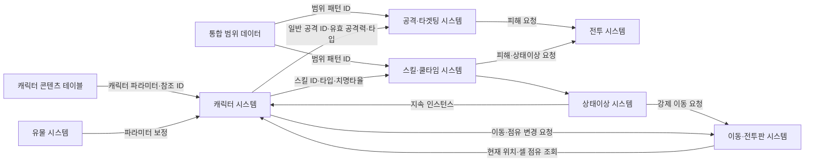
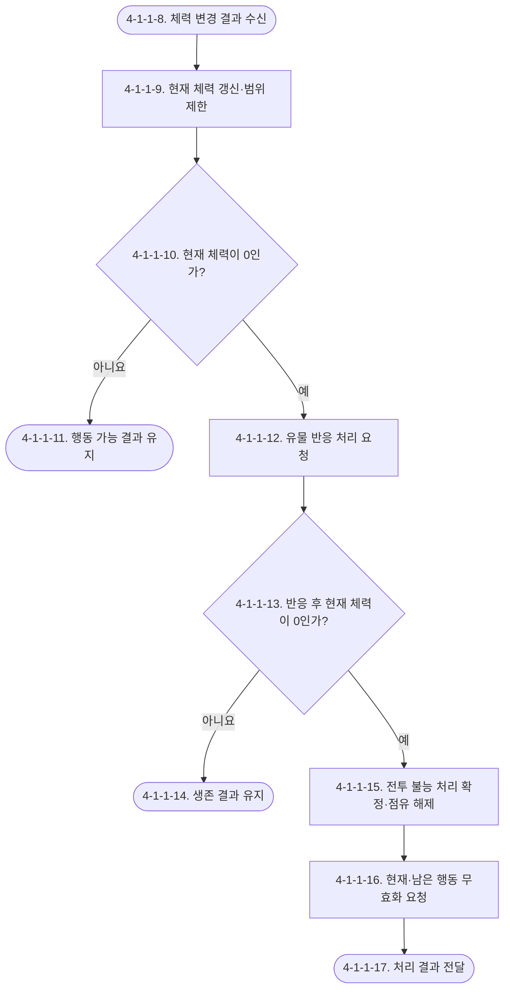
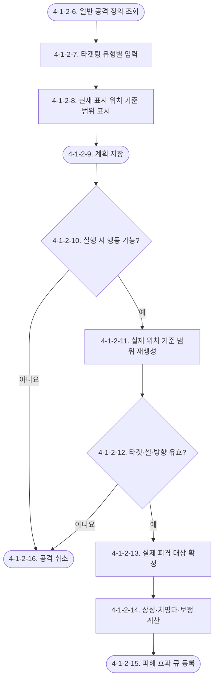
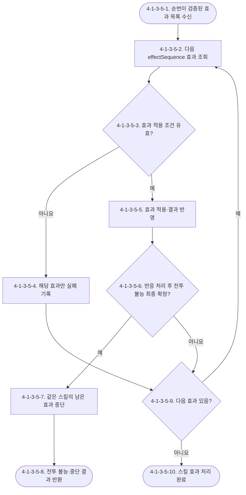
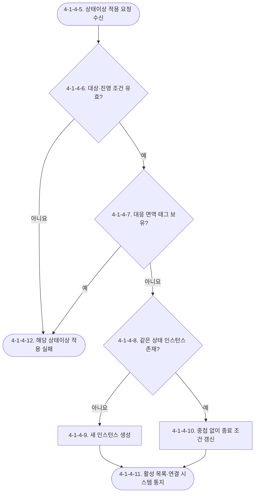
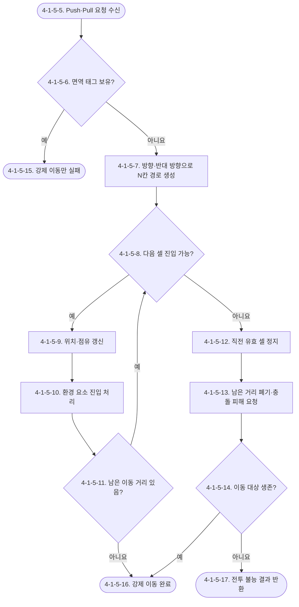

# Waredo 2.0 캐릭터 시스템 기획서

## [확인 필요 목록]

1. 일반 공격과 스킬이 공통으로 참조할 통합 범위 데이터의 좌표 원점, 방향 회전 기준, 선택 가능 셀·영향 셀 저장 형식이 아직 정의되지 않았다. 일반 공격은 `normalAttackRangeId`, 스킬은 `skillRangePatternId`와 `skillAffectedCellPatternId` 참조까지만 정의한다.
2. 같은 스킬의 효과는 `effectSequence` 오름차순으로 등록·처리한다. 서로 다른 스킬·유물·환경·연쇄 효과 요청 사이의 전역 우선순위와 큐 삽입 위치는 아직 정의되지 않았으며 전투 시스템의 FSM 항목에서 확정해야 한다.
3. 지속 상태의 적용 시점을 표현하는 `BattleTimingStamp`의 실제 필드 구성은 전투 시스템의 FSM 항목에서 확정해야 한다.
4. 유물·전투 효과가 파라미터 보정과 행동 차단 조건을 제공하는 공통 인터페이스는 유물 시스템 및 전투 시스템의 FSM 항목에서 확정해야 한다.
5. 캐릭터를 최초로 획득하거나 새 런을 시작할 때 `currentHp`를 어떤 값으로 생성하는지, 전투 밖에서 체력을 회복하는 수단과 저장 시점은 아웃게임·세이브 시스템에서 확정해야 한다. 전투 진입 자체는 체력을 회복시키지 않는다.
6. 캐릭터 직접 타겟형 일반 공격·스킬에서 사용자와 타겟 사이 직선상에 다른 캐릭터·환경 요소·벽이 있을 때 선택 또는 적중을 차단할지 논의해야 한다. 통합 범위·환경 요소 문서와 함께 확정한다.

## 유의사항

- 본 문서는 캐릭터 파라미터, 캐릭터가 참조하는 일반 공격과 스킬, 공격·타겟팅, 쿨타임, 상태이상, 밀치기·당기기 처리 규격을 다룬다.
- 개별 캐릭터의 실제 수치와 캐릭터 목록은 별도의 캐릭터 콘텐츠 테이블에서 관리한다.
- 통합 범위 데이터의 실제 좌표 목록은 별도 범위 데이터 테이블에서 관리한다. 본 문서에서는 범위 데이터 ID와 사용 규칙만 정의한다.
- 캐릭터는 일반 공격 정의를 1개, 스킬 정의를 1개 소유한다.
- 이동 경로는 정사각형 전투판의 셀을 상·하·좌·우로 연결하여 그린다. 대각선 이동은 허용하지 않는다.
- 캐릭터 타입은 선구자, 계승자, 기술자, 각성자 네 종류다.
- 기술자는 각성자에게 강하고, 각성자는 계승자에게 강하며, 계승자는 기술자에게 강하다. 선구자는 강점과 약점이 없다.
- 유리 상성은 피해 `×1.5`, 불리 상성은 피해 `×0.5`, 같은 타입 및 중립 상성은 피해 `×1.0`을 적용한다.
- 환경 요소 피해에는 캐릭터 타입 상성을 적용하지 않는다.
- 공통 초기 치명타 피해율은 `140%`다. 유물 보정이 없을 때 치명타 피해는 치명타 적용 전 피해의 `1.4배`다.
- 상태 면역 태그는 `Push`, `Pull`, `Airborne`, `Stun`을 사용한다.
- GDD의 ‘전투 불능’을 사용자가 말한 ‘사망’에 대응하는 시스템 상태명으로 사용한다. 현재 체력이 0이면 전투 불능 조건을 충족하지만, 피해 적용 후 유물과 전투 불능 전 유물 반응을 처리한 뒤에도 0일 때 전투 불능 처리를 확정하고 점유 셀을 해제한다.
- `currentHp`는 전투가 끝나도 유지되는 지속 상태값이다. 다음 전투 진입 시 최대 체력으로 초기화하지 않고 아웃게임에 저장된 값을 그대로 전달받는다.
- 시간대별 타입 구분과 강화 규칙은 시간대 전환 시스템에서 소유한다. 캐릭터 시스템은 캐릭터 타입 원본만 제공한다.
- 런타임 데이터의 저장 위치와 FSM 상태 연결은 전투 시스템의 FSM 하위 항목에서 다룬다.

# 1. 기획의도

캐릭터를 체력과 공격력만 가진 단순 말이 아니라 이동 경로, 행동 순서, 일반 공격, 스킬, 상태이상과 타입 상성을 연결하는 전투 객체로 정의한다. 각 캐릭터는 동일한 공통 파라미터 구조를 사용하되 서로 다른 수치, 일반 공격 범위, 스킬 효과와 타입을 통해 전투 역할을 구분한다.

플레이어는 캐릭터의 이동력과 공격 범위를 함께 고려하여 이동 경로를 설계하고, 타입 상성·띄워짐·기절·밀치기·당기기를 이용해 행동 결과를 계획한다.

# 2. 개발 목적

캐릭터 원본 데이터, 일반 공격 정의, 스킬 정의, 상태이상 정의와 전투 중 런타임 상태의 소유권을 분리한다. 캐릭터 콘텐츠는 일반 공격 블록을 직접 소유하고 스킬·범위 데이터는 정수 ID로 참조한다. 전투 시스템은 현재 표시 위치 기준의 계획 정보와 실행 시점의 실제 위치 재검증에 동일한 정의와 파생 조회 규칙을 사용한다.

# 3. 시스템 구조

캐릭터 시스템은 캐릭터 원본 파라미터와 전투 런타임 상태를 소유한다. 일반 공격·스킬·상태이상 정의는 각각의 정의 데이터로 관리하고 캐릭터는 해당 ID만 참조한다.



| 구분 | 원본 소유 시스템 | 캐릭터 시스템의 역할 |
|---|---|---|
| 캐릭터 파라미터 | 캐릭터 시스템 | 기본값·독립 런타임과 읽기 전용 유효값 조회 제공 |
| 캐릭터 콘텐츠 수치 | 캐릭터 콘텐츠 테이블 | 테이블 값을 읽어 캐릭터 정의 생성 |
| 일반 공격 정의 | 캐릭터 문법 내 일반 공격 블록·공격 시스템 | ID·공격 형태·통합 범위 ID를 캐릭터별로 1개 정의 |
| 스킬 정의·쿨타임 | 스킬·쿨타임 시스템 | `skillId`로 1개 참조 |
| 범위·영향 셀 패턴 | 통합 범위 데이터 | 일반 공격·스킬 정의가 패턴 ID로 참조 |
| 상태이상 정의와 처리 | 상태이상 시스템 | 면역 태그 제공, 지속 인스턴스 목록 보관 |
| 셀 유효성·점유 맵 | 이동·전투판 시스템 | `cellOccupants`를 위치의 단일 원본으로 소유 |
| 타입별 시간대 규칙 | 시간대 전환 시스템 | 원본 캐릭터 타입만 제공 |

# 4. 시스템 상세 구조

## 4-1. 캐릭터 시스템

### 4-1-1. 캐릭터 파라미터

#### 4-1-1-1. 파라미터 설명

| 파라미터 | 변수명 | 설명 | 기본 규칙 |
|---|---|---|---|
| 캐릭터 ID | `characterId` | 캐릭터 정의를 식별하는 고유 ID | 중복 불가 |
| 캐릭터명 | `characterName` | UI와 콘텐츠에 표시하는 이름 | 캐릭터 콘텐츠 테이블에서 작성 |
| 캐릭터 타입 | `characterType` | 상성 및 타입별 외부 시스템 판정에 사용하는 타입 | 선구자·계승자·기술자·각성자 중 하나 |
| 최대 체력 | `maxHp` | 캐릭터 최대 체력의 원본값 | 1 이상의 정수 |
| 현재 체력 | `currentHp` | 전투와 전투 사이에 유지되는 현재 체력 | 전투 진입 시 아웃게임 저장값 유지, 0~유효 최대 체력 |
| 공격력 | `attackPower` | 일반 공격의 기본 피해 원본값 | 0 이상의 정수 |
| 이동력 | `moveRange` | 한 행동에서 계획할 수 있는 이동 경로의 최대 셀 수 | 0 이상의 정수, 대각선 제외 |
| 치명타 피해율 | `criticalDamageRatePercent` | 치명타가 성립했을 때 적용하는 피해율 | 공통 초기값 140, 0 이상의 백분율 정수 |
| 일반 공격 정의 | `normalAttack` | 캐릭터가 소유한 일반 공격 정의 객체 | `NormalAttackDefinition` 1개 |
| 스킬 참조 | `skillId` | 캐릭터가 소유한 스킬 정의 ID | 캐릭터당 정확히 1개 |
| 지속 상태 목록 | `activeStatusEffects` | 현재 유지 중인 상태이상 인스턴스 목록 | 전투 시작 시 빈 목록 |
| 상태 면역 태그 | `statusImmunityTags` | 적용을 거부할 상태 태그 집합 | `Push`, `Pull`, `Airborne`, `Stun` 중 0개 이상 |

캐릭터 콘텐츠 테이블에는 원본값만 저장한다. 유물은 원본값을 직접 변경하지 않고 보정값을 제공한다. 아래 유효 파라미터는 별도 저장하지 않으며 요청 시 원본값과 현재 보정 목록으로 계산하는 읽기 전용 파생 프로퍼티다.

| 파생 프로퍼티 | 의존 원본 | 계산 규칙 | 변경 시 후속 처리 |
|---|---|---|---|
| `effectiveMaxHp` | `maxHp`, 현재 유물·전투 보정 | 고정·비율 보정 후 1 이상 제한 | 값이 감소하여 `currentHp`가 초과하면 체력만 새 상한으로 제한 |
| `effectiveAttackPower` | `attackPower`, 현재 유물·전투 보정 | 고정·비율 보정 후 0 이상 제한 | 피해 미리보기와 실행 시 다시 조회 |
| `effectiveMoveRange` | `moveRange`, 현재 유물·전투 보정 | 정수 보정 후 0 이상 제한 | 계획 경로 검증 시 다시 조회 |
| `effectiveCriticalDamageRatePercent` | `criticalDamageRatePercent`, 현재 유물·전투 보정 | 퍼센트포인트 보정 후 0 이상 제한 | 치명타 계산 시 다시 조회 |

파생값은 저장하지 않으므로 원본과 계산값 사이의 동기화 처리를 만들지 않는다. 같은 판정 과정에서는 계산 시작 시점의 보정 목록을 사용하여 결과가 중간에 달라지지 않게 한다.

공통 유물 보정 계산은 다음 순서를 사용한다.

```text
기본값
→ 같은 변수의 모든 고정 보정 합산
→ 같은 변수의 모든 비율 보정 합산 적용
→ 최종 반올림
→ 변수별 허용 범위 제한
= 유효값
```

#### 4-1-1-2. 스킬 소유

- 캐릭터는 `skillId`를 통해 스킬 정의 1개를 소유한다.
- 스킬의 이름, 설명, 범위, 효과, 최대 쿨타임, 치명타 가능 여부와 효과 해결 시작 방식은 스킬 정의 데이터에서 관리한다.
- 캐릭터 데이터 안에 스킬 상세 효과를 중복 작성하지 않는다.
- 전투 시작 시 캐릭터 런타임의 `skillCooldownRemaining`은 0으로 초기화한다.
- 스킬을 사용한 행동에서는 일반 공격을 함께 사용할 수 없다.

#### 4-1-1-3. 이동 연결

- 캐릭터는 `effectiveMoveRange`를 이동 시스템에 제공한다.
- 플레이어는 캐릭터의 현재 셀에서 시작하여 상·하·좌·우로 인접한 셀을 이어 경로를 그린다.
- 경로 길이는 `effectiveMoveRange` 이하여야 한다.
- 대각선 셀 연결은 유효한 경로로 인정하지 않는다.
- 다른 캐릭터가 점유한 셀, 이동 불가 셀과 전투판 밖의 셀은 도착하거나 통과할 수 없다.
- 실제 이동과 충돌 처리는 전투 시스템의 이동 로직에서 담당하며 캐릭터 시스템은 이동력과 현재 위치를 제공한다.

#### 4-1-1-4. 일반 공격 소유와 범위 참조

- 캐릭터 문법 안에서 일반 공격 ID, 일반 공격명, 공격 형태와 통합 범위 ID를 함께 정의한다.
- 일반 공격 형태는 타겟형 `Target`, 타일 선택형 `TileSelect`, 방향성 `Directional` 중 하나다.
- 일반 공격 정의는 `normalAttackRangeId`로 통합 범위 데이터 1개를 참조한다.
- 통합 범위 데이터는 선택 가능 셀과 실제 영향 셀 정보를 함께 가진다.
- 통합 범위 데이터는 일반 공격과 스킬이 함께 사용한다.
- 범위의 실제 셀 좌표를 캐릭터 정의나 일반 공격 정의 안에 직접 중복 작성하지 않는다.
- 일반 공격에는 별도 피해 수치를 두지 않고 `effectiveAttackPower`를 기본 피해로 사용한다.

#### 4-1-1-5. 타입 상성

| 공격자 \ 피격자 | 선구자 | 계승자 | 기술자 | 각성자 |
|---|---:|---:|---:|---:|
| 선구자 | 1.0 | 1.0 | 1.0 | 1.0 |
| 계승자 | 1.0 | 1.0 | 1.5 | 0.5 |
| 기술자 | 1.0 | 0.5 | 1.0 | 1.5 |
| 각성자 | 1.0 | 1.5 | 0.5 | 1.0 |

- 상성은 공격자 기준으로 판정한다.
- 선구자가 공격하거나 선구자를 공격하면 항상 중립 배율 `1.0`이다.
- 같은 타입끼리의 피해는 중립 배율 `1.0`이다.
- 상성 배율은 일반 공격과 `Damage` 효과를 가진 스킬의 직접 피해에 적용한다.
- 환경 요소 피해는 상성 조회를 수행하지 않고 상성 배율 `1.0`로 처리한다.
- 캐릭터 시스템은 타입과 상성 배율만 제공하며 시간대별 타입 효과를 계산하지 않는다.

피해 계산 순서는 다음과 같다.

```text
기본 피해
→ 타입 상성 배율
→ 치명타 피해율
→ 전투 중 임시 보정
→ 최종 반올림
→ 0 이상 제한
= 최종 피해
```

#### 4-1-1-6. 상태이상 면역

| 면역 태그 | 차단하는 처리 | 차단하지 않는 처리 |
|---|---|---|
| `Push` | 밀치기 강제 이동 | 같은 스킬의 피해와 다른 효과 |
| `Pull` | 당기기 강제 이동 | 같은 스킬의 피해와 다른 효과 |
| `Airborne` | 띄워짐 상태 적용 | 같은 스킬의 피해와 다른 효과 |
| `Stun` | 기절 상태 적용 | 같은 스킬의 피해와 다른 효과 |

- 상태이상 적용 전에 대상의 `statusImmunityTags`를 확인한다.
- 대응 면역 태그가 있으면 해당 상태이상만 실패한다.
- 같은 스킬의 피해와 다른 효과는 정상적으로 효과 큐에 남아 처리된다.
- 면역으로 실패한 상태이상을 다른 상태이상이나 다른 대상으로 자동 변경하지 않는다.

#### 4-1-1-7. 전투 불능과 셀 점유 해제

1. 확정된 피해 또는 체력 변경 결과를 `currentHp`에 반영한다.
2. `currentHp`를 0~현재 `effectiveMaxHp` 조회값 범위로 제한한다.
3. `currentHp == 0`이면 파생 프로퍼티 `isIncapacitated`가 `true`가 된다. 별도의 전투 상태 변수는 저장하지 않는다.
4. 전투 시스템에 피해 적용 후 유물과 전투 불능 전 유물 반응 처리를 요청한다.
5. 반응 결과로 `currentHp > 0`이 되면 전투 불능 처리를 하지 않고 갱신된 체력 결과를 유지한다.
6. 반응 처리 후에도 `currentHp == 0`이면 전투 불능 처리를 확정한다.
7. 전투판의 단일 위치 원본인 `cellOccupants`에서 해당 `characterId`의 점유 항목을 제거한다.
8. 해당 캐릭터의 현재 행동과 남은 행동을 무효화하도록 전투 FSM에 결과를 전달한다.
9. 전투 불능 처리 확정 캐릭터는 이동·일반 공격·스킬·회복을 실행하지 않으며 부활하지 않는다.



순서도 노드 설명:

| 번호 | 처리 내용 |
|---|---|
| 4-1-1-8 | 공격·스킬·기타 처리 시스템에서 확정된 체력 변경 결과를 받는다. |
| 4-1-1-9 | 현재 체력을 갱신하고 0~유효 최대 체력 범위로 제한한다. |
| 4-1-1-10 | 현재 체력이 0인지 판정한다. |
| 4-1-1-11 | 0보다 크면 행동 가능 결과를 유지한다. |
| 4-1-1-12 | 0이면 전투 시스템에 피해 적용 후 유물과 전투 불능 전 유물 반응 처리를 요청한다. |
| 4-1-1-13 | 유물 반응 결과를 반영한 뒤 현재 체력이 0인지 다시 판정한다. |
| 4-1-1-14 | 0보다 커졌으면 전투 불능 처리를 하지 않고 생존 결과를 유지한다. |
| 4-1-1-15 | 반응 후에도 0이면 전투 불능 처리를 확정하고 캐릭터 위치와 점유 정보를 같은 처리에서 해제한다. |
| 4-1-1-16 | 전투 FSM에 현재 행동과 남은 행동 무효화를 요청한다. |
| 4-1-1-17 | 변경된 체력·전투 불능 처리·위치 결과를 연결 시스템에 전달한다. |

### 4-1-2. 공격·타겟팅 시스템

#### 4-1-2-1. 일반 공격 형태

| 공격 형태 | 계획 단계 입력 | 실행 기준 위치 | 실행 대상 판정 |
|---|---|---|---|
| 타겟형 `Target` (`InRangeTarget`) | 거리 제한 없이 캐릭터 1명 지정 | 현재 표시 위치 | 실행 시 지정 대상이 실제 위치 기준 범위 안이고 전투 가능이면 공격 |
| 타일 선택형 `TileSelect` (`CellSelect`) | 거리 제한 없이 셀 지정, 방향 입력 없음 | 현재 표시 위치 | 실행 시 지정 셀이 실제 위치 기준 범위 안이고 유효하면 해당 셀 기준 영향 범위를 판정 |
| 방향성 `Directional` | 상·하·좌·우 방향 지정 | 현재 표시 위치 | 실행 시 실제 위치에서 방향에 맞춰 회전한 영향 셀의 현재 캐릭터를 판정 |

#### 4-1-2-2. 공격 계획 단계

1. 행동 캐릭터의 `normalAttack`에서 `NormalAttackDefinition`을 읽는다.
2. `normalAttackType`에 따라 캐릭터, 셀 또는 방향 입력을 받는다.
3. `normalAttackRangeId`의 통합 범위 데이터를 행동 캐릭터의 현재 표시 위치에 배치한다. 앞 행동 결과를 반영한 예상 위치는 계산하지 않는다.
4. 방향을 사용하는 유형은 선택 방향에 맞게 범위 패턴을 회전한다.
5. `normalAttackTargetTeam`에 포함되지 않는 캐릭터는 선택 대상과 표시할 영향 대상에서 제외한다.
6. 계획 단계에서는 현재 표시 위치 기준 선택 가능 범위와 예상 영향 셀을 표시하되 최종 적중은 확정하지 않는다.

#### 4-1-2-3. 공격 실행 단계

1. 행동 캐릭터가 전투 불능인지 확인한다. 전투 불능이면 공격을 실행하지 않는다.
2. 현재 체력, 활성 상태이상, 이동 실행 결과와 유물 조건을 입력으로 `canExecuteMainAction`을 조회한다. `false`이면 공격을 취소한다.
3. 행동 캐릭터의 실제 현재 위치를 기준으로 `normalAttackRangeId`의 통합 범위를 다시 생성한다.
4. 방향을 사용하는 경우 계획한 방향에 맞게 패턴을 회전한다.
5. 타겟 캐릭터 또는 타겟 셀이 현재도 유효한지 재검증한다.
6. 검증 실패 시 공격을 취소하며 다른 대상이나 셀로 자동 변경하지 않는다.
7. 검증 성공 시 일반 공격 형태에서 파생된 `hitTargetRule`에 따라 실제 피격 대상을 확정한다.
8. 유효 공격력을 기본 피해로 사용하고 타입 상성, 치명타, 임시 보정을 순서대로 적용한다.
9. 피해 결과를 효과 큐에 등록한다.

#### 4-1-2-4. 공격 유형별 예외

- `InRangeTarget`은 `SelectedTarget`만 사용한다. 지정 대상이 전투 불능이거나 범위 밖이면 공격을 취소한다.
- `CellSelect`는 `InRangeTarget`과 같은 방식으로 범위 안의 대상을 지정하지만 대상 단위가 캐릭터가 아니라 셀이다.
- `CellSelect`는 방향을 입력하지 않고 계획한 원래 셀을 유지한다. 실행 시 해당 셀이 범위 밖이거나 전투판의 유효하지 않은 셀이면 취소한다.
- 타일 선택형은 통합 범위 데이터에서 선택한 셀을 기준으로 영향 셀을 배치하며 방향 회전을 적용하지 않는다.
- `CellSelect`의 최종 영향 셀이 비어 있으면 피격 대상 없이 공격을 실행한다. 다른 셀로 자동 보정하지 않는다.
- `Directional`은 현재 위치 기준으로 영향 셀을 다시 생성하므로 계획 이후 캐릭터 배치가 바뀌면 실행 시점의 점유자가 피격 대상이 된다.
- `CharactersInAffectedCells`는 영향 셀 안에 있고 `normalAttackTargetTeam` 조건을 만족하는 모든 캐릭터를 대상으로 한다.
- 일반 공격은 띄워짐 상태의 대상에게 항상 치명타를 적용한다.
- 직접 지정 대상과 사용자 사이의 직선상 방해물 처리는 `[확인 필요 목록]` 6번의 논의사항으로 유지한다.

#### 4-1-2-5. 공격·타겟팅 순서도



| 번호 | 처리 내용 |
|---|---|
| 4-1-2-6 | 캐릭터의 일반 공격 ID로 공격 정의를 조회한다. |
| 4-1-2-7 | 공격 유형에 맞춰 캐릭터·셀·방향을 입력받는다. |
| 4-1-2-8 | 캐릭터의 현재 표시 위치와 통합 범위 데이터를 이용해 범위를 표시한다. 앞 행동 결과에 따른 예상 위치는 계산하지 않는다. |
| 4-1-2-9 | 선택 대상, 셀, 방향과 범위 ID를 행동 계획에 저장한다. |
| 4-1-2-10 | 전투 불능·기절·이동 중 전투 불능과 외부 행동 차단 여부를 확인한다. 충돌 후 생존은 공격을 취소하지 않는다. |
| 4-1-2-11 | 실행 시점의 실제 위치를 기준으로 범위를 다시 생성한다. |
| 4-1-2-12 | 계획한 타겟·셀·방향이 현재 규칙을 만족하는지 재검증한다. |
| 4-1-2-13 | 타겟 규칙과 현재 셀 점유를 기준으로 피격 대상을 확정한다. |
| 4-1-2-14 | 타입 상성, 치명타와 임시 보정을 순서대로 적용한다. |
| 4-1-2-15 | 확정된 피해 요청을 효과 큐에 등록한다. |
| 4-1-2-16 | 공격을 취소하고 자동 재타겟팅 없이 행동을 종료한다. |

### 4-1-3. 스킬·쿨타임 시스템

#### 4-1-3-1. 스킬 형태

| 스킬 형태 | 계획 단계 입력 | 실행 판정 | 주요 용도 |
|---|---|---|---|
| 범위 내 타겟팅 `InRangeTarget` | 거리 제한 없이 캐릭터 지정 | 실행 시 범위 안이면 지정 대상에게 시전 | 단일 대상 효과 |
| 셀 선택 `CellSelect` | 거리 제한 없이 셀 지정, 방향 입력 없음 | 실행 시 실제 위치 기준 범위 안이면 선택 셀 기준 처리 | 선택 셀 또는 셀 기준 범위 효과 |
| 방향성 `Directional` | 상·하·좌·우 방향 지정 | 실제 위치 기준으로 회전한 범위에 적용 | 범위 피해, 밀치기, 당기기 |

- 스킬은 `skillRangePatternId`로 시전 가능 범위를 참조한다.
- 다수 셀에 영향을 주는 스킬은 `skillAffectedCellPatternId`로 실제 영향 셀을 참조한다.
- 스킬은 `SkillEffectData`를 1개 이상 가지며 문법에 명시한 `effectSequence` 오름차순으로 효과 큐에 등록·처리한다.
- 스킬은 `resolveTiming`으로 시작 연출의 `Impact Marker`를 기다릴지 즉시 효과 해결을 시작할지 제공한다.
- 지원하는 효과 유형은 `Damage`, `Push`, `Pull`, `Airborne`, `Stun`이다.
- `Push`와 `Pull`을 사용하는 스킬은 `Directional` 유형이어야 한다.
- 캐릭터를 직접 지정하는 스킬의 직선상 방해물 처리는 `[확인 필요 목록]` 6번의 논의사항으로 유지한다.

`SkillEffectData`는 효과 종류에 따른 구분 타입으로 관리한다. 공통 필드는 `effectType`, `targetScope`, `effectTargetTeam`뿐이며, 효과별 수치는 해당 하위 데이터에만 존재한다.

| 하위 데이터 | 추가 저장값 | 사용하지 않는 값 |
|---|---|---|
| `DamageEffectData` | `damageValue: int` | 이동 거리·상태 ID를 갖지 않음 |
| `ForceMoveEffectData` | `forceMoveDistance: int` | 피해값·상태 ID를 갖지 않음 |
| `PersistentStatusEffectData` | `statusEffectId: int` | 피해값·이동 거리를 갖지 않음 |

#### 4-1-3-2. 스킬 실행 로직

1. 캐릭터의 `skillId`로 스킬 정의를 조회한다.
2. 캐릭터 전투 런타임의 `skillCooldownRemaining`이 0인지 확인한다. 0보다 크면 스킬을 선택할 수 없다.
3. 타겟팅 유형에 맞춰 캐릭터, 셀 또는 방향을 입력받고 행동 계획에 저장한다.
4. 실행 시 행동 캐릭터의 실제 위치를 기준으로 범위를 다시 생성한다.
5. 타겟 캐릭터 또는 타겟 셀 조건을 재검증한다.
6. 실패하면 스킬을 취소하고 자동 재타겟팅하지 않으며 쿨타임도 발생시키지 않는다.
7. 성공하면 스킬 효과를 `effectSequence` 오름차순의 실행 대기 묶음으로 전투 시스템에 전달한다.
8. 첫 번째 효과 요청이 전투 시스템에 정상 등록되는 시점에 쿨타임을 적용한다.
9. 전투 시스템은 `resolveTiming`이 `IMPACT_MARKER`이면 시작 연출의 피격 마커를 받은 뒤, `IMMEDIATE`이면 즉시 `Resolve` 파이프라인에서 효과를 처리한다.
10. 효과 적용 전 `SkillCast`, `BeforeApply`, 적용 후 `AfterApply`·`AfterDamage` 등 전투 시스템의 공통 이벤트를 발생시키며 스킬 데이터가 이벤트 처리 순서를 직접 바꾸지는 않는다.
11. `Damage`는 스킬 효과의 `damageValue`를 기본 피해로 사용한다.
12. `canCritical = true`이고 대상이 띄워짐이면 유효 치명타 피해율을 적용한다.
13. `Airborne`·`Stun`은 상태이상 시스템에, `Push`·`Pull`은 상태이상 시스템을 거쳐 강제 이동 처리에 요청한다.

#### 4-1-3-3. 쿨타임 규칙

| 시점 | `skillCooldownRemaining` 처리 |
|---|---|
| 전투 시작 | 0으로 초기화 |
| 스킬 계획 | 0일 때만 선택 가능 |
| 실행 검증 실패 | 변경하지 않음 |
| 첫 효과 큐 등록 성공 | 유효 `cooldownMax`로 설정 |
| 스킬을 사용한 같은 턴 | 감소하지 않음 |
| 다음 `TurnSetup`부터 | 턴마다 1 감소 |
| 감소 결과 | 0 미만으로 내려가지 않음 |

- `cooldownMax`의 유효값은 최소 1 이상이다.
- 현재 쿨타임은 `0~effectiveCooldownMax` 조회값 범위로 제한한다.
- 유물로 최대 쿨타임이 변경되면 현재 쿨타임도 유효 최대 쿨타임을 초과하지 않도록 제한한다.

#### 4-1-3-4. 스킬 예외 처리

- 행동 캐릭터가 전투 불능이면 스킬을 실행하지 않는다.
- 현재 체력, 활성 상태이상, 이동 실행 결과와 유물 조건을 입력으로 조회한 `canExecuteMainAction`이 `false`이면 예약된 스킬을 취소한다.
- 캐릭터 타겟팅형은 지정 대상이 전투 불능이거나 실행 범위 밖이면 취소한다.
- 셀 선택형은 방향을 입력하지 않는다. 계획 셀이 범위 밖이거나 유효하지 않은 셀이면 취소한다.
- 셀 선택형은 `skillAffectedCellPatternId = null`이면 선택 셀 하나에 효과를 적용하고, 패턴 ID가 있으면 선택 셀을 기준으로 방향 회전 없이 영향 셀을 생성한다.
- 방향성은 실행 위치의 현재 영향 셀을 사용하며 계획 시점의 피격 대상을 고정하지 않는다.
- `effectTargetTeam`에 포함되지 않은 캐릭터는 해당 효과의 적용 대상에서 제외한다.

#### 4-1-3-5. 스킬 효과 순서·큐 처리

스킬 제작 문법의 각 `EFFECT`에는 `1`부터 시작하는 `effectSequence`를 작성한다. 같은 스킬의 효과 요청은 `effectSequence` 오름차순으로 등록하고 하나씩 처리한다. `effectSequence`는 `skillEffects`의 순서로 항상 계산할 수 있으므로 런타임 저장값을 추가하지 않고 목록 인덱스 `+1`로 조회한다.

확정 규칙:

1. 효과 순번은 `1`부터 시작하며 중복하거나 건너뛸 수 없다.
2. 문서에 배치한 효과 순서와 `effectSequence` 오름차순은 일치해야 한다.
3. 현재 효과가 면역, 대상 없음 또는 적용 조건 불일치로 실패하면 해당 효과만 실패 처리하고 다음 `effectSequence`를 계속 처리한다.
4. 실패한 효과를 다른 효과·대상·셀로 자동 변경하지 않는다.
5. 성공한 효과의 체력·상태·위치·점유 변경을 반영한 뒤 다음 효과로 진행한다.
6. 현재 효과로 전투 불능 조건이 발생하면 전투 시스템의 유물 반응 처리를 거친다. 반응 후 전투 불능 처리가 최종 확정되면 아직 처리하지 않은 같은 스킬의 효과를 모두 중단한다.
7. 전투 불능으로 중단되기 전에 이미 반영한 효과 결과는 되돌리지 않는다.
8. 전투 불능 캐릭터의 점유 해제와 행동 무효화 요청을 처리한 뒤 전투 시스템에 결과를 반환한다.
9. 전투가 계속되더라도 중단한 같은 스킬의 남은 효과는 다시 처리하지 않는다.
10. 서로 다른 출처의 효과 우선순위, 반응 효과 삽입 위치와 전역 효과 큐 자료형은 전투 FSM이 소유한다.



| 번호 | 처리 내용 |
|---|---|
| 4-1-3-5-1 | 문법 순번 검증을 통과하고 `effectSequence` 오름차순으로 정렬된 스킬 효과 목록을 받는다. |
| 4-1-3-5-2 | 아직 처리하지 않은 가장 낮은 `effectSequence`의 효과를 조회한다. |
| 4-1-3-5-3 | 현재 대상·진영·면역·효과별 적용 조건이 유효한지 확인한다. |
| 4-1-3-5-4 | 조건이 유효하지 않으면 현재 효과만 실패로 기록하고 이미 반영된 결과를 유지한다. |
| 4-1-3-5-5 | 조건이 유효하면 현재 효과를 적용하고 체력·상태·위치·점유 결과를 반영한다. |
| 4-1-3-5-6 | 현재 효과로 `currentHp <= 0` 조건이 발생하면 전투 시스템의 유물 반응 결과까지 반영하고 전투 불능 처리가 최종 확정됐는지 확인한다. |
| 4-1-3-5-7 | 전투 불능 처리가 최종 확정되면 아직 처리하지 않은 같은 스킬의 효과 요청을 모두 중단한다. |
| 4-1-3-5-8 | 점유 해제·행동 무효화에 필요한 전투 불능 결과와 스킬 효과 중단 결과를 전투 시스템에 반환한다. |
| 4-1-3-5-9 | 실패 또는 성공 처리 뒤 다음 `effectSequence`가 남아 있는지 확인한다. |
| 4-1-3-5-10 | 남은 효과가 없으면 처리된 효과·실패 효과와 최종 상태 결과를 반환한다. |

#### 4-1-3-6. 스킬 실행 타이밍·전투 이벤트 계약

| `resolveTiming` | 전투 FSM 처리 | 사용 예 |
|---|---|---|
| `IMPACT_MARKER` | `ActionStart` 후 연출 시스템의 피격 마커를 기다리고 `Resolve`에 진입 | 투사체, 검격, 돌진, 폭발처럼 타격 프레임이 있는 스킬 |
| `IMMEDIATE` | 별도 피격 마커 없이 `ImmediateImpact`로 `Resolve`에 진입 | 즉시 상태 변경, 즉시 자가 효과 등 |

확정 규칙:

1. 현재 캐릭터 시스템의 스킬은 플레이어 또는 적 행동 계획으로 선택하는 능동 스킬이다.
2. 스킬 시작 연출 요청이 성공하면 전투 시스템이 `SkillCast` 이벤트를 발생시킨다.
3. 각 효과는 `Resolve` 파이프라인에서 `BeforeApply`, `AfterApply`, 피해가 1 이상이면 `AfterDamage` 이벤트의 발생 원인이 된다.
4. 스킬은 이벤트의 발생 원인이 될 수 있지만 전투 FSM 상태를 직접 전이시키거나 반응 큐를 직접 정렬하지 않는다.
5. 별도 이벤트를 구독해 자동 발동하는 트리거 스킬과 추가 행동 스킬은 캐릭터의 소유·장착 규칙이 제공되지 않아 현재 확정 범위에 포함하지 않는다.
6. 실제 애니메이션·마커 이름·이펙트·사운드·카메라 바인딩은 연출 시스템이 소유한다.

### 4-1-4. 상태이상 시스템

#### 4-1-4-1. 데이터 구조

상태이상은 `상태이상 정의 데이터 → 상태이상 적용 요청 → 지속 상태이상 인스턴스`의 세 단계로 관리한다.

| 데이터 | 주요 내용 | 소유 시스템 |
|---|---|---|
| `StatusEffectDefinition` | 상태이상 ID, 상태 태그, 종료 규칙 | 상태이상 시스템 |
| `StatusEffectApplyRequest` | 상태이상 ID, 적용 주체·대상, 발생 스킬 | 요청 생성 시스템 → 상태이상 시스템 |
| `ForceMoveRequest` | 밀치기·당기기 구분, 적용 주체·대상, 발생 스킬, 이동 거리, 행동 방향 | 요청 생성 시스템 → 상태이상 시스템 → 이동 시스템 |
| `StatusEffectInstance` | 상태이상 ID, 적용 주체, 적용 시점 | 상태이상 시스템이 생성·갱신·제거, 대상 캐릭터가 목록 보관 |

#### 4-1-4-2. 띄워짐

- 띄우기는 대상에게 `Airborne` 태그의 지속 상태이상을 적용한다.
- 띄워짐은 대상의 다음 `ActionBegin` 또는 적용된 현재 턴의 `TurnCleanup` 시작 중 먼저 발생한 시점에 해제한다.
- 띄워짐 대상은 치명타 조건을 충족한다.
- 일반 공격은 띄워짐 대상에게 반드시 치명타를 적용한다.
- 스킬은 `canCritical = true`인 경우에만 띄워짐 치명타를 적용한다. 
- 이미 띄워짐인 대상에게 다시 적용하면 새 인스턴스를 추가하지 않고 기존 인스턴스의 `appliedAt`만 새 적용 시점으로 갱신한다.
- 아군에게 띄워짐을 적용할 수 없다.
- 대상이 `Airborne` 면역 태그를 가지고 있으면 띄워짐만 실패하고 같은 스킬의 다른 효과는 처리한다.

#### 4-1-4-3. 기절

- 기절은 대상에게 `Stun` 태그의 지속 상태이상을 적용한다.
- 기절은 적용된 현재 턴 동안 대상 캐릭터가 행동하지 못하게 한다.
- 기절한 캐릭터의 행동 슬롯이 실행되면 슬롯을 소비하고 즉시 패스한다.
- 패스된 행동에서는 이동·일반 공격·스킬을 모두 실행하지 않는다.
- 기절은 적용된 현재 턴의 `TurnCleanup`에서 해제한다.
- 캐릭터가 이미 행동을 마친 뒤 기절하면 완료된 행동에는 영향을 주지 않는다.
- 해당 턴에 남은 행동 슬롯이 없다면 기절의 전투상 행동 제한 효과는 발생하지 않는다.
- 이미 기절한 대상에게 다시 적용해도 추가 행동 슬롯을 패스하지 않으며 같은 `TurnCleanup`에서 해제한다.
- 아군에게 기절을 적용할 수 없다.
- 대상이 `Stun` 면역 태그를 가지고 있으면 기절만 실패하고 같은 스킬의 다른 효과는 처리한다.

#### 4-1-4-4. 지속 상태 적용 순서



| 번호 | 처리 내용 |
|---|---|
| 4-1-4-5 | 상태이상 ID와 적용 주체·대상·시점이 포함된 요청을 받는다. |
| 4-1-4-6 | 대상이 전투 가능하고 해당 상태이상을 적용할 수 있는 진영인지 확인한다. |
| 4-1-4-7 | 대상 캐릭터가 대응 상태 면역 태그를 보유했는지 확인한다. |
| 4-1-4-8 | 대상의 활성 목록에 같은 상태이상 인스턴스가 있는지 확인한다. |
| 4-1-4-9 | 없으면 새 인스턴스를 활성 목록에 추가한다. 목록에 존재하는 것 자체가 활성 상태를 의미한다. |
| 4-1-4-10 | 있으면 중첩 수를 늘리지 않고 종료 조건만 새 적용 시점 기준으로 갱신한다. |
| 4-1-4-11 | 활성 목록을 갱신하고 행동 순서·공격·UI·FSM에 상태 결과를 전달한다. |
| 4-1-4-12 | 해당 상태이상만 실패시키고 같은 스킬의 다른 효과 처리는 유지한다. |

### 4-1-5. 밀치기·당기기 처리

#### 4-1-5-1. 공통 규칙

- 밀치기와 당기기는 즉시형 상태이상이며 지속 인스턴스를 남기지 않는다.
- 밀치기·당기기 효과를 가진 스킬은 `Directional` 타겟팅을 사용한다.
- 스킬 사용자는 현재 위치를 기준으로 상·하·좌·우 중 하나의 방향을 선택한다.
- 강제 이동 거리는 `forceMoveDistance`의 N칸이다.
- 아군에게 밀치기·당기기를 적용할 수 있다.
- 아군 대상에게는 해당 스킬의 피해를 적용하지 않고 강제 이동 효과만 처리한다.
- 대상이 대응하는 `Push` 또는 `Pull` 면역 태그를 가지고 있으면 강제 이동만 실패한다.
- 일반 이동과 동일한 셀 진입 가능 판정을 사용한다.
- 이동 중 환경 요소 진입 처리는 환경 요소 시스템 규칙을 따른다.
- 강제 이동 중 캐릭터·이동 차단 환경 요소·벽·전투판 외곽에 충돌하면 직전 유효 셀에서 정지하고 충돌 피해 10을 처리한다.

#### 4-1-5-2. 밀치기

- 선택한 스킬 사용 방향으로 대상을 N칸 강제 이동시킨다.
- 방향이 먼저 확정되므로 결과 후보는 선택 방향으로 이어진 직선 경로 하나다.
- 후보 셀 동률이나 별도의 방향 선택은 발생하지 않는다.

#### 4-1-5-3. 당기기

- 선택한 스킬 사용 방향의 반대 방향으로 대상을 N칸 강제 이동시킨다.
- 방향이 먼저 확정되므로 결과 후보는 선택 방향 반대로 이어진 직선 경로 하나다.
- 후보 셀 동률이나 별도의 방향 선택은 발생하지 않는다.

#### 4-1-5-4. 강제 이동 충돌 처리

1. 대상의 현재 셀에서 강제 이동 방향으로 N개의 경로 셀을 생성한다.
2. 다음 셀이 전투판 안·이동 가능·미점유 조건을 모두 만족하는지 진입 직전에 확인한다.
3. 진입 가능하면 전투판 위치의 단일 원본인 `cellOccupants`를 갱신한다.
4. 해당 셀의 환경 요소 진입 조건을 확인한다.
5. 다음 셀이 진입 불가능하면 직전 유효 셀에서 멈춘다.
6. 남은 강제 이동 거리를 폐기한다.
7. 강제 이동 대상에게 적용할 충돌 피해 10 요청을 생성한다.
8. 충돌 원인이 피해를 받을 수 있는 캐릭터 또는 환경 요소라면 동일한 피해 10 요청을 생성한다.
9. 충돌 피해 요청을 전투 시스템의 일반 피해·유물·전투 불능 처리 순서로 전달한다.



| 번호 | 처리 내용 |
|---|---|
| 4-1-5-5 | 상태이상 시스템이 밀치기 또는 당기기 요청을 받는다. |
| 4-1-5-6 | 대상이 `Push` 또는 `Pull` 면역 태그를 보유했는지 확인한다. |
| 4-1-5-7 | 밀치기는 선택 방향, 당기기는 선택 방향 반대로 N칸 직선 경로를 생성한다. |
| 4-1-5-8 | 다음 셀이 전투판 안·이동 가능·미점유 조건을 만족하는지 확인한다. |
| 4-1-5-9 | 진입 가능하면 캐릭터 현재 위치와 전투판 점유를 함께 갱신한다. |
| 4-1-5-10 | 새 셀에 반응하는 환경 요소가 있는지 확인하고 처리 요청을 등록한다. |
| 4-1-5-11 | 처리할 강제 이동 거리가 남았는지 확인한다. |
| 4-1-5-12 | 진입 불가능하면 대상은 직전 유효 셀에서 멈춘다. |
| 4-1-5-13 | 남은 이동 거리를 폐기하고 이동 대상에 대한 피해 10 요청을 생성한다. 충돌 원인이 피해를 받을 수 있으면 같은 피해 요청을 생성해 전투 이벤트 순서로 처리한다. |
| 4-1-5-14 | 충돌 피해와 반응 처리 후 강제 이동 대상의 `currentHp > 0`인지 확인한다. |
| 4-1-5-15 | 면역이면 강제 이동만 실패시키고 같은 스킬의 다른 효과는 유지한다. |
| 4-1-5-16 | 최종 위치와 점유 정보를 반환하고 강제 이동을 종료한다. |
| 4-1-5-17 | 강제 이동 대상의 전투 불능 확정과 점유 해제 결과를 반환한다. |

### 4-1-6. 변수 관리

#### 4-1-6-1. 관리 원칙

| 구분 | 저장 여부 | 판단 기준 |
|---|---|---|
| 독립 원본 | 저장 | 다른 값만으로 복원할 수 없고 콘텐츠 작성 또는 전투 진행에 따라 직접 변경되는 값 |
| 파생 프로퍼티 | 저장하지 않음 | 하나 이상의 원본과 현재 판정 문맥으로 항상 다시 계산할 수 있는 값 |
| 실행 임시값 | 지속 저장하지 않음 | 한 번의 행동·효과 처리 안에서만 생성하고 소비하는 결과 |
| 외부 참조 | 캐릭터 시스템에 저장하지 않음 | 전투판·이동·FSM 등 다른 시스템이 단일 원본으로 소유하는 값 |

같은 의미의 상태를 둘 이상의 변수에 저장하지 않는다. 파생 프로퍼티는 외부에서 값을 설정할 수 없는 읽기 전용 조회로 제공한다.

#### 4-1-6-2. 독립 저장값

| 구조체 | 저장 필드 | 소유자 | 독립인 이유 |
|---|---|---|---|
| `CharacterDefinition` | `characterId`, `characterName`, `characterType`, `maxHp`, `attackPower`, `moveRange`, `criticalDamageRatePercent`, `normalAttack`, `skillId`, `statusImmunityTags` | 캐릭터 콘텐츠 | 콘텐츠 제작자가 직접 결정하는 원본값 |
| `NormalAttackDefinition` | `normalAttackId`, `normalAttackName`, `normalAttackType`, `normalAttackRangeId`, `normalAttackTargetTeam` | 캐릭터 콘텐츠 | 공격별 입력·범위·대상 규칙의 원본값 |
| `SkillDefinition` | `skillId`, `skillName`, `skillDescription`, `skillTargetingType`, `skillRangePatternId`, `skillAffectedCellPatternId`, `skillEffects`, `cooldownMax`, `canCritical`, `resolveTiming` | 스킬 콘텐츠 | 스킬별 규칙·효과와 해결 시작 방식의 원본값 |
| `SkillEffectData` | `effectType`, `targetScope`, `effectTargetTeam` 및 효과 종류별 필수값 | 스킬 콘텐츠 | 효과 종류에 따라 피해·거리·상태 ID 중 필요한 값만 저장 |
| `CharacterBattleRuntime` | `currentHp`, `skillCooldownRemaining`, `activeStatusEffects` | 캐릭터 런타임·아웃게임 세이브 | 전투 진행에 따라 직접 변경되며 원본 데이터만으로 복원 불가. `currentHp`는 전투 종료 후 저장해 다음 전투에 유지 |
| `ActionPlan` | `movePath`, `mainAction` | 행동 설계 | 플레이어가 확정한 이동과 본 행동 |
| `StatusEffectDefinition` | `statusEffectId`, `statusEffectName`, `statusTag`, `durationRule` | 상태이상 콘텐츠 | 상태별 표시·면역·종료 규칙의 원본값 |
| `StatusEffectInstance` | `statusEffectId`, `sourceCharacterId`, `appliedAt` | 상태이상 런타임 | 적용 출처와 갱신된 적용 시점 보존 필요 |
| `cellOccupants` | 셀 좌표→`characterId` | 전투판 | 위치와 점유의 단일 원본 |

#### 4-1-6-3. 행동 계획 묶음

타겟 입력을 `targetCharacterId`, `targetCell`, `actionDirection`의 nullable 변수 세 개로 동시에 저장하지 않는다. `mainAction` 안에 행동 종류와 일치하는 `ActionTarget` 하나만 저장한다.

| 구조 | 필드 | 규칙 |
|---|---|---|
| `ActionPlan` | `movePath: List<Vector2Int>`, `mainAction: MainActionPlan?` | 이동만 계획하면 `mainAction = null` |
| `MainActionPlan` | `actionType: MainActionType`, `target: ActionTarget` | `NormalAttack` 또는 `Skill` 중 하나 |
| `CharacterTarget` | `characterId: int` | 타겟형에서만 사용 |
| `CellTarget` | `cell: Vector2Int` | 타일 선택형에서만 사용, 방향 없음 |
| `DirectionTarget` | `direction: Direction` | 방향성에서만 사용, 상·하·좌·우 |

정의 데이터의 타겟팅 유형과 `ActionTarget` 종류가 일치하지 않으면 행동 계획을 확정하지 않는다.

#### 4-1-6-4. 파생 프로퍼티와 의존 관계

| 조회명 | 반환형 | 의존 원본·문맥 | 계산 규칙 | 사용처 |
|---|---|---|---|---|
| `effectiveMaxHp` | `int` | `maxHp`, 현재 파라미터 보정 | 공통 보정 계산 후 1 이상 제한 | 체력 상한·회복 |
| `effectiveAttackPower` | `int` | `attackPower`, 현재 파라미터 보정 | 공통 보정 계산 후 0 이상 제한 | 일반 공격 피해 |
| `effectiveMoveRange` | `int` | `moveRange`, 현재 파라미터 보정 | 공통 보정 계산 후 0 이상 제한 | 이동 경로 검증 |
| `effectiveCriticalDamageRatePercent` | `int` | `criticalDamageRatePercent`, 현재 파라미터 보정 | 공통 보정 계산 후 0 이상 제한 | 치명타 피해 |
| `effectiveCooldownMax` | `int` | `cooldownMax`, 현재 파라미터 보정 | 공통 보정 계산 후 1 이상 제한 | 쿨타임 상한 |
| `isIncapacitated` | `bool` | `currentHp` | `currentHp <= 0` | 행동·피격·회복 제한, UI |
| `occupiedCell` | `Vector2Int?` | 전투판 `cellOccupants`, `characterId` | 해당 캐릭터 ID가 점유한 셀 조회, 없으면 `null` | 이동·범위 원점·UI |
| `hasStatus(tag)` | `bool` | `activeStatusEffects`, 상태 정의 | 목록에 같은 `statusTag`의 인스턴스가 존재하는지 조회 | 띄워짐·기절 판정 |
| `hitTargetRule` | `NormalAttackHitTargetRule` | `normalAttackType` | `Target`이면 지정 대상, 나머지는 영향 셀 대상 | 일반 공격 실행 |
| `forceMoveDirection` | `Direction` | `effectType`, `DirectionTarget.direction` | `Push`는 같은 방향, `Pull`은 반대 방향 | 강제 이동 경로 생성 |
| `effectSequence` | `int` | `skillEffects` 목록 위치 | 목록 인덱스 `+1`, 1부터 연속 | 같은 스킬의 효과 등록·처리 순서 |
| `canUseSkill` | `bool` | `skillCooldownRemaining`, `canExecuteMainAction` | 쿨타임이 0이고 본 행동 실행 가능일 때 `true` | 스킬 선택·실행 |

`canExecuteMainAction`은 저장하는 bool 변수가 아니라 다음 규칙을 순서대로 평가하는 조회다.

```text
GetActionBlockReasons(actionContext)
├─ currentHp <= 0                         → Incapacitated
├─ hasStatus(Stun)                        → Stunned
├─ movementResult == Incapacitated        → IncapacitatedDuringMove
└─ 현재 유물·전투 효과의 행동 차단 조건 충족 → ExternalEffectBlocked

canExecuteMainAction = GetActionBlockReasons(actionContext).Count == 0
```

`movementResult == Collision`이더라도 충돌 피해 후 `currentHp > 0`이면 정지한 실제 위치에서 예정된 본 행동을 실행하므로 행동 차단 사유에 포함하지 않는다. UI와 로그는 단순 bool 대신 `GetActionBlockReasons`의 결과를 사용하여 취소 원인을 표시할 수 있다. 새로운 유물 조건은 별도 bool 필드를 추가하지 않고 행동 차단 규칙 목록에 조건 제공자로 연결한다.

#### 4-1-6-5. 실행 임시값과 외부 참조

| 항목 | 구분 | 처리 방식 |
|---|---|---|
| `movementResult` | 실행 임시값 | 이동 실행의 반환값으로 행동 문맥에 전달하고 행동 종료 후 폐기 |
| 실제 피격 대상 목록 | 실행 임시값 | 실행 시 범위·진영·생존 여부를 재검증하여 생성 후 폐기 |
| 스킬 효과 요청 식별값 | 실행 임시값 | `sourceSkillId`와 파생 `sourceEffectSequence`를 요청에 전달하고 해당 효과 처리 후 폐기 |
| 강제 이동 경로·최종 셀 | 실행 임시값 | `forceMoveDirection`, 거리와 현재 점유 맵으로 생성 후 처리 결과만 반영 |
| `cellOccupants` | 외부 참조 | 전투판이 소유하며 캐릭터 시스템은 조회·점유 해제 요청만 수행 |
| 효과 대기 목록 | 외부 참조 | 전투 시스템 내부 FSM이 소유한다. 정렬 방식과 우선순위는 전투 시스템의 FSM 항목에서 정의 |

삭제한 중복 변수는 `characterBattleState`, 저장형 `occupiedCell`, `cancelMainAction`, `stackCount`, `isActive`, `remainingCount`, `expireEvents`, `sourcePosition`, `targetPosition`, 요청의 별도 `direction`이다. 각 의미는 위 파생 조회, 컨테이너 포함 여부, `durationRule`, `DirectionTarget` 또는 전투판 조회로 대체한다.

### 4-1-7. 콘텐츠 기획 문법

콘텐츠 기획이 필요한 경우 아래 문법에 따라 기획한다.

#### 4-1-7-1. 캐릭터 문법

```text
CHARACTER <캐릭터ID> "<캐릭터명>"
TYPE <선구자 | 계승자 | 기술자 | 각성자>
MAX_HP <1 이상의 정수>
ATTACK_POWER <0 이상의 정수>
MOVE_RANGE <0 이상의 정수>
CRITICAL_DAMAGE_RATE_PERCENT <140>

NORMAL_ATTACK <일반공격ID> "<일반공격명>"
NORMAL_ATTACK_TYPE <TARGET | TILE_SELECT | DIRECTIONAL>
NORMAL_ATTACK_RANGE_ID <통합범위데이터ID>
NORMAL_ATTACK_TARGET_TEAM <ENEMY | ALLY | ALL>

SKILL <스킬ID>
STATUS_IMMUNITY <NONE | PUSH | PULL | AIRBORNE | STUN | 복수 태그>
```

작성 규칙:

1. 캐릭터 ID는 유효한 정수여야 하며 중복되지 않아야 한다.
2. 타입은 선구자·계승자·기술자·각성자 중 하나만 사용한다.
3. 캐릭터별 실제 수치는 별도 캐릭터 콘텐츠 테이블에서 작성한다.
4. 공통 초기 치명타 피해율은 `140`이다.
5. 캐릭터마다 일반 공격 블록과 스킬 ID를 각각 정확히 하나씩 작성한다.
6. 일반 공격 블록에는 정수형 ID, 이름, 공격 형태, 정수형 통합 범위 데이터 ID와 유효 대상 진영을 모두 작성한다.
7. 면역이 없으면 `STATUS_IMMUNITY NONE`으로 작성한다.
8. 복수 면역 태그는 `PUSH`, `PULL`, `AIRBORNE`, `STUN` 중 필요한 값을 작성한다.

#### 4-1-7-2. 일반 공격 문법

일반 공격은 별도 문법 블록으로 분리하지 않고 `4-1-7-1. 캐릭터 문법` 안에서 정의한다.

| `NORMAL_ATTACK_TYPE` | 내부 타겟팅 유형 | 플레이어 입력 | 실제 대상 판정 |
|---|---|---|---|
| `TARGET` | `InRangeTarget` | 범위 안의 캐릭터 1명 지정 | 지정 캐릭터에게만 적용 |
| `TILE_SELECT` | `CellSelect` | 범위 안의 셀 지정, 방향 입력 없음 | 통합 범위 데이터의 셀 영향 범위에 있는 유효 캐릭터에게 적용 |
| `DIRECTIONAL` | `Directional` | 상·하·좌·우 방향 지정 | 방향에 맞춰 회전한 통합 범위의 영향 셀에 있는 유효 캐릭터에게 적용 |

작성 규칙:

1. `TARGET`은 캐릭터를 지정하고 `hitTargetRule = SelectedTarget`을 사용한다.
2. `TILE_SELECT`는 방향을 입력하지 않고 셀을 지정하며 `hitTargetRule = CharactersInAffectedCells`를 사용한다.
3. `DIRECTIONAL`은 상·하·좌·우 방향을 입력하고 `hitTargetRule = CharactersInAffectedCells`를 사용한다.
4. 세 형태 모두 `NORMAL_ATTACK_RANGE_ID`로 통합 범위 데이터 하나를 참조한다.
5. `TARGET`은 통합 범위 데이터의 선택 가능 셀만 사용하여 대상 캐릭터의 위치가 범위 안인지 판정한다.
6. `TILE_SELECT`는 선택 셀을 기준으로 통합 범위의 영향 셀을 방향 회전 없이 배치한다.
7. `DIRECTIONAL`은 캐릭터 위치를 기준으로 통합 범위를 선택 방향에 맞춰 회전한다.
8. 일반 공격 피해값은 별도로 작성하지 않고 캐릭터의 유효 공격력을 사용한다.
9. 범위 좌표를 캐릭터 문법에 직접 작성하지 않고 통합 범위 데이터 ID만 참조한다.

#### 4-1-7-3. 스킬 문법

```text
SKILL <스킬ID> "<스킬명>"
DESCRIPTION "<설명>"
TARGETING <IN_RANGE_TARGET | CELL_SELECT | DIRECTIONAL>
RANGE_PATTERN <통합범위데이터ID>
AFFECTED_CELL_PATTERN <통합영향범위데이터ID | NONE>
COOLDOWN <1 이상의 정수>
CAN_CRITICAL <true | false>
RESOLVE_TIMING <IMPACT_MARKER | IMMEDIATE>

EFFECT <효과순번> DAMAGE <SELECTED_TARGET | SELECTED_CELL | AFFECTED_CELLS> TARGET_TEAM <ENEMY | ALLY | ALL> VALUE <0 이상의 피해값>
EFFECT <효과순번> PUSH <SELECTED_TARGET | AFFECTED_CELLS> TARGET_TEAM <ENEMY | ALLY | ALL> DISTANCE <0 이상의 N>
EFFECT <효과순번> PULL <SELECTED_TARGET | AFFECTED_CELLS> TARGET_TEAM <ENEMY | ALLY | ALL> DISTANCE <0 이상의 N>
EFFECT <효과순번> AIRBORNE <SELECTED_TARGET | AFFECTED_CELLS> TARGET_TEAM <ENEMY>
EFFECT <효과순번> STUN <SELECTED_TARGET | AFFECTED_CELLS> TARGET_TEAM <ENEMY>
```

작성 예시:

```text
SKILL 101 "방패 돌진"
DESCRIPTION "대상에게 피해를 주고 밀친 뒤 기절을 시도한다."
TARGETING DIRECTIONAL
RANGE_PATTERN 201
AFFECTED_CELL_PATTERN 301
COOLDOWN 3
CAN_CRITICAL false
RESOLVE_TIMING IMPACT_MARKER

EFFECT 1 DAMAGE AFFECTED_CELLS TARGET_TEAM ENEMY VALUE 20
EFFECT 2 PUSH AFFECTED_CELLS TARGET_TEAM ALL DISTANCE 2
EFFECT 3 STUN AFFECTED_CELLS TARGET_TEAM ENEMY
```

위 예시에서 1번 피해가 실패하면 2번 밀치기를 계속 처리한다. 1번 또는 2번 효과로 전투 불능 조건이 발생하면 유물 반응을 처리하고, 반응 후 전투 불능 처리가 최종 확정되는 시점에 남은 효과를 중단하므로 이후 순번은 처리하지 않는다.

작성 규칙:

1. 스킬은 효과를 1개 이상 가진다.
2. 모든 `EFFECT`에는 `1`부터 시작하는 효과 순번을 작성한다.
3. 효과 순번은 중복하거나 건너뛸 수 없으며 문서의 위에서 아래 배치 순서와 일치해야 한다.
4. 효과는 효과 순번 오름차순으로 효과 큐에 등록하고 같은 순서로 처리한다.
5. 앞 효과가 면역·대상 없음·조건 불일치로 실패해도 다음 효과를 계속 처리한다.
6. 효과 결과로 전투 불능 조건이 발생하면 유물 반응 처리 후 다시 판정하고, 전투 불능 처리가 최종 확정되면 같은 스킬의 남은 효과를 중단하고 다시 처리하지 않는다.
7. `PUSH`와 `PULL` 효과를 가진 스킬은 `TARGETING DIRECTIONAL`을 사용한다.
8. `CELL_SELECT`는 방향을 입력하지 않고 범위 안의 셀을 지정한다.
9. `CELL_SELECT`에서 `AFFECTED_CELL_PATTERN NONE`이면 선택 셀 하나를 효과 셀로 사용한다. 패턴 ID가 있으면 선택 셀을 기준으로 방향 회전 없이 배치한다.
10. `AFFECTED_CELLS`를 사용하는 스킬은 영향 셀 패턴 ID를 반드시 작성한다.
11. 스킬 피해에 띄워짐 치명타를 허용하려면 `CAN_CRITICAL true`로 작성한다.
12. `AIRBORNE`과 `STUN`은 아군에게 적용할 수 없으므로 `TARGET_TEAM ENEMY`만 사용한다.
13. 공격·투사체·돌진처럼 피격 프레임이 있는 스킬은 `RESOLVE_TIMING IMPACT_MARKER`, 별도 피격 프레임이 없는 즉시 효과는 `RESOLVE_TIMING IMMEDIATE`를 작성한다.
14. `RESOLVE_TIMING`은 효과 순서를 바꾸지 않으며 첫 번째 효과를 `Resolve`에서 처리하기 시작하는 시점만 결정한다.
13. 범위 좌표를 직접 작성하지 않고 통합 범위 데이터 ID만 참조한다.

## 자체 검수 결과표

| 점검 항목 | 결과(정상/이슈 발견) | 세부 내용 | 해당 위치(번호) |
|---|---|---|---|
| 넘버링 무결성 | 정상 | 캐릭터, 공격, 스킬, 상태이상, 강제 이동, 변수와 문법을 4-1 하위로 연속 구성했다. | 4-1 전체 |
| 순서도-텍스트 일치성 | 정상 | 전투 불능, 공격·타겟팅, 스킬 효과 큐, 지속 상태이상, 강제 이동 순서도의 모든 번호를 대응 설명표에서 1:1로 확인했다. | 4-1-1-7, 4-1-2-5, 4-1-3-5, 4-1-4-4, 4-1-5-4 |
| 변수 일관성 | 정상 | 캐릭터 기본값·유효값·런타임값과 공격·스킬·상태 변수를 소유 시스템별로 분리하고 `effectSequence`를 목록 위치 기반 파생값, `resolveTiming`을 스킬 원본값으로 정의했다. | 4-1-3, 4-1-6 |
| 변수 참조 무결성 | 정상 | 본문 및 콘텐츠 문법의 주요 변수를 변수 관리표에 등록했다. | 4-1-1~4-1-7 |
| 시스템 간 충돌 | 정상 | 같은 스킬 내부 순서는 캐릭터 시스템, 서로 다른 출처의 전역 큐 정렬·삽입은 FSM 소유로 분리했다. 타입 상성, 시간대, 환경 피해, 상태이상, 이동·점유 책임도 기존 경계를 유지한다. | 확인 필요 목록, 3, 4-1-1~4-1-5 |
| 임의 추가 여부 자가 점검 | 정상 | 효과 실패 시 다음 효과 계속 처리, 전투 불능 발생 시 같은 스킬의 남은 효과 중단을 사용자 확정값으로 반영했다. 전역 큐 우선순위는 임의 확정하지 않고 확인 필요로 유지했다. | 확인 필요 목록, 4-1-3-5 |
| 순환 참조/모순된 조건 분기 | 정상 | 스킬 효과 반복은 다음 순번으로 진행하며 실패·완료·전투 불능 중단 경로가 모두 종료점을 가진다. 강제 이동 반복도 남은 거리 감소를 전제로 한다. | 4-1-1-7, 4-1-2-5, 4-1-3-5, 4-1-4-4, 4-1-5-4 |
| 콘텐츠 문법 준수 여부 | 정상 | 스킬 `EFFECT` 문법의 연속 효과 순번과 `RESOLVE_TIMING`을 본문·변수 정의서의 `effectSequence`, `resolveTiming`과 일치시켰다. | 4-1-7-3 |
| 기획의도-개발목적-시스템구조 정합성 | 정상 | 캐릭터 파라미터를 중심으로 이동·공격·스킬·상태이상·상성의 구조와 실행 로직을 연결했다. | 1~4 |
