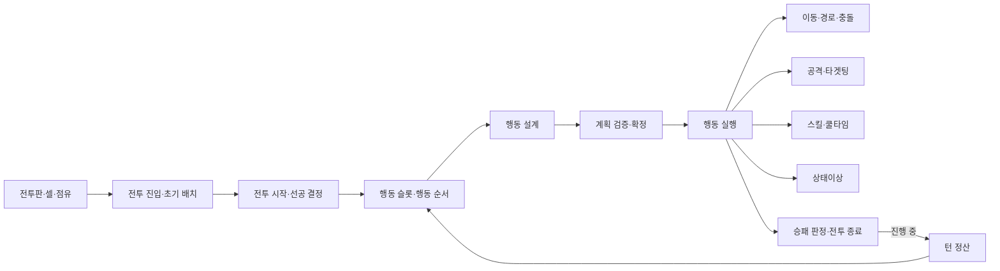
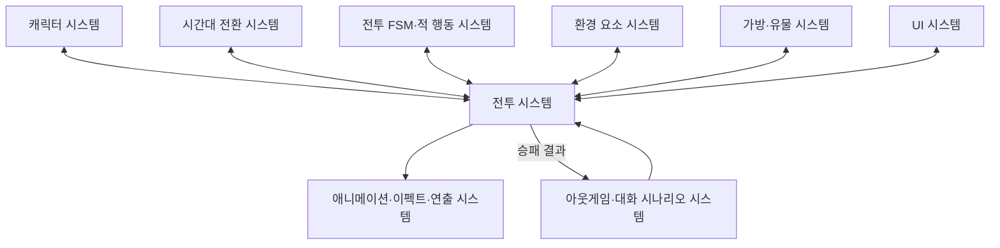
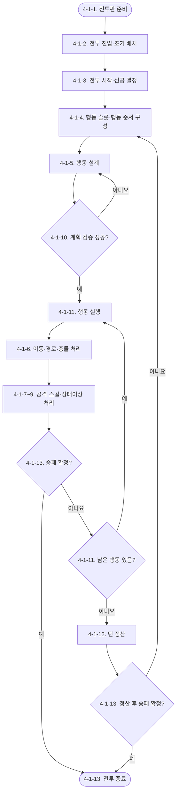

# Waredo 2.0 전투 시스템 기획서 작성 전 구조안

> 문서 성격: 전투 시스템 기획서 본문 작성 전에 목차, 책임, 로직, 변수 연결, 미결정 항목을 확정하기 위한 구조안  
> 구조 기준: `확정/시스템/Waredo_2.0_시스템_구조_및_작성_현황.md`  
> 내용 우선순위: **확정 문서 > 제안 GDD > 본 구조안의 `[제안]`**  
> 현재 상태: 전투 시스템 `[작성 전]`

## 0. 이번 구조안의 결론

전투 시스템 기획서는 하나의 `4-1. 전투 시스템` 아래에 다음 13개 하위 항목을 순서대로 작성한다.

```text
4-1. 전투 시스템
├─ 4-1-1. 전투판·셀·점유
├─ 4-1-2. 전투 진입·초기 배치
├─ 4-1-3. 전투 시작·선공 결정
├─ 4-1-4. 행동 슬롯·행동 순서
├─ 4-1-5. 행동 설계
├─ 4-1-6. 이동·경로·충돌
├─ 4-1-7. 공격·타겟팅
├─ 4-1-8. 스킬·쿨타임
├─ 4-1-9. 상태이상
├─ 4-1-10. 계획 검증·확정
├─ 4-1-11. 행동 실행
├─ 4-1-12. 턴 정산
└─ 4-1-13. 승패 판정·전투 종료
```

전투 문서의 핵심 역할은 세부 콘텐츠를 다시 정의하는 것이 아니라 다음 계약을 확정하는 것이다.

1. 언제 어떤 시스템을 호출하는가.
2. 호출할 때 어떤 원본값과 실행 문맥을 전달하는가.
3. 어떤 처리 결과를 반환받는가.
4. 결과에 따라 어떤 다음 단계로 진행하거나 취소하는가.
5. 어느 시스템이 값을 소유하고 어느 시스템이 읽기·변경 요청만 하는가.

## 1. 문서 경계

### 1.1 전투 시스템 문서가 소유하는 내용

- 전투 입장부터 전투 종료까지의 규칙 순서
- 전투판 셀 유효성 및 점유 사용 계약
- 초기 배치 완료 조건과 전투 시작 요청
- 선공 진영과 행동 슬롯 구성 규칙
- 아군 행동 설계와 잠긴 계획의 사용 규칙
- 일반 이동 실행과 충돌 결과 연결
- 공격·스킬·상태이상 시스템 호출 순서
- 계획 검증과 잠금 조건
- 행동 슬롯 단위 실행 순서
- 턴 종료 정산 순서
- 전투 불능 반영과 승패 판정
- 외부 시스템 입출력 계약

### 1.2 다른 확정·별도 시스템 문서가 소유하는 내용

| 내용 | 원본 소유 문서·시스템 | 전투 문서의 작성 범위 |
|---|---|---|
| 캐릭터 파라미터·런타임 | 캐릭터 시스템 | 필요한 값을 조회하고 처리 결과 반영을 요청하는 계약만 작성 |
| 일반 공격 유형·피해 계산 | 캐릭터 시스템의 공격·타겟팅 | 계획 입력, 실행 재검증, 효과 요청 수신 위치만 작성 |
| 스킬 정의·쿨타임·효과 데이터 | 캐릭터 시스템의 스킬·쿨타임 | 선택·실행·쿨타임 갱신 요청 위치만 작성 |
| 상태이상·밀치기·당기기 | 캐릭터 시스템의 상태이상 | 적용 요청, 이동 요청, 지속 종료 이벤트 연결만 작성 |
| FSM 상태 enum·전이 처리 | 전투 FSM·적 행동 시스템 | 전투 규칙상 전이 요청과 진입·종료 조건만 작성 |
| 적 AI 의사결정 | 전투 FSM·적 행동 시스템 | 계획 요청 입력과 결과 자료형, 실행 시 재검증 요청만 작성 |
| 시간대 효과·시간 파편 | 시간대 전환 시스템 | 계획 잠금 후 `TimeShiftResolution` 요청과 결과 연결만 작성 |
| 환경 요소 내부 처리 | 환경 요소 시스템 | 셀 진입·이동 종료·턴 종료 이벤트와 처리 결과 연결만 작성 |
| 유물 보정·트리거 | 가방·유물 시스템 | 보정 조회, 행동 차단 조회, 전투 이벤트 통지만 작성 |
| 화면·조작·연출 | UI, 애니메이션·이펙트·연출 | 표시할 원본 상태와 입력 가능 시점, 표현 요청만 작성 |
| 전투 결과 이후 진행 | 아웃게임 시스템 | 확정 승패 결과 전달까지 작성 |

### 1.3 중복 작성 금지 항목

- `CharacterDefinition`, `NormalAttackDefinition`, `SkillDefinition`, `StatusEffectDefinition`을 전투 문서에서 다시 정의하지 않는다.
- `ActionPlan`, `MainActionPlan`, `ActionTarget`은 캐릭터 변수 정의서의 확정 구조를 그대로 참조한다.
- `cellOccupants` 외에 저장형 `occupiedCell`을 만들지 않는다.
- `currentHp` 외에 저장형 캐릭터 전투 상태를 만들지 않는다.
- `cancelMainAction`을 저장하지 않고 확정된 `canExecuteMainAction` 조회를 사용한다.
- 공격·스킬의 실제 수치와 범위 좌표를 전투 문서에 작성하지 않는다.

## 2. 최종 기획서 전체 구성

첨부된 시스템 기획서 작성 규칙에 따라 최종 문서는 아래 순서를 사용한다.

### 프리앰블

#### `[확인 필요 목록]`

- 본 구조안 7장의 미결정 항목 중 작성 시점에도 확정되지 않은 항목을 질문 형태로 배치한다.
- 다른 시스템에서 결정해야 하는 항목은 소유 시스템을 함께 표시한다.
- 제안 GDD와 확정 문서의 충돌은 임의로 봉합하지 않고, 확정 문서 적용값 또는 확인 필요 사유를 적는다.

#### 유의사항

- 전투 문서의 포함·제외 범위
- 확정 문서 우선 원칙
- 계획 단계 예상값과 실행 단계 실제값의 차이
- 규칙 결과와 연출 처리의 분리
- 전투 불능 시 점유 해제 및 남은 행동 무효화
- 미결정 항목 재확인 요청

### 1. 기획의도

다음 경험을 중심으로 작성한다.

- 적 행동 예고를 본 뒤 아군의 행동 순서와 이동·공격을 설계한다.
- 앞선 행동의 위치 변경이 뒤 행동의 경로와 공격 결과를 바꾼다.
- 충돌, 범위 이탈, 전투 불능으로 계획이 달라지는 이유를 이해할 수 있다.
- 짧은 실행 구간에서 설계한 행동이 연속으로 해결되는 난투 경험을 제공한다.

수치, 구현 자료형, 비즈니스 지표는 이 장에 넣지 않는다.

### 2. 개발 목적

- 전투 흐름과 하위 시스템의 소유권 분리
- 계획 미리보기와 실행 재검증의 공통 판정 사용
- 위치·체력·상태·행동 계획의 단일 원본 확립
- 효과 처리·전투 불능·승패 판정 순서의 일관성 확보
- UI·AI·연출이 동일한 전투 상태를 참조할 수 있는 계약 제공

확정된 정량 지표가 없으므로 임의의 리텐션·플레이타임 목표는 작성하지 않는다.

### 3. 시스템 구조

#### 3.1 전투 시스템 하위 구조



#### 3.2 외부 시스템 관계



#### 3.3 전체 전투 진행 개요

```text
전투 진입
→ 초기 배치
→ 전투 시작·최초 선공 결정
→ 턴 준비·행동 슬롯 생성
→ 적 행동 계획 요청·예고
→ 아군 행동 설계
→ 계획 검증·확정
→ 시간대 해결 요청
→ 행동 번호 순서대로 실행
→ 행동·효과 묶음별 승패 판정
→ 모든 행동 완료 시 턴 정산
→ 승패가 없으면 선공 교대 후 다음 턴
→ 승패 확정 시 전투 종료
```

### 4. 시스템 상세 구조

최종 문서에서는 `4-1. 전투 시스템` 하나를 상위 시스템으로 두고 아래 13개 하위 항목을 작성한다.

## 3. `4-1. 전투 시스템` 공통 작성 규칙

### 3.1 각 하위 항목 작성 순서

각 `4-1-x`는 아래 형식을 반복한다.

1. 책임: 해당 항목이 소유하는 규칙
2. 입력: 읽는 원본값과 외부 요청
3. 처리 절차: 번호가 붙은 순서도와 텍스트 설명
4. 출력: 다음 단계 또는 외부 시스템에 전달하는 값
5. 실패·취소·예외: 실패 시 변경하지 않는 값과 종료 위치
6. 변수: 독립·의존·실행 임시·외부 참조 구분
7. 연결 계약: 호출 대상, 요청값, 반환값, 갱신 권한
8. 확인 필요: 원본에 없는 규칙

### 3.2 전투 시스템 전체 순서도

최종 문서의 `4-1` 시작 부분에 전체 순서도를 하나 배치한다. 각 노드는 아래 13개 하위 항목과 대응한다.



순서도 아래에는 `4-1-1`부터 `4-1-13`까지 각 노드의 역할을 1:1로 설명한다. 한 노드가 여러 하위 항목을 묶는 경우 `4-1-7~9`처럼 범위를 표시하고 각 상세 절차는 해당 장에서 별도 순서도로 분리한다.

### 3.3 전투 시스템 공통 변수 분류

| 구분 | 저장 원칙 | 전투 문서 예시 |
|---|---|---|
| 독립 저장값 | 전투 진행 또는 플레이어 선택으로 직접 바뀌고 다른 값만으로 복원 불가 | `turnIndex`, 최초 선공 결과, 잠긴 슬롯별 계획, 실행 커서 |
| 의존값 | 다른 원본으로 항상 계산 가능하므로 저장하지 않음 | `isIncapacitated`, `occupiedCell`, `canExecuteMainAction`, `actionNumber` |
| 실행 임시값 | 행동·효과 처리 중에만 사용하고 종료 후 폐기 | `movementResult`, `collisionCell`, 실제 피격 대상, 처리 중 효과 목록 |
| 외부 참조 | 다른 시스템이 단일 원본을 소유 | `currentHp`, `activeStatusEffects`, `cellOccupants`, 시간대, 유물 보정 |

## 4. 하위 항목별 작성 구조

### 4-1-1. 전투판·셀·점유

#### 작성 목적

초기 배치, 일반 이동, 강제 이동, 공격 범위가 공통으로 참조하는 셀과 점유 원칙을 먼저 확정한다.

#### 핵심 로직

```text
셀 좌표 요청
→ 전투판 내부인지 확인
→ 이동 가능한 셀인지 확인
→ 다른 캐릭터가 점유했는지 확인
→ 모두 만족하면 진입 가능
```

#### 변수·소유권

- `cellOccupants: Dictionary<Vector2Int, int>`는 전투판 시스템의 단일 원본이다.
- `occupiedCell`은 `cellOccupants`와 `characterId`로 계산하는 파생 조회다.
- 전투판 크기, 이동 불가 셀 목록, 레벨별 `deployableCells`는 전투판·레벨 데이터가 소유한다.
- 위치 변경은 이동 시스템이 전투판에 요청하며 캐릭터가 위치 복사본을 저장하지 않는다.

#### 결정 필요

- 전투판 크기와 이동 불가 셀 데이터 형식
- 캐릭터 점유 외에 환경 요소가 셀 점유를 막는 방식

### 4-1-2. 전투 진입·초기 배치

#### 작성 목적

아웃게임에서 받은 전투 데이터를 준비하고 모든 출전 캐릭터를 유효 배치한 뒤 전투 시작 요청을 허용한다.

#### 핵심 로직

```text
레벨·출전 캐릭터 데이터 수신
→ 전투판·캐릭터 런타임 생성
→ deployableCells 표시
→ 캐릭터 배치 요청
→ 셀 유효성·중복 점유 검증
→ 모든 출전 캐릭터 배치 여부 조회
→ 전투 시작 입력 허용
```

#### 작성 주의

- 초기 배치 중 행동 슬롯, 경로, 공격, 스킬, 적 예고는 표시하지 않는다.
- `isDeploymentComplete`는 별도 저장보다 배치 상태에서 계산하는 의존값으로 검토한다.
- 배치 변경·취소·확정 조작은 UI 시스템과 함께 결정해야 한다.

### 4-1-3. 전투 시작·선공 결정

#### 작성 목적

배치 완료 후 전투 런타임을 초기화하고 첫 턴의 선공 진영을 결정한다.

#### 핵심 로직

```text
배치 완료·전투 시작 입력
→ 캐릭터 런타임 초기화
→ 현재 체력·쿨타임·상태 목록 초기화
→ 시간대 시스템 전투 시작 요청
→ 동전 던지기
→ 최초 선공 진영 저장
→ 첫 TurnSetup 요청
```

#### 확정 연결

- `currentHp = effectiveMaxHp`
- `skillCooldownRemaining = 0`
- `activeStatusEffects = 빈 목록`
- 현재 시간대와 시작 시간 파편은 시간대 전환 시스템이 소유한다.

### 4-1-4. 행동 슬롯·행동 순서

#### 작성 목적

현재 행동 가능한 캐릭터를 선공 진영부터 교차 배치하고 남은 진영 슬롯을 후순위에 추가한다.

#### 핵심 로직

```text
생존 아군·적 목록 조회
→ 선공 진영 확인
→ 양 진영 교차 슬롯 생성
→ 한 진영이 남으면 후순위 슬롯 추가
→ 적 슬롯은 적 행동 시스템에 행동자 배치 요청
→ 아군 슬롯은 Planning 입력 대기
```

#### 변수 방향

- `actionSlots`는 턴 단위 독립 원본이다.
- `actionNumber`는 슬롯 인덱스 `+1`인 의존값으로 작성한다.
- 같은 캐릭터를 둘 이상의 슬롯에 배치할 수 없다.
- 턴 중 전투 불능이 된 캐릭터의 슬롯은 번호를 재배열하지 않고 실행 시 소비·무효화하는 안을 우선 검토한다.

#### 결정 필요

- `ActionSlot`의 필드 구성과 잠긴 `ActionPlan` 보관 위치
- 전투 불능 슬롯의 유지·제거 규칙

### 4-1-5. 행동 설계

#### 작성 목적

플레이어가 아군 슬롯의 캐릭터 순서와 이동 경로, 일반 공격 또는 스킬을 계획한다.

#### 확정 구조

```text
ActionPlan
├─ movePath: List<Vector2Int>
└─ mainAction: MainActionPlan?
   ├─ actionType: NormalAttack | Skill
   └─ target: CharacterTarget | CellTarget | DirectionTarget
```

#### 핵심 로직

```text
아군 슬롯 선택
→ 행동 캐릭터 배치
→ 예상 시작 위치 계산
→ 이동 경로 작성 또는 제자리 유지
→ 일반 공격·스킬·본 행동 없음 선택
→ 타겟팅 유형별 ActionTarget 입력
→ 예상 범위·영향 결과 표시
→ 앞선 계획 수정 시 뒤 계획 재계산
```

#### 작성 주의

- 행동 순서는 `이동 → 일반 공격 또는 스킬`만 허용한다.
- 이동 없이 본 행동만 사용하는 것은 허용한다.
- 일반 공격과 스킬은 같은 행동에서 함께 사용할 수 없다.
- 계획 단계는 예상값이며 실제 충돌·적중·피해를 확정하지 않는다.

### 4-1-6. 이동·경로·충돌

#### 작성 목적

잠긴 `movePath`를 셀 단위로 실행하고 위치·점유·환경 요소·이후 본 행동 가능 여부를 연결한다.

#### 핵심 로직

```text
실제 현재 위치 조회
→ 다음 경로 셀 확인
→ 진입 가능하면 cellOccupants 갱신
→ 셀 진입 환경 이벤트 요청
→ 남은 경로 반복
→ 진입 불가면 직전 유효 셀 정지·Collision 반환
→ 이동 중 전투 불능이면 Incapacitated 반환
```

#### 실행 결과

| 결과 | 후속 처리 |
|---|---|
| `Completed` | 본 행동 실행 가능 여부 조회로 진행 |
| `Collision` | 남은 경로 폐기, 본 행동 차단 사유에 포함 |
| `Incapacitated` | 남은 경로 폐기, 점유 해제·승패 판정으로 진행 |

#### 결정 필요

- 빈 경로를 `Completed`로 반환할지 별도 값으로 구분할지
- `collisionCell`을 실행 임시값으로 반환할지

### 4-1-7. 공격·타겟팅

#### 작성 목적

캐릭터 확정 문서가 소유한 일반 공격 규칙을 행동 설계·실행 순서에 연결한다.

#### 적용할 확정값

- 일반 공격 유형은 `Target`, `TileSelect`, `Directional`이다.
- `CellSelect`는 방향을 입력하지 않고 `CellTarget`만 사용한다.
- 실행 시 실제 위치 기준으로 통합 범위를 다시 생성한다.
- 재검증 실패 시 자동 재타겟팅하지 않는다.
- 일반 공격 피해 계산과 효과 요청 생성은 캐릭터 공격·타겟팅 시스템이 담당한다.

#### 전투 문서의 출력

- 공격 실행 요청
- 공격 취소 결과
- 피해 효과 요청 목록
- UI·로그·연출에 전달할 확정 결과

### 4-1-8. 스킬·쿨타임

#### 작성 목적

캐릭터 확정 문서의 스킬 실행과 쿨타임 규칙을 전투 행동에 연결한다.

#### 적용할 확정값

- 스킬 유형은 `InRangeTarget`, `CellSelect`, `Directional`이다.
- 지원 효과는 `Damage`, `Push`, `Pull`, `Airborne`, `Stun`이다.
- 첫 효과가 큐에 정상 등록될 때 쿨타임을 적용한다.
- 실행 취소 시 쿨타임을 적용하지 않는다.
- 사용한 턴에는 감소하지 않고 다음 `TurnSetup`부터 감소한다.
- 설치형 스킬은 현재 확정 구조에 포함하지 않는다.
- 스킬 문법의 `EFFECT <효과순번>`을 목록 위치 기반 파생 `effectSequence`로 사용한다.
- 같은 스킬의 효과 요청은 `effectSequence` 오름차순으로 등록·처리한다.
- 앞 효과가 실패하면 해당 효과만 실패 처리하고 다음 순번을 계속 처리한다.
- 효과로 `currentHp <= 0` 조건이 발생하면 피해 적용 후·전투 불능 전 유물 반응을 처리하고, 반응 후 전투 불능 처리가 최종 확정되면 같은 스킬의 남은 효과를 중단하고 재개하지 않는다.

#### 전투 문서의 출력

- 스킬 실행·취소 결과
- `sourceSkillId`, `sourceEffectSequence`가 연결된 순서 보장 효과 요청 목록
- 효과별 성공·실패, 전투 불능 발생과 잔여 효과 중단 결과
- 쿨타임 변경 요청

### 4-1-9. 상태이상

#### 작성 목적

행동 실행 중 발생한 상태 적용·강제 이동 요청과 `ActionBegin`, `TurnCleanup` 종료 이벤트를 연결한다.

#### 적용할 확정값

- `Push`, `Pull`은 즉시형이며 지속 인스턴스를 남기지 않는다.
- `Airborne`, `Stun`은 지속 인스턴스를 사용한다.
- `Stun` 대상의 슬롯은 소비 후 패스한다.
- `Airborne`은 대상의 다음 `ActionBegin` 또는 적용 턴 `TurnCleanup` 중 먼저 발생한 시점에 제거한다.
- `Stun`은 적용된 턴의 `TurnCleanup`에서 제거한다.
- 면역으로 실패한 상태만 취소하고 같은 스킬의 다른 효과는 유지한다.

#### 결정 필요

- `BattleTimingStamp` 실제 필드 구성
- 서로 다른 스킬·유물·환경·연쇄 효과 사이에서 상태 적용과 피해·강제 이동 요청이 끼어드는 전역 큐 순서

### 4-1-10. 계획 검증·확정

#### 작성 목적

턴 종료 입력 시 전체 행동 순서와 계획, 선택 시간대를 검증하고 실행용 읽기 전용 데이터로 잠근다.

#### 검증 범주

```text
모든 행동 가능 캐릭터 중복·누락 검증
→ 슬롯 진영과 캐릭터 진영 일치 검증
→ movePath 자료형·인접·이동력 검증
→ mainAction과 ActionTarget 유형 일치 검증
→ 스킬 선택 시 현재 쿨타임 검증
→ 선택 시간대와 현재 보유 파편 검증 요청
→ 전체 성공 시 계획 잠금
```

#### 작성 주의

- `턴 종료`는 실제 턴 종료가 아니라 계획 검증 요청이다.
- 실패 시 잠그지 않고 실패 사유 목록과 함께 행동 설계로 돌아간다.
- 성공 후 행동 순서·경로·본 행동·선택 시간대를 수정할 수 없다.
- 시간대 변경 비용은 잠금 후 시간대 시스템에서 해결한다.

#### 결정 필요

- 이동과 본 행동이 모두 없는 계획 허용 여부
- 계획 잠금 데이터의 실제 소유 구조
- 잠금 이후 시간대 해결 실패의 복귀·오류 처리

### 4-1-11. 행동 실행

#### 작성 목적

행동 슬롯을 번호 순서대로 소비하며 행동자 검증, 이동, 본 행동, 효과 처리와 행동 종료를 연결한다.

#### 규칙 순서

```text
현재 슬롯 설정
→ 전투 불능·Stun 확인
→ ActionBegin 이벤트
→ 아군 잠긴 계획 또는 적 실행 계획 조회
→ 실제 상태 재검증
→ 이동 실행
→ canExecuteMainAction 조회
→ 일반 공격 또는 스킬 실행
→ 효과 처리 요청
→ 전투 불능 반영
→ 승패 판정
→ ActionEnd 이벤트
→ 다음 슬롯
```

#### `canExecuteMainAction` 연결

```text
currentHp <= 0
OR hasStatus(Stun)
OR movementResult == Collision
OR movementResult == Incapacitated
OR 외부 행동 차단 조건 충족
```

위 조건이 하나도 없을 때만 본 행동을 실행한다. 별도 `cancelMainAction` 변수는 만들지 않는다.

#### 별도 FSM 문서와의 경계

- 전투 문서: 규칙의 순서, 입력, 결과, 취소 조건을 소유한다.
- 전투 FSM 문서: 실제 상태 enum, 전이 구현, 효과 큐 상태, 적 행동 요청 상태를 소유한다.

### 4-1-12. 턴 정산

#### 작성 목적

모든 행동 슬롯 실행 후 턴 종료 이벤트를 정해진 순서로 처리하고 승패가 없으면 다음 턴을 준비한다.

#### 정산 순서안

```text
OnTurnEnd 환경 효과 요청·처리
→ 전투 불능 반영
→ 승패 판정
→ 적용 턴 종료형 상태 제거
→ 외부 버프·디버프 종료 요청
→ 유물 OnTurnEnd 요청
→ 환경 요소 수명·횟수 갱신 요청
→ 턴 단위 카운터 초기화 요청
→ 시간 파편 턴 경과 지급 요청
→ 선공 진영 교대
→ 다음 TurnSetup 요청
```

#### 작성 주의

- 중간 승패가 확정되면 남은 정산을 계속할지 여부를 단계별로 명시한다.
- 스킬 쿨타임 감소는 `TurnCleanup`이 아니라 다음 `TurnSetup`에서 처리한다.
- 환경·유물의 내부 카운터 규칙은 각 시스템 문서를 참조한다.

### 4-1-13. 승패 판정·전투 종료

#### 작성 목적

효과 처리와 턴 정산 결과를 기준으로 전투 진행·승리·패배를 판정하고 전투를 종료한다.

#### 확정 판정 순서

```text
allyAliveCount 조회
→ allyAliveCount == 0이면 Defeat
→ 아니면 enemyAliveCount 조회
→ enemyAliveCount == 0이면 Victory
→ 아니면 InProgress
```

#### 확정 규칙

- 모든 적이 전투 불능이면 승리한다.
- 모든 아군이 전투 불능이면 패배한다.
- 같은 효과 묶음에서 양 진영이 모두 전투 불능이면 패배가 우선한다.
- 승패 확정 시 남은 행동과 추가 트리거를 중지한다.
- 결과를 잠그고 UI·연출·아웃게임 시스템에 전달한다.

#### 결정 필요

- 효과 묶음의 정확한 경계
- 활성 전투의 파생 승패 조회와 종료 시 확정 결과 저장 방식
- 전투 종료 결과 데이터의 필드 구성

## 5. 변수 연결 구조

### 5.1 단일 원본

| 정보 | 단일 원본 소유자 | 전투 시스템 사용 방식 |
|---|---|---|
| 캐릭터 원본 정의 | 캐릭터 시스템 | 읽기 조회 |
| 현재 체력·쿨타임·상태 목록 | 캐릭터 런타임 | 변경 요청 및 결과 조회 |
| 캐릭터 위치·셀 점유 | 전투판 `cellOccupants` | 위치 조회·점유 변경 요청 |
| 슬롯별 행동 계획 | 행동 설계 시스템 | `Planning`에서 변경, 잠금 후 읽기만 함 |
| 전투 흐름 상태 | 전투 FSM | 진입·전이 요청 및 상태 조회 |
| 적 계획 | 전투 FSM·적 행동 시스템 | 계획 요청·결과 수신·실행 재검증 요청 |
| 시간대·시간 파편 | 시간대 전환 시스템 | 선택 검증·잠금·해결 요청 |
| 환경 요소 | 환경 요소 시스템 | 전투 이벤트 통지·효과 결과 수신 |
| 유물 장착·보정·트리거 | 가방·유물 시스템 | 보정 조회·행동 차단 조회·이벤트 통지 |

### 5.2 호출 방식

| 방식 | 정의 | 사용 예시 |
|---|---|---|
| 조회 | 값을 바꾸지 않고 현재 원본 또는 파생값을 읽음 | 현재 위치, 유효 이동력, `hasStatus`, `canExecuteMainAction` |
| 요청 | 다른 시스템 소유 값을 변경하거나 처리를 시작하도록 요구 | 이동 실행, 피해 반영, 상태 적용, 시간대 해결 |
| 결과 | 요청 성공·실패와 확정 결과를 반환 | `MovementResult`, 공격 취소, 상태 면역 실패, 승패 결과 |
| 이벤트 | 여러 연관 시스템에 처리 시점을 알림 | `ActionBegin`, 셀 진입, `ActionEnd`, `TurnCleanup`, `BattleEnd` |

### 5.3 호출 흐름

```text
전투 시스템
→ 전투판에서 실제 위치·점유 조회
→ 캐릭터에서 유효 이동력·체력·상태 조회
→ 이동 시스템에 잠긴 경로 실행 요청
← MovementResult 수신
→ canExecuteMainAction 조회
→ 공격 또는 스킬 실행 요청
← 효과 요청 목록 수신
→ 전투 FSM에 효과 처리 요청
← 체력·상태·위치 변경 결과 수신
→ 전투 불능·승패 조회
→ UI·연출에 확정 결과 통지
```

### 5.4 전투 변수 정의서에서 새로 확정할 구조

| 구조 | 목적 | 현재 상태 |
|---|---|---|
| `BattleRuntime` | 턴 번호, 전투 진행에 필요한 독립 상태 묶음 | `[확인 필요]` |
| `ActionSlot` | 진영, 행동 캐릭터, 잠긴 계획의 연결 | `[확인 필요]` |
| 잠긴 턴 계획 구조 | 한 턴의 슬롯 순서와 `ActionPlan` 원본 | `[확인 필요]` |
| `ActionExecutionContext` | 현재 행동의 슬롯·행동자·이동 결과 등 임시 문맥 | `[확인 필요]` |
| `MovementResult` | `Completed`, `Collision`, `Incapacitated` 실행 결과 | 일부 원안 존재, 빈 경로 규칙 확인 필요 |
| 효과 요청 공통 봉투 | 효과 종류, 출처, 대상, 묶음·순서 정보 | `[확인 필요]` |
| `BattleTimingStamp` | 상태 적용 시점 식별 | `[확인 필요]` |
| 전투 종료 결과 구조 | 승패 및 아웃게임 전달값 | `[확인 필요]` |

## 6. 제안 GDD에서 확정값으로 치환할 항목

| 항목 | 제안 GDD 내용 | 전투 문서 적용값 |
|---|---|---|
| `CellSelect` 일반 공격 | 방향 선택 후 셀 선택 | 방향 없이 셀만 선택 |
| 일반 공격 범위 | 범위·영향 범위 분리 저장 | `normalAttackRangeId`의 통합 범위 참조 |
| `hitTargetRule` | 공격 정의에 저장 | `normalAttackType`에서 파생 |
| 스킬 유형 | 설치형 포함 4종 | 확정된 3종만 사용 |
| 스킬 효과 데이터 | nullable 공통 필드 | 효과별 구분 타입 사용 |
| ID 타입 | `string` 혼용 | 콘텐츠 ID는 `int`, 선택 참조만 `int?` |
| 캐릭터 위치 | `occupiedCell` 저장 | `cellOccupants`에서 파생 조회 |
| 캐릭터 전투 상태 | 상태 enum 저장 | `currentHp <= 0`으로 파생 |
| 본 행동 취소 | `cancelMainAction` 저장 | `canExecuteMainAction` 조회 |
| 행동 타겟 | nullable 필드 여러 개 | `ActionTarget` 하위 타입 하나만 사용 |
| 상태 인스턴스 | 중첩·활성·종료 필드 중복 | 확정된 `statusEffectId`, `sourceCharacterId`, `appliedAt` 사용 |

## 7. 본문 작성 전에 필요한 결정

### 7.1 전투 시스템에서 결정

1. `ActionSlot`의 필드와 잠긴 `ActionPlan` 보관 위치
2. 턴 중 전투 불능 캐릭터의 기존 슬롯 처리
3. 이동·본 행동이 모두 없는 행동 계획 허용 여부
4. 빈 이동 경로의 `MovementResult`
5. 계획 검증 실패 조건 전체 목록
6. 계획 수정 시 뒤 행동 예상 결과 재계산 범위
7. 효과 묶음의 시작·종료 경계
8. 승패 조회값과 종료 확정값의 저장 방식
9. 전투 종료 결과 데이터 구조

### 7.2 전투 FSM·적 행동 시스템에서 결정

1. 서로 다른 스킬·유물·환경·연쇄 효과 요청의 전역 우선순위, 같은 우선순위 동률과 큐 삽입 위치
2. 효과 요청 공통 봉투와 연쇄 효과 식별 방식
3. `BattleTimingStamp` 필드
4. 실제 FSM 상태 enum과 전이 실패 처리
5. 적 타겟 유지, 경로 재계산, 행동 변경 허용 범위
6. 적 AI 타겟 선정·행동 평가·동률 처리

### 7.3 연관 시스템에서 결정

- 통합 범위 데이터 자료형과 회전 규칙: 캐릭터·전투판 연계
- 시간대 잠금 이후 해결 실패 처리: 시간대 전환
- 환경 요소의 셀 진입·강제 이동 반응 우선순위: 환경 요소
- 유물 보정·행동 차단 조건 제공 인터페이스: 가방·유물
- 배치·경로·제자리 유지·턴 종료 조작: UI
- 결과 화면 이후 보상·재도전·다음 진행: 아웃게임

## 8. 실제 작성 순서

1. 7.1의 전투 시스템 결정 항목을 먼저 확정한다.
2. `4-1-1`부터 `4-1-5`까지 전투판·배치·순서·계획 원본을 작성한다.
3. 전투 변수 정의서에서 `ActionSlot`, 잠긴 계획, 실행 문맥을 확정한다.
4. `4-1-6`부터 `4-1-9`까지 확정 캐릭터 문서와의 호출 계약을 작성한다.
5. `4-1-10` 계획 검증·잠금을 작성한다.
6. 전투 FSM 문서와 함께 `4-1-11` 행동 실행 및 효과 처리 경계를 확정한다.
7. `4-1-12`, `4-1-13` 턴 정산과 승패·종료를 작성한다.
8. 각 상세 항목의 순서도와 텍스트 번호를 1:1로 맞춘다.
9. 변수 표에서 파생 가능한 상태·bool·번호를 제거한다.
10. 시스템 구조 관리 문서에서 전투 하위 항목 상태를 갱신한다.
11. 연관 시스템에 영향이 생기면 해당 상태를 `[수정필요]`로 바꾸고 `검토필요-사유:`를 기록한다.

## 9. 최종 산출물 구성

전투 시스템은 다음 두 문서로 확정하는 것을 권장한다.

1. `확정/시스템/Waredo_2.0_전투_시스템_기획서.md`
   - 13개 하위 항목의 규칙, 순서도, 예외, 외부 연결 계약
2. `확정/시스템/Waredo_2.0_전투_시스템_변수_정의서.md`
   - 전투 런타임, 행동 슬롯, 잠긴 계획, 실행 문맥, 효과 요청, 이벤트, 파생 조회

두 문서가 작성·검수되기 전까지 시스템 구조 관리 문서의 전투 시스템과 13개 하위 항목은 `[작성 전]`을 유지한다.
