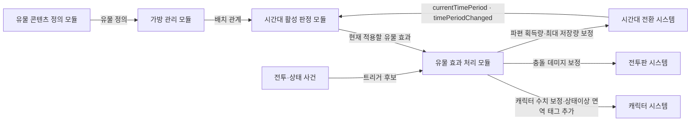
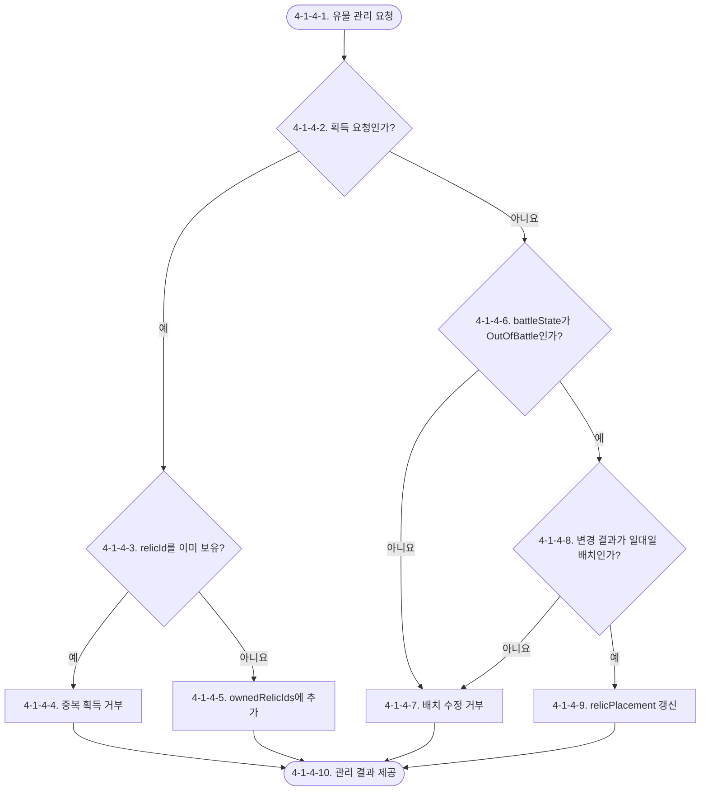
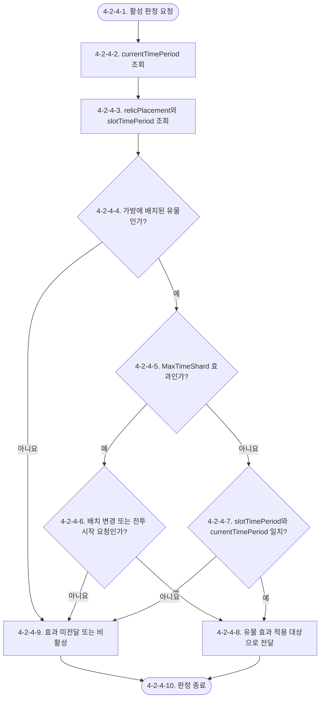
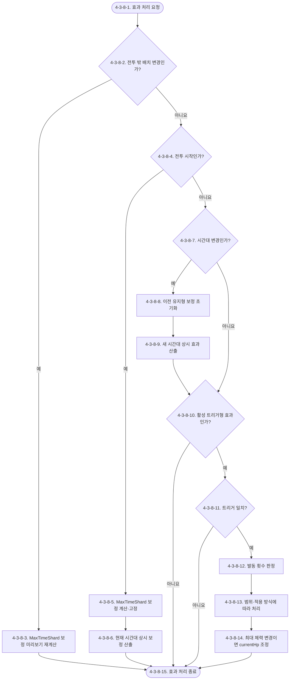
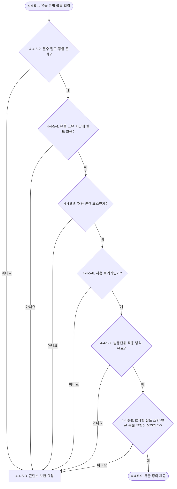

# Waredo 2.0 가방·유물 시스템 기획서

> 자료형 기준: [조정값 통합표의 공통 자료형 규칙](../문서관리/Waredo_2.0_기획_조정값_통합표.md#공통-자료형-규칙). ID는 `int`, 분류·태그는 `enum`을 사용한다.

> 최근 수정일: 2026-09-14
> 관련 검토: [문서 간 연결 이력](../문서관리/Waredo_2.0_연결성_검토.md)

> 결정 상태: `[확정]` — 기존 승인·확정 이동 이력 및 2026-09-14 후속 결정 반영. 개별 미정은 제외
> 검수 상태: `[수정 필요]` — 기존 연계 이슈·미정 항목 유지
> 문서 책임자: `[작성 필요]` · 검수자: `[작성 필요]`
> 최초 작성일: 2026-09-12 · 최근 수정일: 2026-09-14
> 기준 문서: `../../확정/Waredo_2.0_전체_기획_관리.md`
> 관련 문서: `Waredo_2.0_시간대_전환_시스템_기획서.md`, `Waredo_2.0_캐릭터_시스템_기획서.md`, `Waredo_2.0_전투판_시스템_기획서.md`, `Waredo_2.0_상태이상_시스템_기획서.md`
> 확정 범위: 공용 유물 관리, 12칸 시간대 가방, 배치 칸에 따른 효과 활성, 공격력·이동력·최대 체력·쿨타임·상태이상 면역 태그 및 자원 보정, 유물 콘텐츠 제작 문법. 개별 `[작성 필요]`·`[논의 필요]`·`[추후 기획]` 항목은 제외한다.
> 확정 기록: 2026-09-12 사용자 직접 승인으로 확정 폴더로 이동했다. 개별 콘텐츠 수치·FSM·최초 진입 미정은 제외하며, 충돌 피해 연계는 2026-09-14 반영 완료했다.

## 시스템 브리핑

- 가방·유물 시스템은 아군 캐릭터가 공통으로 소유하는 유물과 유물의 가방 배치를 관리한다.
- 가방은 과거·현재·미래 구역으로 나뉘며, 각 구역은 4칸씩 총 12칸으로 구성한다.

- 유물 자체에는 시간대 또는 시간대 태그가 없다.
- 일반 유물 효과는 유물이 배치된 가방 칸의 시간대와 전투의 현재 전투 시간대가 일치할 때 해당 배치 위치에서만 적용된다.
- 최대 시간 파편 저장량 효과는 배치 칸과 관계없이 모든 시간대에 공통 적용한다.
- 여기서 가방 칸은 전투판 셀과 관계없는 유물 관리 위치다.

- 유물이 변경할 수 있는 범위는 공격력, 이동력, 최대 체력, 쿨타임, 상태이상 면역 태그, 충돌 데미지, 시간 파편 획득량, 최대 시간 파편 저장량이다.
- 공격력 효과는 일반 공격만, 스킬만, 일반 공격과 스킬 둘 다 중 하나를 대상으로 지정한다.
- 여기서 스킬은 일반 스킬과 궁극기를 모두 포함한다.
- 상태이상 면역 태그 효과는 활성 시간대 동안 전체 아군에게 지정 태그를 추가한다.

- 최대 체력이 증가하면 증가량만큼 현재 체력도 회복하고, 증가 효과가 사라져 최대 체력이 감소할 때는 새 최대 체력을 넘는 초과 체력만 잘라낸다.
- 최대 시간 파편 저장량 효과는 모든 시간대에 공통 적용하며 전투 중에는 바뀌지 않는다.
- 충돌 데미지 효과는 충돌 피해 요청의 가해 진영이 아군일 때 아군이 주는 데미지만 변경한다.

- 유물 콘텐츠는 이 문서 4-4의 콘텐츠 기획 문법에 따라 문법 블록 형태로 작성한다.

## [확인 필요 목록]

1. `[작성 필요]` 개별 시간대 유지형 효과의 maxStackCount 수치. 반복 발동은 4-3-3-1의 중첩 규칙으로 확정했다. Instant 적용·소비·종료 시점은 FSM 정의 후 확정한다.
2. `[작성 필요]` 실제 유물 이름·ID·등급·수치와 추가 면역 태그를 작성해야 한다.
3. `[보류]` 전투 시작의 현재 시간대 초기화를 TimePeriodEntered로 처리할지 여부. 보류를 발동 또는 미발동 결정으로 해석하지 않는다.

## 유의사항

- 이 문서는 유물 공용 소유, 가방 구성·배치, 배치 칸 시간대에 따른 효과 활성, 허용 변경 요소·트리거와 콘텐츠 제작 문법을 다룬다.
- 실제 유물 목록, 유물별 이름·수치·밸런스는 아직 작성하지 않는다.
- 유물 획득처·판매·분해·정렬 규칙과 가방 조작 UI는 `[추후 기획]`으로 현재 범위에서 제외한다.
- 한 가방 칸에는 유물 하나만 배치할 수 있고, 한 유물은 한 칸을 차지한다.
- 유물 배치·해제·이동은 전투 밖에서만 가능하다.
- 동일한 유물은 다시 획득할 수 없다. 서로 다른 유물이 같은 공격력·이동력·최대 체력·쿨타임을 올리면 각 유물의 적용 조건을 만족하는 효과를 모두 중첩하여 반영한다.
- 캐릭터를 대상으로 하는 유물 효과는 트리거 발생 진영과 관계없이 전투불능 캐릭터를 제외한 전체 아군에게 적용한다. 시간 파편 효과는 파티 공용 자원에 적용한다. 충돌 데미지 효과는 충돌 피해 요청의 가해 진영이 아군일 때 아군이 주는 데미지만 변경한다.
- 최대 시간 파편 저장량 효과는 배치된 가방 칸의 시간대와 관계없이 모든 시간대에 공통 적용하며, 전투 시작 후 종료까지 같은 값을 유지한다.
- 전투 시작의 현재 시간대 초기화를 `시간대 진입 시`로 처리하는지는 이 문서에서 별도로 명시하지 않는다.
- 시간대의 현재 상태와 변경 알림은 시간대 전환 시스템이 단일 원본으로 소유한다.
- 캐릭터의 공격력·이동력·최대 체력·쿨타임 원본값과 보정 반영값 산출은 캐릭터 시스템이 소유한다.
- 충돌 발생 조건과 기본 충돌 피해는 전투판 시스템이 소유한다.
- 기절·띄워짐의 적용과 유지 규칙은 상태이상 시스템이 소유한다.
- 원본 우선순위는 이번 사용자 결정, 확정 시스템 문서, 프로토타입 참고 문서 순이다. 기존 프로토타입의 `relicTimeTags`와 캐릭터별 장착 규칙은 이번 결정과 충돌하므로 적용하지 않는다.

- 서로 다른 유물의 효과 중첩과 동일 유물의 반복 발동 중첩은 구별하며 후자는 4-3-3-1을 따른다.

# 1. 기획의도

- 유물의 효과 시간대를 유물 자체가 아니라 가방 배치로 결정하여, 플레이어가 같은 유물을 어느 시간대에 사용할지 선택하게 한다.
- 과거·현재·미래 각 4칸이라는 제한 안에서 유물의 적용 시점을 나누어 배치하고, 전투의 시간대 전환과 유물 조합을 함께 계획하는 선택의 재미를 제공한다.

- 캐릭터들이 유물을 공통으로 소유하도록 하여 개별 캐릭터 장착 관리보다 파티 전체의 전투 계획과 시간대 선택에 집중하게 한다.

# 2. 개발 목적

- 총 12칸의 가방 구조와 칸별 시간대 특징을 하나의 기준으로 관리한다.
- 유물 정의에서 시간대 데이터를 제거하고 배치 정보만으로 활성 여부를 판정한다.
- 유물이 변경할 수 있는 요소와 사용할 수 있는 트리거를 제한하여 콘텐츠 제작 범위를 일관되게 유지한다.
- 최대 체력 변경 시 현재 체력 조정 규칙을 통일한다.
- 캐릭터·전투판·상태이상·시간대 전환 시스템이 소유한 원본을 덮어쓰지 않고 유물 보정만 전달한다.

## 2.1 시스템 개요: 어떤 시스템인가

- 플레이어는 공용으로 소유한 유물을 과거·현재·미래 구역으로 나뉜 12칸 가방에 배치한다.
- 한 칸에는 유물 하나만 배치할 수 있으며 배치는 전투 밖에서만 수정한다.
- 전투 중에는 현재 시간대와 같은 특징을 가진 가방 칸의 유물 효과만 적용된다.
- 단, 최대 시간 파편 저장량 효과는 가방 칸의 시간대와 관계없이 모든 시간대에 공통 적용한다.
- 시간대가 바뀌면 그 밖의 활성 유물도 함께 바뀌며, 캐릭터 대상 효과는 전투불능을 제외한 전체 아군에게 적용된다.

## 2.2 사용자가 한 사이클 동안 하는 일

1. 플레이어는 공용으로 보유한 유물과 과거·현재·미래 각 4칸의 가방 구성을 확인한다.
2. 플레이어는 전투 밖에서 유물을 사용할 시간대를 고려해 빈 가방 칸에 유물을 하나씩 배치한다.
3. 전투가 시작되거나 시간대가 변경되면 시스템은 현재 시간대와 각 유물이 배치된 칸의 시간대를 비교한다.
4. 시간대가 일치하는 칸의 유물만 활성화되고, 일치하지 않는 칸의 유물 효과는 적용되지 않는다.
5. 활성 유물의 상시 효과는 현재 시간대 동안 유지되고, 트리거형 효과는 지정 사건이 발생하면 공격력·이동력·최대 체력·쿨타임 중 해당 보정을 제공한다.
6. 시간대가 다시 변경되면 새 시간대의 가방 칸을 기준으로 같은 과정을 반복한다.

- 사용자가 직접 수행하는 일은 유물 확인과 배치이며, 시간대 비교·활성 변경·트리거 판정·보정 전달은 시스템이 자동으로 처리한다.

## 2.3 핵심 작동 방식

- 유물 자체에는 시간대를 기록하지 않으며, 유물을 어느 가방 칸에 두었는지가 적용 시간대를 결정한다.
- 따라서 같은 유물도 현재 칸에 배치하면 현재에서, 과거 칸에 배치하면 과거에서, 미래 칸에 배치하면 미래에서만 적용된다.
- 단, 최대 시간 파편 저장량 효과는 배치 칸의 시간대와 관계없이 모든 시간대에 공통 적용한다.

- 유물은 다른 시스템의 원본값을 직접 바꾸지 않는다.
- 캐릭터 시스템에는 공격력·이동력·최대 체력·쿨타임 보정과 상태이상 면역 태그 추가를, 충돌에는 충돌 피해 요청의 가해 진영이 아군일 때 아군이 주는 데미지의 보정을, 시간 파편에는 획득량 또는 최대 저장량 보정을 제공한다.
- 실제 최종값과 사건 결과는 각 원본 시스템이 계산한다.

- 최대 체력은 유물 보정의 활성과 비활성에 따라 현재 체력도 함께 조정되는 예외가 있다.
- 최대 체력이 증가하면 그 증가량만큼 현재 체력도 회복하며, 증가 효과가 사라질 때는 현재 체력이 새 최대 체력을 넘는 경우에만 초과분을 제거한다.

- 아군과 적군 모두 발생시킬 수 있는 사건은 진영별 트리거로 나눈다.
- 공격에는 일반 공격, 스킬, 반격이 포함되고 충돌 피해는 포함하지 않는다.
- 피격은 실제 피해가 1 이상 발생했을 때 성립한다.
- 다중 대상·다단 공격의 발동 단위는 각 유물 콘텐츠가 정한다.
- 기절과 띄워짐은 같은 상태가 다시 적용될 때도 트리거가 발생한다.

- 트리거형 효과는 즉시 결과를 적용하거나 공격력·이동력·최대 체력·쿨타임 보정을 만든다.
- 트리거로 생긴 수치 보정은 해당 유물이 활성화된 시간대에서만 유지되며, 다른 시간대로 이동하면 제거된다.
- 이후 같은 시간대로 다시 돌아와도 이전 발동 상태를 복원하지 않고 초기 상태에서 다시 시작한다.

## 2.4 실제 처리 예시

- 최대 체력 증가 유물이 현재 시간대 칸에 배치되어 있고 전투의 시간대가 현재라고 가정한다.
- 유물 효과 적용 전 최대 체력을 변경 전 최대 체력, 적용 후 최대 체력을 변경 후 최대 체력라고 하면, 두 값의 증가분만큼 현재 체력도 회복한다.

- 이후 시간대가 과거로 변경되어 현재 칸의 유물이 비활성화되면 보정 반영 최대 체력는 유물 보정이 빠진 값으로 돌아간다.
- 이때 현재 체력가 새 보정 반영 최대 체력 이하라면 그대로 유지하고, 새 최대 체력을 넘는 경우에만 초과분을 제거한다.

- 유물을 전투 밖에서 과거 칸으로 옮겼다면 같은 유물이라도 과거에서만 적용된다.
- 전투 중에는 유물 배치를 수정할 수 없다.

## 2.5 시스템이 직접 정의하는 것

- 이 문서는 가방이 과거·현재·미래 각 4칸, 총 12칸이라는 구조와 유물의 배치 관계를 소유한다.
- 유물 자체에는 시간대를 저장하지 않으며, 현재 시간대와 배치 칸의 시간대가 일치하는지를 기준으로 효과 적용 여부를 결정한다.

- 이 문서는 유물에 사용할 수 있는 공격력·이동력·최대 체력·쿨타임·상태이상 면역 태그와 자원 변경 요소, 수치 연산, 진영별 트리거 목록, 트리거 발동 단위, 시간대 이탈 시 수치 보정·면역 태그 초기화, 최대 체력 증감 시 현재 체력 조정 규칙, 최대 시간 파편 저장량의 시간대 공통 적용, 아군이 주는 충돌 데미지 보정 범위, 유물 콘텐츠 작성 문법을 소유한다.

- 시간대 전환 시스템은 현재 전투 시간대와 시간대 변경 알림, 시간 파편의 기본 규칙을 소유한다.
- 캐릭터 시스템은 공격력·이동력·최대 체력·쿨타임의 원본값·보정 반영값과 현재 체력, 상태이상 면역 태그를 소유한다.
- 전투판 시스템은 충돌 판정과 기본 충돌 데미지를 소유한다.
- 상태이상 시스템은 기절·띄워짐 적용 결과를 소유한다.
- 가방·유물 시스템은 이 값을 참조하거나 보정을 전달할 뿐 원본 규칙을 다시 정의하지 않는다.

# 3. 시스템 구조

| 모듈명 | 핵심 책임 | 입력 | 출력 | 소유 데이터 | 참조 데이터 | 의존 모듈·시스템 |
|---|---|---|---|---|---|---|
| 가방 관리 모듈 | 공용 유물 획득과 12칸 배치 관계 관리 | 유물 획득, 배치·해제·이동 요청, 전투 여부 | 공용 유물 목록, 유물 배치 관계 | 보유 유물, 가방 칸 구성, 유물 배치 관계 | 전투 여부 | 전투 진입 및 종료 시스템 `[기존 유지]`, UI 시스템 `[작성 전]` |
| 시간대 활성 판정 모듈 | 현재 시간대와 가방 칸 시간대 비교 | 유물 배치 관계, `currentTimePeriod`, `timePeriodChanged` | 현재 적용할 유물 효과 | 활성 여부 파생 판정 | 시간대 상태 | 시간대 전환 시스템 |
| 유물 효과 처리 모듈 | 트리거와 상시 효과를 구분하고 허용된 보정 전달 | 현재 적용할 유물 효과, 배치 변경·전투 시작, 캐릭터·전투·상태 사건 | 공격력·이동력·최대 체력·쿨타임·상태이상 면역 태그·충돌 데미지·시간 파편 보정 | 트리거형 캐릭터 수치 보정, 시간대 상시 보정, 전투 고정 최대 저장량 보정 | 캐릭터·충돌·시간 파편·상태이상 결과 | 캐릭터·전투판·시간대 전환·상태이상 시스템 |
| 유물 콘텐츠 정의 모듈 | 유물과 효과의 공통 작성 문법 관리 | 유물 콘텐츠 블록 | 검증된 유물 정의 | 유물 ID·이름·설명·효과 정의 | 허용 변경 요소·공격력 적용 범위·상태이상 면역 태그·트리거 | 가방 관리·유물 효과 처리 모듈 |



> 관계도 설명: 유물 정의와 가방 배치는 가방·유물 시스템이 소유한다. 현재 시간대와 전투 사건은 외부 시스템에서 받고, 유물 효과는 원본값이 아니라 보정 형태로 각 소유 시스템에 전달한다.

# 4. 시스템 상세 구조

## 4-1. 가방 관리 모듈

### 4-1-1. 사용 변수·용어

| 변수·용어 | 이 모듈에서의 의미 | 자료형·값 형태 | 소유·성격 |
|---|---|---|---|
| `bagSlotId` | 12칸 중 한 가방 칸을 식별하는 값 | int | 가방 관리 모듈·원본 |
| `slotTimePeriod` | 가방 칸이 가진 시간대 특징 | enum | 가방 관리 모듈·원본 |
| `relicId` | 유물 콘텐츠를 식별하는 값 | int | 유물 콘텐츠 정의 모듈·참조 |
| `ownedRelicIds` | 아군 파티가 공용으로 획득한 유물 | int 목록 | 가방 관리 모듈·상태 |
| `relicPlacement` | 어떤 `relicId`가 어느 `bagSlotId` 한 칸에 배치됐는지 나타내는 일대일 관계 | int ID 간 배치 관계 | 가방 관리 모듈·상태 |
| `bagSlotCount` | 전체 가방 칸 수 | int | 가방 관리 모듈·원본 |
| `slotCountPerTimePeriod` | 각 시간대가 가지는 가방 칸 수 | int | 가방 관리 모듈·원본 |
| `battleState` | 현재 전투 중인지 전투 밖인지 구분하는 상태 | enum | 전투 진입 및 종료 시스템·참조, 세부 기획서 `[기존 유지]` |

### 4-1-2. 목적·입력·처리·출력

- 목적: 아군 캐릭터가 공통으로 소유하는 유물과 총 12칸의 가방 배치 관계를 관리한다.
- 입력: 유물 획득 요청과 특정 가방 칸에 유물을 배치·해제·이동하려는 요청을 받는다.
- 처리: 획득하려는 유물 ID가 공용 보유 유물에 이미 있으면 중복 획득을 막는다. `battleState = OutOfBattle`일 때만 배치를 수정하고, 한 가방 칸 ID에는 하나의 유물 ID만 연결한다.
- 출력: 공용 공용 보유 유물, 갱신된 유물 배치 관계, 획득·배치 성공 또는 실패 결과를 제공한다.
- 소유 데이터: 가방 칸 ID, 가방 칸 시간대, 공용 보유 유물, 유물 배치 관계, 전체 가방 칸 수, 시간대별 가방 칸 수.
- 참조 데이터: 유물 콘텐츠 정의 모듈의 유물 ID, 전투 진입 및 종료 시스템의 전투 중·밖 구분.
- 의존 모듈: 유물 콘텐츠 정의 모듈에서 유효한 유물인지 확인하고, 전투 진입 및 종료 시스템에서 전투 여부를 참조한다. UI 시스템은 아직 `[작성 전]`이다.
- 실패·취소·예외: 이미 획득한 유물 ID의 중복 획득 요청, 전투 중 배치 수정 요청, 변경 결과가 한 칸당 유물 하나·유물당 한 칸 조건을 위반하는 요청은 반영하지 않는다.

### 4-1-3. 외부 변수 참조 출처

| 참조 변수 | 가져오는 시스템 | 원본 모듈·데이터 | 현재 모듈에서의 사용 | 원본 문서·번호 |
|---|---|---|---|---|
| `battleState` | 전투 진입 및 종료 시스템 | 전투 진입·종료 상태 | 유물 배치 수정 가능 여부 판정 | 기획서 `[기존 유지]`, 세부 번호 `[작성 전]` |

### 4-1-4. 가방 관리 순서도



| 번호 | 처리 설명 |
|---|---|
| 4-1-4-1 | 유물 획득 또는 가방 배치 수정 요청을 받는다. |
| 4-1-4-2 | 요청이 유물 획득인지 배치·해제·이동인지 구분한다. |
| 4-1-4-3 | 획득 요청이면 `ownedRelicIds`에 같은 `relicId`가 있는지 확인한다. |
| 4-1-4-4 | 같은 유물을 이미 보유했다면 중복 획득을 거부한다. |
| 4-1-4-5 | 보유하지 않은 유물이면 `ownedRelicIds`에 추가한다. |
| 4-1-4-6 | 배치 수정 요청이면 `battleState = OutOfBattle`인지 확인한다. |
| 4-1-4-7 | 전투 중이거나 배치 조건을 만족하지 않으면 기존 `relicPlacement`를 유지한다. |
| 4-1-4-8 | 요청을 반영한 최종 관계가 한 `bagSlotId`당 유물 하나, 한 `relicId`당 가방 칸 하나인지 확인한다. |
| 4-1-4-9 | 일대일 조건을 만족하면 배치·해제·이동 결과에 맞춰 `relicPlacement`를 갱신한다. |
| 4-1-4-10 | 획득·배치의 성공 또는 실패 결과를 제공하고 관리 흐름을 종료한다. |

## 4-2. 시간대 활성 판정 모듈

### 4-2-1. 사용 변수·용어

| 변수·용어 | 이 모듈에서의 의미 | 자료형·값 형태 | 소유·성격 |
|---|---|---|---|
| `relicPlacement` | 유물과 가방 칸의 현재 배치 관계 | int ID 간 배치 관계 | 가방 관리 모듈·참조 |
| `slotTimePeriod` | 유물이 배치된 가방 칸의 시간대 특징 | enum | 가방 관리 모듈·참조 |
| `currentTimePeriod` | 현재 전투가 위치한 시간대 | enum | 시간대 전환 시스템 > 시간대 상태 모듈·참조 |
| `timePeriodChanged` | 현재 시간대가 변경되어 재판정할 시점을 알리는 신호 | 사건 (값 없는 알림) | 시간대 전환 시스템 > 시간대 효과·연동 모듈·참조 |
| 계산 용어 | 유물 효과 적용 여부: 유물의 개별 효과 줄을 현재 적용할지 나타내는 판정 / 참/거짓 / 일반 효과 줄은 `slotTimePeriod == currentTimePeriod`, `MaxTimeShard` 효과 줄은 배치 여부로 산출하는 파생 판정·계산 결과 | — | — |

### 4-2-2. 목적·입력·처리·출력

- 목적: 유물 자체의 시간대 없이 배치된 가방 칸과 현재 시간대만으로 효과 적용 여부를 판정한다.
- 입력: 유물 배치 관계, 가방 칸 시간대, 현재 전투 시간대, 시간대 변경 알림.
- 처리: 하나의 유물에 여러 효과 줄이 있으면 각 효과 줄의 유물 효과 적용 여부를 따로 판정한다.
- 일반 효과 줄은 유물이 배치된 칸의 가방 칸 시간대와 현재 전투 시간대가 같으면 `true`, 다르면 `false`다.
- 최대 시간 파편 저장량 효과 줄은 유물이 어느 시간대 칸에 배치됐는지와 관계없이 가방에 배치되어 있으면 `true`지만, 효과 처리 모듈에는 전투 밖 배치 변경과 전투 시작에만 전달한다.
- 출력: 유물 효과 처리 모듈에 현재 적용할 유물 효과를 제공한다.
- 소유 데이터: 유물 효과 적용 여부는 배치와 현재 시간대에 따라 판단한다.
- 참조 데이터: 가방 관리 모듈의 배치·칸 시간대, 시간대 전환 시스템의 현재 시간대·변경 신호.
- 의존 모듈: 시간대 변경 알림를 받으면 현재 전투 시간대를 다시 읽어 판정한다.
- 실패·취소·예외: 유물이 가방 칸에 배치되지 않았다면 적용할 위치가 없으므로 효과를 적용하지 않는다.
- 최대 시간 파편 저장량 효과는 시간대 변경으로 다시 켜지거나 꺼지지 않으며 전투 시작 시 확정된 값을 전투 종료까지 유지한다.
- 전투 시작의 현재 시간대 초기화를 시간대 진입 트리거로 볼지는 이 문서에서 규칙으로 명시하지 않는다.

### 4-2-3. 외부 변수 참조 출처

| 참조 변수 | 가져오는 시스템 | 원본 모듈·데이터 | 현재 모듈에서의 사용 | 원본 문서·번호 |
|---|---|---|---|---|
| `currentTimePeriod` | 시간대 전환 시스템 | 시간대 상태 모듈 | 가방 칸 시간대와 비교 | `Waredo_2.0_시간대_전환_시스템_기획서.md` 4-1 |
| `timePeriodChanged` | 시간대 전환 시스템 | 시간대 효과·연동 모듈 | 활성 효과 재판정 시점 확인 | `Waredo_2.0_시간대_전환_시스템_기획서.md` 4-4 |

### 4-2-4. 시간대 활성 판정 순서도



| 번호 | 처리 설명 |
|---|---|
| 4-2-4-1 | 전투 시작, 전투 밖의 배치 변경 또는 `timePeriodChanged` 수신으로 활성 판정을 시작한다. |
| 4-2-4-2 | 시간대 전환 시스템의 `currentTimePeriod`를 조회한다. |
| 4-2-4-3 | 각 유물의 `relicPlacement`와 해당 칸의 `slotTimePeriod`를 조회한다. |
| 4-2-4-4 | 유물이 가방에 배치되어 있는지 확인한다. |
| 4-2-4-5 | 효과 줄이 모든 시간대에 공통 적용되는 `MaxTimeShard`인지 확인한다. |
| 4-2-4-6 | `MaxTimeShard` 효과 줄이면 요청 원인이 전투 밖 배치 변경 또는 전투 시작인지 확인한다. 시간대 변경 요청에는 다시 전달하지 않는다. |
| 4-2-4-7 | 일반 효과 줄이라면 `slotTimePeriod == currentTimePeriod`인지 확인한다. |
| 4-2-4-8 | 배치 변경·전투 시작 때의 `MaxTimeShard` 효과 줄 또는 현재 시간대와 일치하는 일반 효과 줄을 유물 효과 처리 모듈에 전달한다. |
| 4-2-4-9 | 시간대가 일치하지 않는 일반 효과 줄과 배치되지 않은 유물은 비활성 처리한다. 시간대 변경 때의 `MaxTimeShard` 효과 줄은 전투 시작에 고정한 값을 유지하고 다시 전달하지 않는다. |
| 4-2-4-10 | 모든 유물의 개별 효과 줄 판정을 마치고 종료한다. |

## 4-3. 유물 효과 처리 모듈

### 4-3-1. 사용 변수·용어

| 변수·용어 | 이 모듈에서의 의미 | 자료형·값 형태 | 소유·성격 |
|---|---|---|---|
| 계산 용어 | 유물 효과 적용 여부: 유물의 개별 효과 줄을 현재 적용할지 나타내는 판정 / 참/거짓 / 시간대 활성 판정 모듈·참조 | — | — |
| `relicTriggerType` | 유물 효과가 반응할 사건 종류 | enum | 유물 콘텐츠 정의 모듈·원본 |
| `relicChangeElement` | 유물이 변경할 요소 | enum | 유물 콘텐츠 정의 모듈·원본 |
| `attackPowerScope` | 공격력 효과가 적용될 공격 종류 | enum | 유물 콘텐츠 정의 모듈·원본, `AttackPower` 전용 |
| `statusImmunityTag` | 전체 아군에게 추가할 상태이상 면역 태그 | enum (상태 태그) | 유물 콘텐츠 정의 모듈·원본, `StatusImmunityTag` 전용 |
| `relicEffectOperation` | 효과에 적용할 연산 | enum | 유물 콘텐츠 정의 모듈·원본 |
| `relicEffectValue` | 수치 효과의 보정값 | float (수치 효과 전용) | 유물 콘텐츠 정의 모듈·원본 |
| `triggerCountRule` | 다중 대상·다단 사건에서 한 유물이 발동할 단위 | enum | 유물 콘텐츠 정의 모듈·원본 |
| `relicEffectMode` | 효과를 적용하는 방식 | enum | 유물 콘텐츠 정의 모듈·원본 |
| `activeTriggeredCharacterStatModifiers` | 현재 시간대에서 트리거로 발생해 유지 중인 공격력·이동력·최대 체력·쿨타임 보정 | 보정 목록 | 유물 효과 처리 모듈·상태, 시간대 이탈 시 초기화 |
| `activeTimePeriodConstantModifiers` | 현재 시간대에 활성화된 상태이상 면역 태그·충돌 데미지·시간 파편 획득량 상시 효과 | 효과 목록 | 유물 효과 처리 모듈·상태, 전투 시작·시간대 변경 시 재산출 |
| `currentHp` | 캐릭터의 현재 체력 | int | 캐릭터 시스템 > 체력 상태 데이터·참조 |
| `effectiveMaxHp` | 현재 보정을 반영한 캐릭터 최대 체력 | int | 캐릭터 시스템 > 최대 체력 계산·참조 |
| 계산 용어 | 변경 전 최대 체력: 유물 보정 변경 직전의 `effectiveMaxHp` / 정수 / 최대 체력 증감 설명용 계산 용어·계산 결과 | — | — |
| 계산 용어 | 변경 후 최대 체력: 유물 보정 변경 직후의 `effectiveMaxHp` / 정수 / 최대 체력 증감 설명용 계산 용어·계산 결과 | — | — |
| `collisionDamageDealerFaction` | 개별 충돌 피해 요청에서 유물 보정에 사용할 가해 진영(밀치기는 시전자 진영) | enum | 전투판 시스템 4-3이 제공하는 참조 입력 |
| `collisionDamageModifier` | 아군이 주는 충돌 데미지에 전달할 유물 보정 | 보정값 | 가방·유물 시스템 출력, 전투판 시스템 참조 입력 |
| `timeShardGainModifier` | 기존 시간 파편 획득 사건의 지급량에 전달할 유물 보정 | 보정값 | 가방·유물 시스템 출력 |
| `maxTimeShardModifier` | 기본 최대 시간 파편 저장량에 전달할 유물 보정 | 보정값 | 가방·유물 시스템 출력 |

### 4-3-2. 목적·입력·처리·출력

- Instant의 적용계산·적용시점·종료시점은 [유물 문법 관리표](../문서관리/Waredo_2.0_유물_문법_관리표.md) 1.3에 기록하고 FSM 정의 후 확정한다. 아래 ‘즉시 처리’만으로 현재 피해에 소급 적용하거나 지속 종료를 추정하지 않는다.

- 목적: 현재 적용 가능한 유물 효과가 지정 트리거에 반응하도록 하고, 허용된 변경 요소에만 보정을 제공한다. 상태이상 면역 태그, 충돌 데미지, 시간 파편 획득량은 현재 시간대 상시 효과로 제공하고, 최대 시간 파편 저장량는 전투 밖의 배치 변경과 전투 시작에 별도 계산해 전투 중 고정한다.
- 입력: 유물 효과 적용 여부, 유물 효과 정의, 전투 밖의 배치 변경, 전투 시작, 전투·상태이상·시간대 사건.
- 처리: 최대 시간 파편 저장량 효과는 트리거를 사용하지 않고 가방에 배치된 모든 해당 효과를 전투 밖에서 다시 계산하며, 전투 시작 시 최종 보정을 고정한다.
- 상태이상 면역 태그, 충돌 데미지, 시간 파편 획득량도 트리거를 사용하지 않고 전투 시작·시간대 변경 시 현재 활성 효과를 현재 시간대의 상시 효과로 다시 산출한다.
- 캐릭터 시스템은 상태이상 적용 판정 직전에 추가 면역 태그를, 전투판 시스템은 개별 충돌 피해 계산 직전에 유물 충돌 피해 보정를, 시간대 전환 시스템은 기존 시간 파편 지급량 계산 직전에 유물 파편 획득량 보정를 조회한다.
- 그 밖의 비활성 유물은 처리하지 않는다.
- 활성 트리거형 유물은 진영이 구분된 유물 발동 조건과 사건이 일치할 때 유물 발동 단위에 따라 발동 횟수를 정한다.
- 캐릭터 대상 효과는 전투불능을 제외한 전체 아군에게 적용한다.
- `relicEffectMode = Instant`이면 즉시 처리하고, `TimePeriodCharacterStat`이면 현재 시간대에서만 공격력·이동력·최대 체력·쿨타임 보정을 유지한다.
- 출력: 캐릭터 시스템에는 공격력·이동력·최대 체력·쿨타임 보정과 상태이상 면역 태그 추가, 전투판 시스템에는 유물 충돌 피해 보정, 시간대 전환 시스템에는 유물 파편 획득량 보정 또는 유물 최대 파편 저장량 보정를 전달한다.
- 소유 데이터: 유물 발동 조건, 유물 변경 요소, 공격력 적용 범위, 추가 면역 태그, 유물 효과 연산, 유물 효과 수치, 유물 발동 단위, 유물 효과 유지 방식는 콘텐츠 정의가 소유한다.
- 현재 시간대에서 유지 중인 트리거형 캐릭터 수치 보정은 현재 시간대의 발동 후 유지 보정, 시간대 상시 효과는 현재 시간대의 상시 효과로 관리한다.
- 참조 데이터: 공격력·이동력·최대 체력·쿨타임, 상태이상 면역 태그, 충돌 사건과 개별 피해 요청의 가해 진영, 시간 파편 사건, 기절·띄워짐 적용 결과, 시간대 변경 결과.
- 의존 모듈: 각 원본 시스템에 보정을 전달하고 최종 결과를 받는다.
- 실패·취소·예외: 비활성 유물, 일치하지 않는 트리거, 허용되지 않은 변경 요소에는 효과를 적용하지 않는다.
- 단, 상태이상 면역 태그, 충돌 데미지, 시간 파편 획득량, 최대 시간 파편 저장량의 상시 효과는 트리거 일치 판정을 사용하지 않는다.
- `currentHp <= 0`인 전투불능 캐릭터는 모든 캐릭터 대상 유물 효과에서 제외한다.
- 시간대 이탈 시 제거된 수치 보정과 면역 태그는 같은 시간대로 돌아와도 이전 트리거 상태를 복원하지 않는다.

### 4-3-3. 허용 트리거

- 피격 트리거의 발동 단위는 Hit(타격당)로 고정한다. 실제 피해 1 이상인 캐릭터별 피격 한 건을 1회로 세므로 한 캐릭터 3회 피격과 세 캐릭터 각 1회 피격은 모두 3회다. 피해 0·회복·환경요소는 이 피격 집계에서 제외한다.
- Action은 일반 공격·스킬 실행 하나 또는 반격 발동 하나, Target은 그 실행 안의 서로 다른 대상 개체별 1회, Event는 고유 사건별 1회다. Hit는 대상별 개별 피격마다 1회다. 피격 외 트리거의 발동 단위 선택지는 유지한다.
- 피해 결과로 발동한 유지형 보정은 해당 피격을 확정한 뒤 반영하고 다음 타격부터 조회한다. 원인이 된 피해를 소급 재계산하지 않는다. 유지형 반복 중첩은 4-3-3-1을 따르며 Instant의 계산 시점·종료만 FSM 이후 확정한다.

| `relicTriggerType` | 표시명 |
|---|---|
| `TimePeriodEntered` | 시간대 진입 시 |
| `AllyDamaged` | 아군 피격 시 |
| `EnemyDamaged` | 적군 피격 시 |
| `EnemyDied` | 적 캐릭터 사망 시 |
| `AllyDied` | 아군 캐릭터 사망 시 |
| `AllyAttackPerformed` | 아군 공격 시 |
| `EnemyAttackPerformed` | 적군 공격 시 |
| `AllyCriticalOccurred` | 아군 치명타 발생 시 |
| `EnemyCriticalOccurred` | 적군 치명타 발생 시 |
| `AllyStunned` | 아군 기절 시 |
| `EnemyStunned` | 적군 기절 시 |
| `AllyAirborneApplied` | 아군 띄워짐 시 |
| `EnemyAirborneApplied` | 적군 띄워짐 시 |
| `EnvironmentDestroyed` | 환경요소 파괴 시 |
| `None` | 트리거 없음, `StatusImmunityTag`·`CollisionDamage`·`TimeShardGain`·`MaxTimeShard` 전용 |

- 양 진영에서 발생할 수 있는 피격·공격·치명타·기절·띄워짐은 아군용과 적군용 트리거로 나눈다.
- 공격은 일반 공격, 스킬 공격, 반격을 포함한다. 충돌 데미지는 공격 트리거에 포함하지 않는다.
- 캐릭터 피격 트리거는 실제 피해가 1 이상 발생했을 때만 성립한다. 환경요소의 피격 파괴 판정과는 구분한다.
- `EnvironmentDestroyed`는 환경요소가 존재에서 파괴로 바뀔 때 발생하는 별도 트리거다. 피해량 0의 피격으로 박스가 파괴되어도 발생한다. 바위 피격·잘못된 배치 제외·이미 파괴된 요소에는 발생하지 않는다. 진영을 나누지 않는 환경요소 파괴 사건이며, 다중 파괴의 효과 발동 횟수는 `triggerCountRule`을 따른다. 가상 시뮬레이션에서는 가상 효과만 발생한다.
- 환경요소는 `EnvironmentDestroyed`만 트리거로 발생시키며, 환경요소에 대한 공격·피격·충돌은 기존 캐릭터용 공격·피격 트리거에 해당하지 않는다. 같은 행동의 캐릭터 대상 사건은 별도 판정한다.
- 환경요소 파괴 1개당 기본 시간 파편 5를 받는다. 지급은 [시간대 전환 시스템](Waredo_2.0_시간대_전환_시스템_기획서.md) 4-2가 소유하며, 이 시스템은 기존 `TimeShardGain` 보정만 제공한다. 유물의 `triggerCountRule`은 유물 효과 발동 횟수이며 기본 파편 지급 단위를 바꾸지 않는다.
- 기절과 띄워짐은 같은 상태가 이미 있어도 적용이 다시 성공하면 트리거가 다시 발생한다.
- 다중 대상·다단 공격의 발동 횟수는 각 유물의 유물 발동 단위에 따라 정한다.
- 전투 시작 시 현재 시간대 초기화를 `TimePeriodEntered`로 처리할지는 `[보류]`다. 기존 시간대 전환 사건과 상시 효과 초기화 규칙은 유지한다.
- `None`은 상태이상 면역 태그, 충돌 데미지, 시간 파편 획득량, 최대 시간 파편 저장량의 상시 효과에만 사용하며 공격력·이동력·최대 체력·쿨타임의 트리거형 효과에는 사용할 수 없다.

### 4-3-3-1. 시간대 유지형 반복 중첩

| 변수 | 자료형 | 소유·허용값 |
|---|---|---|
| maxStackCount | int | 효과 콘텐츠·1 이상 필수 |
| activeStackCount | int | 유물 효과 처리 상태·0~maxStackCount |

- TimePeriodCharacterStat 효과는 유물 ID·효과 번호별로 중첩을 관리한다. 한 번의 유효 발동마다 1중첩을 추가한다. 피격 트리거는 실제 피해 1 이상인 대상별 피격 한 건을 한 번으로 센다.
- 최대 중첩 수 maxStackCount는 효과 콘텐츠가 소유하는 1 이상의 int 필수값이다. 미입력은 [작성 필요]이며 0·무제한으로 자동 대체하지 않는다. 효과마다 다른 상한을 설정할 수 있다.
- 현재 중첩 수 activeStackCount는 전투 상태이며 최초 0, 발동 시 min(activeStackCount+1, maxStackCount)로 갱신한다. 상한 도달 후에도 사건·발동 횟수는 집계하지만 보정은 추가하지 않는다.
- 각 중첩은 해당 효과의 동일한 보정 한 건이다. Add·Subtract·Percent는 기존 합산 계층에 중첩 수만큼 포함하고 Multiply는 중첩 수만큼 곱한다. 중간 반올림 없이 4-3-4의 순서를 따른다.
- 예: +2 효과 3중첩은 +6, ×2 효과 3중첩은 ×8이다. 예시 수치는 콘텐츠 확정값이 아니다.
- 피격 결과로 생긴 중첩은 해당 피해 확정 후 반영하며 다음 타격부터 적용한다. 시간대 이탈 시 중첩과 보정을 모두 제거하고 재진입 시 0부터 시작한다.
- 다른 적용 방식에는 이 유지형 중첩 규칙을 적용하지 않는다. Instant의 소비·종료 경계는 FSM 후 확정한다.

### 4-3-4. 허용 변경 요소


| `relicChangeElement` | 표시명 | 변경 범위 | 추가 필드 | 원본 소유 시스템 |
|---|---|---|---|---|
| `AttackPower` | 공격력 | 일반 공격 피해, 스킬 피해 또는 둘 다 | `attackPowerScope` 필수 | 캐릭터 시스템 |
| `MoveRange` | 이동력 | 아군의 이동 가능 거리 | 없음 | 캐릭터 시스템 |
| `MaxHp` | 최대 체력 | 아군의 최대 체력 | 없음 | 캐릭터 시스템 |
| `Cooldown` | 쿨타임 | 일반 스킬·궁극기가 공유하는 최대 쿨타임 | 없음 | 캐릭터 시스템 |
| `StatusImmunityTag` | 상태이상 면역 태그 | 활성 시간대 동안 전체 아군에게 지정 면역 태그 추가 | `statusImmunityTag` 필수 | 캐릭터 시스템 |
| `CollisionDamage` | 충돌 데미지 | 가해 Ally·피해 대상 Enemy인 충돌 피해 요청의 데미지 | 없음 | 전투판 시스템 |
| `TimeShardGain` | 시간 파편 획득량 | 기존 시간 파편 획득 사건의 지급량 | 없음 | 시간대 전환 시스템 |
| `MaxTimeShard` | 최대 시간 파편 저장량 | 모든 시간대 공통 최대 저장량 | 없음 | 시간대 전환 시스템 |

- 이 여덟 종류 외의 요소는 현재 유물 콘텐츠에서 사용할 수 없다.
- 공격력·이동력·최대 체력·쿨타임의 결과는 전투불능을 제외한 전체 아군에게 적용한다.

- 공격력의 공격력 적용 범위는 다음 세 값 중 하나다.

| `attackPowerScope` | 표시명 | 적용 대상 |
|---|---|---|
| `NormalAttack` | 일반 공격 | 일반 공격의 수치 효과만 보정. 회복에도 적용 |
| `Skill` | 스킬 | 일반 스킬과 궁극기의 수치 효과만 보정. 회복에도 적용 |
| `Both` | 둘 다 | 일반 공격, 일반 스킬, 궁극기의 수치 효과를 모두 보정. 회복에도 적용 |

- 상태이상 면역 태그는 추가 면역 태그에 지정한 태그를 현재 시간대의 전체 아군에게 추가한다.
- 시간대를 벗어나면 유물이 추가한 태그만 제거하며 캐릭터 원본 면역 태그는 변경하지 않는다.
- 면역 태그가 추가되면 해당 태그에 대응하는 현재 상태이상을 즉시 제거한다. 다른 태그의 상태는 제거하지 않는다. 이후 해당 면역이 유지되는 동안 같은 상태의 새 적용을 막는다.
- 유물 면역이 해제되어도 이미 제거한 상태이상을 되살리거나 남은 지속시간을 복원하지 않는다. 실제 상태 제거는 [상태이상](Waredo_2.0_상태이상_시스템_기획서.md) 4-1-2를 따른다.

- 충돌 유물 보정은 가해 진영이 Ally이고 피해 대상이 Enemy인 캐릭터일 때만 적용한다. 아군·환경요소 대상 및 Enemy·Neutral 가해 요청에는 적용하지 않는다. 충돌 기본 피해 자체는 기존 피해 대상 규칙대로 처리한다.
- 가해 진영 정보가 없는 충돌 피해 요청에는 보정을 적용하지 않는다.

- 밀치기로 발생한 충돌은 다음 일반 규칙보다 우선하여 `collisionDamageDealerFaction`을 **밀친 캐릭터(시전자)의 진영**으로 정한다. 아군 시전자면 `Ally`, 적군 시전자면 `Enemy`다. 밀려난 대상의 진영을 뒤집는 뜻이 아니다.
- 밀치기가 아닌 충돌 피해 요청의 가해 진영은 피해를 받는 대상의 반대편 충돌 참여자로 정한다.
- 접근 캐릭터가 기존 점유 캐릭터에게 주는 피해 요청은 접근 캐릭터의 진영을, 기존 점유 캐릭터가 접근 캐릭터에게 주는 피해 요청은 기존 점유 캐릭터의 진영을 사용한다.
- 밀치기에서는 위 시전자 진영 규칙을 적용한다. 당기기 등 다른 이동 원인의 진영 판정은 이번 결정으로 변경하지 않는다.
- 밀치기로 발생한 경계·환경요소 충돌에도 시전자 진영 규칙을 적용한다. 밀치기가 아닌 경우, 경계나 진영 없는 환경요소가 접근 캐릭터에게 주는 피해는 `Neutral`이며 보정을 적용하지 않는다.
- 밀치기가 아닌 경우 캐릭터가 환경요소에 주는 피해는 해당 캐릭터의 진영을 사용한다.

- 공격력·이동력·최대 체력·쿨타임·충돌 데미지·시간 파편 획득량에는 다음 네 수치 연산을 사용할 수 있다. 최대 시간 파편 저장량은 4-3-6의 감소 금지 예외를 따른다.
- 각 수치 효과는 연산 하나와 수치 하나를 작성한다.

| `relicEffectOperation` | 표시명 | 계산 의미 |
|---|---|---|
| `Add` | 더하기 | 보정 전 값에 `relicEffectValue`를 더한다. |
| `Multiply` | 곱하기 | 보정 전 값에 `relicEffectValue`를 곱한다. |
| `Subtract` | 빼기 | 보정 전 값에서 `relicEffectValue`를 뺀다. |
| `Percent` | 비율 보정 | 보정 전 값에 `1 + relicEffectValue / 100`을 곱한다. 음수 수치는 비율 감소로 사용한다. |

- `Percent`의 유물 효과 수치는 백분율 숫자로 작성한다.
- 예를 들어 `20`은 `+20%`이며, 원본 시스템이 비율 가산값을 `0.2`처럼 받는 경우 유물 효과 처리 모듈이 전달 전에 `20 / 100`으로 변환한다.

- 상태이상 면역 태그는 수치 연산을 사용하지 않고 `AddTag`로 지정 태그를 추가한다.
- 보정의 공통 순서는 합연산 완료 → 곱연산 적용 → 최종 반올림 → 대상 값의 기존 하한·상한 적용이다. 중간 단계에서는 반올림하지 않는다.
- 더하기와 빼기는 기본값에 대한 합연산 단계에서 모두 반영한다. 곱하기 배율은 그 결과에 적용한다.
- Percent는 기존 같은 계층 비율 합산 규칙을 따른다. 백분율을 합산해 `max(0, 1 + 합산 백분율 / 100)`을 만든 뒤 곱연산 단계에 적용한다. 별도 Multiply 효과가 여러 개면 각각의 배율을 곱한다.
- 계산 요약: `(기본값 + 더하기 합계 - 빼기 합계) × 합산 비율 배율 × 곱하기 배율들의 곱`. 비율·곱하기 보정이 없으면 해당 배율은 1이다.
- 예: 기본 공격력 10에 서로 다른 유물의 +2, +3과 ×2가 적용되면 `(10 + 2 + 3) × 2 = 30`이다. 예시 수치는 실제 유물 콘텐츠가 아니다.
- 캐릭터의 고정 보정·합산 비율 보정은 이 순서의 해당 계층에 한 번만 포함한다. 유물에서 계산한 결과에 같은 보정을 다시 중복 적용하지 않는다. 피해 치명타 등 별도 배율도 최종 반올림 전에 적용하며 원본 적용 조건을 유지한다.

- 상태이상 면역 태그, 충돌 데미지, 시간 파편 획득량은 `relicTriggerType = None`, `triggerCountRule = None`, `relicEffectMode = TimePeriodConstant`로 작성한다.
- 전투 시작과 시간대 변경 시 현재 시간대에 활성화된 효과를 다시 산출한다.
- 캐릭터 시스템은 상태이상 적용 판정 직전에 추가 면역 태그를, 원본 자원 시스템은 실제 충돌 피해 또는 기존 시간 파편 지급량을 계산하기 직전에 해당 보정을 조회한다.

- 시간 파편 획득량은 기존에 발생한 시간 파편 획득 사건의 획득량만 변경할 수 있다.
- 유물은 새로운 시간 파편 획득 사건을 만들 수 없다.

- 위 공격력 적용 범위는 회복형에도 동일하게 적용한다. 회복의 상한·치명타 제외는 [캐릭터](Waredo_2.0_캐릭터_시스템_기획서.md) 4-1-5-5를 따른다.

### 4-3-5. 최대 체력 변경 규칙

- 효과 해제 후 트리거 재성립으로 최대 체력이 다시 증가하여 현재 체력도 증가하는 결과는 의도된 동작이다. 향후 밸런싱 과정에서 수정될 수 있다. 시간대 재진입만으로 이전 트리거 보정을 자동 복원하지 않는다.
- 같은 시간대 전환에서 여러 효과가 제거·적용되면 전환 전 최대 체력과 모든 효과 반영 후 최종 최대 체력을 비교해 현재 체력을 한 번만 조정한다. 전환 내부의 임시 증감마다 반복 회복하지 않는다.

- 유물 효과로 보정 반영 최대 체력가 증가하면 증가한 값만큼 현재 체력도 회복한다.

```text
최대 체력 증가량 = newEffectiveMaxHp - oldEffectiveMaxHp
currentHp = min(newEffectiveMaxHp, currentHp + 최대 체력 증가량)
```

- 유물 효과가 해제되거나 감소하여 보정 반영 최대 체력가 낮아지면 현재 체력에서 감소량을 그대로 빼지 않는다.
- 현재 체력이 새 최대 체력을 넘는 경우에만 초과분을 제거한다.

```text
currentHp = min(currentHp, newEffectiveMaxHp)
```

- `currentHp <= 0`인 전투불능 캐릭터는 최대 체력 증가와 회복 대상에서 제외한다.

### 4-3-6. 시간 파편 변경 규칙

- MaxTimeShard는 감소할 수 없다. Add는 0 이상, Multiply는 1 이상, Percent는 0 이상만 허용하고 Subtract는 허용하지 않는다. 최대 저장량은 기본값 100 이상이며 이 제한은 전투 시작 전 콘텐츠 검증에도 적용한다. 다른 수치 요소의 네 연산 허용과 구별되는 예외다.
- TimeShardGain의 보정 후 획득량 하한은 0이며 음수 결과로 기존 보유량을 차감하지 않는다. 최종 지급식은 시간대 전환 4-2-2를 따른다.

- 시간 파편 획득량은 시간대 전환 시스템에 이미 정의된 시간 파편 획득 사건의 지급량만 변경한다. 유물 효과로 새로운 획득 사건을 만들 수 없다.
- 최대 시간 파편 저장량는 `relicTriggerType = None`, `triggerCountRule = None`, `relicEffectMode = BattleConstant`로 작성하며 기본 최대 저장량 100에 적용할 보정을 제공한다.
- 전투 밖에서 유물 배치가 바뀔 때마다 가방에 배치된 모든 최대 시간 파편 저장량 효과를 다시 계산한다. 이 효과는 배치 칸의 시간대와 관계없이 모든 시간대에 공통 적용한다.
- 전투 시작 시 최종 유물 최대 파편 저장량 보정를 고정하고 시간대 전환 시스템이 최대 파편 저장량를 계산한다. 유물 배치·해제·이동은 전투 밖에서만 가능하므로 전투 종료까지 이 값을 다시 계산하지 않는다.
- 따라서 본 문서가 다루는 전투 안에서는 최대 저장량 감소에 따른 초과 파편 처리가 발생하지 않는다. 전투 종료 뒤에도 보유 시간 파편를 유지하는 규칙이 별도로 생기면 전투 밖 상한 감소 처리는 시간대 전환 시스템에서 정해야 하며, 가방·유물 시스템이 임의 처리하지 않는다.
- 시간대 전환은 `timeShard >= 100`일 때 가능하며, 전환 시 현재 파편을 전부 소모하지 않고 비용 100만 차감한다.
- 예를 들어 `maxTimeShard = 130`, `timeShard = 130`이면 전환 직후 `timeShard = 30`을 유지한다.

### 4-3-7. 외부 변수 참조 출처

| 참조 변수 | 가져오는 시스템 | 원본 모듈·데이터 | 현재 모듈에서의 사용 | 원본 문서·번호 |
|---|---|---|---|---|
| `currentHp`, `effectiveMaxHp` | 캐릭터 시스템 | 최대 체력 계산·캐릭터 상태 | 최대 체력 증감 시 현재 체력 조정 | `Waredo_2.0_캐릭터_시스템_기획서.md` 4-1-2 |
| `collisionDamageDealerFaction` | 전투판 시스템 | 개별 충돌 피해 요청의 가해 진영 | 가해 Ally·피해 대상 Enemy인 요청에만 충돌 데미지 보정 적용 | [전투판](Waredo_2.0_전투판_시스템_기획서.md) 4-3에서 제공. 현행 Ally→Enemy 보정에 연결 |
| `collisionDamageModifier` | 전투판 시스템 | 충돌 모듈이 참조하는 유물 보정 | 가해 Ally·피해 대상 Enemy인 피해 요청에만 보정 전달 | [전투판](Waredo_2.0_전투판_시스템_기획서.md) 4-3. 아군 가해 판정인 요청만 보정 |
| 시간 파편 획득량·최대 저장량 | 시간대 전환 시스템 | 시간 파편 자원 모듈 | 기존 획득량과 기본 최대 저장량에 보정 전달 | `Waredo_2.0_시간대_전환_시스템_기획서.md` 4-2 |
| 환경요소 파괴 결과 | 환경요소 시스템 | 존재→파괴 판정 | `EnvironmentDestroyed` 트리거 후보 | [환경요소](Waredo_2.0_환경요소_시스템_기획서.md) 4-1-2 |
| 기절·띄워짐 적용 결과 | 상태이상 시스템 | 상태이상 공통 처리·띄워짐·기절 | `Stunned`, `AirborneApplied` 트리거 후보 | `Waredo_2.0_상태이상_시스템_기획서.md` 4-1~4-3 |
| 공격·피격·사망·치명타 결과 | 전투·캐릭터 시스템 | 행동·피해·전투불능·치명타 판정 | 사건별 트리거 후보 | `Waredo_2.0_전투_시스템_기획서.md`, `Waredo_2.0_캐릭터_시스템_기획서.md` |

### 4-3-8. 유물 효과 처리 순서도



| 번호 | 처리 설명 |
|---|---|
| 4-3-8-1 | 전투 밖의 배치 변경, 전투 시작 또는 시간대·전투·상태 사건으로 유물 효과 처리를 요청한다. |
| 4-3-8-2 | 요청 원인이 전투 밖의 배치 변경인지 확인한다. |
| 4-3-8-3 | 가방에 배치된 모든 `MaxTimeShard` 효과를 계산해 다음 전투의 최대 저장량 미리보기를 갱신한다. |
| 4-3-8-4 | 전투 시작 요청인지 확인한다. |
| 4-3-8-5 | 가방에 배치된 모든 `MaxTimeShard` 효과를 계산해 `maxTimeShardModifier`로 제공하고 전투 종료까지 고정한다. |
| 4-3-8-6 | 현재 시간대의 `StatusImmunityTag`, `CollisionDamage`, `TimeShardGain` 효과를 `activeTimePeriodConstantModifiers`로 산출한다. 캐릭터 시스템과 원본 자원 시스템은 상태이상 적용·충돌 피해·파편 지급 계산 직전에 이 값을 조회한다. |
| 4-3-8-7 | 일반 사건 처리라면 요청이 `timePeriodChanged`에 따른 시간대 변경인지 확인한다. |
| 4-3-8-8 | 시간대가 바뀌면 이전 `activeTriggeredCharacterStatModifiers`와 `activeTimePeriodConstantModifiers`를 제거한다. 같은 시간대로 돌아와도 이전 트리거형 보정은 복원하지 않는다. |
| 4-3-8-9 | 새 시간대의 `StatusImmunityTag`, `CollisionDamage`, `TimeShardGain` 효과를 `activeTimePeriodConstantModifiers`로 다시 산출한다. |
| 4-3-8-10 | 개별 일반 효과 줄의 `isRelicEffectActive`를 확인한다. 비활성 효과와 상시 보정 효과는 이후 트리거 처리에서 제외한다. |
| 4-3-8-11 | 활성 트리거형 효과의 진영별 `relicTriggerType`과 전달된 사건이 일치하는지 확인한다. |
| 4-3-8-12 | 유물별 `triggerCountRule`로 다중 대상·다단 사건의 발동 횟수를 판정한다. |
| 4-3-8-13 | 캐릭터 대상은 `currentHp > 0`인 전체 아군으로 정한다. `Instant`는 즉시 처리하고 `TimePeriodCharacterStat`은 `activeTriggeredCharacterStatModifiers`에 반영한다. |
| 4-3-8-14 | 처리 결과가 캐릭터의 `effectiveMaxHp` 변경이면 증가량만큼 `currentHp`를 회복하거나 새 최대치를 넘는 초과 체력을 제거한다. 전투불능 캐릭터는 제외한다. |
| 4-3-8-15 | 원본 시스템의 결과 반영 또는 보정 제공을 마치고 유물 효과 처리를 종료한다. |

## 4-4. 유물 콘텐츠 정의 모듈

### 4-4-1. 사용 변수·용어

| 변수·용어 | 이 모듈에서의 의미 | 자료형·값 형태 | 소유·성격 |
|---|---|---|---|
| `relicId` | 유물 콘텐츠를 식별하는 고유값 | int | 유물 콘텐츠 정의 모듈·원본 |
| `relicName` | 유물 표시 이름 | string | 유물 콘텐츠 정의 모듈·원본 |
| `relicGrade` | 유물 등급 | enum | 유물 콘텐츠 정의 모듈·원본 |
| `relicDescription` | 유물 효과를 설명하는 표시 문장 | string | 유물 콘텐츠 정의 모듈·원본 |
| `relicChangeElement` | 효과가 변경할 요소 | enum | 유물 콘텐츠 정의 모듈·원본 |
| `attackPowerScope` | 공격력 효과의 적용 범위 | enum | 유물 콘텐츠 정의 모듈·원본, `AttackPower` 전용 |
| `statusImmunityTag` | 추가할 상태이상 면역 태그 | enum (상태 태그) | 유물 콘텐츠 정의 모듈·원본, `StatusImmunityTag` 전용 |
| `relicTriggerType` | 효과가 반응할 트리거 | enum | 유물 콘텐츠 정의 모듈·원본 |
| `triggerCountRule` | 다중 대상·다단 사건의 발동 단위 | enum | 유물 콘텐츠 정의 모듈·원본 |
| `relicEffectMode` | 효과의 적용 방식 | enum | 유물 콘텐츠 정의 모듈·원본 |
| `relicEffectOperation` | 변경 요소에 적용할 연산 | enum | 유물 콘텐츠 정의 모듈·원본 |
| `relicEffectValue` | 수치 효과의 보정값 | float (수치 효과 전용) | 유물 콘텐츠 정의 모듈·원본 |

### 4-4-2. 목적·입력·처리·출력

- 목적: 모든 유물 콘텐츠가 같은 필드와 허용값을 사용하도록 작성 문법을 제공한다.
- 입력: 콘텐츠 제작자가 작성한 유물 문법 블록.
- 처리: 필수 식별값, 유물 등급, 유물 시간대 필드 금지, 여덟 변경 요소, 공격력 적용 범위, 상태이상 면역 태그, 진영별 트리거, 발동 단위, 적용 방식과 연산의 허용값을 확인한다.
- 출력: 가방 관리와 유물 효과 처리 모듈이 참조할 유물 정의.
- 소유 데이터: 유물 ID, 유물 이름, 유물 등급, 유물 설명, 유물 변경 요소, 공격력 적용 범위, 추가 면역 태그, 유물 발동 조건, 유물 발동 단위, 유물 효과 유지 방식, 유물 효과 연산, 유물 효과 수치.
- 참조 데이터: 상태이상 면역 태그 허용값과 4-3의 허용 변경 요소·공격력 적용 범위·트리거.
- 의존 모듈: 가방 관리 모듈은 유물 ID를, 유물 효과 처리 모듈은 효과 정의를 참조한다.
- 실패·취소·예외: 유물에 시간대를 직접 작성하거나 허용되지 않은 변경 요소·트리거·연산을 사용하면 유효한 콘텐츠로 취급하지 않는다. 시간대 유지형 효과는 maxStackCount를 입력하고 4-3-3-1의 중첩 규칙을 검증한 뒤 확정한다. 서로 다른 유물의 효과 중첩은 허용된 규칙이다.

### 4-4-3. 외부 변수 참조 출처

| 참조 변수 | 가져오는 시스템 | 원본 모듈·데이터 | 현재 모듈에서의 사용 | 원본 문서·번호 |
|---|---|---|---|---|
| `statusImmunityTag` 허용값 | 캐릭터 시스템 | 상태이상 면역 태그 목록 | `StatusImmunityTag` 효과의 유효성 확인 | `Waredo_2.0_캐릭터_시스템_기획서.md` 4-1-1 |

### 4-4-4. 콘텐츠 기획 문법

- 작성 문법의 단일 원본은 [유물 문법·관리표](../문서관리/Waredo_2.0_유물_문법_관리표.md) 1장이다. 필수 항목·허용 조합·기획 유의사항을 확인한 뒤 같은 문서의 유물·효과 관리표에 작성한다.
- 기존 상태이상 면역 태그 유물 초안은 관리표 3·4장으로 옮겼다. 이름·ID·등급·태그는 작성 필요 상태를 유지한다.
- 이 시스템 문서는 효과의 동작·대상·발동·연산·유지 규칙을 소유하며 관리표는 콘텐츠 작성 표기와 실제 입력을 소유한다.
- 문법 분리로 기능이나 허용 조합을 변경하지 않는다. 콘텐츠 검증은 아래 4-4-5를 함께 따른다.

### 4-4-5. 콘텐츠 검증 순서도



| 번호 | 처리 설명 |
|---|---|
| 4-4-5-1 | 콘텐츠 제작자가 유물 문법 블록을 작성한다. |
| 4-4-5-2 | `relicName`, `relicId`, `relicGrade`, `relicDescription`과 하나 이상의 효과가 있는지 확인한다. |
| 4-4-5-3 | 누락·금지·미정 항목이 있으면 콘텐츠를 확정하지 않고 보완을 요청한다. |
| 4-4-5-4 | 유물 정의에 고유 시간대 또는 시간대 태그 필드가 없는지 확인한다. |
| 4-4-5-5 | `relicChangeElement`가 4-3-4의 여덟 요소 중 하나인지 확인한다. |
| 4-4-5-6 | `relicTriggerType`이 4-3-3의 진영별 허용 목록에 있는지 확인한다. |
| 4-4-5-7 | 공격력·이동력·최대 체력·쿨타임 트리거형 효과의 `triggerCountRule`과 `relicEffectMode`이 허용값인지 확인한다. `StatusImmunityTag`·`CollisionDamage`·`TimeShardGain`은 `None`·`None`·`TimePeriodConstant`, `MaxTimeShard`는 `None`·`None`·`BattleConstant` 조합인지 확인한다. |
| 4-4-5-8 | 공격력에는 `attackPowerScope`, 상태이상 면역 태그에는 `statusImmunityTag`가 있는지 확인한다. 수치 효과는 네 수치 연산 중 하나, 면역 태그 효과는 `AddTag`인지 확인한다. 시간대 유지 효과는 maxStackCount가 1 이상의 int인지 확인한다. |
| 4-4-5-9 | 모든 확정 규칙을 만족한 유물 정의를 가방 관리와 유물 효과 처리 모듈에 제공한다. |

## 4-5. 전체 기획 변수표

| 변수명 | 기획상 의미 | 자료형·값 형태 | 초기값·허용값 | 소유 모듈 | 사용 위치(번호) | 성격 | 산출·갱신 규칙 | 비고 |
|---|---|---|---|---|---|---|---|---|
| `bagSlotId` | 가방 칸 식별값 | int | 총 12개 | 가방 관리 | 4-1, 4-2 | 원본 | 가방 구성에서 지정 | 칸별 실제 ID는 구현·데이터 작성 시 지정 |
| `slotTimePeriod` | 가방 칸의 시간대 특징 | enum | `Past`, `Present`, `Future`, 각 4칸 | 가방 관리 | 4-1, 4-2 | 원본 | 칸 생성 시 지정 | 유물에는 저장하지 않음 |
| `ownedRelicIds` | 공용 보유 유물 | int 목록 | 동일 `relicId` 중복 불가 | 가방 관리 | 4-1 | 상태 | 신규 유물 획득 시 추가 | 동일 유물 재획득 불가 |
| `relicPlacement` | 유물과 가방 칸의 일대일 배치 관계 | int ID 간 배치 관계 | 한 칸당 유물 1개, 유물당 1칸 | 가방 관리 | 4-1, 4-2 | 상태 | 전투 밖의 배치·해제·이동 시 갱신 | 조작 방식과 무관하게 최종 관계만 검증 |
| `bagSlotCount` | 전체 가방 칸 수 | int | 12 | 가방 관리 | 4-1 | 원본 | 고정 |  |
| `slotCountPerTimePeriod` | 시간대별 가방 칸 수 | int | 4 | 가방 관리 | 4-1 | 원본 | 고정 |  |
| `battleState` | 전투 중·전투 밖 상태 | enum | `OutOfBattle`, `InBattle` | 전투 진입 및 종료 시스템 | 4-1 | 참조 | 외부 원본 조회 | 전투 밖에서만 배치 수정 |
| `currentTimePeriod` | 현재 전투 시간대 | enum | `Past`, `Present`, `Future` | 시간대 전환 시스템 > 시간대 상태 | 4-2 | 참조 | 외부 원본 조회 | 시간대 전환 문서 4-1 |
| `timePeriodChanged` | 시간대 변경 알림 | 사건 | 사건 (값 없는 알림) | 시간대 전환 시스템 > 시간대 효과·연동 | 4-2 | 참조 | 외부 시스템이 전달 | 시간대 전환 문서 4-4 |
| 계산 용어 | 유물 효과 적용 여부: 현재 유물 효과 적용 여부 / 참/거짓 / 일반 효과는 `slotTimePeriod == currentTimePeriod`, `MaxTimeShard`는 가방 배치 여부 / 시간대 활성 판정 / 4-2, 4-3 / 파생 / 필요할 때 산출, 계산 결과 / `MaxTimeShard`는 모든 시간대 공통 | — | — | — | — | — | — | — |
| `relicId` | 유물 식별값 | int | 중복 불가 | 유물 콘텐츠 정의 | 4-1, 4-4 | 원본 | 콘텐츠에서 작성 |  |
| `relicName` | 유물 표시 이름 | string | 콘텐츠별 값 | 유물 콘텐츠 정의 | 4-4 | 원본 | 콘텐츠에서 작성 |  |
| `relicGrade` | 유물 등급 | enum | `Common`, `Rare`, `Heroic`, `Legendary` | 유물 콘텐츠 정의 | 4-4 | 원본 | 콘텐츠에서 작성 | 일반·희귀·영웅·전설 |
| `relicDescription` | 유물 표시 설명 | string | 콘텐츠별 값 | 유물 콘텐츠 정의 | 4-4 | 원본 | 콘텐츠에서 작성 |  |
| `relicTriggerType` | 유물 트리거 종류 | enum | 4-3-3의 14종(환경요소 파괴 포함), 상시 보정 전용 `None` | 유물 콘텐츠 정의 | 4-3, 4-4 | 원본 | 콘텐츠에서 작성 |  |
| `relicChangeElement` | 유물 변경 요소 | enum | `AttackPower`, `MoveRange`, `MaxHp`, `Cooldown`, `StatusImmunityTag`, `CollisionDamage`, `TimeShardGain`, `MaxTimeShard` | 유물 콘텐츠 정의 | 4-3, 4-4 | 원본 | 콘텐츠에서 작성 | 일반 변경 요소 명칭 미사용 |
| `attackPowerScope` | 공격력 적용 범위 | enum | `NormalAttack`, `Skill`, `Both` | 유물 콘텐츠 정의 | 4-3, 4-4 | 원본 | `AttackPower` 효과에 작성 | `Skill`은 일반 스킬·궁극기 포함 |
| `statusImmunityTag` | 추가할 상태이상 면역 태그 | enum (상태 태그) | 상태이상 태그 허용값 | 유물 콘텐츠 정의 | 4-3, 4-4 | 원본 | `StatusImmunityTag` 효과에 작성 | 활성 시간대 동안 전체 아군에 추가 |
| `triggerCountRule` | 다중 대상·다단 사건의 발동 단위 | enum | `Event`, `Action`, `Target`, `Hit`, `None` | 유물 콘텐츠 정의 | 4-3, 4-4 | 원본 | 유물별 작성 | `None`은 상시 보정 전용 |
| `relicEffectMode` | 효과 적용 방식 | enum | `Instant`, `TimePeriodCharacterStat`, `TimePeriodConstant`, `BattleConstant` | 유물 콘텐츠 정의 | 4-3, 4-4 | 원본 | 유물별 작성 | 수치 유지·시간대 상시·전투 고정 구분 |
| `relicEffectOperation` | 효과 연산 | enum | `Add`, `Multiply`, `Subtract`, `Percent`, `AddTag` | 유물 콘텐츠 정의 | 4-3, 4-4 | 원본 | 유물별 작성 | 수치 네 연산 또는 면역 태그 추가 |
| `relicEffectValue` | 유물 보정 수치 | float (수치 효과 전용) | 유물별 설정 | 유물 콘텐츠 정의 | 4-3, 4-4 | 원본 | 수치 효과에 작성 | 면역 태그 효과는 `None` |
| `activeTriggeredCharacterStatModifiers` | 현재 시간대에 유지되는 공격력·이동력·최대 체력·쿨타임 트리거형 보정 | 보정 목록 | 시간대 진입 시 빈 상태 | 유물 효과 처리 | 4-3 | 상태 | 트리거 발동 시 반영, 시간대 이탈 시 전체 초기화 | 같은 시간대 복귀 시 복원하지 않음 |
| `activeTimePeriodConstantModifiers` | 현재 시간대의 상태이상 면역 태그·충돌 데미지·시간 파편 획득량 상시 효과 | 효과 목록 | 전투 시작·시간대 변경 시 재산출 | 유물 효과 처리 | 4-3 | 상태 | 현재 시간대와 일치하는 효과 줄에서 산출 | 원본 시스템이 판정·계산 직전에 조회 |
| `currentHp` | 캐릭터 현재 체력 | int | `0~effectiveMaxHp` | 캐릭터 시스템 > 체력 상태 | 4-3 | 참조 | 최대 체력 변경 결과에 따라 원본 시스템이 갱신 | 캐릭터 문서 4-1-2 |
| `effectiveMaxHp` | 보정 반영 최대 체력 | int | 1 이상 | 캐릭터 시스템 > 최대 체력 계산 | 4-3 | 참조 | 캐릭터 시스템이 산출 | 캐릭터 문서 4-1-2 |
| `collisionDamageDealerFaction` | 충돌 피해 요청의 가해 진영 | enum | `Ally`, `Enemy`, `Neutral` | 전투판 시스템 | 4-3 | 참조 | 밀치기는 시전자 진영, 그 외 개별 피해 요청은 충돌 반대편 참여자의 진영으로 산출 | 전투판 4-3에 연결됨 |
| `collisionDamageModifier` | 아군이 주는 충돌 데미지 유물 보정 | 보정값 | 네 허용 연산과 유물별 수치 | 가방·유물 효과 처리 | 4-3 | 출력 | 가해 Ally·피해 대상 Enemy인 개별 피해 요청에만 제공 | 전투판 4-3의 개별 피해 요청에 연결됨 |
| `timeShardGainModifier` | 기존 시간 파편 획득 사건의 획득량 보정 | 보정값 | 유물별 설정 | 가방·유물 효과 처리 | 4-3 | 출력 | 활성 유물 효과로 제공 | 새 획득 사건 생성 불가 |
| `maxTimeShardModifier` | 최대 시간 파편 저장량 유물 보정 | 보정값 | 유물별 설정 | 가방·유물 효과 처리 | 4-3 | 출력 | 가방에 배치된 효과를 전투 시작 전에 확정해 모든 시간대에 공통 제공 | 전투 중 불변, 전환 시 비용 100만 소모하고 잔여 유지 |

### 콘텐츠 조정값과 조건

- 아래 항목은 구현용 저장 필드가 아니라 기획에서 조정·확인할 값이다. 기존 변수표의 수치·허용값·시점을 그대로 따른다.

| 기획 변수 | 의미·원문 기준 |
|---|---|
| `relicEffectValue` | 효과 수치. 값은 유물별 작성, 면역 태그 추가에는 사용하지 않음 |
| `relicTriggerType` | 발동 조건. 4-3-3의 진영별 사건 또는 상시 효과의 None |
| `triggerCountRule` | 사건·행동·대상·타격 중 발동 단위 |
| `relicEffectTarget` | 전투불능 제외 전체 아군 / 파티 공용 파편 / 아군이 주는 충돌 피해. 변경 요소에 따라 이미 정해진 대상의 기획 명칭 |
| `relicEffectMode` | 즉발·시간대 유지·시간대 상시·전투 고정 |
| `attackPowerScope` | 일반 공격·스킬·둘 다 |
| `statusImmunityTag` | 추가 면역 태그, 실제 태그는 작성 필요 |
| `relicStackRule` | 동일 유물 중복 불가, 서로 다른 유물 효과 중첩. 동일 유물 효과별 발동당 1중첩·maxStackCount 제한·시간대 이탈 초기화 |

## 과거 자체 검수 결과표 — 2026-09-12 이력

아래 표는 당시 판정이다. 충돌 연계와 반복 중첩 미정 안내는 현재 상태가 아니며 최신 규칙은 4-3과 확인 필요 목록을 따른다.

> 아래 표는 원문의 검수 이력을 보존한 것이다. 이번 재작성 검토는 별도 검토 기록과 연결성 검토를 기준으로 확인한다.

| 점검 항목 | 결과 | 세부 내용 | 해당 위치 |
|---|---|---|---|
| 1. 넘버링 무결성 | 정상 | 4-1~4-5와 하위 번호의 누락·중복 없음 | 4장 전체 |
| 2. 순서도-텍스트 일치성 | 정상 | 4-1·4-2·4-3·4-4 순서도의 처리 분기와 표 설명이 일치한다. | 4-1-4, 4-2-4, 4-3-8, 4-4-5 |
| 3. 기획 변수 일관성 | 정상 | 시간대는 가방 칸만 소유하고 유물에는 저장하지 않는다. 일반 효과와 시간대 공통 `MaxTimeShard` 효과는 효과 줄별로 활성 여부를 판정한다. | 4-1, 4-2, 4-5 |
| 4. 변수 선언 적정성 | 보완 필요 | 반복 판정·콘텐츠·외부 전달 값은 선언했다. `collisionDamageDealerFaction`은 이번 제안에 필요한 신규 외부 계약이며 확정 전투판 문서에는 아직 없다. | 4-1-1, 4-2-1, 4-3-1, 4-4-1, 4-5 |
| 5. 시스템 간 충돌 | 보완 필요 | 최대 저장량은 모든 시간대 공통·전투 중 불변으로 정리됐다. 아군이 주는 충돌 데미지만 변경한다는 본 제안은 충돌 사건 양쪽에 같은 보정을 적용하는 확정 전투판 시스템 4-3과 충돌하므로, 제안 확정 시 연계 수정이 필요하다. | 유의사항, 4-3-4, 4-3-7 |
| 6. 임의 추가 여부 | 정상 | 사용자 결정은 결정 항목으로 반영하고, 서로 다른 유물 중첩은 허용하고 동일 유물 반복 발동 누적만 `[논의 필요]`, 획득·판매·분해·정렬은 `[추후 기획]`으로 분리했다. | 결정 및 확인 필요 목록 |
| 7. 순환 참조·모순 분기 | 정상 | 유물은 외부 원본에 보정만 전달하며 원본을 재소유하지 않음 | 3장, 4-3 |
| 8. 콘텐츠 문법 준수 | 보완 필요 | 공격력·이동력·최대 체력·쿨타임·충돌 데미지·시간 파편 획득량·최대 시간 파편 저장량은 더하기·곱하기·빼기·비율을 모두 허용한다. 공격력의 `일반 공격`·`스킬`·`둘 다` 범위와 상태이상 면역 태그 추가 문법을 반영했으며, 반복 발동 유지형 효과의 중첩 방식은 미정이다. | 확인 필요 1, 4-3-4, 4-4-4 |
| 9. 장 간 정합성 | 정상 | 기획의도·개발 목적·이해 설명·구조가 12칸 시간대 배치와 공용 유물에 연결됨 | 1~4장 |
| 10. 파생 가능 변수 | 정상 | `isRelicEffectActive`를 유물의 개별 효과 줄마다 배치·현재 시간대에서 산출하는 비저장 판정으로 정의했다. | 4-2-1, 4-5 |
| 11. 모듈화 | 정상 | 가방 관리·활성 판정·효과 처리·콘텐츠 정의의 책임과 호출 방향을 분리 | 3장, 4장 |
| 12. 변수·용어 선행 정의 | 정상 | 각 모듈의 규칙보다 먼저 변수표와 외부 출처를 배치 | 4-1-1~4-4-3 |
| 13. 시스템 브리핑 | 정상 | 책임·배치 활성·허용 효과·최대 체력 규칙·콘텐츠 문법 위치를 요약 | 시스템 브리핑 |
| 14. 자연어·기획 재미·시각 자료 | 정상 | 배치 선택의 재미를 명시하고 시스템 관계와 처리 흐름을 Mermaid로 제공 | 1장, 3장, 4장 |

- 2026-09-12 사용자 직접 승인으로 결정 상태를 `[확정]`으로 변경했다.
- 이번 사용자 결정으로 합연산 후 곱연산, 서로 다른 유물 효과 중첩, 면역 추가 시 해당 기존 상태 제거를 임시본에 반영했다. 동일 유물 반복 발동 누적·콘텐츠 미작성·최초 진입 보류는 별도로 남긴다.
- 전투판 연계 충돌은 후속 수정 사항으로 남기며, 검수 상태는 `[수정 필요]`로 구분한다.
- 문서 관리 및 검수 규칙 자체는 `[제안]` 상태다.

## 2026-09-14 문서 공통 정리 및 후속 결정

- 종전 제안·임시본 표기를 기존 2026-09-12 승인 기록과 확정 승격 커밋 a9dbe0a에 맞춰 정리했다. 미정 항목이 남아 있으므로 검수 상태는 수정 필요를 유지한다.
- 과거 안내: ‘전투판 양쪽 공통 보정과 충돌’, ‘가해 진영 참조가 없음’, ‘이동력·쿨타임 연산 제한 충돌’은 해결됐다. 현행 충돌은 개별 요청의 Ally→Enemy 조건을 사용하고 캐릭터 수치는 네 연산을 사용한다.
- 반복 중첩은 사용자 승인으로 4-3-3-1에 확정했다. Instant 신규 사용 보류는 없으며 세부 계산·소비·종료 경계만 FSM 이후 확정한다.
- 참고 문서 관리·검수 운영 규칙 자체는 [제안]이다. 시스템의 기존 확정 상태와 혼동하지 않는다.
