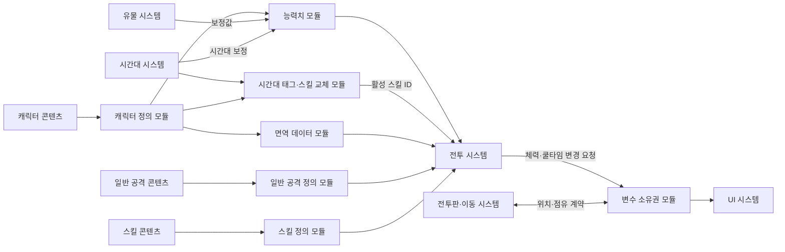
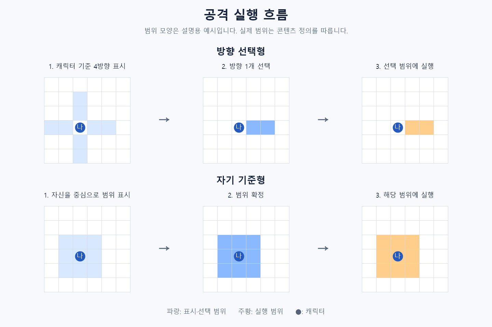
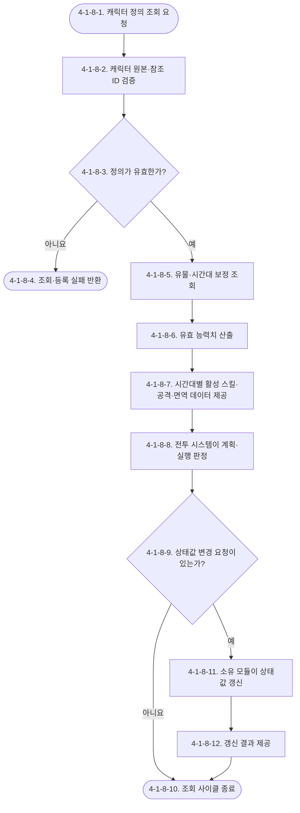

# Waredo 2.0 캐릭터 시스템 기획서

> 자료형 기준: [조정값 통합표의 공통 자료형 규칙](../문서관리/Waredo_2.0_기획_조정값_통합표.md#공통-자료형-규칙). ID는 `int`, 분류·태그는 `enum`을 사용한다.

> 재작성일: 2026-09-12 · 원문 기능 보존 검토용
> 이전 원문·섹션별 비교 기록은 레거시 보관본을 참고한다. 현재 문서가 시스템 규칙의 단일 원본이다.

> 결정 상태: `[확정]`
> 최근 수정일: 2026-09-14
> 변경 근거: 사용자 결정, `Waredo_2.0_시간대_전환_시스템_기획서.md`, `도구/전투 프로토타입/실험버전/v5/`의 상대 타일 지정·시간대 궁극기 교체 구조

## 시스템 브리핑

- 캐릭터 시스템은 전투에 참여하는 캐릭터의 분류, 시간대 태그, 기본 능력치, 일반 공격, 일반 스킬·궁극기, 상태이상 면역과 관련 변수의 소유권을 정의한다.
- 아군 캐릭터의 시간대 태그는 `과거` 또는 `미래`만 사용하며 태그 사이의 상성은 없다.

- 최대 체력·치명타 피해율·이동력은 캐릭터 원본 능력치로 관리한다.
- 모든 캐릭터의 초기 치명타 피해율은 임시로 `150%`를 공통 사용한다.
- 일반 공격 피해는 캐릭터가 아니라 일반 공격 정의의 일반 공격 기본 수치가 소유하고, 스킬 피해는 개별 피해 효과의 스킬 효과 기본 수치가 소유한다.
- 현재 체력은 게임 최초 시작 시 최대 체력으로 초기화하며, 이후에는 스테이지 사이에 저장·유지한다.
- 최대 체력이 감소하면 현재 체력의 초과분만 절삭한다. 유물로 생존 캐릭터의 최대 체력이 증가하면 증가량만큼 현재 체력도 증가한다. 상세 예외는 4-1-2를 따른다.

- 일반 공격은 방향성, 자기 기준, 타일 선택형 세 방식을 사용하고, 스킬은 여기에 자가 버프형를 더한 네 방식을 사용한다.
- 방향성은 상·하·좌·우 중 한 방향을 선택하고, 자기 기준은 실행 시점의 자신을 기준으로 정해진 범위에 피해를 주며, 타일 선택형은 시전자 기준 상대 방향·거리로 목표를 정하며 절대 셀 좌표에 고정하지 않는다.
- 자가 버프형은 별도 목표를 지정하지 않고 시전자 자신에게 버프 효과를 적용한다.
- 설치형 스킬과 캐릭터 직접 지정형은 사용하지 않는다.
- 캐릭터 시스템은 공격·스킬의 원본 데이터와 계산에 필요한 값을 제공하며, 실제 타겟 재검증, 피해 적용, 상태이상, 반격, 강제 이동, 전투 불능과 실행 실패 처리는 전투 시스템이 담당한다.

- 아군 캐릭터는 일반 스킬과 그에 대응하는 궁극기 스킬을 하나씩, 총 2개 보유한다.
- 현재 시간대가 캐릭터의 시간대 태그와 일치하면 스킬 슬롯의 일반 스킬이 궁극기로 교체되고, 일치하지 않으면 일반 스킬을 사용한다.
- 이 전환은 동일 스킬 슬롯의 남은 쿨타임을 초기화하거나 변경하지 않는다.
- 적 캐릭터는 프로토타입 기준으로 시간대 태그와 궁극기를 사용하지 않는다.

- 문서 하단 `4-1-10. 콘텐츠 기획 문법`은 캐릭터·일반 공격·스킬 콘텐츠에 필요한 필드를 정의한다.
- 개별 캐릭터의 실제 최대 체력·이동력·일반 공격·스킬·면역 값은 별도의 캐릭터 콘텐츠 테이블에서 작성하고 관리한다.

## [확인 필요 목록]

1. 추가 범위 모양은 통합 범위 데이터에 등록한다. 기존 콘텐츠 사용 범위의 좌표는 작성 완료했다.
2. AREA는 영향 범위 직접 적용으로 확정했다. 별도 곡사·궤적·높이 판정은 [추후 기획]이다. 환경요소의 대상 지정 가능 여부와 직사·관통 차단 규칙은 [환경요소 시스템](Waredo_2.0_환경요소_시스템_기획서.md) 4-1-2를 따른다. 박스는 비관통 종료·관통 통과 가능, 바위는 관통도 차단한다.
3. `[추후 확장]` 반격 외 자가 버프 효과의 종류·중첩·해제 규칙.

## 유의사항

- 환경요소는 일반 공격·스킬의 대상이 될 수 있다. 박스는 피해량 0을 포함해 공격 피격 시 파괴한다. 상태이상·강제 이동·회복 효과는 받지 않으며, 복합 효과에서는 해당 무효 효과만 제외한다. 대상 지정·차단의 원본은 [환경요소](Waredo_2.0_환경요소_시스템_기획서.md) 4-1-2다.

- 이 문서는 캐릭터의 원본 정보, 시간대 태그, 기본·유효 능력치, 상태이상 면역 데이터, 일반 공격 정의, 일반 스킬·궁극기 정의와 변수 소유권을 다룬다.
- 상태이상 적용·유지·해제·중첩, 면역의 실제 판정, 반격 상태와 반응 공격, 밀치기·당기기 실행, 강제 이동, 전투 불능, 공격·스킬 실행 재검증, 실패·취소, 효과 큐와 최종 피해·회복 반영은 전투 시스템 범위로 둔다.

- 캐릭터 시스템은 전투 시스템이 판정에 사용할 원본값·참조 ID·보정 전후의 유효값을 제공하지만 전투 FSM과 행동 결과를 직접 결정하지 않는다.
- 시간대·파편·전환 비용·시간대 버프는 [시간대 전환 시스템 기획서](Waredo_2.0_시간대_전환_시스템_기획서.md)를 원본으로 사용하고, 이전 제안 GDD는 적용 기준으로 사용하지 않는다.
- 현재 체력는 게임 최초 시작 시 보정 반영 최대 체력로 초기화한다. 이후에는 스테이지 종료 시 저장하고 다음 스테이지 시작 시 그대로 불러오는 지속 상태값이며, 일반적인 스테이지 시작을 이유로 다시 회복하거나 초기화하지 않는다.
- 제안 GDD의 캐릭터 공격력 소유 규칙은 적용하지 않는다. 사용자 결정에 따라 일반 공격 피해 원본은 일반 공격 정의의 일반 공격 기본 수치가 소유한다.
- 기존 프로토타입의 공격력 유물 효과를 그대로 이전하지 않는다. 현재 사용할 공격력 유물은 [가방·유물](Waredo_2.0_가방_유물_시스템_기획서.md) 4-3-4의 일반 공격·스킬·둘 다 보정 규칙을 따른다.
- 캐릭터 위치의 단일 원본은 전투판 시스템의 셀 점유 정보로 둔다. 캐릭터별 캐릭터 현재 셀은 이 데이터에서 조회하는 파생값이며 별도로 저장하지 않는다.

- 현재 유지 중인 상태이상인 현재 유지 중인 상태이상는 전투 상태이상 시스템이 소유한다. 캐릭터 시스템은 면역 원본인 캐릭터 상태이상 면역 태그만 제공한다.
- 유물과 시간대 시스템은 캐릭터 원본값을 직접 덮어쓰지 않고 보정값 또는 별도 전투 보정 계층을 제공한다.
- 일반 공격·스킬의 방향, 자기 기준 범위, 상대 방향·거리가 실행 시점에도 유효한지 확인하는 절차와 취소 결과는 전투 시스템에서 정의한다.
- `[확인 필요 목록]`의 항목이 확정되기 전에는 관련 수치·범위·예외를 임의로 추가하지 않는다.

# 1. 기획의도

- 캐릭터마다 체력, 이동력, 시간대 태그, 일반 공격과 일반 스킬·궁극기의 차이를 부여하여 플레이어가 행동 순서·이동 경로·공격 방식을 서로 다르게 설계하도록 한다.
- 일반 공격별 일반 공격 기본 수치, 공격 범위, 스킬 효과와 시간대에 따른 스킬 교체는 위치 계산 중심의 전투와 시간대 선택에 필요한 판단 근거를 제공한다.

# 2. 개발 목적

- 캐릭터 원본 데이터와 전투 중 변경되는 상태값을 구분하여 콘텐츠 수정과 전투 계산의 기준을 일관되게 유지한다.
- 일반 공격과 스킬을 ID·타겟팅 유형·범위 패턴·효과 데이터로 정의하여 캐릭터 콘텐츠를 같은 규칙으로 제작할 수 있게 한다.
- 유물과 시간대 보정이 원본 능력치를 직접 변경하지 않도록 기본값과 유효값을 분리한다.
- 캐릭터·전투·전투판·유물·시간대·UI 시스템 사이의 변수 소유권과 조회·변경 요청 관계를 명확히 한다.
- 전투 시스템이 캐릭터 데이터를 이용해 치명타, 이동 가능 거리, 면역, 시간대별 활성 스킬과 스킬 사용 가능 여부를 동일한 기준으로 판정할 수 있게 한다.

## 2.1 시스템 개요: 어떤 시스템인가

- 캐릭터 시스템은 전투에 참여하는 캐릭터가 어떤 시간대 태그와 능력치를 가지며, 어떤 일반 공격과 일반 스킬·궁극기를 사용할 수 있는지를 정의하는 시스템이다.
- 플레이어가 행동 설계 단계에서 캐릭터를 선택하면 전투 시스템은 이 문서의 이동력, 일반 공격 유형, 현재 시간대에 맞는 활성 스킬과 범위 참조를 사용해 선택 가능한 행동 정보를 제공한다.
- 실제 이동·피해·상태이상·전투 불능 결과는 전투 시스템이 처리하고, 캐릭터 시스템은 그 처리에 필요한 원본 데이터와 유효 능력치를 제공한다.

## 2.2 사용자가 한 사이클 동안 하는 일

- 한 사이클은 행동 설계 단계에서 캐릭터 한 명의 행동을 계획하는 과정으로 본다.

1. 플레이어가 행동 슬롯에 배치된 캐릭터를 확인한다.
2. 시스템은 캐릭터의 보정 반영 이동력와 현재 전투 상태를 전투 시스템에 제공한다.
3. 플레이어가 이동 경로를 정하면 전투 시스템이 경로 가능 여부를 처리한다.
4. 플레이어는 캐릭터가 보유한 일반 공격 또는 현재 스킬 슬롯에 활성화된 스킬 중 하나를 선택한다.
5. 시스템은 선택한 행동의 타겟팅 유형, 범위 패턴, 영향 셀 패턴, 대상 진영과 쿨타임 정보를 제공한다.
6. 플레이어가 상·하·좌·우 방향, 자기 기준 범위 확정, 타일의 상대 방향·거리 또는 자기 자신 중 해당 유형에 필요한 입력을 지정한다.
7. 전투 시스템이 계획을 저장·검증·잠그며, 실행 단계에서 실제 위치와 상태를 기준으로 다시 판정한다.
8. 실행 결과로 현재 체력·쿨타임·상태이상 목록 등이 변경되면 각 변수의 소유 모듈이 결과를 갱신한다.

- 플레이어의 세부 클릭·드래그·터치 조작과 표시 우선순위는 UI 시스템 범위다.

## 2.3 핵심 작동 방식

- 캐릭터 콘텐츠에는 변경되지 않는 원본 능력치와 일반 공격·스킬 참조를 저장한다.
- 전투에서는 유물과 현재 시간대의 보정을 원본과 분리하여 유효 능력치를 산출한다.
- 전투 시스템은 유효값을 이용해 이동 가능 거리와 공격 결과를 판정한다.

- 일반 공격과 스킬은 타겟팅 유형에 따라 방향, 자기 기준 범위 또는 상대 방향·거리를 입력받고, 자가 버프형 스킬은 자기 자신을 확정한다.
- 타일 선택형의 실제 목표 셀은 실행 시점의 시전자 위치에 선택한 상대 방향·거리를 다시 적용해 산출하므로 시전자가 이동하면 목표 셀도 같은 만큼 이동한다.
- 계획 단계의 선택 결과는 실행 결과를 보장하지 않는다.
- 실제 실행 시점의 위치·대상·상태에 대한 재검증과 실패·취소 처리는 전투 시스템이 맡는다.

- 상태이상 면역은 캐릭터가 보유하는 태그 데이터다.
- 캐릭터 시스템은 면역 태그 목록을 제공하고, 상태이상 적용 요청을 받은 전투 시스템이 대응 태그를 조회하여 적용 여부를 결정한다.

## 2.4 실제 처리 예시

- 방향성 일반 공격을 보유한 캐릭터가 행동을 계획하는 경우의 예시다.

1. 캐릭터 정의에서 보유 일반 공격 ID를 조회한 뒤 대응 일반 공격 정의의 일반 공격 기본 수치를 조회한다.
2. 일반 공격 정의에서 타겟팅 유형이 방향성인지 확인한다.
3. 플레이어는 상·하·좌·우 중 하나를 선택한다.
4. 일반 공격 정의는 캐릭터 기준 위쪽 방향으로 작성된 범위 패턴과 영향 셀 패턴을 전투 시스템에 제공한다.
5. 전투 시스템은 계획을 저장하고, 행동 실행 시 실제 이동 완료 위치를 기준으로 패턴을 선택 방향에 맞춰 회전한 뒤 현재 셀 점유를 판정한다.
6. 유효 대상에게 피해가 발생하면 일반 공격 정의의 일반 공격 기본 수치를 보정 전 피해로 사용한다.
7. 시간대 보정, 띄워짐 대상 치명타, 기타 주는 피해 보정과 반올림은 전투 시스템이 정해진 피해 계산 순서로 처리한다. 시간대 태그에 따른 상성 배율은 적용하지 않는다.

- 범위 패턴 좌표는 통합 범위 데이터, 캐릭터별 공격 수치는 콘텐츠 원본을 참조한다.

## 2.5 시스템이 직접 정의하는 것

- 캐릭터 시스템이 직접 정의하고 소유하는 항목은 다음과 같다.

- 캐릭터 ID, 캐릭터 분류, 시간대 태그, 기본 능력치, 일반 공격 참조, 일반 스킬·궁극기 참조와 상태이상 면역 태그
- 기본 능력치와 유물 보정으로 산출하는 유효 능력치의 계산 규칙
- 일반 공격의 ID, 이름, 타겟팅 유형, 범위·영향 패턴 참조, 대상 진영과 피격 대상 규칙
- 스킬의 ID, 이름, 설명, 타겟팅 유형, 범위·영향 패턴 참조, 효과 목록과 최대 쿨타임
- 캐릭터 관련 변수의 단일 원본, 상태, 파생값과 외부 참조의 경계

- 전투 시스템은 상태이상·면역·전투 불능·공격·스킬을 실제로 판정하고 실행한다.
- 전투판 시스템은 셀 점유 원본을, 이동 시스템은 위치 변경 요청을, 유물 시스템은 유물 장착 상태와 보정 데이터를, 시간대 시스템은 현재 시간대와 시간대 보정을 소유한다.

# 3. 시스템 구조

## 3.1 모듈 구성

| 모듈명 | 핵심 책임 | 입력 | 출력 | 소유 데이터 | 참조 데이터 | 의존 모듈·시스템 |
|---|---|---|---|---|---|---|
| 캐릭터 정의 모듈 | 캐릭터 원본 데이터와 콘텐츠 참조 관리 | 캐릭터 콘텐츠 | 캐릭터 정의 조회 결과 | 캐릭터 ID·분류·시간대 태그·기본 능력치·참조 ID·면역 태그 | 일반 공격·일반 스킬·궁극기 정의 | 일반 공격 정의, 스킬 정의 |
| 능력치 모듈 | 기본값과 보정값으로 유효 능력치 산출 | 캐릭터 원본값, 유물·시간대·전투 보정 | `effectiveMaxHp`, `effectiveMoveRange`, `effectiveCriticalDamageRatePercent` | 기본 능력치 | 유물·시간대·전투 보정 | 유물, 시간대, 전투 |
| 시간대 태그·스킬 교체 모듈 | 현재 시간대와 캐릭터 태그를 비교해 활성 스킬 결정 | 현재 시간대, 시간대 태그, 일반 스킬·궁극기 ID | `activeSkillId` | 시간대 태그, 스킬 쌍 참조 | 현재 시간대, 공유 쿨타임 | 시간대, 전투 |
| 면역 데이터 모듈 | 캐릭터별 면역 태그 제공 | 캐릭터 ID | 면역 태그 목록 | 없음 | `statusImmunityTags`, 상태이상 태그 | 캐릭터 정의, 전투 상태이상 처리 |
| 일반 공격 정의 모듈 | 일반 공격의 선택·범위·대상 규칙 제공 | 일반 공격 콘텐츠 | 일반 공격 정의 조회 결과 | 일반 공격 정의 | 범위·영향 셀 패턴 | 행동 설계, 전투 |
| 스킬 정의 모듈 | 스킬의 선택·범위·효과·쿨타임 원본 제공 | 스킬 콘텐츠 | 스킬 정의 조회 결과 | 스킬 정의와 효과 목록 | 범위·영향 셀 패턴, 상태이상 ID | 행동 설계, 전투 |
| 변수 소유권 모듈 | 단일 원본과 변경·조회 계약 관리 | 각 모듈의 데이터 책임 | 소유·조회·갱신 계약 | 캐릭터 시스템 소유권 규칙 | 외부 시스템 소유 변수 | 전투, 전투판, 이동, 유물, 시간대, UI |

## 3.2 시스템 관계



# 4. 시스템 상세 구조

## 4-1. 캐릭터 시스템

### 4-1-1. 캐릭터 정의 모듈

#### 변수·데이터

| 변수·용어 | 이 모듈에서의 의미 | 자료형·값 형태 | 소유·성격 |
|---|---|---|---|
| `characterId` | 캐릭터 정의를 식별하는 고유값 | int | 캐릭터 정의·원본 |
| `characterCategory` | 일반 적·보스 적·아군을 구분하는 캐릭터 분류 | enum | 캐릭터 정의·원본 |
| `timeTag` | 궁극기 활성 판정에 사용하는 아군 캐릭터 전용 시간대 태그 | enum | 캐릭터 정의·원본 |
| `maxHp` | 최대 체력의 기본값 | int | 캐릭터 정의·원본 |
| `moveRange` | 한 행동에서 이동할 수 있는 기본 셀 거리 | int | 캐릭터 정의·원본 |
| `criticalDamageRatePercent` | 치명타 성립 시 사용하는 기본 피해율 | int (%) | 캐릭터 정의·원본 |
| `characterNormalAttackId` | 캐릭터가 보유한 일반 공격 정의 참조 | int | 캐릭터 정의·원본 |
| `characterSkillId` | 캐릭터가 보유한 일반 스킬 정의 참조 | int | 캐릭터 정의·원본 |
| `characterUltimateSkillId` | 캐릭터가 보유한 궁극기 정의 참조 | int (없음: 0) | 캐릭터 정의·원본 |
| `statusImmunityTags` | 캐릭터가 적용을 거부하는 상태 태그 목록 | enum 목록 | 캐릭터 정의·원본 |

#### 4-1-1-1. 목적과 책임

- 캐릭터 콘텐츠의 단일 원본을 관리하고 다른 모듈이 캐릭터를 같은 ID와 시간대 태그로 조회할 수 있게 한다.

#### 4-1-1-2. 입력·처리·출력

- 입력: 캐릭터 ID, 캐릭터 분류, 시간대 태그, 기본 능력치, 일반 공격 ID, 일반 스킬 ID, 궁극기 ID, 상태이상 면역 태그 목록
- 처리: ID 중복, 허용 시간대 태그, 능력치 범위, 스킬 쌍과 필수 참조 존재 여부를 검증한다.
- 출력: 검증된 캐릭터 정의와 일반 공격·일반 스킬·궁극기 참조를 제공한다.
- 소유 데이터: 캐릭터 ID, 캐릭터 분류, 캐릭터 시간대 태그, 기본 최대 체력, 기본 이동력, 기본 치명타 피해율, 보유 일반 공격 ID, 보유 일반 스킬 ID, 보유 궁극기 ID, 캐릭터 상태이상 면역 태그
- 참조 데이터: 일반 공격 정의, 스킬 정의, 현재 시간대
- 실패·예외: 필수값 누락, ID 중복, 허용 범위 위반 또는 존재하지 않는 참조 ID가 있으면 콘텐츠 등록을 거부한다.

#### 4-1-1-3. 캐릭터 원본 규칙

- 캐릭터 ID는 캐릭터 정의를 식별하며 중복될 수 없다.
- 캐릭터 분류는 `NormalEnemy`, `BossEnemy`, `Ally` 중 하나를 사용한다.
- `NormalEnemy`와 `BossEnemy`는 대상 진영 판정에서 적군으로, `Ally`는 아군으로 처리한다.
- 일반 적과 보스 적의 세부 전투 규칙 차이는 전투·보스 시스템이 캐릭터 분류를 조회하여 처리한다.
- 아군의 캐릭터 시간대 태그는 `Past` 또는 `Future` 중 하나를 사용한다. 표시명은 각각 `과거`, `미래`다.
- 프로토타입 기준으로 적군의 캐릭터 시간대 태그는 `None`이며 궁극기 교체 대상이 아니다.
- 시간대 태그는 궁극기 활성 조건으로만 사용하며 공격자·피격자 사이의 유리·중립·불리 관계나 피해 배율을 만들지 않는다.
- 기본 최대 체력는 1 이상의 정수다.
- 기본 이동력는 0 이상의 정수다.
- 기본 이동력는 상·하·좌·우 이동 거리를 의미하며 ~~대각선 거리를 포함하지 않는다.~~
- 기본 치명타 피해율는 0 이상의 백분율 정수이며 `100`은 일반 피해와 같은 배율이다. 모든 캐릭터의 공통 초기값은 임시로 `150`을 사용한다.
- 캐릭터별 최대 체력·이동력·일반 공격·스킬·면역을 포함한 실제 콘텐츠 값은 캐릭터 콘텐츠 테이블에서 작성하고 관리한다.
- 아군 캐릭터는 일반 공격 정의 ID 하나와 일반 스킬·궁극기 정의 ID를 각각 하나씩 참조한다. 따라서 아군 캐릭터가 보유하는 스킬 정의는 총 2개다.
- 적 캐릭터는 일반 스킬 ID 하나를 참조하며 궁극기 ID는 `0`으로 둔다.
- 일반 스킬과 궁극기는 하나의 스킬 슬롯과 하나의 남은 쿨타임 상태를 공유한다.
- 면역이 없는 캐릭터는 빈 면역 목록 또는 콘텐츠 문법의 `NONE`으로 작성한다.

### 4-1-2. 능력치 모듈

#### 변수·데이터

| 변수·용어 | 이 모듈에서의 의미 | 자료형·값 형태 | 소유·성격 |
|---|---|---|---|
| `baseDamage` | 현재 피해 건에서 보정 계산의 시작값으로 선택된 값. 일반 공격은 `normalAttackValue`, 스킬은 `numericEffectValue` | int | 전투 피해 계산·파생 입력 |
| `normalAttackValue` | 일반 공격 정의가 소유하는 보정 전 피해·회복 기본 수치 | int | 일반 공격 정의 참조 |
| `numericEffectValue` | 스킬의 개별 수치 효과가 소유하는 보정 전 피해·회복 수치 | int | 스킬 정의 참조 |
| `maxHp` | 캐릭터가 소유하는 최대 체력 기본값 | int | 캐릭터 정의 참조 |
| `flatMaxHpBonus` | `maxHp`에 직접 더하는 개별 고정형 최대 체력 보정 | float | 유물·전투 보정 참조 |
| `maxHpRateBonus` | 고정형 보정 합산 후 적용하는 개별 비율형 최대 체력 보정 | float | 유물·전투 보정 참조 |
| `currentHp` | 전투 중 캐릭터의 현재 체력 | int | 캐릭터 시스템·상태 참조 |
| `moveRange` | 캐릭터가 소유하는 이동력 기본값 | int | 캐릭터 정의 참조 |
| `flatMoveRangeBonus` | `moveRange`에 직접 더하는 개별 고정형 이동력 보정 | float | 유물·전투 보정 참조 |
| `cooldownMax` | 스킬이 소유하는 최대 쿨타임 기본값 | int | 스킬 정의 참조 |
| `flatCooldownMaxBonus` | `cooldownMax`에 직접 더하는 개별 고정형 최대 쿨타임 보정 | float | 유물·전투 보정 참조 |
| `effectiveMaxHp` | 캐릭터 원본과 현재 최대 체력 보정을 반영한 최대 체력 | int | 능력치 모듈·파생 |
| `effectiveMoveRange` | 캐릭터·유물 보정을 반영한 이동력 | int | 능력치 모듈·파생 |
| `effectiveCooldownMax` | 스킬 원본과 유물 보정을 반영한 최대 쿨타임 | int | 능력치 모듈·파생 |
| `cooldownRemaining` | 현재 남은 스킬 쿨타임 | int | 전투 스킬 쿨타임 모듈 참조 |
| `flatDamageBonus` | 적용 조건을 만족할 때 기본 피해에 직접 더하는 개별 상수형 피해 보정 | float | 유물·시간대·전투 보정 참조 |
| `dealtDamageRateBonus` | 적용 조건을 만족할 때 공격자에게 적용되는 개별 비율형 주는 피해 보정 | float | 유물·전투 보정 참조 |
| `criticalDamageRatePercent` | 캐릭터가 소유하는 기본 치명타 피해율 | int (%) | 캐릭터 정의 참조 |
| `criticalDamageRateBonus` | 적용 조건을 만족할 때 치명타 피해율에 더하는 개별 보정 | float (% 또는 %p) | 유물·시간대·전투 보정 참조 |
| `effectiveCriticalDamageRatePercent` | 캐릭터·유물·시간대 보정을 반영한 치명타 피해율 | float (% 또는 %p) | 능력치 모듈·파생 |
| `isCritical` | 현재 피해 건에 치명타가 성립했는지 여부 | bool | 전투 시스템 판정 참조 |
| `finalDamage` | 모든 피해 보정과 치명타를 적용하고 반올림한 최종 피해 | int | 계산 결과 |

#### 4-1-2-1. 목적과 책임

- 캐릭터 기본 능력치를 보존하고 유물·시간대·전투 보정을 원본과 분리하여 전투가 사용할 유효값을 제공한다.

#### 4-1-2-2. 기본 능력치 정의

- 이동력·최대 쿨타임의 네 연산과 보정 순서는 가방·유물 4-3-4에 연결되어 있다.

- **체력:**

- 기본 최대 체력는 캐릭터 콘텐츠에 저장하는 최대 체력의 원본값이다.
- 고정 최대 체력 보정은 소수를 허용하는 float이며, 최대 체력 비율 보정은 고정형 보정 합산 이후 적용한다.
- 보정 반영 최대 체력는 다음 계산식으로 산출하는 파생값이다.

```text
effectiveMaxHp = max(
    1,
    반올림(
        (maxHp + ΣflatMaxHpBonus)
        × max(0, 1 + ΣmaxHpRateBonus)
    )
)
```

- 모든 고정 최대 체력 보정를 먼저 합산한 뒤 모든 최대 체력 비율 보정를 합산하여 배율로 변환한다.
- 최대 체력 비율 보정의 합산 배율은 0 미만으로 내려가지 않는다.
- 중간 계산에서는 소수점을 유지하고 최종 결과를 한 번만 반올림한 뒤 보정 반영 최대 체력를 1 이상으로 제한한다.
- 현재 체력는 전투 중 실제로 남아 있는 체력 상태값이며 스테이지가 종료되어도 저장한다.
- 게임 최초 시작 시 현재 체력는 보정 반영 최대 체력와 같은 값으로 초기화하여 최대 체력 상태로 시작한다.
- 다음 스테이지 시작 시 저장된 현재 체력를 그대로 불러오며 보정 반영 최대 체력로 초기화하지 않는다.
- 스테이지 사이의 체력 회복은 별도의 회복 효과나 명시된 회복 규칙이 있을 때만 현재 체력에 반영한다.
- 유물 효과로 생존 캐릭터의 보정 반영 최대 체력가 증가하면 증가량만큼 현재 체력도 함께 증가한다.
- `maxHpDelta = newEffectiveMaxHp - oldEffectiveMaxHp`가 양수이면 `currentHp = min(newEffectiveMaxHp, currentHp + maxHpDelta)`로 정리한다.
- `currentHp <= 0`인 전투불능 캐릭터는 유물 효과 대상에서 제외한다.
- 유물 외 원인으로 보정 반영 최대 체력가 증가할 때의 현재 체력 처리는 해당 보정 제공 시스템의 명시된 규칙을 따르며, 별도 규칙이 없으면 기존 현재 체력를 유지한다.
- 보정 반영 최대 체력가 감소하면 기존 현재 체력가 새 보정 반영 최대 체력를 초과하는 부분만 절삭한다. 감소량만큼 현재 체력을 강제로 빼지 않는다.
- 최대 체력 증감에 따른 현재 체력 조정은 별도의 피해 또는 회복 효과로 취급하지 않는다.
- 현재 체력의 허용 범위는 `0~effectiveMaxHp`다.
- 피해·회복에 따른 현재 체력 변경과 체력 0 이하의 전투 불능 판정은 전투 시스템이 처리한다.

- **공격력:**

- 캐릭터는 공통 공격력 원본을 소유하지 않는다.
- 일반 공격의 공격력 원본은 해당 일반 공격 정의가 소유하는 일반 공격 기본 수치다.
- 스킬의 공격력 원본은 해당 스킬의 개별 피해 효과가 소유하는 스킬 효과 기본 수치다.
- 보정 전 피해는 현재 실행 중인 일반 공격 또는 스킬에서 공격력 원본을 선택해 사용하는 계산 입력이다.
- 고정 피해 보정는 하나의 유물·시간대·전투 효과가 보정 전 피해에 직접 더하는 개별 상수형 피해 보정값이다.
- 피해 3 증가 유물과 피해 4 증가 유물이 함께 적용되면 두 유물이 각각 `flatDamageBonus = 3`, `flatDamageBonus = 4`를 제공하며 `ΣflatDamageBonus`는 7이다.
- 각 보정값은 동일한 고정 피해 보정 변수명을 사용하고, 제공 출처별 개별 값으로 보관한다.
- 주는 피해 비율 보정는 공격자가 주는 피해에 적용되는 비율형 보정이며, 적용 가능한 값을 모두 합산한 뒤 배율로 변환한다.
- 최종 공격 피해는 적용 가능한 피해 보정과 치명타를 반영하여 최종 피해로 산출한다. 시간대 태그에 따른 상성 배율은 없다.

- **치명타 피해율:**

- 기본 치명타 피해율는 치명타가 성립했을 때 적용할 기본 피해율 원본이다.
- 모든 캐릭터의 기본 치명타 피해율 초기값은 임시로 `150`을 사용한다.
- 치명타 피해율 보정는 유물·시간대·전투 조건이 제공하는 치명타 피해율 보정값이다.
- 보정 반영 치명타 피해율는 `criticalDamageRatePercent + ΣcriticalDamageRateBonus`로 산출하는 파생값이며 0 이상으로 제한한다.
- 치명타가 아닌 피해에는 보정 반영 치명타 피해율을 적용하지 않고 배율 1을 사용한다.
- 치명타인 피해에만 `effectiveCriticalDamageRatePercent ÷ 100`을 피해 배율로 적용한다.

- **이동력:**

- 기본 이동력는 캐릭터 콘텐츠에 저장하는 한 행동당 기본 이동 가능 셀 거리다.
- 이동력은 더하기·곱하기·빼기·비율 보정을 모두 허용한다. 아래 산식은 고정 보정만 있는 경우다. 비율·곱하기가 있으면 합연산을 끝낸 결과에 배율을 적용하며 가방·유물 4-3-4를 따른다.
- 고정 이동력 보정는 기본 이동력에 직접 더하는 개별 고정형 이동력 보정이다.
- 보정 반영 이동력는 다음 계산식으로 산출하는 파생값이다.

```text
effectiveMoveRange = max(
    0,
    반올림(moveRange + ΣflatMoveRangeBonus)
)
```

- 보정 반영 이동력는 0 이상으로 제한하며 상·하·좌·우 이동 거리를 의미한다.
- 실제 이동 가능 셀은 보정 반영 이동력만으로 확정하지 않는다. 전투판의 점유, 이동 불가 셀과 경로 규칙을 전투·이동 시스템이 함께 판정한다.

- **스킬 쿨타임:**

- 기본 최대 쿨타임은 스킬 정의가 소유하는 최대 쿨타임 원본값이다.
- 스킬 최대 쿨타임은 더하기·곱하기·빼기·비율 보정을 모두 허용한다. 아래 산식은 고정 보정만 있는 경우다. 비율·곱하기가 있으면 합연산을 끝낸 결과에 배율을 적용하며 가방·유물 4-3-4를 따른다.
- 고정 최대 쿨타임 보정는 기본 최대 쿨타임에 직접 더하는 개별 고정형 최대 쿨타임 보정이다.
- 보정 반영 최대 쿨타임은 다음 계산식으로 산출하는 파생값이다.

```text
effectiveCooldownMax = max(
    1,
    반올림(cooldownMax + ΣflatCooldownMaxBonus)
)
```

- 보정 반영 최대 쿨타임에는 별도의 최댓값을 두지 않고 최소값 `1`만 적용한다.

- 남은 쿨타임은 전투 중 남은 쿨타임 상태값이며 `0~effectiveCooldownMax` 범위로 제한한다.

#### 4-1-2-3. 유효값 공통 산출 규칙

- 고정형 보정도 float로 전달·합산하며 기본값과 최종 체력·이동력·쿨타임만 int로 저장한다. 반올림 경계는 0에서 먼 쪽으로 처리한다(10.5→11, -0.5→-1). 최종 반올림 뒤 하한·상한을 적용한다. 예: (10+0.5)×2=21이며 중간의 0.5를 정수로 자르지 않는다.
- 소수로 정의한 비율·배율 자체는 정수화하지 않는다. 정수 결과를 요구하는 각 계산의 마지막에만 한 번 반올림한다.
- 최대 쿨타임 변경 시 기존 남은 값을 먼저 유지하고 cooldownRemaining=min(cooldownRemaining, newEffectiveCooldownMax)로 초과분만 절삭한다. 최대값이 증가해도 남은 값은 증가하지 않는다.

- 공격력·이동력·최대 체력·쿨타임은 합연산을 모두 끝낸 결과에 곱연산을 적용한다. 더하기·빼기를 먼저 합산하고, 기존 합산 비율 배율과 곱하기 배율을 적용한 뒤 최종 결과만 반올림한다. 보정의 단일 처리 순서는 [가방·유물](Waredo_2.0_가방_유물_시스템_기획서.md) 4-3-4를 따른다.
- 아래 개별 산식의 고정 보정에는 빼기를 음의 고정 보정으로 포함한다. 산식에 별도로 적지 않은 Multiply 효과가 있으면 최종 반올림 전에 그 배율을 곱한다. 동일 보정을 여러 산식에서 중복 적용하지 않는다.

```text
기본값
→ 모든 고정형 더하기·빼기 보정 합산
→ 같은 계층의 비율 보정을 합산한 배율 및 곱하기 배율 적용
→ 최종 반올림
→ 변수별 허용 범위 제한
= 유효값
```

- 보정 반영 최대 체력는 1 이상으로 제한한다.
- 보정 반영 이동력, 보정 반영 치명타 피해율는 0 이상으로 제한한다.
- 고정 보정만 있는 이동력은 `moveRange + ΣflatMoveRangeBonus`의 최종 반올림 후 하한 0을 적용한다. 다른 연산의 사용을 금지하는 규칙이 아니다.
- 보정 반영 치명타 피해율는 `criticalDamageRatePercent + ΣcriticalDamageRateBonus`로 산출한다.
- 보정 반영 최대 쿨타임은 1 이상으로 제한한다.
- 고정 보정만 있는 최대 쿨타임은 `cooldownMax + ΣflatCooldownMaxBonus`의 최종 반올림 후 하한 1을 적용한다. 다른 연산의 사용을 금지하는 규칙이 아니다.
- 남은 쿨타임은 `0~effectiveCooldownMax` 범위로 제한한다.
- 모든 수치 계산은 전체 계산을 완료한 최종 단계에서 한 번만 반올림한다.
- 시간대·치명타·회복 보정의 실제 적용은 전투 시스템에서 처리한다.

#### 4-1-2-4. 피해 계산 연결 규칙

- 일반 공격 정의 모듈은 일반 공격 기본 수치, 스킬 정의 모듈은 스킬 효과 기본 수치, 능력치 모듈은 보정 반영 치명타 피해율를 제공한다.
- 전투 시스템은 다음 순서로 최종 피해를 처리한다.

```text
최종 피해 = max(
    0,
    반올림(
        (baseDamage + ΣflatDamageBonus)
        × max(0, 1 + ΣdealtDamageRateBonus)
        × (isCritical이면 effectiveCriticalDamageRatePercent ÷ 100, 아니면 1)
    )
)
```

- 일반 공격의 보정 전 피해는 일반 공격 기본 수치다.
- 스킬의 보정 전 피해는 해당 피해 효과의 스킬 효과 기본 수치다.
- 비율형 보정은 같은 계층의 값을 먼저 모두 합산한 뒤 하나의 배율로 변환한다.
- 비율형 보정의 합산 결과로 계산된 배율은 음수가 될 수 없으며 `0` 미만으로 내려가지 않는다.
- 미래 시간대에는 시간대 시스템이 아군 일반 공격에만 `flatDamageBonus = 3`을 제공하고, 피해 계산은 다른 적용 가능한 상수형 보정과 함께 합산한다. 스킬과 기타 피해에는 이 보정을 적용하지 않는다.
- 시간대 시스템은 치명타 피해율 보정을 제공하지 않는다.
- 치명타 성립 여부은 피해 적용 직전 대상의 상태를 사용해 전투 시스템이 판정하며 캐릭터 시스템에는 저장하지 않는다.
- 상태 기반 치명타는 [상태이상](Waredo_2.0_상태이상_시스템_기획서.md) 4-1-2를 따른다. 띄워짐만 치명타 조건이며 기절·충돌 피해는 제외한다.
- 상태 기반 치명타에는 스킬별 치명타 허용값을 두지 않는다.
- 캐릭터 시간대 태그는 캐릭터 시스템이 소유하는 `Past` 또는 `Future` 값이다. 시간대 전환 시스템이 제공하는 현재 시간대와 비교하여 일반 스킬과 궁극기를 교체하는 조건이며, 자체 피해 배율이나 상성을 제공하지 않는다.
- 중간 계산에서는 소수점을 유지하고 모든 피해 보정과 치명타를 적용한 최종 결과를 한 번만 반올림한다.
- 반올림한 최종 피해는 `0` 이상으로 제한한다.

### 4-1-3. 시간대 태그·스킬 교체 모듈

#### 변수·데이터

| 변수·용어 | 이 모듈에서의 의미 | 자료형·값 형태 | 소유·성격 |
|---|---|---|---|
| `timeTag` | 아군에 지정된 시간대 태그 | enum | 캐릭터 정의·원본 |
| `currentTimePeriod` | 현재 전투가 위치한 시간대 | enum | 시간대 전환 시스템 참조 |
| `characterSkillId` | 평상시에 사용하는 일반 스킬 ID | int | 캐릭터 정의·원본 |
| `characterUltimateSkillId` | 태그 일치 시간대에 사용하는 궁극기 ID | int (없음: 0) | 캐릭터 정의·원본 |
| `activeSkillId` | 현재 스킬 슬롯에 활성화된 정의 ID | int | 비교 결과·파생 |
| `cooldownRemaining` | 일반 스킬과 궁극기가 공유하는 남은 쿨타임 | int | 전투 스킬 쿨타임 모듈·상태 참조 |

#### 4-1-3-1. 목적과 책임

- 현재 시간대와 캐릭터의 시간대 태그를 비교해 스킬 슬롯에 사용할 일반 스킬 또는 궁극기를 결정한다.

#### 4-1-3-2. 시간대 태그와 스킬 교체 규칙

- `currentTimePeriod = timeTag`이면 `activeSkillId = characterUltimateSkillId`다.
- 현재가 캐릭터의 태그와 일치하지 않으면 `activeSkillId = characterSkillId`다. `Present`와 일치하는 캐릭터 태그는 없다.
- 시간대가 바뀌면 계획·실행 화면에서 참조할 현재 사용 스킬를 즉시 다시 산출한다.
- 일반 스킬과 궁극기는 같은 스킬 슬롯과 남은 쿨타임을 공유한다.
- 스킬 교체 자체는 남은 쿨타임을 유지한다. 같은 전환에 연결된 유물 보정까지 재산출한 최종 최대값이 남은 값보다 작을 때만 4-1-2-3에 따라 초과분을 절삭한다. 예: 남은 4, 새 최대 2이면 2가 된다.
- 한 쌍의 일반 스킬과 궁극기는 동일한 기본 최대 쿨타임을 사용한다. 두 정의의 값이 다르면 콘텐츠 검증에 실패한다.
- 시간대 태그에는 상성이 없으며 태그 비교만으로 피해 배율을 변경하지 않는다.

### 4-1-4. 면역 데이터 모듈

#### 변수·데이터

| 변수·용어 | 이 모듈에서의 의미 | 자료형·값 형태 | 소유·성격 |
|---|---|---|---|
| `statusImmunityTags` | 캐릭터가 적용을 거부하는 상태 태그 목록 | enum 목록 | 캐릭터 정의·원본 참조 |
| `statusTag` | 상태이상과 면역을 대응시키는 식별 태그 | enum | 전투 상태이상 정의 참조 |

#### 4-1-4-1. 목적과 책임

- 캐릭터가 상태이상 적용을 거부할 수 있도록 캐릭터별 면역 태그 목록을 제공한다.

#### 4-1-4-2. 면역 데이터 규칙

- 캐릭터는 0개 이상의 상태이상 면역 태그를 가질 수 있다.
- GDD가 현재 사용하는 면역 대상 상태는 밀치기, 당기기, 띄워짐과 기절이다.
- 면역 데이터는 캐릭터 원본에 저장한다.
- 면역 태그와 상태이상 태그의 일치 여부, 해당 효과만 실패시키는 규칙과 이후 효과 처리는 전투 시스템이 담당한다.
- 면역이 발생해도 다른 상태이상·대상·셀로 자동 변경하지 않는 실행 규칙은 전투 시스템에 둔다.

### 4-1-5. 일반 공격 정의 모듈

#### 변수·데이터

| 변수·용어 | 이 모듈에서의 의미 | 자료형·값 형태 | 소유·성격 |
|---|---|---|---|
| `normalAttackId` | 일반 공격 정의 식별값 | int | 일반 공격 정의·원본 |
| `normalAttackTargetingType` | 방향성·자기 기준·타일 선택 중 일반 공격의 입력 방식 | enum | 일반 공격 정의·원본 |
| `normalAttackRangePatternId` | 공격 가능한 셀 범위 패턴 참조 | int | 일반 공격 정의·원본 |
| `normalAttackAffectedCellPatternId` | 실제 피해 대상을 찾는 영향 셀 패턴 참조 | int | 일반 공격 정의·원본 |
| `normalAttackValidTargetTeam` | 선택·피격을 허용하는 대상 진영 | enum | 일반 공격 정의·원본 |
| `normalAttackValue` | 일반 공격이 소유하는 보정 전 피해·회복 기본 수치 | int | 일반 공격 정의·원본 |
| `targetDirection` | 방향성 일반 공격 계획에서 받은 상·하·좌·우 방향 | enum | 전투 시스템 > 행동 모듈 소유·참조 |
| `relativeTargetOffset` | 타일 선택형 계획에서 받은 시전자 기준 상대 방향·거리 | 좌표 (int x, int y) | 전투 시스템 > 행동 모듈 소유·참조 |

#### 4-1-5-1. 목적과 책임

- 캐릭터가 보유한 일반 공격의 타겟 선택 방식, 범위와 실제 피격 대상 판정에 필요한 원본 데이터를 제공한다.

#### 4-1-5-2. 일반 공격 유형

| 유형 | 플레이어 입력 | 정의 규칙 |
|---|---|---|
| `Directional` | 상·하·좌·우 방향 선택 | 계획 단계에서 `targetDirection`을 선택한다. 이동 종료 후 실제 점유 셀에서 선택한 방향을 바라보고, 위쪽 기준 패턴을 해당 방향에 맞춰 회전하여 공격한다. |
| `SelfCentered` | 자기 기준 범위 확정 | 별도 대상 좌표를 지정하지 않는다. 실행 시점의 캐릭터 현재 셀을 중심으로 고정 범위를 펼쳐 범위 안의 유효 대상에게 피해를 준다. |
| `TileSelect` | 타일 1개 선택 | 계획된 이동 도착 셀에서 선택 타일까지의 `relativeTargetOffset`으로 목표를 정한다. 이동 계획이 없으면 현재 셀을 계획 원점으로 사용한다. 실행 시점의 시전자 현재 셀에 이 상대 방향·거리를 더해 실제 목표 셀을 다시 산출한다. |

#### 공격 실행 흐름 그림



- 방향 선택형: 캐릭터를 기준으로 지정된 범위를 상·하·좌·우에 표시 → 네 방향 중 하나 선택 → 선택한 방향의 범위에 실행.
- 자기 기준형: 자신을 중심으로 지정된 범위 표시 → 확정 → 해당 범위에 실행.
- 그림의 직선 2칸·주변 3×3은 설명용 예시이며 콘텐츠 범위를 확정하지 않는다. 실제 대상은 해당 범위와 대상 진영 조건으로 정한다.
- 일반 공격과 스킬의 동일한 대상 선택 방식에 공통 적용한다. 실행 시 위치·범위 재검증 규칙은 유지한다.

#### 4-1-5-3. 일반 공격 정의 규칙

- 일반 공격 ID는 중복될 수 없다.
- 일반 공격 정의는 일반 공격 기본 수치를 직접 소유하며 캐릭터 정의에는 일반 공격 피해값을 저장하지 않는다.
- 방향성은 계획 단계에서 선택 방향을 저장하고, 이동 종료 후 행동 캐릭터의 실제 점유 셀을 패턴 원점으로 사용한다.
- 방향성의 일반 공격 가능 범위 패턴과 일반 공격 영향 셀 패턴은 캐릭터 기준 위쪽 방향을 바라보는 형태로 작성한다. 전투 시스템은 이 원본 패턴을 상·하·좌·우 각 방향에 맞춰 회전하여 사용한다.
- 회전된 서로 다른 방향 패턴에 같은 셀이 포함되면 해당 셀을 어느 한 방향에서 제외하지 않는다. 겹친 셀은 두 방향의 범위에 모두 포함된다.
- 자기 기준은 실행 시점 캐릭터의 실제 위치를 원점으로 일반 공격 영향 셀 패턴을 펼친다. 별도 대상 캐릭터·타일·방향은 지정하지 않는다.
- 타일 선택형은 계획 당시 절대 셀 좌표에 목표를 고정하지 않는다.
- 계획된 이동 도착 셀을 원점으로 사용하고, 이동 계획이 없으면 현재 셀을 원점으로 사용한다.
- 이 원점에서 선택 타일까지의 상대 변위인 `relativeTargetOffset = (targetX - originX, targetY - originY)`만 저장한다.
- 타일 선택형의 실행 목표 셀은 `실행 시점 시전자 셀 + relativeTargetOffset`으로 산출한다. 시전자가 계획 이후 이동하거나 이동이 중단되어 위치가 달라지면 목표 셀도 같은 방향·거리 관계를 유지한 채 함께 이동한다.
- 타일 선택형의 실행 목표 셀이 전투판 밖이거나 실행 범위를 벗어나면 공격에 실패한다. 다른 셀로 자동 보정하거나 재타겟팅하지 않는다.
- 세 유형 모두 영향 셀 안의 유효 캐릭터를 실제 피격 대상으로 사용하고 일반 공격 영향 셀 패턴을 반드시 참조한다.
- 일반 공격 대상 진영에 포함되지 않은 캐릭터는 실제 피격 대상으로 판정하지 않는다.

#### 4-1-5-4. 사용 가능 범위와 영향 범위

- 사용 가능 범위(`normalAttackRangePatternId`): 공격을 지정·실행할 수 있는 셀을 판단한다.
- 영향 범위(`normalAttackAffectedCellPatternId`): 실행이 가능할 때 실제 효과를 받을 대상을 찾는다. 캐릭터는 진영 조건, 환경요소는 환경요소 시스템의 대상·효과 제한을 따른다.
- 범위 검증을 먼저 하고, 성공하면 영향 범위와 대상 진영을 확인한다. 두 범위가 같아도 되지만 의미가 다르므로 하나로 합치지 않는다.
- 스킬의 `skillRangePatternId`와 `skillAffectedCellPatternId`도 같은 역할 구분을 사용한다.
- 이 구분만으로 영향 범위의 중심을 선택 타일로 바꾸지는 않는다. 중심·회전·상대 위치는 각 대상 선택 방식의 기존 규칙을 따른다.

#### 4-1-5-5. 피해·회복 수치 효과

> 사용자 요청에 따른 기능 추가다. 앞선 가독성 재작성과 달리 회복형 일반 공격·스킬을 새로 허용한다. 기존 피해 콘텐츠는 피해형으로 유지한다.

| 기획 변수 | 의미 | 허용값·적용 기준 |
|---|---|---|
| `normalAttackEffectType` | 일반 공격 수치의 용도 | `Damage` 피해 / `Heal` 회복 |
| `normalAttackValue` | 일반 공격의 기본 수치 | 0 이상의 정수. 기존 `normalAttackDamage`의 수치를 그대로 이전 |
| `numericEffectType` | 스킬의 개별 수치 효과 용도 | `Damage` 피해 / `Heal` 회복 |
| `numericEffectValue` | 스킬의 개별 수치 효과 기본 수치 | 0 이상의 정수. 기존 `damageEffectValue`의 수치를 그대로 이전 |
| `normalAttackValidTargetTeam` | 일반 공격 대상 진영 | 기존 Enemy·Ally·All. 피해·회복 선택과 독립 |
| `effectTargetTeam` | 스킬 효과 대상 진영 | 기존 Enemy·Ally·All. 각 효과에 작성 |
| `effectTargetScope` | 스킬 효과 대상 범위 | SELECTED_CELL·AFFECTED_CELLS·SELF. 선택 방식의 기존 허용 조건 적용 |

**콘텐츠 작성**

- 일반 공격에는 기본 수치 옆에 피해·회복 중 하나를 작성한다.
- 스킬에는 수치 효과 줄마다 기본 수치와 피해·회복을 작성한다. 한 스킬 안에 피해 줄과 회복 줄을 함께 작성할 수 있으며 위에서 아래 순서대로 처리한다.
- 회복형을 선택한다고 자동으로 아군 대상이 되지는 않는다. 대상 진영과 범위를 별도로 작성한다.
- 일반 공격·스킬의 기본 수치와 피해 보정 계산은 피해형·회복형에 공통 적용한다. 체력 감소·전투불능·피격과 피해 치명타 처리는 피해형에만 적용한다.
- 기존 문법의 DAMAGE 및 EFFECT DAMAGE는 피해형 수치 효과를 뜻한다. 기존 수치·범위·대상·부가 효과를 바꾸지 않는다.

**적용 결과 — 이번 초안의 설계 기준**

- 피해형: 기존 피해 보정, 치명타, 반올림, 체력 감소·전투불능 규칙을 그대로 따른다.
- 회복형: 기본 수치에 적용 가능한 피해 보정을 반영한 만큼 현재 체력을 증가시키되 보정 반영 최대 체력을 넘지 않는다. 실제 회복량은 적용 후 체력과 적용 전 체력의 차이다.
- 회복형도 고정 피해 보정과 주는 피해 비율 보정, 공격력 유물·시간대 보정을 받는다. 각 보정의 일반 공격·스킬·둘 다 및 진영·시간대 조건은 그대로 적용한다. 미래 일반 공격력 보정은 아군의 회복형 일반 공격에도 적용하지만 회복형 스킬에는 적용하지 않는다.
- 보정 후 회복량은 기본 수치에 고정 피해 보정을 합산하고, 주는 피해 비율 보정의 합산 배율을 적용한 뒤 최종 반올림하여 0 이상으로 제한한다. 비율 합산 배율은 0 미만이 되지 않는다. 이후 최대 체력까지의 부족분만 실제 회복한다.
- 회복형에는 피해 치명타를 적용하지 않는다.
- 회복은 피해·피격·치명타 피해 사건으로 처리하지 않는다. 대상이 띄워짐·기절이어도 회복량을 치명타로 증폭하지 않는다.
- 현재 체력 0 이하인 캐릭터를 회복으로 부활시키지 않는다. 해당 회복만 적용하지 않으며 뒤 효과는 기존 순서대로 처리한다.
- 체력이 가득 찬 대상에게는 실제 회복량이 0이다. 유효한 사용이었다면 일반 공격의 행동 소비와 스킬 쿨타임은 정상 적용한다.
- 범위 밖·잘못된 목표에 대한 실패·취소, 행동 슬롯 소비, 일반 스킬·궁극기 쿨타임 공유는 기존 규칙을 유지한다.
- 기존 반격은 일반 공격 피해 1건이라는 규칙을 유지한다. 회복형 일반 공격을 사용하는 캐릭터의 반격은 회복형으로 자동 전환하지 않고, 같은 기본 수치를 기존 반격 피해 계산의 입력으로 사용한다.
- 공격 행동 발생 조건과 효과 결과 조건을 구분한다. 회복형 일반 공격도 일반 공격 행동이며, 실제 피해가 필요한 피격·피해 치명타 조건은 충족하지 않는다.

### 4-1-6. 스킬 정의 모듈

#### 변수·데이터

| 변수·용어 | 이 모듈에서의 의미 | 자료형·값 형태 | 소유·성격 |
|---|---|---|---|
| `skillId` | 스킬 정의 식별값 | int | 스킬 정의·원본 |
| `skillTargetingType` | 방향성·자기 기준·타일 선택·자가 버프 중 스킬의 입력 방식 | enum | 스킬 정의·원본 |
| `skillRangePatternId` | 스킬을 사용할 수 있는 셀 범위 패턴 참조 | int | 스킬 정의·원본 |
| `skillAffectedCellPatternId` | 실제 효과 대상을 찾는 영향 셀 패턴 참조 | int (범위 없음: ID 9) | 스킬 정의·원본 |
| `skillEffects` | 작성 순서대로 실행을 요청할 스킬 효과 목록 | 효과 목록 | 스킬 정의·원본 |
| `numericEffectValue` | 개별 수치 효과가 소유하는 보정 전 피해·회복 수치 | int | 스킬 정의·원본 |
| `counterRangePatternId` | `Counter` 효과가 참조하는 반격 발동 범위 | int | 스킬 정의·원본 |
| `counterAppliesStun` | `Counter` 발동 시 기절을 적용할지 여부 | bool | 스킬 정의·원본 |
| `cooldownMax` | 스킬 사용 후 설정되는 최대 쿨타임 | int | 스킬 정의·원본 |
| `effectiveCooldownMax` | `cooldownMax`와 현재 보정을 반영한 최대 쿨타임 | int | 능력치 모듈·파생 참조 |
| `cooldownRemaining` | 스킬을 다시 사용할 수 있기까지 남은 턴 값 | int | 전투 스킬 쿨타임 모듈·상태 참조 |
| `targetDirection` | 방향성 스킬 계획에서 받은 방향 | enum | 전투 시스템 > 행동 모듈 소유·참조 |
| `relativeTargetOffset` | 타일 선택형 스킬 계획에서 받은 시전자 기준 상대 방향·거리 | 좌표 (int x, int y) | 전투 시스템 > 행동 모듈 소유·참조 |

#### 4-1-6-1. 목적과 책임

- 캐릭터가 보유한 스킬의 타겟팅, 범위, 효과 목록과 쿨타임을 정의한다.
- 상태이상으로 발생하는 치명타 여부는 스킬 정의가 아니라 전투 시스템이 판정한다.

#### 4-1-6-2. 스킬 유형

| 유형 | 플레이어 입력 | 정의 규칙 |
|---|---|---|
| `Directional` | 상·하·좌·우 방향 선택 | 계획 단계에서 `targetDirection`을 선택한다. 이동 종료 후 실제 점유 셀에서 선택한 방향을 바라보고, 위쪽 기준 패턴을 해당 방향에 맞춰 회전하여 효과 범위를 산출한다. |
| `SelfCentered` | 자기 기준 범위 확정 | 별도 대상 좌표를 지정하지 않는다. 실행 시점의 캐릭터 현재 셀을 중심으로 고정 범위를 펼쳐 범위 안의 유효 대상에게 피해와 부가 효과를 적용한다. |
| `TileSelect` | 타일 선택 | 계획된 이동 도착 셀에서 선택 타일까지의 `relativeTargetOffset`으로 목표를 정한다. 이동 계획이 없으면 현재 셀을 계획 원점으로 사용한다. 실행 시점의 시전자 현재 셀에 상대 방향·거리를 더해 목표 셀을 다시 산출한다. |
| `SelfBuff` | 시전자 자신을 확정 | 별도 대상 캐릭터·타일·방향을 지정하지 않는다. 실행 시점의 시전자 자신에게 버프 효과를 적용한다. |

#### 4-1-6-3. 스킬 타겟팅 규칙

- 방향성은 계획 단계에서 선택 방향을 저장하고, 이동 종료 후 행동 캐릭터의 실제 점유 셀을 패턴 원점으로 사용한다.
- 방향성의 스킬 사용 가능 범위 패턴과 스킬 영향 셀 패턴은 캐릭터 기준 위쪽 방향을 바라보는 형태로 작성한다. 전투 시스템은 이 원본 패턴을 상·하·좌·우 각 방향에 맞춰 회전하여 사용한다.
- 회전된 서로 다른 방향 패턴에 같은 셀이 포함되면 해당 셀을 어느 한 방향에서 제외하지 않는다. 겹친 셀은 두 방향의 범위에 모두 포함된다.
- 자기 기준은 실행 시점 캐릭터의 실제 위치를 원점으로 스킬 영향 셀 패턴을 펼치며 별도 대상 정보를 지정하지 않는다.
- 타일 선택형은 계획된 이동 도착 셀을 원점으로 목표의 상대 방향·거리를 계산하며, 이동 계획이 없으면 현재 셀을 원점으로 사용한다. 절대 셀 좌표는 저장하지 않는다. 실행 목표 셀은 `실행 시점 시전자 셀 + relativeTargetOffset`으로 다시 계산한다.
- 타일 선택형의 실행 목표 셀이 전투판 밖이거나 실행 범위를 벗어나면 스킬 행동을 취소하며 다른 셀로 자동 보정하거나 재타겟팅하지 않는다.
- 자가 버프형은 시전자 자신을 적용 대상으로 사용하고 별도 목표를 지정하지 않는다. 계획 단계의 자기 자신 재선택 또는 UI의 행동 확정 입력은 같은 확정 결과로 처리한다.
- 자가 버프형은 `skillAffectedCellPatternId = 9`을 허용하며, 효과 범위가 필요한 반응형 버프는 별도의 범위 패턴 ID를 효과 데이터로 참조할 수 있다.

#### 4-1-6-4. 스킬 효과 정의

- 각 효과 행 시작 시 현재 영향 범위·점유·유효 진영·생존 상태로 대상을 다시 찾는다. 직전 행의 대상 목록을 다음 행에 자동 승계하지 않는다. 예: 밀치기 후 피해가 작성되어 있으면 이동 후 현재 범위 안의 대상에게만 피해를 준다. 밀치기 자체에 추가 피해를 만들지는 않는다.
- 한 밀치기 효과 행은 행 시작의 시전자와 대상 위치로 거리를 정해 먼 대상부터 처리한다. 일렬 대상은 후방부터 가까운 순서이며 거리 제곱이 같으면 characterInstanceId 오름차순으로 처리한다. 같은 행 안에서는 대상을 한 번씩만 처리하고 각 대상 직전에 생존·적용 가능 여부를 재검증한다. DIRECT의 피격·차단은 사선상 가까운 접촉부터 처리한다. AREA의 캐릭터 대상은 characterInstanceId 오름차순을 사용한다. 환경요소 동률은 현행 배치 목록 순서를 사용하며 제작용 명시 순서 정의는 레벨 배치 문서 후속 범위다.
- 콘텐츠가 '이번 타격에 피격된 대상'을 명시한 후속 상태·밀치기는 해당 타격의 피격 대상과 현재 유효 대상의 교집합에만 적용한다. 이전 피격 여부만으로 범위 밖 대상을 추적하지 않고, 새로 범위에 들어온 미피격 대상에 피격 전용 효과를 주지 않는다.
- 타일 선택형의 사용 범위 원점·영향 범위 원점과 회전은 [통합 범위 데이터](Waredo_2.0_통합_범위_데이터_시스템.md) 4장을 따른다.

- 수치 효과의 피해·회복 선택은 4-1-5-5를 공통으로 따른다. 각 `EFFECT NUMERIC` 줄에 `TYPE`과 `VALUE`를 함께 작성한다.

- 스킬은 하나 이상의 효과를 가진다.
- 효과의 처리 순서는 콘텐츠에 작성된 순서이며, 전투 시스템이 그 순서대로 실행을 담당한다.
- 허용 효과는 수치 효과(피해·회복), 밀쳐짐, 당겨짐, 띄워짐, 기절, 반격이다.
- 각 캐릭터 대상 효과는 `Enemy`, `Ally`, `All` 중 유효 대상 진영을 가진다.
- 피해는 스킬 효과 기본 수치를 가진다.
- 자기 기준 스킬은 자기 기준 범위에 적용할 수치 효과(피해 또는 회복)를 하나 이상 포함한다.
- 밀쳐짐·당겨짐은 이동 거리 N을 가지며 방향성 스킬에서 사용한다.
- 띄워짐·기절은 상태이상 정의 ID를 참조한다.
- 반격은 자가 버프형 스킬에서만 사용하며 시전자 자신에게 반격 상태를 적용한다. 반격 범위·발동·중복 방지·피해·중단 규칙은 전투 시스템의 반격 모듈이 소유한다.
- 효과의 실제 성공·실패, 면역, 강제 이동, 중단과 전투 불능 처리는 전투 시스템이 담당한다.

#### 4-1-6-5. 쿨타임 정의

- 기본 최대 쿨타임은 1 이상이다.
- 한 캐릭터의 일반 스킬과 궁극기는 동일한 기본 최대 쿨타임을 사용한다.
- 보정 반영 최대 쿨타임은 최소값 `1`만 적용하며 별도의 최댓값은 두지 않는다.
- 전투 시작 시 남은 쿨타임은 0이다.
- 일반 스킬과 궁극기는 하나의 남은 쿨타임을 공유한다.
- 활성 스킬 사용 시 공유 남은 쿨타임을 보정 반영 최대 쿨타임으로 설정한다.
- 스킬을 사용한 같은 턴에는 감소하지 않고 다음 `TurnSetup`부터 1씩 감소한다.
- 시간대 진입·이탈로 일반 스킬과 궁극기가 교체되어도 남은 쿨타임은 그대로 유지한다.
- 선택한 방향 또는 상대 방향·거리로 산출한 목표 셀이 실행 범위를 벗어나 스킬이 실패하면 사용으로 처리하지 않는다. 이 경우 남은 쿨타임을 보정 반영 최대 쿨타임으로 설정하지 않고 기존 값을 유지한다.
- 범위 검증에 성공해 스킬 사용을 시작하면 남은 쿨타임을 보정 반영 최대 쿨타임으로 설정한다.

### 4-1-7. 변수 소유권 모듈

#### 변수·데이터

| 변수·용어 | 이 모듈에서의 의미 | 자료형·값 형태 | 소유·성격 |
|---|---|---|---|
| `currentHp` | 전투 중 현재 체력 | int | 캐릭터 시스템·상태 |
| `effectiveMaxHp` | 현재 보정을 반영한 최대 체력 | int | 능력치 모듈·파생 참조 |
| 계산 용어 | 캐릭터 현재 셀: `cellOccupants`에서 `characterInstanceId`로 조회한 현재 셀 / 좌표 또는 없음 / 전투판 데이터·파생 참조 | — | — |
| `activeStatusEffects` | 캐릭터에게 현재 유지 중인 상태이상 | 목록 | 전투 상태이상 시스템 참조 |
| `cooldownRemaining` | 현재 남은 스킬 쿨타임 | int | 전투 스킬 쿨타임 모듈 참조 |
| `cellOccupants` | 셀별 점유 캐릭터의 단일 원본 | 셀별 점유 정보 | 전투판 시스템 참조 |

#### 4-1-7-1. 목적과 책임

- 캐릭터 관련 데이터를 원본·상태·파생·참조로 구분하고, 각 값을 한 시스템만 단일 원본으로 소유하도록 한다.

#### 4-1-7-2. 소유권과 갱신 계약

| 데이터 | 단일 원본 소유 | 변경·갱신 주체 | 주요 참조 시스템 | 갱신 시점 |
|---|---|---|---|---|
| 캐릭터 기본 능력치 | 캐릭터 정의 모듈 | 캐릭터 콘텐츠 | 능력치, 전투, UI | 콘텐츠 로드·변경 시 |
| 유효 캐릭터 능력치 | 저장하지 않음 | 능력치 모듈이 요청 시 산출 | 전투, 이동, 공격, 스킬, UI | 유물·시간대 조건 변경 및 판정 시 |
| `currentHp` | 캐릭터 시스템 | 전투 시스템이 변경 요청, 캐릭터 시스템이 반영 | 전투, 스테이지 진행, 저장, UI | 피해·회복 시 갱신, `effectiveMaxHp` 변경 시 초과분 절삭, 스테이지 종료 시 저장 및 다음 스테이지 시작 시 불러오기 |
| 현재 유지 중인 상태이상 | 전투 상태이상 시스템 | 전투 상태이상 처리 모듈만 생성·변경·제거 | 전투, 공격, 스킬, UI | 적용·갱신·해제 시 |
| 상태이상 면역 태그 | 캐릭터 정의 모듈 | 캐릭터 콘텐츠 | 면역 데이터, 전투 상태이상 처리 | 상태이상 적용 판정 시 조회 |
| 일반 공격 정의 | 일반 공격 정의 모듈 | 일반 공격 콘텐츠 | 행동 설계, 전투, UI | 콘텐츠 로드·변경 시 |
| 스킬 정의·최대 쿨타임 | 스킬 정의 모듈 | 스킬 콘텐츠, 유물은 보정 제공 | 행동 설계, 전투, UI | 콘텐츠 로드·유물 조건 변경 시 |
| 현재 스킬 쿨타임 | 전투 스킬 쿨타임 모듈 | 전투 스킬 쿨타임 모듈 | 행동 설계, UI | 전투 시작·스킬 사용·`TurnSetup` |
| 캐릭터 현재 위치 | 저장하지 않음 | 전투판 시스템이 `cellOccupants`에서 요청 시 조회 | 캐릭터, 전투, 공격, 스킬, UI | 위치 조회 시 |
| 셀 점유 데이터 | 전투판 시스템 | 이동 시스템이 변경 요청, 전투판 시스템이 반영 | 캐릭터, 전투, UI | 위치 변경마다 즉시 |
| 장착 유물·유물 보정 | 유물 시스템 | 유물 시스템 | 능력치, 전투, UI | 장착·해제·교체 시 |
| 현재 시간대·시간대 보정 | 시간대 시스템 | 시간대 시스템 | 능력치, 전투, UI | 전투 시작·시간대 해결 시 |
| 효과 처리 순서·실행 결과 | 전투 시스템 | 전투 시스템 | 캐릭터 상태, UI | 행동 및 효과 처리 시 |

#### 4-1-7-3. 변수 관리 원칙

- 같은 의미의 값은 한 시스템의 기준을 공통으로 따른다.
- 유물은 캐릭터 기본값을 직접 변경하지 않고 보정값을 제공한다.
- 파생값은 원본·상태·현재 조건에 따라 정해지는 결과다.
- UI·애니메이션·연출 시스템은 원본 전투 변수를 직접 수정하지 않고 조회하거나 변경을 요청한다.
- 캐릭터 현재 셀은 전투판의 셀 점유 정보를 기준으로 확인한다.
- 행동과 효과의 진행 상황·실행 결과는 전투 시스템이 담당한다.

### 4-1-8. 캐릭터 시스템 처리 순서



| 번호 | 처리 내용 |
|---|---|
| 4-1-8-1 | 캐릭터 ID를 기준으로 캐릭터 정의 조회를 요청한다. |
| 4-1-8-2 | 캐릭터 원본 능력치, 시간대 태그, 일반 공격 ID, 일반 스킬·궁극기 ID와 면역 태그를 검증한다. |
| 4-1-8-3 | 필수값·허용 범위·참조 ID가 유효한지 판정한다. |
| 4-1-8-4 | 유효하지 않으면 캐릭터 등록 또는 조회 실패를 반환한다. |
| 4-1-8-5 | 유효하면 현재 적용 가능한 유물 보정과 시간대 보정 계층을 조회한다. |
| 4-1-8-6 | 기본값과 보정값으로 유효 능력치를 산출한다. |
| 4-1-8-7 | 현재 시간대와 태그를 비교해 활성 스킬을 산출하고 일반 공격 정의, 활성 스킬 정의와 면역 데이터를 전투 시스템에 제공한다. |
| 4-1-8-8 | 전투 시스템이 이동·타겟·효과·피해·상태이상과 실행 결과를 판정한다. |
| 4-1-8-9 | 판정 결과에 현재 체력·쿨타임·상태이상·위치 변경 요청이 있는지 확인한다. |
| 4-1-8-10 | 변경 요청이 없으면 현재 조회 사이클을 종료한다. |
| 4-1-8-11 | 변경 요청이 있으면 해당 데이터의 단일 원본 소유 모듈이 값을 갱신한다. |
| 4-1-8-12 | 변경된 상태와 파생값 재조회 결과를 전투·UI 시스템에 제공한다. |

### 4-1-9. 기획 변수

- `contentType: enum`은 ATTACK / SKILL / ULTIMATE로 공격·스킬·궁극기를 구분한다. 각 정의에 기록하며 캐릭터의 일반 공격·일반 스킬·궁극기 참조와 분류가 일치해야 한다.
- `attackDeliveryType: enum`은 DIRECT(직사) / AREA(범위 적용) / NONE(공격 전달 없음)이다. 공격·스킬 정의가 소유하고 전투가 조회한다. 미정은 NONE으로 처리하지 않는다. 상세 문법은 공통 작성 문법의 분류와 공격 전달 방식을 따른다.


- `characterId`는 콘텐츠 정의 ID이며 `characterInstanceId`는 전투 참가 개체 ID다. 전투 참가 시 개체마다 1 이상의 정수를 부여하고 같은 정의를 가진 개체도 구별한다. 체력·상태·계획·점유는 개체별로 관리하며 개체가 참조한 `characterId`로 기본 능력과 공격·스킬을 조회한다.


| 변수명 | 기획상 의미 | 자료형·값 형태 | 초기값·허용값 | 소유 모듈 | 사용 위치(번호) | 성격 | 산출·갱신 규칙 | 비고 |
|---|---|---|---|---|---|---|---|---|
| `characterId` | 캐릭터 정의 식별값 | int | 종류 내 중복 불가, 1 이상 | 캐릭터 정의 | 4-1-1 | 원본 | 캐릭터 콘텐츠 테이블에서 설정 | 실제 값은 콘텐츠 인덱스에서 관리 |
| `characterInstanceId` | 전투 참가 개체 식별값 | int | 전투 내 중복 불가, 1 이상 | 전투 참가 개체 | 4-1-7 | 상태 | 전투 참가 시 부여하고 전투 중 유지 | 같은 characterId를 가진 개체도 서로 구분 |
| `characterCategory` | 일반 적·보스 적·아군을 구분하는 캐릭터 분류 | enum | `NormalEnemy`, `BossEnemy`, `Ally` | 캐릭터 정의 | 4-1-1 | 원본 | 캐릭터 콘텐츠에서 설정 | 적·아군 대상 판정과 보스 규칙에서 참조 |
| `timeTag` | 궁극기 활성 판정에 사용하는 시간대 태그 | enum | 아군 `Past`, `Future`; 적군 `None` | 캐릭터 정의 | 4-1-1, 4-1-3 | 원본 | 콘텐츠에서 설정 | 태그 사이 상성 없음 |
| `maxHp` | 최대 체력 기본값 | int | 1 이상 | 캐릭터 정의 | 4-1-1, 4-1-2 | 원본 | 캐릭터 콘텐츠 테이블에서 설정 | 캐릭터별 실제 값은 콘텐츠 테이블에서 관리 |
| `flatMaxHpBonus` | `maxHp`에 직접 더하는 개별 고정형 최대 체력 보정 | float | 보정별 설정값 | 유물·전투 보정 제공 시스템 | 4-1-2 | 참조 | 적용 가능한 모든 값을 `maxHp`에 합산 | 비율형 보정보다 먼저 적용 |
| `maxHpRateBonus` | 고정형 보정 합산 후 최대 체력에 적용하는 개별 비율형 보정 | float | 보정별 설정값 | 유물·전투 보정 제공 시스템 | 4-1-2 | 참조 | 적용 가능한 모든 값을 합산해 배율로 변환 | 합산 배율은 0 미만으로 내려가지 않음 |
| `currentHp` | 현재 체력 | int | `0~effectiveMaxHp` | 캐릭터 시스템 | 4-1-2, 4-1-7, 4-1-8 | 상태 | 게임 최초 시작 시 `effectiveMaxHp`로 초기화하고, 이후 피해·회복 시 갱신 및 스테이지 간 저장·불러오기. 최대 체력 감소 시 초과분 절삭. 유물에 의한 생존 캐릭터 최대 체력 증가 시 증가량만큼 현재 체력 증가 | 게임 최초 시작은 최대 체력 상태 |
| `moveRange` | 한 행동의 기본 이동 가능 셀 거리 | int | 0 이상 | 캐릭터 정의 | 4-1-1, 4-1-2 | 원본 | 콘텐츠에서 설정 | ~~대각선 제외~~ |
| `flatMoveRangeBonus` | `moveRange`에 직접 더하는 개별 고정형 이동력 보정 | float | 보정별 설정값 | 유물·전투 보정 제공 시스템 | 4-1-2 | 참조 | 적용 가능한 모든 값을 `moveRange`에 합산 | 고정 보정 항목. 다른 연산은 유물 4-3-4 참조 |
| `criticalDamageRatePercent` | 치명타 기본 피해율 | int (%) | 0 이상, 공통 초기값 `150` | 캐릭터 정의 | 4-1-1, 4-1-2 | 원본 | 모든 캐릭터에 임시 공통값 `150%` 적용 | 임시 수치 |
| `effectiveMaxHp` | 보정 반영 최대 체력 | int | 1 이상 | 능력치 | 4-1-2 | 파생 | `(maxHp + ΣflatMaxHpBonus) × max(0, 1 + ΣmaxHpRateBonus)` 계산 후 최종 반올림하고 최소 1 적용 | 저장하지 않음 |
| `effectiveMoveRange` | 보정 반영 이동력 | int | 0 이상 | 능력치 | 4-1-2 | 파생 | `max(0, 반올림(moveRange + ΣflatMoveRangeBonus))` | 저장하지 않음 |
| `effectiveCooldownMax` | 보정 반영 최대 쿨타임 | int | 1 이상 | 능력치 | 4-1-2, 4-1-6 | 파생 | `max(1, 반올림(cooldownMax + ΣflatCooldownMaxBonus))` | 저장하지 않음 |
| `effectiveCriticalDamageRatePercent` | 보정 반영 치명타 피해율 | float (% 또는 %p) | 0 이상 | 능력치 | 4-1-2 | 파생 | 기본값과 현재 보정으로 계산 | 저장하지 않음 |
| `characterNormalAttackId` | 캐릭터가 보유한 일반 공격 참조 | int | 캐릭터당 1개 | 캐릭터 정의 | 4-1-1, 4-1-5 | 원본 | 콘텐츠에서 설정 | 일반 공격 정의 참조 |
| `characterSkillId` | 캐릭터가 보유한 일반 스킬 참조 | int | 캐릭터당 1개 | 캐릭터 정의 | 4-1-1, 4-1-3, 4-1-6 | 원본 | 콘텐츠에서 설정 | 평상시 스킬 슬롯에서 사용 |
| `characterUltimateSkillId` | 캐릭터가 보유한 궁극기 참조 | int (없음: 0) | 캐릭터당 1개 | 캐릭터 정의 | 4-1-1, 4-1-3, 4-1-6 | 원본 | 콘텐츠에서 설정 | 태그 일치 시간대에 스킬 슬롯에서 사용 |
| `activeSkillId` | 현재 시간대에 활성화된 스킬 참조 | int | 일반 스킬 또는 궁극기 ID | 시간대 태그·스킬 교체 | 4-1-3, 4-1-6 | 파생 | `currentTimePeriod = timeTag`이면 궁극기, 아니면 일반 스킬 | 저장하지 않음 |
| `statusImmunityTags` | 적용을 거부할 상태 태그 목록 | enum 목록 | 0개 이상 | 캐릭터 정의 | 4-1-1, 4-1-4 | 원본 | 콘텐츠에서 설정 | 면역 데이터 모듈은 조회 결과만 제공 |
| 계산 용어 | 캐릭터 현재 셀: 캐릭터가 현재 점유하는 셀 / 좌표 또는 없음 / `cellOccupants` 조회 결과 / 계산 결과 / 4-1-7, 4-1-8 / 파생 / `characterInstanceId`로 `cellOccupants`를 조회 / 캐릭터 시스템에 중복 계산 결과 | — | — | — | — | — | — | — |
| `cellOccupants` | 셀별 점유 캐릭터의 단일 원본 | 셀별 점유 정보 | 전투 시작 시 배치 결과 | 전투판 시스템 | 4-1-7 | 참조 | 이동 요청이 확정될 때 전투판 시스템이 갱신 | `occupiedCell`은 갱신하지 않고 이 값에서 다시 조회 |
| `activeStatusEffects` | 캐릭터에게 유지 중인 상태이상 목록 | 목록 | 전투 시작 시 빈 목록 | 전투 상태이상 시스템 | 4-1-7, 4-1-8 | 참조 | 전투 상태이상 처리 모듈만 생성·변경·제거 | 캐릭터 시스템에 저장하지 않음 |
| `statusTag` | 상태이상과 면역을 대응시키는 식별 태그 | enum | 상태이상 정의값 | 전투 상태이상 시스템 | 4-1-4 | 참조 | 상태이상 정의에서 조회 | 캐릭터는 `statusImmunityTags`만 소유 |
| `baseDamage` | 현재 피해 건의 보정 계산에 사용할 시작값 | int | 일반 공격·스킬 정의에서 선택한 값 | 저장하지 않음 | 4-1-2 | 파생 | 일반 공격은 `normalAttackValue`, 스킬은 `numericEffectValue`를 선택 | 독립 원본 변수가 아님 |
| `criticalDamageRateBonus` | 적용 조건을 만족할 때 치명타 피해율에 더하는 개별 보정 | float (% 또는 %p) | 보정별 설정값 | 유물·전투 보정 제공 시스템 | 4-1-2 | 참조 | 적용 가능한 모든 값을 `criticalDamageRatePercent`에 합산 | 시간대 시스템은 이 보정을 제공하지 않음 |
| `isCritical` | 현재 피해 건의 치명타 성립 여부 | bool | 전투 판정 결과 | 전투 시스템 | 4-1-2 | 참조 | 대상에게 `Airborne` 또는 `Stun`이 있으면 `true` | 캐릭터 시스템에 저장하지 않음 |
| `normalAttackId` | 일반 공격 정의 식별값 | int | 중복 불가 | 일반 공격 정의 | 4-1-5 | 원본 | 캐릭터 콘텐츠 테이블과 일반 공격 콘텐츠에서 설정 | 실제 값은 콘텐츠 테이블에서 관리 |
| `normalAttackValue` | 일반 공격의 보정 전 피해·회복 기본 수치 | int | 0 이상 | 일반 공격 정의 | 4-1-2, 4-1-5 | 원본 | 일반 공격 콘텐츠에서 설정 | 캐릭터 능력치에 중복 저장하지 않음 |
| `flatDamageBonus` | 적용 조건을 만족할 때 `baseDamage`에 더하는 개별 상수형 피해 보정 | float | 보정별 설정값 | 유물·시간대·전투 보정 제공 시스템 | 4-1-2 | 참조 | 적용 가능한 모든 값을 합산 | 시간대 시스템의 +3은 미래 아군 일반 공격에만 적용 |
| `dealtDamageRateBonus` | 적용 조건을 만족할 때 주는 피해에 더하는 개별 비율형 보정 | float | 보정별 설정값 | 유물·전투 보정 제공 시스템 | 4-1-2 | 참조 | 적용 가능한 모든 값을 합산 | 합산 배율은 0 미만으로 내려가지 않음 |
| `finalDamage` | 모든 피해 보정과 치명타를 적용하고 반올림한 결과 | int | 0 이상 | 전투 피해 계산 | 4-1-2 | 파생 | 피해 계산식으로 산출 | 계산 후 `currentHp` 변경 요청에 사용 |
| `normalAttackTargetingType` | 일반 공격 입력 방식 | enum | `Directional`, `SelfCentered`, `TileSelect` | 일반 공격 정의 | 4-1-5 | 원본 | 콘텐츠에서 설정 |  |
| `normalAttackRangePatternId` | 공격 가능 범위 패턴 참조 | int | 공격별 필수 | 일반 공격 정의 | 4-1-5 | 원본 | 콘텐츠에서 설정 | 통합 범위 데이터 참조 |
| `normalAttackAffectedCellPatternId` | 실제 영향 셀 패턴 참조 | int | 공격별 필수 | 일반 공격 정의 | 4-1-5 | 원본 | 콘텐츠에서 설정 |  |
| `normalAttackValidTargetTeam` | 일반 공격 허용 대상 진영 | enum | `Enemy`, `Ally`, `All` | 일반 공격 정의 | 4-1-5 | 원본 | 콘텐츠에서 설정 |  |
| `targetDirection` | 방향성 행동에서 계획 단계에 선택한 방향 | enum | `Up`, `Down`, `Left`, `Right` | 전투 시스템 > 행동 모듈 | 4-1-5, 4-1-6 | 참조 | 행동 계획 작성 시 저장하고 실행 시 패턴 회전에 사용 | 전투 시스템 기획서 4-1-4 참조 |
| `relativeTargetOffset` | 타일 선택형 행동에서 저장한 시전자 기준 상대 방향·거리 | 좌표 (int x, int y) 또는 없음 | `(Δx, Δy)` | 전투 시스템 > 행동 모듈 | 4-1-5, 4-1-6 | 참조 | 계획 원점과 선택 타일의 차이를 저장하고 실행 시 현재 위치에 더함 | 절대 셀 좌표 저장 금지 |
| `skillId` | 스킬 정의 식별값 | int | 중복 불가 | 스킬 정의 | 4-1-6 | 원본 | 캐릭터 콘텐츠 테이블과 스킬 콘텐츠에서 설정 | 실제 값은 콘텐츠 테이블에서 관리 |
| `skillTargetingType` | 스킬 입력 방식 | enum | `Directional`, `SelfCentered`, `TileSelect`, `SelfBuff` | 스킬 정의 | 4-1-6 | 원본 | 콘텐츠에서 설정 | 일반 공격에는 `SelfBuff` 사용 불가 |
| `skillRangePatternId` | 스킬 사용 가능 범위 패턴 | int | 스킬별 필수 | 스킬 정의 | 4-1-6 | 원본 | 콘텐츠에서 설정 | 패턴 좌표 `[추후 작성]` |
| `skillAffectedCellPatternId` | 스킬 영향 셀 패턴 | int | `SelfBuff`는 범위 없음 ID 9 | 스킬 정의 | 4-1-6 | 원본 | 콘텐츠에서 설정 |  |
| `skillEffects` | 순서대로 처리할 스킬 효과 | 효과 목록 | 1개 이상 | 스킬 정의 | 4-1-6 | 원본 | 콘텐츠 작성 순서 유지 | 실제 처리는 전투 시스템 |
| `numericEffectValue` | 스킬의 개별 수치 효과가 소유하는 보정 전 피해·회복 수치 | int | 0 이상 | 스킬 정의 | 4-1-2, 4-1-6 | 원본 | 스킬 콘텐츠의 `EFFECT NUMERIC`에 설정 | 피해 건의 `baseDamage`로 사용 |
| `counterRangePatternId` | 반격 발동 범위 패턴 | int | `Counter` 효과에서 필수 | 스킬 정의 | 4-1-6 | 원본 | `EFFECT COUNTER`에 설정 | 실제 범위 판정은 전투 시스템 4-1-8 |
| `counterAppliesStun` | 반격 시 기절 적용 여부 | bool | `true`, `false` | 스킬 정의 | 4-1-6 | 원본 | `EFFECT COUNTER`에 설정 | `true`면 반격 피해와 함께 현재 위치에 기절 적용 요청 |
| `cooldownMax` | 스킬 최대 쿨타임 | int | 1 이상, 별도 최댓값 없음 | 스킬 정의 | 4-1-6 | 원본 | 스킬 콘텐츠 테이블에서 설정 | 실제 값은 콘텐츠 테이블에서 관리 |
| `flatCooldownMaxBonus` | `cooldownMax`에 직접 더하는 개별 고정형 최대 쿨타임 보정 | float | 보정별 설정값 | 유물·전투 보정 제공 시스템 | 4-1-2 | 참조 | 적용 가능한 모든 값을 `cooldownMax`에 합산 | 고정 보정 항목. 다른 연산은 유물 4-3-4 참조 |
| `cooldownRemaining` | 남은 스킬 쿨타임 | int | 전투 시작 0, `0~effectiveCooldownMax` | 전투 스킬 쿨타임 모듈 | 4-1-6, 4-1-7 | 상태 | 스킬 사용·`TurnSetup`에서 갱신 | 캐릭터 시스템에 저장하지 않음 |

### 4-1-10. 콘텐츠 기획 문법

- 아래 문법은 캐릭터 콘텐츠 테이블과 일반 공격·스킬 콘텐츠에 필요한 필드 구성을 나타낸다.
- 실제 캐릭터별 값은 이 문서 본문에 나열하지 않고 콘텐츠 테이블에서 관리한다.

#### 4-1-10-1. 캐릭터 문법

- 작성 문법과 검증 조건의 단일 원본은 [캐릭터·스킬·공격 관리표](../문서관리/Waredo_2.0_캐릭터_스킬_공격_관리표.md) 1.1이다.

#### 4-1-10-2. 일반 공격 문법

- 작성 문법은 [관리표](../문서관리/Waredo_2.0_캐릭터_스킬_공격_관리표.md) 1.3을 따른다. 사용 가능 범위와 영향 범위는 서로 다른 역할이며 둘 다 작성한다.

#### 4-1-10-3. 스킬 문법

- 작성 문법과 효과 순서는 [관리표](../문서관리/Waredo_2.0_캐릭터_스킬_공격_관리표.md) 1.2를 따른다.
- 기존 `EFFECT DAMAGE`는 `EFFECT NUMERIC … TYPE DAMAGE`로 표현한다. 기존 수치·효과 순서를 바꾸지 않는다.
- 기존 `CAN_CRITICAL`은 이전 콘텐츠의 호환 검토 항목으로만 남긴다. 4-1-2-4의 상태 기반 치명타에는 스킬별 허용값을 두지 않으므로 신규 문법에서 치명타 스위치로 사용하지 않는다.

### 콘텐츠 조정값과 조건

- 아래 항목은 구현용 저장 필드가 아니라 기획에서 조정·확인할 값이다. 기존 변수표의 수치·허용값·시점을 그대로 따른다.

| 기획 변수 | 의미·원문 기준 |
|---|---|
| `normalAttackValue`, `numericEffectValue` | 일반 공격과 개별 스킬 수치 효과의 기본 공격력·회복 수치. Damage·Heal 용도와 함께 작성 |
| `cooldownMax`, `cooldownRemaining` | 최대 쿨타임과 남은 쿨타임. 일반 스킬·궁극기 공유 |
| `effectTargetTeam` | 스킬 효과의 Enemy·Ally·All 대상 진영. 기존 TARGET_TEAM의 기획 명칭 |
| `effectTargetScope` | 기존 SELECTED_CELL·AFFECTED_CELLS·SELF 대상 범위의 기획 명칭 |
| `effectTriggerCondition` | 일반 공격·스킬 실행, 상태 기반 치명타, 반격 조건 등 해당 효과 원문 절에 정의된 발동 조건. 새 조건을 추가하지 않음 |
| `forcedMoveDistance` | Push·Pull 거리 N. 상태이상 문서와 같은 이름 |
| `counterRangePatternId`, `counterAppliesStun` | 반격 범위와 기절 적용 여부 |
| `effectDurationRule` | 상태이상·반격 원문에서 정한 행동 시작·턴 종료 기준. 임의 지속시간 추가 없음 |

## 자체 검수 결과표

> 아래 표는 원문의 검수 이력을 보존한 것이다. 이번 재작성 검토는 별도 검토 기록과 연결성 검토를 기준으로 확인한다.

| 점검 항목 | 결과 | 세부 내용 | 해당 위치 |
|---|---|---|---|
| 넘버링 무결성 | 정상 | 4-1-1부터 4-1-10까지 중복·누락 없이 구성했다. | 4장 전체 |
| 순서도-텍스트 일치성 | 정상 | 순서도 4-1-8-1~12와 노드 설명 12개가 1:1로 대응한다. | 4-1-8 |
| 기획 변수 일관성 | 정상 | 캐릭터 참조 ID와 정의 ID를 구분하고 동일 개념의 영문명을 통일했다. | 4-1-7, 4-1-9 |
| 변수 선언 적정성 | 정상 | 콘텐츠·판정·상태·모듈 연결에 필요한 변수만 선언하고 효과 큐 내부 구현값은 제외했다. | 4-1-9 |
| 시스템 간 충돌 | 정상 | 사용자 결정에 따라 기존 타입·상성 규칙을 제거하고 시간대 태그와 스킬 교체 규칙으로 대체했으며, 프로토타입의 `자가 버프형`과 반격 효과를 정식 규칙으로 편입했다. | 유의사항, 4-1-1, 4-1-3, 4-1-5~6 |
| 임의 추가 여부 자가 점검 | 정상 | 사용자 결정과 프로토타입의 상대 오프셋·공유 쿨타임 구조만 반영했다. 캐릭터별 수치는 콘텐츠 테이블에서 관리하고, 제공되지 않은 범위 좌표는 `[추후 작성]`으로 유지했다. | 확인 필요 목록, 4-1-1, 4-1-3, 4-1-9 |
| 순환 참조·조건 분기 | 정상 | 캐릭터 데이터 제공 후 전투 판정과 소유 모듈 갱신으로 종료되며 순환 갱신을 정의하지 않았다. | 4-1-8 |
| 콘텐츠 문법 준수 여부 | 정상 | 캐릭터·일반 공격·스킬 문법과 본문 변수명이 일치한다. | 4-1-10 |
| 문서 구조 정합성 | 정상 | 기획의도·개발 목적·이해 설명·구조·상세 모듈의 범위가 캐릭터 원본과 전투 실행의 경계에 맞춰져 있다. | 1~4장 |
| 파생 가능 변수 점검 | 정상 | 유효 능력치는 저장하지 않는 파생값으로 정의했다. | 4-1-2, 4-1-9 |
| 모듈화 점검 | 정상 | 정의·계산·시간대 스킬 교체·면역·공격·스킬·소유권 책임을 분리하고 전투 실행을 외부 의존으로 명시했다. | 3.1, 4-1-1~7 |
| 모듈 최상단 변수·용어 선행 정의 | 정상 | 각 모듈 제목 바로 아래에 본문과 계산식보다 먼저 `사용 변수·용어` 표를 배치하고 소유·성격을 표시했다. | 4-1-1~7 |
| 타겟팅 데이터 계약 | 정상 | 일반 공격은 방향성·자기 기준·타일 선택을 사용하고, 스킬은 자가 버프형을 추가로 허용한다. 타일 선택형은 절대 좌표 대신 `relativeTargetOffset`을 사용한다. | 4-1-5, 4-1-6, 4-1-9 |
| 스킬 실패 쿨타임 | 정상 | 저장 방향 또는 상대 방향·거리로 산출한 목표가 실행 범위를 벗어나면 스킬 사용 실패로 처리하고 `cooldownRemaining`을 변경하지 않도록 정의했다. | 4-1-6-3, 4-1-6-5 |
| 스킬 교체 쿨타임 | 정상 | 일반 스킬과 궁극기가 하나의 쿨타임 상태를 공유하고 시간대 전환 시 남은 값을 유지하도록 정의했다. | 4-1-3, 4-1-6-5 |

## 2026-09-14 문서 공통 정리 이력

- 종전 ‘이동력·쿨타임 고정형 보정 제한과 유물 네 연산 허용이 충돌한다’는 안내는 해결된 과거 검토다. 현행 4-1-2는 네 연산·소수 보정·최종 반올림을 허용하므로 현재 확인 대상에서 제거했다.
