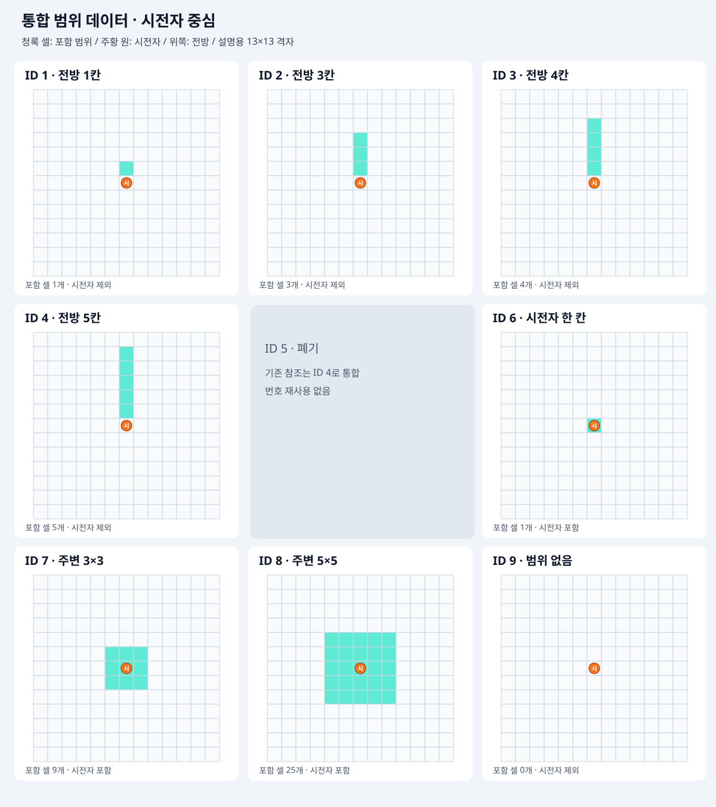

# Waredo 2.0 통합 범위 데이터 시스템

> 결정 상태: [확정] — 사용자 통합 범위 데이터 작성 요청
> 검수 상태: 주 작업자 자체 검토
> 최근 수정일: 2026-09-14
> 범위: 기존 콘텐츠의 범위 7종과 명시적인 범위 없음 데이터를 관리한다.
> 관련 문서: [캐릭터](Waredo_2.0_캐릭터_시스템_기획서.md), [전투](Waredo_2.0_전투_시스템_기획서.md), [전투판](Waredo_2.0_전투판_시스템_기획서.md), [콘텐츠 문법](../문서관리/Waredo_2.0_캐릭터_스킬_공격_관리표.md)

## 1. 기획 의도

- 공격·스킬·궁극기·반격에서 사용하는 같은 범위를 하나의 데이터로 관리한다.
- 범위는 정수 ID로 참조하고 이름은 사람이 읽는 설명으로만 사용한다.
- 사용 가능 범위와 실제 영향 범위를 따로 연결해 선택 가능한 셀과 효과가 발생하는 셀을 구별한다.

## 2. 보드 표시 기준

- 시전자 중심은 상대 좌표 (0,0)이다. 오른쪽 +x, 위쪽 +y이며 각 축은 int다.
- 전방 범위는 위쪽을 기본으로 그린다. 방향 선택 시 기존 상·하·좌·우 회전 규칙을 따른다.
- 그림은 시전자를 중앙에 놓고 전방 5칸까지 사용하는 설명용 13×13 격자다. 실제 전투판 크기는 6×6이다.
- 청록색 셀은 범위 포함, 주황 원은 시전자 위치다. 시전자 위치 표시 자체는 범위 포함을 뜻하지 않는다.
- 실제 적용은 캐릭터·전투 시스템의 원점·대상 진영·점유·차단 규칙을 따른다. 전투판 밖 셀은 실제 대상 셀이 아니며 범위 데이터를 축소해서 덮어쓰지 않는다.
- 범위 그림의 모서리 셀은 효과 범위다. 대각선 이동 규칙을 다시 활성화하는 뜻이 아니다.

## 3. 범위 데이터

| rangeId (int) | 표시명 (string) | rangeType (enum) | 포함 셀 수 |
|---|---|---|---|
| 1 | [전방 1칸](#범위-1) | FORWARD_LINE | 1 |
| 2 | [전방 3칸](#범위-2) | FORWARD_LINE | 3 |
| 3 | [전방 4칸](#범위-3) | FORWARD_LINE | 4 |
| 4 | [전방 5칸](#범위-4) | FORWARD_LINE | 5 |
| 6 | [시전자 한 칸](#범위-6) | SELF | 1 |
| 7 | [주변 3×3](#범위-7) | CENTERED_AREA | 9 |
| 8 | [주변 5×5](#범위-8) | CENTERED_AREA | 25 |
| 9 | [범위 없음](#범위-9) | NONE | 0 |

- 유효 ID는 1·2·3·4·6·7·8·9다. ID 5는 폐기하고 다른 ID는 재번호하지 않는다. ID 9는 실제 등록된 빈 범위다.
- 범위 ID는 null·빈칸·0으로 작성하지 않는다. 범위가 의도적으로 없으면 9, 미정이면 [작성 필요]다.
- `rangeType=NONE`의 셀 목록은 빈 목록이다. null이 아니며 셀을 펼치거나 범위 대상을 찾지 않는다.
- ID 6은 시전자 셀 하나를 포함하고 ID 9는 시전자 셀도 포함하지 않는다.
- 아래 좌표 목록이 그림과 범위의 단일 원본이다. 이름에 붙인 숫자를 읽어 범위를 추정하지 않는다.

### 범위 1

- 표시명: 전방 1칸
- 상대 셀 좌표: (0, 1)

### 범위 2

- 표시명: 전방 3칸
- 상대 셀 좌표: (0, 1), (0, 2), (0, 3)

### 범위 3

- 표시명: 전방 4칸
- 상대 셀 좌표: (0, 1), (0, 2), (0, 3), (0, 4)

### 범위 4

- 표시명: 전방 5칸
- 상대 셀 좌표: (0, 1), (0, 2), (0, 3), (0, 4), (0, 5)

### 범위 5 — 폐기 이력

- 전방 6칸 데이터를 제거했다. ID 5는 재사용하지 않으며 기존 참조는 전방 5칸(ID 4)으로 변경한다. 유효 데이터로 등록하지 않는다.

### 범위 6

- 표시명: 시전자 한 칸
- 상대 셀 좌표: (0, 0)

### 범위 7

- 표시명: 주변 3×3
- 상대 셀 좌표: (-1, -1), (0, -1), (1, -1), (-1, 0), (0, 0), (1, 0), (-1, 1), (0, 1), (1, 1)

### 범위 8

- 표시명: 주변 5×5
- 상대 셀 좌표: (-2, -2), (-1, -2), (0, -2), (1, -2), (2, -2), (-2, -1), (-1, -1), (0, -1), (1, -1), (2, -1), (-2, 0), (-1, 0), (0, 0), (1, 0), (2, 0), (-2, 1), (-1, 1), (0, 1), (1, 1), (2, 1), (-2, 2), (-1, 2), (0, 2), (1, 2), (2, 2)

### 범위 9

- 표시명: 범위 없음
- 상대 셀 좌표: 빈 목록 — 포함 셀 없음

## 4. 연결 항목과 실행

- TileSelect의 사용 가능 범위는 시전자 현재 셀이 원점이다. 실행 목표 셀은 시전자 실제 셀+계획의 relativeTargetOffset이며 먼저 사용 가능 범위·보드 안 여부를 검증한다.
- TileSelect의 실제 영향 패턴은 검증된 목표 셀을 원점으로 평행 이동한다. 별도 방향 입력이 없으므로 회전하지 않고 보드 축(+x 오른쪽, +y 위쪽)을 유지한다. Directional은 시전자 원점과 선택 방향 회전, SelfCentered는 시전자 원점·무회전을 사용한다.
- 타일 선택형 콘텐츠는 영향 셀을 통합 범위 데이터 ID로 참조한다. 예: 목표 (3,2)에 주변 3×3(ID 7)이면 x=2..4, y=1..3의 셀을 사용한다. 보드 밖은 제외한다. 회전이 필요한 비대칭 타일 패턴은 별도 콘텐츠 기획 대상으로 남긴다.

| 참조 항목 | 의미 | 없음 처리 |
|---|---|---|
| normalAttackRangePatternId / RANGE_PATTERN | 일반 공격 사용 가능 범위 | 현재 일반 공격에는 비어 있지 않은 범위 필수 |
| normalAttackAffectedCellPatternId / AFFECTED_CELL_PATTERN | 일반 공격 실제 영향 범위 | 현재 일반 공격에는 비어 있지 않은 범위 필수 |
| skillRangePatternId / RANGE_PATTERN | 스킬·궁극기 사용 가능 범위 | 자가 버프는 6으로 시전자 선택 |
| skillAffectedCellPatternId / AFFECTED_CELL_PATTERN | 스킬·궁극기 실제 영향 범위 | 자가 버프처럼 별도 영향 범위가 없으면 9 |
| counterRangePatternId | 반격 발동 감지 범위 | 반격 효과가 없으면 9. COUNTER 효과는 비어 있지 않은 범위 필수 |

- 반격 스킬의 영향 범위가 9여도 SELF에 반격 상태를 부여하는 효과는 실행한다. 반격 감지 범위는 별도 counterRangePatternId로 조회한다.
- 광역 효과가 없다는 이유로 직선 공격의 실제 영향 범위를 9로 바꾸지 않는다. 직선 범위와 광역 범위 모두 이 데이터로 표현한다.
- 별도의 광역 범위 참조가 필요한 콘텐츠를 작성할 때도 동일한 ID 규칙을 사용한다. 현재 필요 없는 중복 광역 범위 필드는 새로 입력하지 않는다.
- 계획에서는 기존 예정 위치 기준, 실행에서는 기존 실제 위치 기준으로 범위를 펼친다. 직사 차단·관통은 범위 모양 자체와 독립적으로 판정한다.
- 등록되지 않은 ID는 범위 없음으로 자동 치환하지 않고 기존 콘텐츠 유효성 검사에서 오류로 처리한다.

## 5. 검수·확인 필요

- 현행 전방 1·3·4·5칸, 시전자 1칸, 주변 3×3·5×5의 모양을 좌표와 그림으로 작성했다.
- 추가 모양·타일 선택형의 개별 범위는 해당 콘텐츠 기획 시 등록한다. 미작성 범위를 9로 숨기지 않는다.
- 참고 문서 관리·검수 규칙은 [제안] 상태이며 이번 검토는 자체 검토다.
